<!-- _class: title-slide -->
<!-- _paginate: false -->

# Data Foundation
# & The ML Framework

## Understanding Data and How Machines Learn

**Nipun Batra** | IIT Gandhinagar

---

# Recap: What Did We See Last Week?

**AI is everywhere:**
- AlphaFold solving protein folding
- AI writing code, music, art
- Self-driving cars, medical diagnosis

**The key insight:**
> Machine Learning = Learning patterns from DATA

<div class="insight">
Today: What IS this data? How does learning actually work?
</div>

---

# Today's Learning Goals

By the end of this lecture, you will be able to:

1. **Distinguish** traditional programming from machine learning
2. **Identify** the three learning paradigms (supervised, unsupervised, RL)
3. **Differentiate** classification from regression problems
4. **Explain** why train/test split is essential
5. **Apply** the sklearn API pattern to any ML problem

---

<!-- _class: section-divider -->

# Part 1: The ML Framework

## How Machines Learn

---

# The Big Question

Every AI/ML system answers **one fundamental question**:

<div class="insight">

**"Given some input, what should the output be?"**

</div>

| Input | Output | System |
|-------|--------|--------|
| Email text | Spam or Not Spam | Spam Filter |
| Image | "Cat" or "Dog" | Image Classifier |
| "The capital of France is" | "Paris" | Language Model |
| House features | Price ($) | Price Predictor |

---

# Traditional Programming vs ML

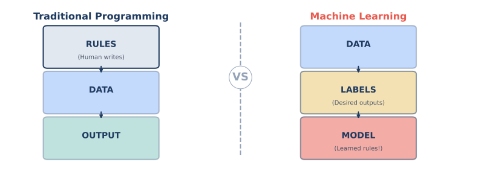

---

# The Paradigm Shift

<div class="columns">
<div>

### Traditional Programming

```
     ┌─────────────┐
     │    RULES    │ ← Human writes
     │  (if/else)  │
     └──────┬──────┘
            │
     ┌──────▼──────┐
     │    DATA     │
     └──────┬──────┘
            │
     ┌──────▼──────┐
     │   OUTPUT    │
     └─────────────┘
```

**Explicit programming**

</div>
<div>

### Machine Learning

```
     ┌─────────────┐
     │    DATA     │
     └──────┬──────┘
            │
     ┌──────▼──────┐
     │   LABELS    │ ← Desired outputs
     └──────┬──────┘
            │
     ┌──────▼──────┐
     │    MODEL    │ ← Learned rules!
     └─────────────┘
```

**Learning from examples**

</div>
</div>

---

# Why This Matters

| Scenario | Traditional | ML |
|----------|-------------|-----|
| Spam changes tactics | Rewrite rules | Retrain on new examples |
| 1000 new categories | 1000 new rule sets | Same algorithm, new data |
| Complex patterns | Impossible to specify | Model discovers them |
| Human bias | Encoded in rules | (Can still exist in data) |

<div class="insight">
ML excels when patterns are complex or rules are hard to specify explicitly.
</div>

---

# Example: Spam Detection

<div class="columns">
<div>

**Traditional Approach:**
```python
def is_spam(email):
    if "FREE" in email:
        return True
    if "winner" in email:
        return True
    if "click here" in email:
        return True
    if sender not in contacts:
        if num_links > 5:
            return True
    # ... 1000 more rules
    return False
```

*What about "Fr33" or "w1nner"?*
*What if rules conflict?*

</div>
<div>

**ML Approach:**
```python
# Just give it examples!
X = [email1, email2, ...]
y = [spam, not_spam, ...]

model = SpamClassifier()
model.fit(X, y)

# Model learns patterns itself!
model.predict(new_email)
```

*It learns to generalize!*
*Handles variations automatically*

</div>
</div>

---

# The Power of Generalization

**Training data has:** "FREE money!!!"

**Model learns:** Unusual capitalization + exclamation marks + money words = suspicious

**New email:** "EARN ca$h NOW!!!" → **Spam** (never seen before, but pattern matches)

<div class="insight">
Good ML models learn the <strong>underlying pattern</strong>, not just memorize examples.
</div>

---

# Three Learning Paradigms

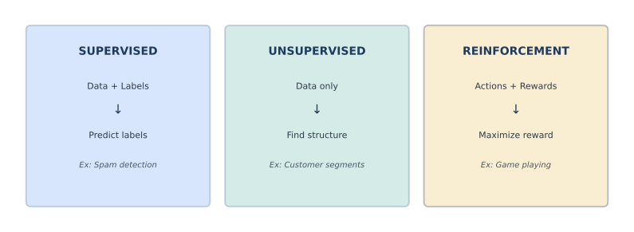

---

# Paradigm Comparison

| Aspect | Supervised | Unsupervised | Reinforcement |
|--------|------------|--------------|---------------|
| **Data** | X + y (labels) | X only | States + Actions |
| **Goal** | Predict labels | Find structure | Maximize reward |
| **Feedback** | Correct answers | None | Reward signals |
| **Example** | Spam detection | Customer segments | Game playing |

---

# Supervised Learning: The Teacher Analogy

```
┌─────────────────────────────────────────────────────────────────┐
│                      SUPERVISED LEARNING                         │
├─────────────────────────────────────────────────────────────────┤
│                                                                  │
│   Student (Model)          Teacher (Training Data)              │
│                                                                  │
│   "Is this spam?"    ──►   "Yes, that's spam."                  │
│                             "No, that's legitimate."             │
│                             "Yes, that's spam."                  │
│                             ...                                  │
│                                                                  │
│   After many examples, student learns the patterns!              │
│                                                                  │
└─────────────────────────────────────────────────────────────────┘
```

---

# Supervised Learning: Two Types

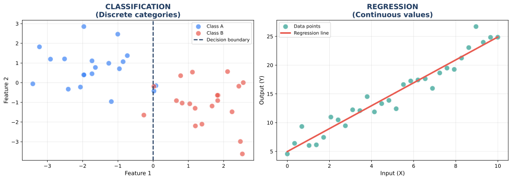

---

# Classification: Discrete Outputs

**Goal:** Assign input to one of K categories

| Type | K | Example |
|------|---|---------|
| **Binary** | 2 | Spam / Not Spam |
| **Multi-class** | K > 2 | Cat, Dog, Bird, Fish |
| **Multi-label** | Multiple | [Action, Comedy] for a movie |

```python
# Binary: One probability
model.predict_proba(email)  # → [0.15, 0.85] = 85% spam

# Multi-class: K probabilities (sum to 1)
model.predict_proba(image)  # → [0.70, 0.20, 0.05, 0.05]
                            #    Cat   Dog  Bird  Fish
```

---

# Classification Examples

| Task | Input | Classes | Real-World Use |
|------|-------|---------|----------------|
| Spam Detection | Email text | Spam, Not Spam | Gmail, Outlook |
| Medical Diagnosis | Symptoms, tests | Disease A, B, Healthy | Hospital systems |
| Image Recognition | Photo pixels | 1000 ImageNet classes | Google Photos |
| Sentiment Analysis | Review text | Positive, Negative, Neutral | Brand monitoring |
| Fraud Detection | Transaction | Fraud, Legitimate | Credit card companies |
| Face Recognition | Face image | Person 1, 2, ..., N | iPhone unlock |

---

# Regression: Continuous Outputs

**Goal:** Predict a numerical value

```python
# Output can be ANY number
model.predict(house_features)  # → 425,000.00
model.predict(face_image)      # → 27.3 (years old)
model.predict(stock_data)      # → 152.47 (price)
```

<div class="insight">
Classification: "Which bucket?" | Regression: "How much?"
</div>

---

# Regression Examples

| Task | Input | Output | Range | Real-World Use |
|------|-------|--------|-------|----------------|
| House Pricing | Size, location | Price ($) | $100K - $10M | Zillow, Redfin |
| Age Estimation | Face image | Years | 0 - 100 | Age verification |
| Demand Forecasting | History, season | Units | 0 - ∞ | Amazon inventory |
| Energy Prediction | Weather, time | kWh | 0 - ∞ | Power grid |
| Stock Prediction | Historical data | Price | 0 - ∞ | Trading |
| Salary Estimation | Resume features | Salary | $0 - $1M | LinkedIn |

---

# Quick Check: Classification or Regression?

| Task | Answer |
|------|--------|
| "Will it rain tomorrow?" | Classification (Yes/No) |
| "How many mm of rain?" | Regression (continuous) |
| "What genre is this movie?" | Classification (Action, Comedy, ...) |
| "What rating will user give?" | Could be both! (1-5 stars) |
| "Which digit is written?" | Classification (0-9) |
| "How confident is the prediction?" | Regression (0.0 - 1.0) |

---

# The In-Between: Ordinal Data

Some data is **ordered categories**:

| Rating | As Classification | As Regression |
|--------|-------------------|---------------|
| ⭐ | Class 0 | 1.0 |
| ⭐⭐ | Class 1 | 2.0 |
| ⭐⭐⭐ | Class 2 | 3.0 |
| ⭐⭐⭐⭐ | Class 3 | 4.0 |
| ⭐⭐⭐⭐⭐ | Class 4 | 5.0 |

**Both approaches can work!** Regression might predict 3.7 stars.

---

# ML Tasks: The Decision Flowchart

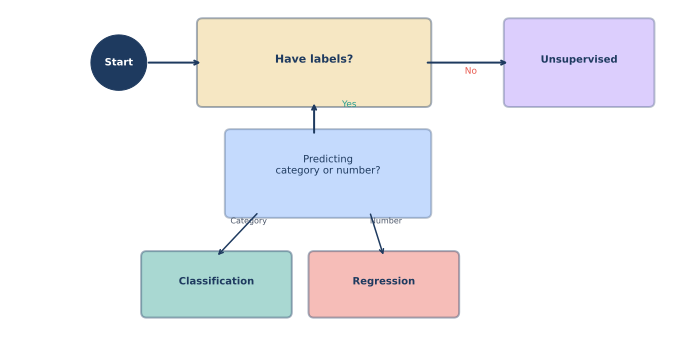

---

# Computer Vision Task Hierarchy

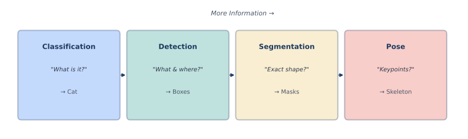

---

# NLP Task Hierarchy

| Task | Input → Output | Example | Complexity |
|------|----------------|---------|------------|
| **Classification** | Text → Category | "Great movie!" → Positive | ⭐ |
| **NER** | Text → Tagged entities | "[Sundar Pichai]_PERSON visited [Google]_ORG" | ⭐⭐ |
| **Seq2Seq** | Sequence → Sequence | English → French | ⭐⭐⭐ |
| **Generation** | Prompt → Text | "Write a poem..." → Poem | ⭐⭐⭐⭐ |

---

<!-- _class: section-divider -->

# Part 2: Understanding Data

## The Fuel for Machine Learning

---

# "Data is the New Oil"

> "Data is the new oil. Like oil, data is valuable, but if unrefined it cannot really be used."
> — Clive Humby (2006)

| Oil Industry | ML Industry |
|--------------|-------------|
| Extract crude oil | Collect raw data |
| Refine into gasoline | Clean and process data |
| Powers engines | Powers models |
| Pollution issues | Bias issues |

---

# What IS Data in ML?

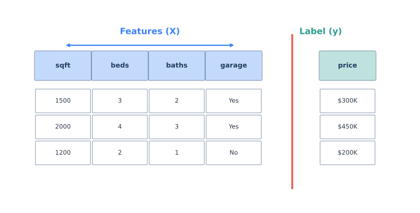

---

# Anatomy of a Dataset

```
                    Features (X)                           Label (y)
         ┌────────────────────────────────────────┐      ┌─────────┐
         │  sqft  │ beds │ baths │ garage │ year  │      │  price  │
         ├────────┼──────┼───────┼────────┼───────┤      ├─────────┤
Row 1 →  │  1500  │   3  │   2   │  Yes   │ 1990  │      │ 300,000 │
Row 2 →  │  2000  │   4  │   3   │  Yes   │ 2005  │      │ 450,000 │
Row 3 →  │  1200  │   2  │   1   │  No    │ 1975  │      │ 200,000 │
Row 4 →  │  1800  │   3  │   2   │  Yes   │ 2010  │      │ 350,000 │
         └────────┴──────┴───────┴────────┴───────┘      └─────────┘

         n_samples = 4 (rows)
         n_features = 5 (columns in X)
```

---

# Features: The Inputs

**Features = Information about each example**

<div class="columns">
<div>

### Good Features

- Relevant to prediction
- Measurable/computable
- Available at prediction time
- Not too correlated with each other

</div>
<div>

### Feature Examples

| Domain | Features |
|--------|----------|
| House | sqft, beds, zip code |
| Email | word counts, sender |
| Image | pixel values |
| Customer | age, purchases, clicks |

</div>
</div>

---

# Types of Features

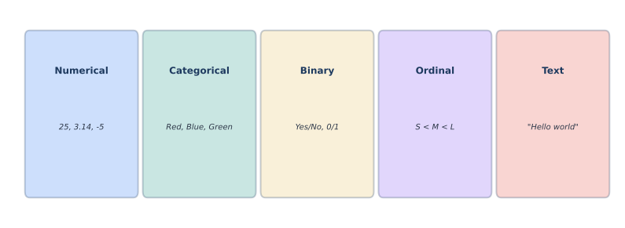

---

# Feature Type Details

| Type | Values | Example | Encoding |
|------|--------|---------|----------|
| **Numerical** | Any number | Age: 25, Price: $50.99 | Use directly |
| **Categorical** | Unordered set | Color: Red, Blue, Green | One-hot encoding |
| **Binary** | 2 values | Has garage: Yes/No | 0 or 1 |
| **Ordinal** | Ordered set | Size: S < M < L < XL | Integer encoding |
| **Text** | String | "Great product!" | Embedding |
| **Date/Time** | Timestamp | 2024-01-15 | Extract features |

---

# One-Hot Encoding Example

**Problem:** Models need numbers, but "Red" isn't a number!

**Solution:** Create binary columns for each category

| Color | is_Red | is_Blue | is_Green |
|-------|--------|---------|----------|
| Red | 1 | 0 | 0 |
| Blue | 0 | 1 | 0 |
| Green | 0 | 0 | 1 |
| Blue | 0 | 1 | 0 |

```python
pd.get_dummies(df['color'])  # Does this automatically!
```

---

# Labels: The Outputs

**Label = What we want to predict**

| Supervised Task | Label Type | Examples |
|-----------------|------------|----------|
| Binary classification | 0 or 1 | spam/not spam |
| Multi-class | Integer (0 to K-1) | digit (0-9) |
| Regression | Float | price ($) |
| Multi-label | Binary vector | [action, comedy, drama] |

<div class="warning">
Unsupervised learning has NO labels! That's what makes it "unsupervised."
</div>

---

# Types of Data Structures

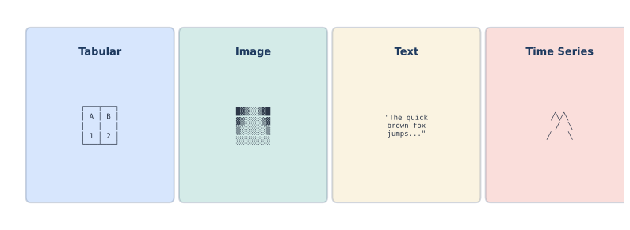

---

# Tabular Data (Most Common)

```python
import pandas as pd

df = pd.DataFrame({
    'sqft': [1500, 2000, 1200],
    'beds': [3, 4, 2],
    'price': [300000, 450000, 200000]
})

#    sqft  beds   price
# 0  1500     3  300000
# 1  2000     4  450000
# 2  1200     2  200000

X = df[['sqft', 'beds']]  # Features
y = df['price']            # Labels
```

---

# Image Data

```python
import numpy as np

# Grayscale image: Height × Width
mnist_digit = np.zeros((28, 28))  # 784 pixels

# Color image: Height × Width × 3 (RGB)
photo = np.zeros((224, 224, 3))   # 150,528 values

# Batch of images: Batch × Height × Width × Channels
batch = np.zeros((32, 224, 224, 3))  # 32 images
```

```
┌─────────────────────────┐
│ 0   0   0   23  155  0  │
│ 0   0   89  254 254  0  │  ← Each cell = pixel brightness
│ 0   0   155 254 178  0  │    (0 = black, 255 = white)
│ ...                     │
└─────────────────────────┘
```

---

# Text Data

**Raw text needs preprocessing:**

```python
text = "I love this movie! It's great."

# Step 1: Tokenize (split into words/pieces)
tokens = ["I", "love", "this", "movie", "!", "It", "'s", "great", "."]

# Step 2: Convert to numbers (vocabulary index)
indices = [23, 156, 45, 892, 2, 56, 78, 234, 3]

# Step 3: (Optional) Convert to embeddings
embeddings = model.embed(indices)  # Shape: (9, 768)
```

---

# Time Series Data

```python
# Stock prices over time
dates = pd.date_range('2024-01-01', periods=100)
prices = [100.0, 101.5, 99.8, 102.3, ...]  # 100 values

# Key characteristic: ORDER MATTERS!
# Shuffling destroys the patterns
```

```
Price
  │    ╱╲
  │   ╱  ╲  ╱╲
  │  ╱    ╲╱  ╲
  │ ╱          ╲
  └──────────────────► Time
    t1  t2  t3  t4
```

---

# How Much Data Do You Need?

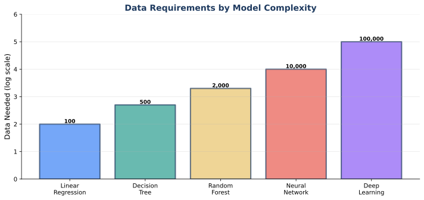

---

# The Data Scaling Laws

| Model Complexity | Minimum Data | Sweet Spot | Diminishing Returns |
|------------------|--------------|------------|---------------------|
| Linear Regression | 50 | 500 | 5,000 |
| Decision Tree | 100 | 1,000 | 10,000 |
| Random Forest | 500 | 5,000 | 50,000 |
| Neural Network (small) | 1,000 | 10,000 | 100,000 |
| Deep Learning | 10,000 | 100,000 | 1,000,000+ |
| LLMs | 1B tokens | 1T tokens | 10T+ tokens |

<div class="insight">
More data almost always helps, but there are diminishing returns.
Quality > Quantity!
</div>

---

# Data Quality Issues

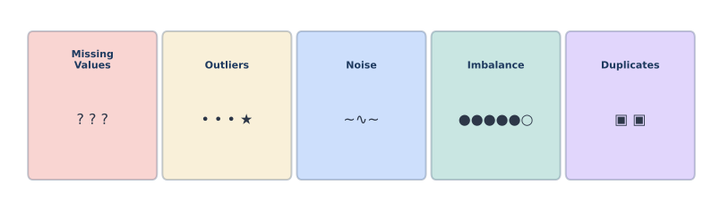

---

# Missing Values

```python
# Original data
df = pd.DataFrame({
    'age': [25, None, 35, 42, None],
    'salary': [50000, 60000, None, 80000, 55000]
})

# Option 1: Drop rows with missing values
df.dropna()  # Lose 3 rows!

# Option 2: Fill with mean/median
df['age'].fillna(df['age'].mean())  # Fill with 34

# Option 3: Fill with mode (categorical)
df['color'].fillna(df['color'].mode()[0])
```

---

# Outliers

```
Normal distribution:      With outlier:
     ╭───────╮                ╭───────╮
    ╱         ╲              ╱         ╲              •
   ╱           ╲            ╱           ╲           (outlier)
  ╱             ╲          ╱             ╲
 ╱               ╲        ╱               ╲
────────────────────     ────────────────────────────────
  μ = 50                   μ = 50        outlier = 500

Mean without outlier: 50
Mean with outlier: 95  ← Heavily skewed!
```

**Detection:** Z-score > 3, IQR method, visual inspection

---

# Class Imbalance

**Scenario:** Fraud detection (1% fraud, 99% legitimate)

| Approach | Model Prediction | Accuracy |
|----------|------------------|----------|
| Naive model | "All legitimate" | 99%! |
| Smart model | Tries to detect | 97% |

**The 99% model is USELESS!** It never detects fraud.

**Solutions:**
- Oversample minority class (SMOTE)
- Undersample majority class
- Use class weights
- Different metrics (precision, recall, F1)

---

# The Data Lifecycle

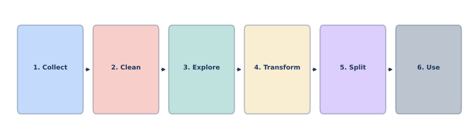

---

# Data Lifecycle in Code

```python
# 1. COLLECT
df = pd.read_csv('raw_data.csv')

# 2. CLEAN
df = df.dropna()  # Handle missing
df = df[df['age'] < 120]  # Remove outliers

# 3. EXPLORE
df.describe()  # Statistics
df.hist()  # Visualize

# 4. TRANSFORM
df['log_price'] = np.log(df['price'])  # Transform
X = pd.get_dummies(df[features])  # Encode

# 5. SPLIT
X_train, X_test, y_train, y_test = train_test_split(X, y)

# 6. USE
model.fit(X_train, y_train)
```

---

<!-- _class: section-divider -->

# Part 3: Train/Test Split

## The Most Important Concept

---

# The Exam Analogy

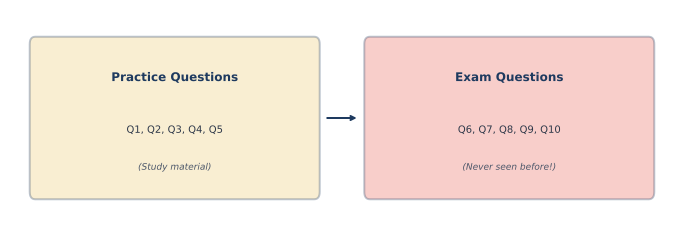

---

# Two Study Strategies

<div class="columns">
<div>

### Strategy A: Memorize

```
Q: "What is 2+3?"
A: "5" (memorized)

Q: "What is 2+4?"
A: "???" (never seen!)
```

**Result:** Fails on new questions

</div>
<div>

### Strategy B: Learn

```
Q: "What is 2+3?"
A: "5" (understands addition)

Q: "What is 2+4?"
A: "6" (applies principle)
```

**Result:** Works on any question

</div>
</div>

<div class="insight">
We want ML models to LEARN, not MEMORIZE!
</div>

---

# What is Overfitting?

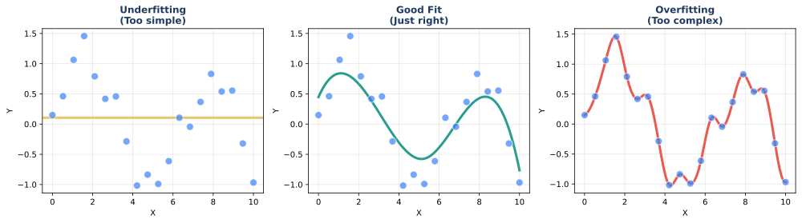

---

# Overfitting in Detail

**Definition:** Model performs well on training data but poorly on new data

| Metric | Overfitting | Good Fit |
|--------|-------------|----------|
| Training Accuracy | 99% | 92% |
| Test Accuracy | 60% | 90% |
| Gap | **39%** | 2% |

**The model memorized the training data!**

---

# The Train/Test Split


---

# Why Split Works

```
┌───────────────────────────────────────────────────────────────┐
│                         THE RULES                             │
├───────────────────────────────────────────────────────────────┤
│                                                               │
│  1. Model trains ONLY on training data                        │
│                                                               │
│  2. Model NEVER sees test data during training                │
│                                                               │
│  3. After training, evaluate on test data                     │
│                                                               │
│  4. Test performance = Expected real-world performance        │
│                                                               │
└───────────────────────────────────────────────────────────────┘
```

---

# The Golden Rule

<div class="insight">

# NEVER PEEK AT TEST DATA!

</div>

If you use test data for:
- Choosing which model to use → **Data leakage**
- Tuning hyperparameters → **Data leakage**
- Feature selection → **Data leakage**

Your accuracy estimate will be **too optimistic** and your model will **fail in production**.

---

# Train/Test Split in Code

```python
from sklearn.model_selection import train_test_split

# The sacred split
X_train, X_test, y_train, y_test = train_test_split(
    X, y,
    test_size=0.2,      # 20% for testing
    random_state=42,    # For reproducibility
    stratify=y          # Keep class proportions (classification)
)

print(f"Training samples: {len(X_train)}")  # 800
print(f"Test samples: {len(X_test)}")       # 200

# NOW: Only touch X_train, y_train until final evaluation
```

---

# Choosing Split Ratio

| Dataset Size | Train % | Test % | Reasoning |
|--------------|---------|--------|-----------|
| < 1,000 | 70% | 30% | Need enough test samples |
| 1,000 - 10,000 | 80% | 20% | Standard split |
| 10,000 - 100,000 | 90% | 10% | Plenty of test data |
| > 100,000 | 95% | 5% | Even 5% is thousands |

<div class="insight">
With huge datasets, even a small percentage gives reliable estimates.
</div>

---

# The Three-Way Split

For model selection, you need **three** sets:

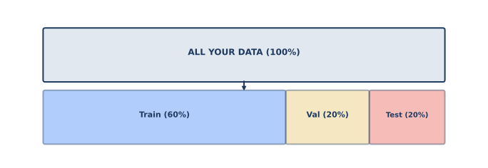

---

# Three-Way Split Explained

| Set | Purpose | When Used |
|-----|---------|-----------|
| **Training** (60%) | Learn parameters | During `model.fit()` |
| **Validation** (20%) | Tune hyperparameters | Choosing model, settings |
| **Test** (20%) | Final evaluation | Once, at the very end |

```python
# First split: separate test
X_temp, X_test, y_temp, y_test = train_test_split(X, y, test_size=0.2)

# Second split: separate validation
X_train, X_val, y_train, y_val = train_test_split(X_temp, y_temp, test_size=0.25)
# 0.25 of 0.8 = 0.2 of total
```

---

# Common Mistakes

| Mistake | Why It's Bad | Fix |
|---------|--------------|-----|
| Training on all data | Can't detect overfitting | Always split first |
| Peeking at test data | Optimistic estimates | Lock away test data |
| Tuning on test | Indirect training | Use validation set |
| Small test set | High variance | Use at least 20% |
| No random state | Non-reproducible | Set `random_state=42` |
| Data leakage | False confidence | Check processing order |

---

<!-- _class: section-divider -->

# Part 4: The ML Recipe

## Putting It All Together

---

# The Universal ML Recipe

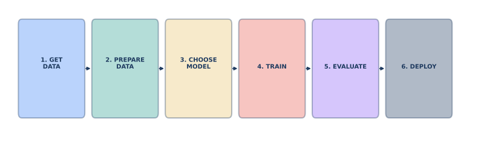

---

# Step 1: Get Data

```python
import pandas as pd
from sklearn.datasets import load_iris

# Option 1: Load from file
df = pd.read_csv('houses.csv')
X = df[['sqft', 'beds', 'baths']]
y = df['price']

# Option 2: Use sklearn datasets
iris = load_iris()
X, y = iris.data, iris.target

# Option 3: Create manually
X = [[1500, 3, 2], [2000, 4, 3], [1200, 2, 1]]
y = [300000, 450000, 200000]
```

---

# Step 2: Prepare Data

```python
from sklearn.model_selection import train_test_split
from sklearn.preprocessing import StandardScaler

# 1. Split first! (before any processing)
X_train, X_test, y_train, y_test = train_test_split(
    X, y, test_size=0.2, random_state=42
)

# 2. Scale features (fit ONLY on train!)
scaler = StandardScaler()
X_train_scaled = scaler.fit_transform(X_train)  # fit + transform
X_test_scaled = scaler.transform(X_test)        # only transform!
```

<div class="warning">
Always fit scaler on training data only! Otherwise: data leakage.
</div>

---

# Step 3: Choose a Model

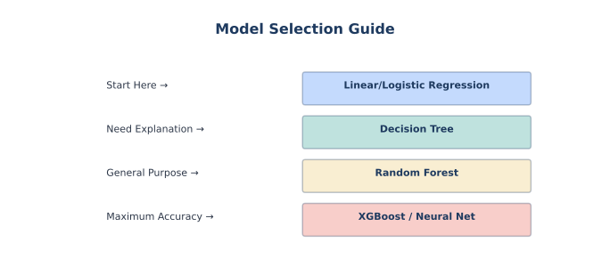

---

# Model Complexity Ladder

| Model | Complexity | Interpretability | When to Use |
|-------|------------|------------------|-------------|
| Linear/Logistic | ⭐ | High | Start here, baseline |
| Decision Tree | ⭐⭐ | High | Need explanations |
| Random Forest | ⭐⭐⭐ | Medium | General purpose |
| XGBoost | ⭐⭐⭐⭐ | Low | Competitions |
| Neural Network | ⭐⭐⭐⭐⭐ | Very Low | Images, text, lots of data |

<div class="insight">
Always start simple! Only add complexity if needed.
</div>

---

# Step 4: Train (Fit)

```python
from sklearn.linear_model import LinearRegression
from sklearn.tree import DecisionTreeClassifier

# For regression
reg_model = LinearRegression()
reg_model.fit(X_train, y_train)

# For classification
clf_model = DecisionTreeClassifier(max_depth=5)
clf_model.fit(X_train, y_train)

# What happens inside:
# 1. Model sees (X, y) pairs
# 2. Adjusts internal parameters
# 3. Minimizes prediction error
# 4. Stores learned patterns
```

---

# What Happens During Training?

```
Iteration 1:  Predictions: [350K, 400K, 250K]
              Actual:      [300K, 450K, 200K]
              Error:       Large!
              Action:      Adjust parameters ↓

Iteration 2:  Predictions: [320K, 430K, 220K]
              Actual:      [300K, 450K, 200K]
              Error:       Smaller
              Action:      Keep adjusting...

...

Iteration N:  Predictions: [305K, 445K, 198K]
              Actual:      [300K, 450K, 200K]
              Error:       Small enough!
              Action:      Stop, save parameters
```

---

# Step 5: Evaluate

```python
# Make predictions on TEST data (never seen before!)
predictions = model.predict(X_test)

# Compare predictions to actual values
from sklearn.metrics import mean_squared_error, accuracy_score

# Regression
rmse = np.sqrt(mean_squared_error(y_test, predictions))
print(f"RMSE: ${rmse:,.0f}")  # RMSE: $25,000

# Classification
accuracy = accuracy_score(y_test, predictions)
print(f"Accuracy: {accuracy:.1%}")  # Accuracy: 94.5%
```

---

# Step 6: Deploy

```python
import joblib

# Save the trained model
joblib.dump(model, 'house_price_model.pkl')
joblib.dump(scaler, 'scaler.pkl')

# Later, in production...
model = joblib.load('house_price_model.pkl')
scaler = joblib.load('scaler.pkl')

# New house comes in
new_house = [[1800, 3, 2]]  # sqft, beds, baths
new_house_scaled = scaler.transform(new_house)
predicted_price = model.predict(new_house_scaled)
print(f"Predicted price: ${predicted_price[0]:,.0f}")
```

---

# The sklearn API Pattern

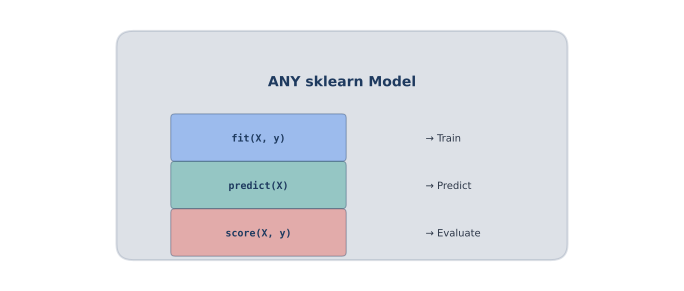

---

# The Beauty of Consistent APIs

```python
# ALL sklearn models follow the same pattern!

# Linear Regression
from sklearn.linear_model import LinearRegression
model = LinearRegression()
model.fit(X_train, y_train)
model.predict(X_test)

# Random Forest
from sklearn.ensemble import RandomForestClassifier
model = RandomForestClassifier()
model.fit(X_train, y_train)
model.predict(X_test)

# Neural Network
from sklearn.neural_network import MLPClassifier
model = MLPClassifier()
model.fit(X_train, y_train)
model.predict(X_test)

# Same 3 methods: fit(), predict(), score()
```

---

# Complete Example: Classification

```python
from sklearn.datasets import load_iris
from sklearn.model_selection import train_test_split
from sklearn.tree import DecisionTreeClassifier
from sklearn.metrics import accuracy_score, classification_report

# 1. Load data
iris = load_iris()
X, y = iris.data, iris.target

# 2. Split
X_train, X_test, y_train, y_test = train_test_split(
    X, y, test_size=0.2, random_state=42
)

# 3. Train
model = DecisionTreeClassifier(max_depth=3)
model.fit(X_train, y_train)

# 4. Evaluate
y_pred = model.predict(X_test)
print(f"Accuracy: {accuracy_score(y_test, y_pred):.1%}")
print(classification_report(y_test, y_pred, target_names=iris.target_names))
```

---

# Complete Example: Regression

```python
from sklearn.datasets import fetch_california_housing
from sklearn.model_selection import train_test_split
from sklearn.linear_model import LinearRegression
from sklearn.metrics import mean_squared_error, r2_score
import numpy as np

# 1. Load data
housing = fetch_california_housing()
X, y = housing.data, housing.target

# 2. Split
X_train, X_test, y_train, y_test = train_test_split(
    X, y, test_size=0.2, random_state=42
)

# 3. Train
model = LinearRegression()
model.fit(X_train, y_train)

# 4. Evaluate
y_pred = model.predict(X_test)
print(f"RMSE: ${np.sqrt(mean_squared_error(y_test, y_pred))*100000:,.0f}")
print(f"R² Score: {r2_score(y_test, y_pred):.3f}")
```

---

<!-- _class: section-divider -->

# Part 5: Course Roadmap

## What's Coming Next

---

# Your Journey Through AI

| Week | Topic | Big Question | You'll Learn |
|------|-------|--------------|--------------|
| **1** | Introduction | What can AI do? | Motivation, capabilities |
| **2** | Data Foundation | What is ML? | Framework, data, split |
| **3** | Supervised Learning | How do algorithms work? | LR, Trees, KNN |
| **4** | Model Selection | How to choose? | CV, tuning, ensembles |
| **5** | Neural Networks | What is deep learning? | Backprop, PyTorch |
| **6** | Computer Vision | How do machines see? | CNNs, YOLO |
| **7** | Language Models | How do LLMs work? | Transformers |
| **8** | Generative AI | How do machines create? | Diffusion, APIs |

---

# Skills You'll Build

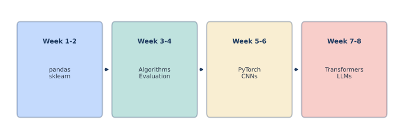

---

# Key Takeaways

<div class="columns">
<div>

### Framework
1. ML learns from DATA
2. Three paradigms: Supervised, Unsupervised, RL
3. Classification vs Regression

</div>
<div>

### Data
4. Features (X) + Labels (y)
5. Quality > Quantity
6. Train/Test split is SACRED

</div>
</div>

### Practice
7. The sklearn pattern: `fit()` → `predict()` → `score()`
8. Start simple, add complexity only if needed

---

<!-- _class: title-slide -->

# Ready to Build!

## Next: Supervised Learning Deep Dive

**Lab this week:** Your first ML models with sklearn

*"In God we trust. All others must bring data."*
— W. Edwards Deming

**Questions?**
