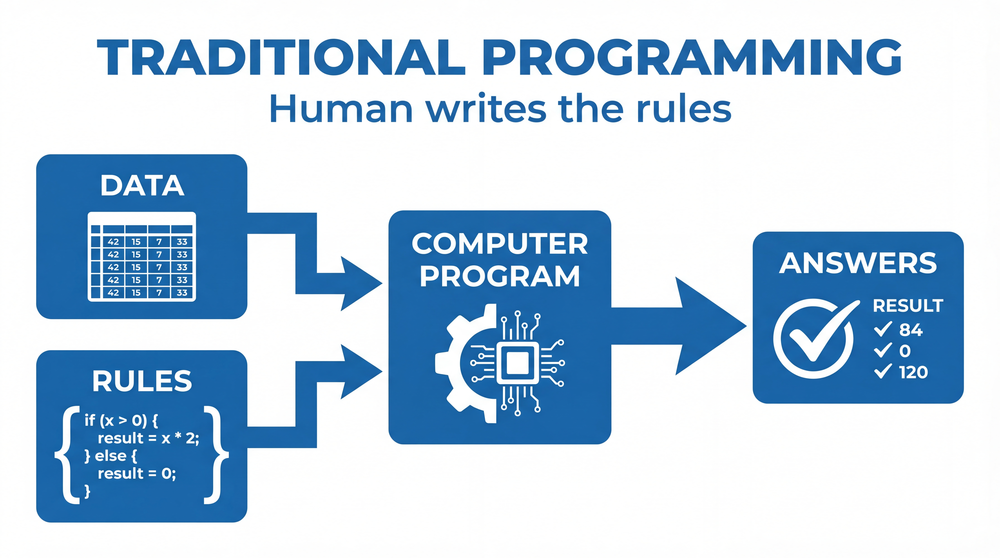
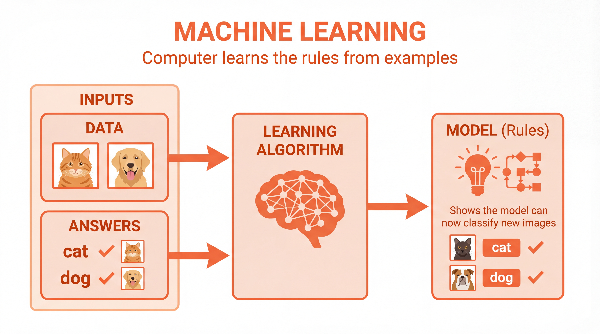
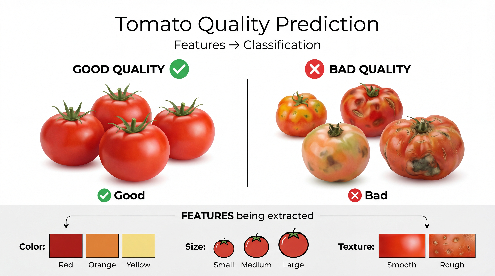
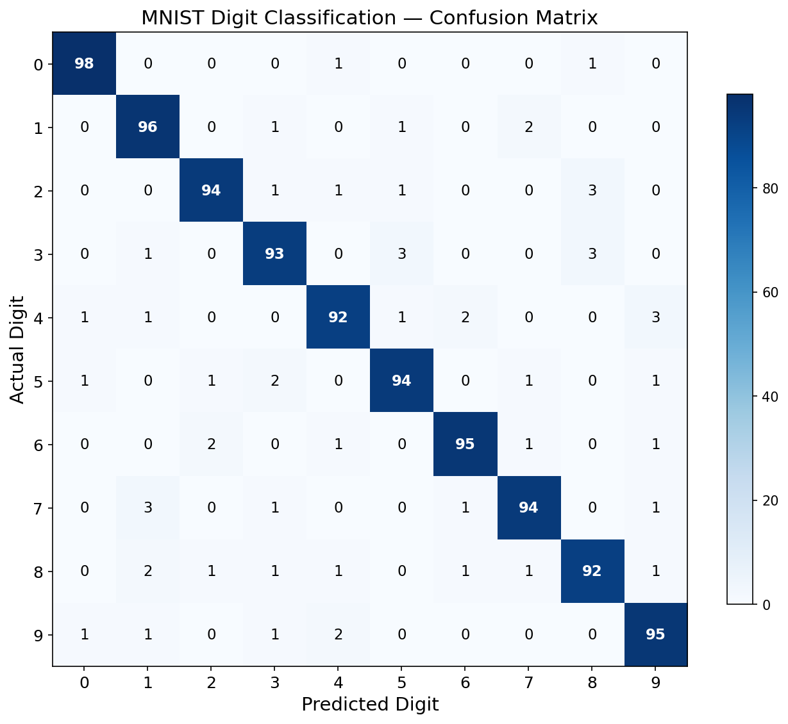

<!-- _class: title-slide -->
<!-- _paginate: false -->

# Data Foundation
# & ML Framework

## The Building Blocks of Machine Learning

**Nipun Batra** | IIT Gandhinagar

---

# Where We Are

| Lecture | Topic |
|---------|-------|
| 1 | What is AI? (videos, demos) |
| **2** | **How does ML work? (today!)** |
| 3 onwards | Building specific models |

**Today:** The foundation everything else builds on!

---

# Today's Big Questions

1. What makes ML different from regular programming?
2. What are the different ways machines can learn?
3. How do we represent data for computers?
4. How do we know if our model is good?

---

<!-- _class: section-divider -->

# Part 1: The ML Mindset

## A New Way of Programming

---

# Traditional Programming



**You provide data and rules → Computer gives answers**

---

# Example: Spam Detection Rules

```
Problem: Determine if an email is spam

Your Rules:
  IF email contains "FREE MONEY" → Spam
  IF email contains "You've won" → Spam
  IF sender is unknown AND has attachment → Spam
  ...
```

**You must think of every possible pattern!**

---

# The Problem with Rules

**What about these?**

| Email | Your Rule | Reality |
|-------|-----------|---------|
| "FR33 M0N3Y!!!" | Not spam | Spam! |
| "Won tickets to concert" | Spam | Actually legit! |
| "Free lunch in cafeteria" | Spam | Not spam! |

**Spammers adapt. Rules break.**

---

# The ML Approach



**You provide data and answers → Computer learns the rules!**

---

# ML in Code

```python
# You provide examples (data + answers)
emails = ["FREE MONEY!!!", "Meeting at 3pm", ...]
labels = ["spam", "not spam", ...]

# Computer learns patterns
model.learn(emails, labels)

# Now it can classify NEW emails
model.predict("FR33 M0N3Y")  # → "spam"
```

**The model learned to handle variations it never saw!**

---

# The Key Difference

| Traditional Programming | Machine Learning |
|------------------------|------------------|
| Human writes rules | Computer learns rules |
| Rules are explicit | Rules are implicit (in the model) |
| Doesn't improve | Improves with more data |
| Breaks on edge cases | Generalizes to new cases |

---

# When to Use ML?

**ML is great when:**

| Scenario | Example |
|----------|---------|
| Rules are complex | Face recognition |
| Rules change over time | Stock prediction |
| Rules are unknown | Medical diagnosis |
| There's lots of data | Language translation |

**ML is NOT needed when:**
- Rules are simple and fixed (calculator)
- Data is scarce (rare diseases)

---

# The Formal Definition

> "A computer program is said to **learn** from **experience E** with respect to some class of **tasks T** and **performance measure P** if its performance at tasks in T, as measured by P, improves with experience E."
> — Tom Mitchell

---

# Breaking Down the Definition (with Example!)

**Let's make this concrete with a spam filter:**

---

# Breaking Down the Definition

| Component | Spam Filter Example |
|-----------|---------------------|
| **Task (T)** | Classify emails as spam/not spam |
| **Experience (E)** | Database of labeled emails |
| **Performance (P)** | % of correctly classified emails |

**Learning = Performance improves with Experience!**

---

<!-- _class: section-divider -->

# Part 2: How Machines Learn

## Three Learning Paradigms

---

# Three Ways to Learn


<div class="insight">

**This course focuses on supervised learning** — learning from labeled examples!

</div>

---

# Supervised Learning

**Like learning with a teacher who tells you right/wrong**

```
Teacher shows examples:
  "This email is spam"
  "This email is not spam"
  "This email is spam"

Student (model) learns patterns...

Later, student predicts on new email:
  "I think this is spam!" (hopefully correct!)
```

<div class="insight">

**This course focuses primarily on supervised learning!**

</div>

---

# Real Supervised Learning Examples

| Task | Input | Output (label) |
|------|-------|----------------|
| Spam detection | Email text | Spam / Not spam |
| Medical diagnosis | X-ray image | Disease / No disease |
| House pricing | House features | Price (₹) |
| Credit scoring | Customer info | Approve / Reject |
| Weather | Historical data | Rain / No rain |

---

# Unsupervised Learning

**No labels! Find hidden patterns on your own**

```
Data: Purchase histories of 10,000 customers

Algorithm discovers groups:
  "Group A seems to buy electronics"
  "Group B mostly buys groceries"
  "Group C buys luxury items"

Nobody TOLD it these groups exist!
```

**Examples:** Customer segmentation, anomaly detection

---

# Reinforcement Learning

**Learn by trial and error with rewards**

```
Game-playing AI:
  Move left → +1 point (good!)
  Move right → -10 points (fell in pit!)
  Jump → +100 points (reached goal!)

Over time, learns: "Don't move right near pits"
```

**Examples:** AlphaGo, Self-driving cars, Robotics

---

# Our Focus: Supervised Learning


<div class="insight">

**Simple rule:** Classification = "Which bucket?" | Regression = "How much?"

</div>

---

# Classification Examples

**Predict a category/class**

| Input | Output | Classes |
|-------|--------|---------|
| Email | Spam or Not | 2 classes (binary) |
| Image | Cat, Dog, Bird | 3+ classes (multi-class) |
| Handwritten digit | 0, 1, 2, ..., 9 | 10 classes |
| Movie review | Positive, Neutral, Negative | 3 classes |

---

# Regression Examples

**Predict a continuous number**

| Input | Output | Range |
|-------|--------|-------|
| House features | Price | ₹0 to ∞ |
| Patient data | Blood pressure | 60-180 mmHg |
| Weather history | Temperature | -20°C to 50°C |
| Image | Person's age | 0-100 years |

---

# Quick Quiz: Classification or Regression?

| Task | Type | Why? |
|------|------|------|
| Will it rain tomorrow? | Classification | Yes/No |
| How many mm of rain? | Regression | A number |
| What rating (1-5 stars)? | Either! | Ordered categories or continuous |
| Which digit (0-9)? | Classification | 10 discrete categories |

---

<!-- _class: section-divider -->

# Part 3: Representing Data

## Features, Labels, and Notation

---

# A Concrete Example: Tomato Quality



These characteristics are called **features** (inputs to our model).

---

# Our Tomato Dataset

| Color | Size | Texture | **Quality** |
|-------|------|---------|-------------|
| Orange | Small | Smooth | Good |
| Red | Small | Rough | Good |
| Orange | Medium | Smooth | Bad |
| Yellow | Large | Smooth | Bad |

**Features (X):** Color, Size, Texture
**Label (y):** Quality (what we want to predict)

---

# Features vs Labels

| Features (X) | Label (y) |
|--------------|-----------|
| What we observe | What we want to predict |
| Input to the model | Output of the model |
| Multiple columns | Usually one column |
| Color, Size, Texture | Good/Bad |

---

# Important: What Makes a Good Feature?

**Good features:**
- Color, Size, Texture → Related to quality!

**Bad features:**
- Sample number (1, 2, 3, 4) → Just an ID, meaningless!
- Day of week you measured → Probably irrelevant

<div class="warning">

**Bad features confuse models.** Think about what's actually relevant!

</div>

---

# Mathematical Notation

**We need consistent symbols for ML**

| Symbol | Meaning | Example |
|--------|---------|---------|
| $n$ | Number of samples | 4 tomatoes |
| $d$ | Number of features | 3 (Color, Size, Texture) |
| $\mathbf{X}$ | Feature matrix (all data) | 4 rows × 3 columns |
| $\mathbf{y}$ | Label vector | [Good, Good, Bad, Bad] |
| $\mathbf{x}_i$ | Single sample's features | Orange, Small, Smooth |
| $y_i$ | Single sample's label | Good |

---

# The Convention

<div class="insight">

**Bold UPPERCASE** = Matrix: $\mathbf{X}, \mathbf{W}$
**Bold lowercase** = Vector: $\mathbf{x}, \mathbf{y}, \mathbf{w}$
**Regular** = Scalar: $n, d, y_i$

</div>

**Why this matters:** When you read ML papers or code, everyone uses these conventions!

---

# The Dataset Notation

$$\mathcal{D} = \{(\mathbf{x}_i, y_i)\}_{i=1}^{n}$$

**In English:**
"Dataset $\mathcal{D}$ is a collection of $n$ pairs, where each pair is (features, label)"

**Example:** $(\mathbf{x}_1, y_1)$ = (Orange, Small, Smooth, Good)

---

# But Wait... Computers Need Numbers!

**Problem:** "Orange" and "Small" aren't numbers!

**Solution:** Convert categories to numbers (encoding)

| Color | Encoded |
|-------|---------|
| Red | [1, 0, 0] |
| Orange | [0, 1, 0] |
| Yellow | [0, 0, 1] |

This is called **one-hot encoding**.

---

# Why One-Hot Encoding?


**Bad idea:** Red=1, Orange=2, Yellow=3

**Problem:** This implies Orange is "between" Red and Yellow!

**One-hot is better:** Each color gets its own column

```python
pd.get_dummies(df['Color'])
#    Red  Orange  Yellow
# 0    0       1       0
# 1    1       0       0
```

---

# One-Hot: The Intuition

**Think of it like a survey checkbox:**

| Question | Red? | Orange? | Yellow? |
|----------|------|---------|---------|
| Tomato 1 | ☐ | ☑ | ☐ |
| Tomato 2 | ☑ | ☐ | ☐ |

**Each category is independent!**

- No artificial ordering
- Model learns: "If Orange=1, then [something]"
- Categories with 100 options? 100 columns! (but sparse)

---

<!-- _class: section-divider -->

# Part 4: Data Quality

## Garbage In, Garbage Out!

---

# Data Quality

**Your model is only as good as your data!**

| Issue | Problem | Example |
|-------|---------|---------|
| Missing values | Incomplete information | Empty cells in spreadsheet |
| Outliers | Extreme values | Age = 500 years |
| Imbalanced classes | One class dominates | 99% healthy, 1% sick |
| Biased data | Unrepresentative sample | Only urban customers |

<div class="warning">

**Garbage In, Garbage Out!** No algorithm can fix fundamentally bad data.

</div>

*For more: See ML class materials on data preprocessing.*

---

# Missing Values

**What to do when data is incomplete?**

| Strategy | When to Use |
|----------|-------------|
| **Drop rows** | Few missing values, lots of data |
| **Fill with mean/median** | Numerical features |
| **Fill with mode** | Categorical features |
| **Use "Unknown" category** | When missingness is meaningful |

```python
# In pandas
df['age'].fillna(df['age'].median(), inplace=True)
```

---

# Outliers

**Extreme values can mislead your model**

| Example | Normal Range | Outlier |
|---------|--------------|---------|
| Age | 0-100 | 500 |
| Salary | ₹10K-₹1Cr | ₹100Cr |
| Height | 1.4m-2.1m | 5m |

**Solutions:**
- Remove if clearly errors
- Cap at percentiles (e.g., 1st and 99th)
- Use robust models (trees are less sensitive)

---

# Imbalanced Classes

**When one class dominates:**

| Class | Count | Problem |
|-------|-------|---------|
| Not Fraud | 99,900 | Model just predicts "Not Fraud" always! |
| Fraud | 100 | Gets 99.9% accuracy but catches nothing |

**Solutions:**
- Collect more minority class data
- Oversample minority class
- Undersample majority class
- Use class weights in training

---

# Data Bias

**Your data reflects the world it came from**

| Bias Type | Example |
|-----------|---------|
| **Selection bias** | Only surveying English speakers |
| **Historical bias** | Past hiring data reflects past discrimination |
| **Measurement bias** | Different hospitals use different equipment |

<div class="warning">

**Biased data → Biased model → Unfair predictions!**

</div>

---

# Real-World Example: Biased Hiring AI

**What happened:**
- A company trained a hiring model on 10 years of data
- Historical data reflected existing biases in who got hired
- AI learned to replicate those biased patterns!

**Result:** Model unfairly penalized candidates from underrepresented groups

<div class="insight">

**Lesson:** Always check your data for hidden biases before training!

</div>

---

<!-- _class: section-divider -->

# Part 5: Train/Test Split

## The Most Important Concept!

---

# The Exam Analogy

**Two study strategies:**

| Strategy A: Memorize | Strategy B: Learn |
|---------------------|-------------------|
| Memorize "2+3=5" | Understand addition |
| Exam: "2+3=?" → 5 | Exam: "2+3=?" → 5 |
| Exam: "2+4=?" → ??? | Exam: "2+4=?" → 6 |

<div class="insight">

**We want models to LEARN patterns, not MEMORIZE examples!**

</div>

---

# Why This Matters: A Story

**You train a spam classifier on 1000 emails.**

| Method | Training Accuracy | On NEW emails |
|--------|-------------------|---------------|
| Memorize all 1000 | 100% | ??? |
| Learn patterns | 95% | 93% |

**The memorizer fails because:**
- New spam uses different words
- New legitimate emails look different
- Real world is messier than training data

**The learner succeeds because:**
- Learned "lots of exclamation marks = suspicious"
- This PATTERN transfers to new emails!

---

# The Problem

**You train a model on 100 emails. You test on the SAME 100 emails.**

| What Happened | Score |
|---------------|-------|
| Training accuracy | 100% |
| Accuracy on NEW emails | 60% |

**The model memorized the answers instead of learning patterns!**

How do we detect this? We need a separate test set.

---

# The Solution: Split Your Data


**Don't test on data you trained on!**

---

# In Python

```python
from sklearn.model_selection import train_test_split

# Split: 80% train, 20% test
X_train, X_test, y_train, y_test = train_test_split(
    X, y,
    test_size=0.2,      # 20% for testing
    random_state=42     # For reproducibility
)

# Train ONLY on training data
model.fit(X_train, y_train)

# Evaluate on test data (never seen!)
accuracy = model.score(X_test, y_test)
```

---

# Why This Works

| Scenario | Training Acc | Test Acc | Status |
|----------|--------------|----------|--------|
| Good model | 90% | 88% | Learned! |
| Memorized | 100% | 60% | Overfitting |
| Too simple | 65% | 63% | Underfitting |

**The test accuracy tells you real-world performance!**

---

# The Golden Rule

<div class="warning">

**NEVER peek at the test data during training!**

</div>

If you use test data to make decisions (choosing models, tuning parameters), you're cheating — your "test" accuracy becomes meaningless.

---

<!-- _class: section-divider -->

# Part 5: Evaluation Metrics

## How Do We Measure "Good"?

---

# Accuracy: The Obvious Metric

$$\text{Accuracy} = \frac{\text{Correct Predictions}}{\text{Total Predictions}}$$

**Example:** 85 out of 100 correct → 85% accuracy

**Sounds perfect, right?**

---

# When Accuracy Fails

**Scenario:** Cancer screening — 1000 patients

| Reality | Count |
|---------|-------|
| Healthy | 990 |
| Cancer | 10 |

**Dumb model:** Always predict "Healthy"

| Metric | Value | Looks... |
|--------|-------|----------|
| Accuracy | 990/1000 = **99%** | Amazing! |
| Cancer cases caught | **0 out of 10** | Useless! |

**High accuracy can be completely misleading with imbalanced data!**

---

# The Confusion Matrix


The confusion matrix shows all four possible outcomes:

- **True Positive (TP):** Correctly caught cancer
- **True Negative (TN):** Correctly said healthy
- **False Positive (FP):** Said cancer but was healthy (false alarm)
- **False Negative (FN):** Said healthy but had cancer (MISSED!)

<div class="insight">

The diagonal shows correct predictions; off-diagonal shows errors.

</div>

---

# Reading a Confusion Matrix

**Example: Cancer screening model tested on 1000 people:**

|  | Predicted: Cancer | Predicted: Healthy |
|--|------|--------|
| **Actually: Cancer** | 85 (TP) | 15 (FN) |
| **Actually: Healthy** | 50 (FP) | 850 (TN) |

**What does this tell us?**
- Model catches 85/100 = 85% of cancer cases (Recall)
- When it says "cancer", it's right 85/135 = 63% (Precision)
- Overall: (85+850)/1000 = 93.5% accuracy

**But is 15 missed cancers acceptable?** That's the key question!

---

# Precision: "When I Say Cancer, Am I Right?"

$$\text{Precision} = \frac{TP}{TP + FP}$$

**From our confusion matrix:** TP=85, FP=50

|  | Predicted: Cancer | Predicted: Healthy |
|--|------|--------|
| **Actually: Cancer** | **85 (TP)** | 15 |
| **Actually: Healthy** | **50 (FP)** | 850 |

$$\text{Precision} = \frac{85}{85 + 50} = \frac{85}{135} = 63\%$$

"When I say cancer, I'm right 63% of the time"

---

# Recall: "Of All Cancers, How Many Did I Catch?"

$$\text{Recall} = \frac{TP}{TP + FN}$$

**From our confusion matrix:** TP=85, FN=15

|  | Predicted: Cancer | Predicted: Healthy |
|--|------|--------|
| **Actually: Cancer** | **85 (TP)** | **15 (FN)** |
| **Actually: Healthy** | 50 | 850 |

$$\text{Recall} = \frac{85}{85 + 15} = \frac{85}{100} = 85\%$$

"I catch 85% of all cancer cases (but miss 15%)"

---

# Precision vs Recall Trade-off

**You usually can't have both perfect!**

| Scenario | Prioritize | Why |
|----------|-----------|-----|
| **Spam filter** | Precision | Don't mark important emails as spam |
| **Cancer screening** | Recall | Don't miss any cancer cases |
| **Criminal justice** | Precision | Don't convict innocent people |
| **Fire alarm** | Recall | Don't miss any real fires |

<div class="insight">

**Trade-off:** Increasing one often decreases the other!

</div>

---

# The Precision-Recall Knob

**Imagine adjusting a threshold:**

| Threshold | Precision | Recall | Behavior |
|-----------|-----------|--------|----------|
| Very high | 99% | 10% | Only flag when VERY sure |
| Medium | 80% | 80% | Balanced |
| Very low | 30% | 99% | Flag everything suspicious |

**You choose based on the cost of errors!**

| What's worse? | Choose... |
|---------------|-----------|
| Missing a real threat | Low threshold (high recall) |
| Many false alarms | High threshold (high precision) |

---

# F1 Score: The Balance

$$\text{F1} = \frac{2 \times \text{Precision} \times \text{Recall}}{\text{Precision} + \text{Recall}}$$

**Harmonic mean** of precision and recall.

| Precision | Recall | F1 |
|-----------|--------|-----|
| 100% | 0% | 0% |
| 80% | 80% | 80% |
| 100% | 100% | 100% |

**F1 is high only when BOTH are high!**

---

# Your Turn: Compute F1!

**A spam filter tested on 200 emails:**

|  | Predicted: Spam | Predicted: Not Spam |
|--|------|--------|
| **Actually: Spam** | 40 | 10 |
| **Actually: Not Spam** | 20 | 130 |

**Try computing these (then we'll check together):**

| Metric | Formula | Your Answer |
|--------|---------|-------------|
| Precision | TP / (TP + FP) | ? / (? + ?) = ? |
| Recall | TP / (TP + FN) | ? / (? + ?) = ? |
| F1 | 2 × P × R / (P + R) | ? |
| Accuracy | (TP+TN) / Total | ? |

---

# Solution: F1 Worked Out

**From the confusion matrix:** TP=40, FP=20, FN=10, TN=130

| Metric | Calculation | Result |
|--------|-------------|--------|
| **Precision** | 40 / (40+20) = 40/60 | **66.7%** |
| **Recall** | 40 / (40+10) = 40/50 | **80.0%** |
| **F1** | 2 × 0.667 × 0.8 / (0.667 + 0.8) | **72.7%** |
| **Accuracy** | (40+130) / 200 | **85.0%** |

**Notice:** Accuracy (85%) looks great, but precision is only 67% — 1 in 3 "spam" flags is wrong!

---

# Matthews Correlation Coefficient (MCC)

$$\text{MCC} = \frac{TP \times TN - FP \times FN}{\sqrt{(TP+FP)(TP+FN)(TN+FP)(TN+FN)}}$$

**Why MCC is useful:**
- Ranges from -1 (worst) to +1 (best), 0 = random
- Works well even with **imbalanced classes**
- Considers all four quadrants of confusion matrix

---

# Your Turn: Compute MCC!

**Same spam filter:** TP=40, FP=20, FN=10, TN=130

$$\text{MCC} = \frac{40 \times 130 - 20 \times 10}{\sqrt{(40+20)(40+10)(130+20)(130+10)}}$$

| Step | Calculation |
|------|-------------|
| Numerator | 40×130 - 20×10 = 5200 - 200 = **5000** |
| Denominator | $\sqrt{60 \times 50 \times 150 \times 140}$ = $\sqrt{63{,}000{,}000}$ = **7937** |
| **MCC** | 5000 / 7937 = **0.63** |

**MCC = 0.63** — a good (not great) classifier. Compare: the "always predict healthy" model gets MCC = 0!

---

# Multi-Class Confusion Matrix



---

# Reading the 10x10 Matrix

**What can you spot?**

| Pattern | What It Means |
|---------|---------------|
| Bright diagonal | Model is mostly correct |
| 4 confused with 9 | They look similar (closed loops) |
| 3 confused with 5, 8 | Curved digits are tricky |
| 7 confused with 1 | Both have vertical strokes |

**The confusion matrix tells you WHERE your model struggles!**

This helps you decide: "Should I collect more training examples of 4s and 9s?"

---

# Multi-Class: A 3x3 Example

**A model classifies animals: Cat, Dog, Bird**

|  | Pred: Cat | Pred: Dog | Pred: Bird |
|--|-----------|-----------|------------|
| **Actual: Cat** | **8** | 1 | 1 |
| **Actual: Dog** | 2 | **6** | 2 |
| **Actual: Bird** | 0 | 1 | **9** |

**Per-class metrics (treat each class as binary):**

| Class | TP | FP | FN | Precision | Recall | F1 |
|-------|----|----|-----|-----------|--------|-----|
| Cat | 8 | 2 | 2 | 8/10=0.80 | 8/10=0.80 | 0.80 |
| Dog | 6 | 2 | 4 | 6/8=0.75 | 6/10=0.60 | 0.67 |
| Bird | 9 | 3 | 1 | 9/12=0.75 | 9/10=0.90 | 0.82 |

---

# Multi-Class F1: Three Approaches

**From our Cat/Dog/Bird example:**

| Approach | Calculation | Result |
|----------|-------------|--------|
| **Macro F1** | (0.80 + 0.67 + 0.82) / 3 | **0.76** |
| **Weighted F1** | Weighted by class count (10 each here) | **0.76** |
| **Micro F1** | Pool: TP=23, FP=7, FN=7 → 23/26.5 | **0.77** |

```python
from sklearn.metrics import f1_score

f1_score(y_true, y_pred, average='macro')
f1_score(y_true, y_pred, average='weighted')
f1_score(y_true, y_pred, average='micro')
```

---

# Verify with Code!

```python
import numpy as np
from sklearn.metrics import f1_score, classification_report

y_true = ['Cat']*10 + ['Dog']*10 + ['Bird']*10
y_pred = (['Cat']*8 + ['Dog']*1 + ['Bird']*1 +
          ['Cat']*2 + ['Dog']*6 + ['Bird']*2 +
          ['Cat']*0 + ['Dog']*1 + ['Bird']*9)

print(classification_report(y_true, y_pred))
```

**Run this in the notebook and verify your hand calculations match!**

---

# Regression Metrics

For regression (predicting numbers), we measure "how far off":

| Metric | Formula | Intuition |
|--------|---------|-----------|
| **MAE** | $\frac{1}{n}\sum\|y_i - \hat{y}_i\|$ | Average error |
| **MSE** | $\frac{1}{n}\sum(y_i - \hat{y}_i)^2$ | Penalizes big errors more |
| **RMSE** | $\sqrt{MSE}$ | Same units as y |

---

# Regression Example

| Actual Price | Predicted | Error |
|--------------|-----------|-------|
| ₹50 lakhs | ₹48 lakhs | ₹2 lakhs |
| ₹30 lakhs | ₹35 lakhs | ₹5 lakhs |
| ₹40 lakhs | ₹40 lakhs | ₹0 |

**MAE = (2 + 5 + 0) / 3 = ₹2.33 lakhs**

"On average, we're off by ₹2.33 lakhs"

---

<!-- _class: section-divider -->

# Part 6: The sklearn Pattern

## Your First ML Code

---

# The Universal Pattern

**ALL sklearn models follow the same pattern:**

```python
# 1. Create model
model = SomeModel()

# 2. Train (fit) on training data
model.fit(X_train, y_train)

# 3. Predict on new data
predictions = model.predict(X_test)

# 4. Evaluate
score = model.score(X_test, y_test)
```

**Learn this once, use it forever!**

---

# Complete Example

```python
from sklearn.tree import DecisionTreeClassifier
from sklearn.model_selection import train_test_split
from sklearn.metrics import accuracy_score

# 1. Split data
X_train, X_test, y_train, y_test = train_test_split(
    X, y, test_size=0.2
)

# 2. Create and train model
model = DecisionTreeClassifier()
model.fit(X_train, y_train)

# 3. Predict and evaluate
predictions = model.predict(X_test)
print(f"Accuracy: {accuracy_score(y_test, predictions):.1%}")
```

---

# Different Models, Same API!

| Model | What It Does | Best For |
|-------|-------------|----------|
| `LinearRegression` | Fits a straight line | Predicting numbers |
| `LogisticRegression` | Fits a decision boundary | Yes/No classification |
| `DecisionTreeClassifier` | Learns if-else rules | Easy to interpret |
| `KNeighborsClassifier` | Finds similar examples | Small datasets |
| `MLPClassifier` | Mini neural network | Complex patterns |

**But they ALL use the exact same 3 methods!**

---

# The Universal sklearn Pattern

```python
model = AnyModel()          # 1. Create
model.fit(X_train, y_train) # 2. Train
model.predict(X_test)       # 3. Predict
```

**Want to try a different model? Just change line 1!**

```python
model = DecisionTreeClassifier()  # swap this line
model.fit(X_train, y_train)       # same
model.predict(X_test)             # same
```

**Learn this pattern once, use it forever!**

---

# Summary: Key Concepts

| Concept | Key Insight |
|---------|-------------|
| **ML vs Programming** | ML learns rules from examples |
| **Three Paradigms** | Supervised (with labels), Unsupervised, RL |
| **Classification** | Predict categories |
| **Regression** | Predict numbers |
| **Features & Labels** | Inputs (X) and outputs (y) |
| **Train/Test Split** | Never test on training data! |
| **Evaluation** | Accuracy isn't everything (precision, recall, F1) |

---

# What's Next?

| Lecture | Topic |
|---------|-------|
| 3 | **Supervised Learning:** Linear & Logistic Regression |
| 4 | **Model Selection:** How to choose and evaluate models |
| 5 | **Neural Networks:** The foundation of deep learning |

---

<!-- _class: section-divider -->

# Questions?

## Next Lecture: Supervised Learning

Linear Regression, Logistic Regression, and Gradient Descent
