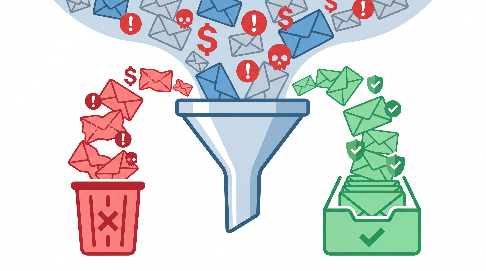
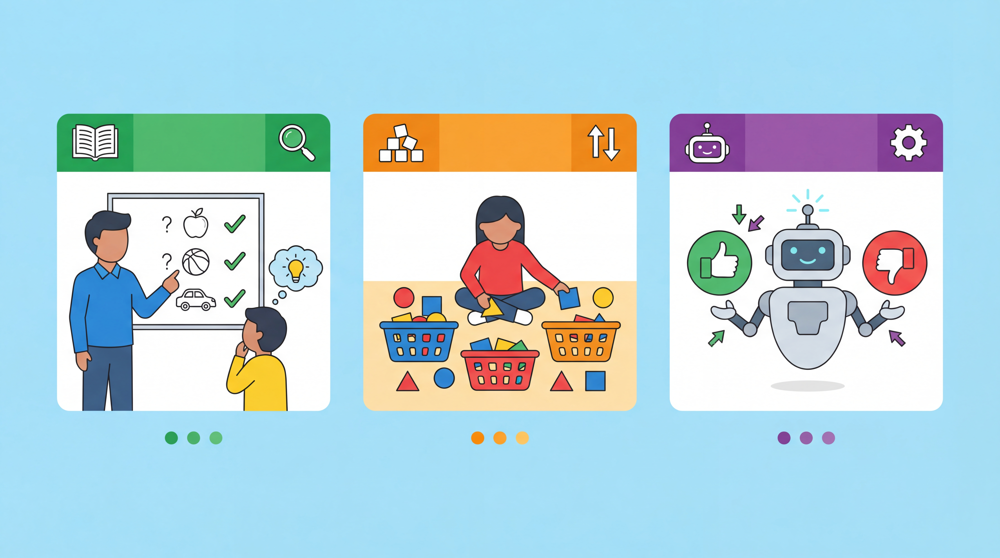
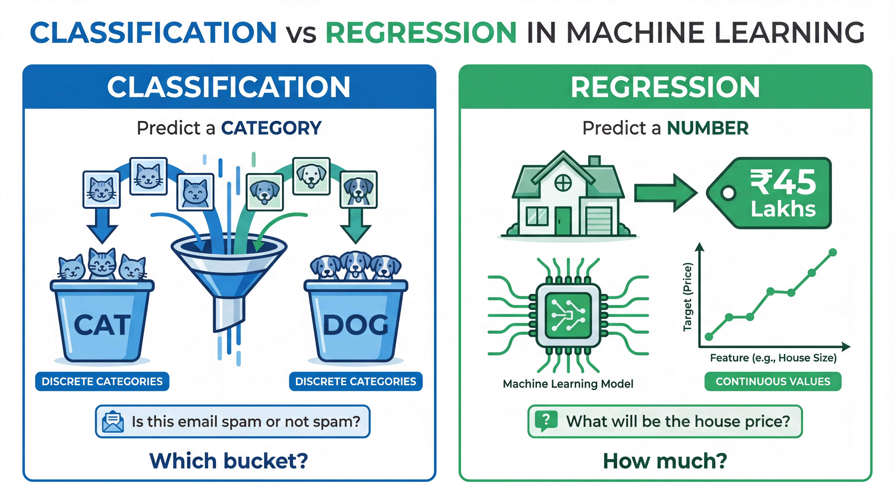
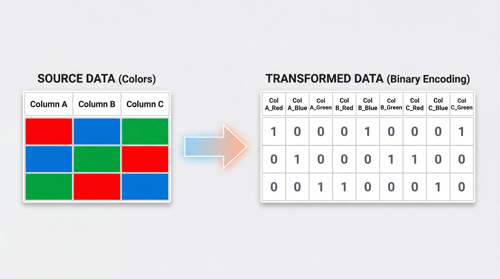
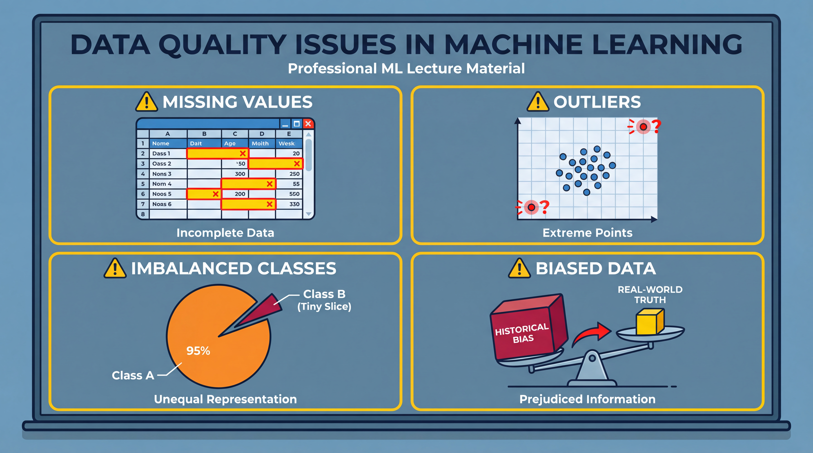
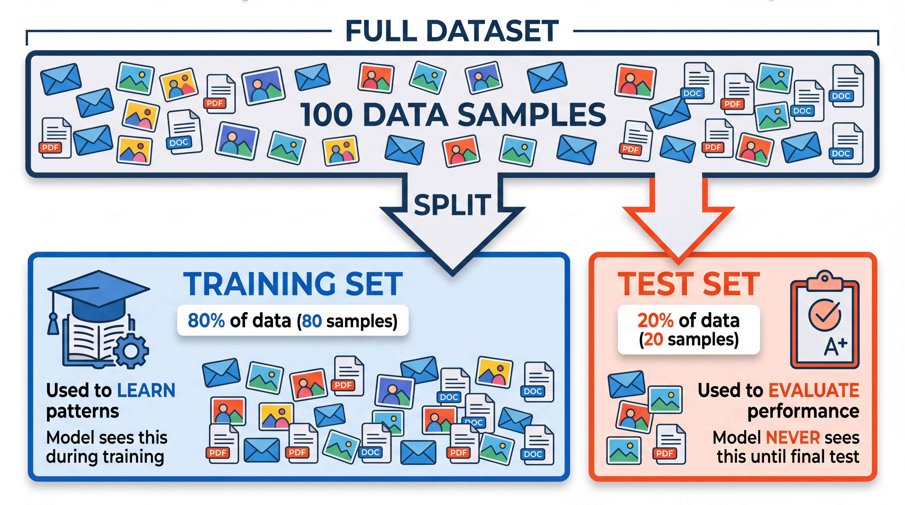
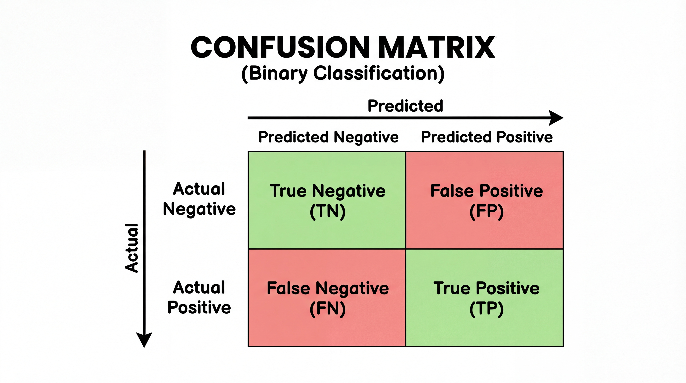
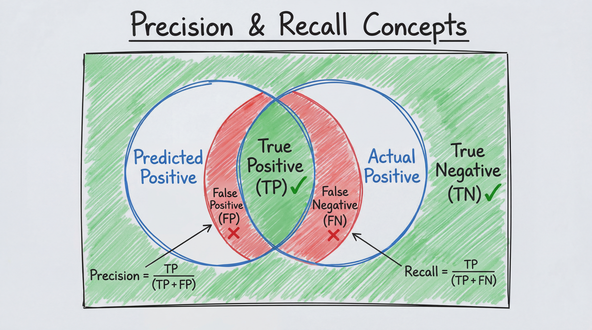

<!-- _class: title-slide -->
<!-- _paginate: false -->

# Data Foundation
# & ML Framework

## The Building Blocks of Machine Learning

**Nipun Batra** | IIT Gandhinagar

---

# Where We Are

| Lecture | Topic |
|---------|-------|
| 1 | What is AI? (videos, demos) |
| **2** | **How does ML work? (today!)** |
| 3 onwards | Building specific models |

**Today:** The foundation everything else builds on!

---

# Today's Big Questions

1. What makes ML different from regular programming?
2. What are the different ways machines can learn?
3. How do we represent data for computers?
4. How do we know if our model is good?

---

<!-- _class: section-divider -->

# Part 1: The ML Mindset

## A New Way of Programming

---

# Traditional Programming


**You write explicit rules:**

```
Problem: Determine if an email is spam

Your Rules:
  IF email contains "FREE MONEY" → Spam
  IF email contains "You've won" → Spam
  IF sender is unknown AND has attachment → Spam
  ...
```

---

# The Problem with Rules

**What about these?**

| Email | Your Rule | Reality |
|-------|-----------|---------|
| "FR33 M0N3Y!!!" | Not spam ❌ | Spam! |
| "Won tickets to concert" | Spam | Actually legit! |
| "Free lunch in cafeteria" | Spam | Not spam! |

**Spammers adapt. Rules break.**

---

# The ML Approach



**Instead of writing rules... let the computer learn them!**

```python
# You provide examples
emails = ["FREE MONEY!!!", "Meeting at 3pm", ...]
labels = ["spam", "not spam", ...]

# Computer learns patterns
model.learn(emails, labels)

# Now it can classify NEW emails
model.predict("FR33 M0N3Y")  # → "spam"
```

**ML = Learning patterns from examples!**

---

# The Key Difference

| Traditional Programming | Machine Learning |
|------------------------|------------------|
| Human writes rules | Computer learns rules |
| Rules are explicit | Rules are implicit (in the model) |
| Doesn't improve | Improves with more data |
| Breaks on edge cases | Generalizes to new cases |

---

# When to Use ML?

**ML is great when:**

| Scenario | Example |
|----------|---------|
| Rules are complex | Face recognition |
| Rules change over time | Stock prediction |
| Rules are unknown | Medical diagnosis |
| There's lots of data | Language translation |

**ML is NOT needed when:**
- Rules are simple and fixed (calculator)
- Data is scarce (rare diseases)

---

# The Formal Definition

> "A computer program is said to **learn** from **experience E** with respect to some class of **tasks T** and **performance measure P** if its performance at tasks in T, as measured by P, improves with experience E."
> — Tom Mitchell

---

# Breaking Down the Definition

| Component | Spam Filter Example |
|-----------|---------------------|
| **Task (T)** | Classify emails as spam/not spam |
| **Experience (E)** | Database of labeled emails |
| **Performance (P)** | % of correctly classified emails |

**Learning = Performance improves with Experience!**

---

<!-- _class: section-divider -->

# Part 2: How Machines Learn

## Three Learning Paradigms

---

# Three Ways to Learn



Just like humans, machines can learn in different ways:

- **Supervised:** Teacher provides labeled answers
- **Unsupervised:** Find hidden patterns in data
- **Reinforcement:** Learn from rewards/penalties

<div class="insight">

**This course focuses on supervised learning** — learning from labeled examples!

</div>

---

# Supervised Learning

**Like learning with a teacher who tells you right/wrong**

```
Teacher shows examples:
  "This email is spam" ✓
  "This email is not spam" ✓
  "This email is spam" ✓

Student (model) learns patterns...

Later, student predicts on new email:
  "I think this is spam!" (hopefully correct!)
```

<div class="insight">

**This course focuses primarily on supervised learning!**

</div>

---

# Real Supervised Learning Examples

| Task | Input | Output (label) |
|------|-------|----------------|
| Spam detection | Email text | Spam / Not spam |
| Medical diagnosis | X-ray image | Disease / No disease |
| House pricing | House features | Price (₹) |
| Credit scoring | Customer info | Approve / Reject |
| Weather | Historical data | Rain / No rain |

---

# Unsupervised Learning

**No labels! Find hidden patterns on your own**

```
Data: Purchase histories of 10,000 customers

Algorithm discovers groups:
  "Group A seems to buy electronics"
  "Group B mostly buys groceries"
  "Group C buys luxury items"

Nobody TOLD it these groups exist!
```

**Examples:** Customer segmentation, anomaly detection

---

# Reinforcement Learning

**Learn by trial and error with rewards**

```
Game-playing AI:
  Move left → +1 point (good!)
  Move right → -10 points (fell in pit!)
  Jump → +100 points (reached goal!)

Over time, learns: "Don't move right near pits"
```

**Examples:** AlphaGo, Self-driving cars, Robotics

---

# Our Focus: Supervised Learning



Supervised learning has two main types:

- **Classification:** Predict a category ("Cat" or "Dog")
- **Regression:** Predict a number (House price: ₹45 lakhs)

<div class="insight">

**Simple rule:** Classification = "Which bucket?" | Regression = "How much?"

</div>

---

# Classification Examples

**Predict a category/class**

| Input | Output | Classes |
|-------|--------|---------|
| Email | Spam or Not | 2 classes (binary) |
| Image | Cat, Dog, Bird | 3+ classes (multi-class) |
| Handwritten digit | 0, 1, 2, ..., 9 | 10 classes |
| Movie review | Positive, Neutral, Negative | 3 classes |

---

# Regression Examples

**Predict a continuous number**

| Input | Output | Range |
|-------|--------|-------|
| House features | Price | ₹0 to ∞ |
| Patient data | Blood pressure | 60-180 mmHg |
| Weather history | Temperature | -20°C to 50°C |
| Image | Person's age | 0-100 years |

---

# Quick Quiz: Classification or Regression?

| Task | Type | Why? |
|------|------|------|
| Will it rain tomorrow? | Classification | Yes/No |
| How many mm of rain? | Regression | A number |
| What rating (1-5 stars)? | Either! | Ordered categories or continuous |
| Which digit (0-9)? | Classification | 10 discrete categories |

---

<!-- _class: section-divider -->

# Part 3: Representing Data

## Features, Labels, and Notation

---

# A Concrete Example: Tomato Quality

**Problem:** Predict if a tomato is Good or Bad

**What information might help?**
- Color (Red, Orange, Yellow)
- Size (Small, Medium, Large)
- Texture (Smooth, Rough)

These are called **features** (inputs to our model).

---

# Our Tomato Dataset

| Color | Size | Texture | **Quality** |
|-------|------|---------|-------------|
| Orange | Small | Smooth | Good |
| Red | Small | Rough | Good |
| Orange | Medium | Smooth | Bad |
| Yellow | Large | Smooth | Bad |

**Features (X):** Color, Size, Texture
**Label (y):** Quality (what we want to predict)

---

# Features vs Labels

| Features (X) | Label (y) |
|--------------|-----------|
| What we observe | What we want to predict |
| Input to the model | Output of the model |
| Multiple columns | Usually one column |
| Color, Size, Texture | Good/Bad |

---

# Important: What Makes a Good Feature?

**Good features:**
- Color, Size, Texture → Related to quality!

**Bad features:**
- Sample number (1, 2, 3, 4) → Just an ID, meaningless!
- Day of week you measured → Probably irrelevant

<div class="warning">

**Bad features confuse models.** Think about what's actually relevant!

</div>

---

# Mathematical Notation

**We need consistent symbols for ML**

| Symbol | Meaning | Example |
|--------|---------|---------|
| $n$ | Number of samples | 4 tomatoes |
| $d$ | Number of features | 3 (Color, Size, Texture) |
| $\mathbf{X}$ | Feature matrix (all data) | 4 rows × 3 columns |
| $\mathbf{y}$ | Label vector | [Good, Good, Bad, Bad] |
| $\mathbf{x}_i$ | Single sample's features | Orange, Small, Smooth |
| $y_i$ | Single sample's label | Good |

---

# The Convention

<div class="insight">

**Bold UPPERCASE** = Matrix: $\mathbf{X}, \mathbf{W}$
**Bold lowercase** = Vector: $\mathbf{x}, \mathbf{y}, \mathbf{w}$
**Regular** = Scalar: $n, d, y_i$

</div>

**Why this matters:** When you read ML papers or code, everyone uses these conventions!

---

# The Dataset Notation

$$\mathcal{D} = \{(\mathbf{x}_i, y_i)\}_{i=1}^{n}$$

**In English:**
"Dataset $\mathcal{D}$ is a collection of $n$ pairs, where each pair is (features, label)"

**Example:** $(\mathbf{x}_1, y_1)$ = (Orange, Small, Smooth, Good)

---

# But Wait... Computers Need Numbers!

**Problem:** "Orange" and "Small" aren't numbers!

**Solution:** Convert categories to numbers (encoding)

| Color | Encoded |
|-------|---------|
| Red | [1, 0, 0] |
| Orange | [0, 1, 0] |
| Yellow | [0, 0, 1] |

This is called **one-hot encoding**.

---

# Why One-Hot Encoding?



**Bad idea:** Red=1, Orange=2, Yellow=3

**Problem:** This implies Orange is "between" Red and Yellow!

**One-hot is better:** Each color gets its own column

```python
# In Python (pandas):
pd.get_dummies(df['Color'])
#    Red  Orange  Yellow
# 0    0       1       0
# 1    1       0       0
```

---

<!-- _class: section-divider -->

# Part 4: Data Quality

## Garbage In, Garbage Out!

---

# Why Data Quality Matters



**Your model is only as good as your data!**

| Issue | Problem | Example |
|-------|---------|---------|
| Missing values | Incomplete information | Empty cells in spreadsheet |
| Outliers | Extreme values | Age = 500 years |
| Imbalanced classes | One class dominates | 99% healthy, 1% sick |
| Biased data | Unrepresentative sample | Only urban customers |

---

# Missing Values

**What to do when data is incomplete?**

| Strategy | When to Use |
|----------|-------------|
| **Drop rows** | Few missing values, lots of data |
| **Fill with mean/median** | Numerical features |
| **Fill with mode** | Categorical features |
| **Use "Unknown" category** | When missingness is meaningful |

```python
# In pandas
df['age'].fillna(df['age'].median(), inplace=True)
```

---

# Outliers

**Extreme values can mislead your model**

| Example | Normal Range | Outlier |
|---------|--------------|---------|
| Age | 0-100 | 500 |
| Salary | ₹10K-₹1Cr | ₹100Cr |
| Height | 1.4m-2.1m | 5m |

**Solutions:**
- Remove if clearly errors
- Cap at percentiles (e.g., 1st and 99th)
- Use robust models (trees are less sensitive)

---

# Imbalanced Classes

**When one class dominates:**

| Class | Count | Problem |
|-------|-------|---------|
| Not Fraud | 99,900 | Model just predicts "Not Fraud" always! |
| Fraud | 100 | Gets 99.9% accuracy but catches nothing |

**Solutions:**
- Collect more minority class data
- Oversample minority class (SMOTE)
- Undersample majority class
- Use class weights in training

---

# Data Bias

**Your data reflects the world it came from**

| Bias Type | Example |
|-----------|---------|
| **Selection bias** | Only surveying English speakers |
| **Historical bias** | Past hiring data reflects past discrimination |
| **Measurement bias** | Different hospitals use different equipment |

<div class="warning">

**Biased data → Biased model → Unfair predictions!**

</div>

---

# Real-World Example: Amazon's Hiring AI

**What happened:**
- Trained on 10 years of hiring data
- Data was mostly male hires (tech industry)
- AI learned to prefer male candidates!

**Result:** Penalized resumes with "women's" in them

<div class="insight">

**Lesson:** Always check your data for hidden biases before training!

</div>

---

<!-- _class: section-divider -->

# Part 5: Train/Test Split

## The Most Important Concept!

---

# The Exam Analogy

**Two study strategies:**

| Strategy A: Memorize | Strategy B: Learn |
|---------------------|-------------------|
| Memorize "2+3=5" | Understand addition |
| Exam: "2+3=?" → 5 ✓ | Exam: "2+3=?" → 5 ✓ |
| Exam: "2+4=?" → ??? ❌ | Exam: "2+4=?" → 6 ✓ |

<div class="insight">

**We want models to LEARN patterns, not MEMORIZE examples!**

</div>

---

# The Problem

**You train a model on 100 emails.**
**You test it on the SAME 100 emails.**
**Accuracy: 100%! 🎉**

**But wait...** The model might have just memorized them!

**On NEW emails it's never seen?** Maybe only 60% accuracy 😱

---

# The Solution: Split Your Data



**Don't test on data you trained on!**

| Training Set (80%) | Test Set (20%) |
|-------------------|----------------|
| Used to learn | Used to evaluate |
| Model sees these during training | Model NEVER sees these |
| 80 emails | 20 emails |

---

# In Python

```python
from sklearn.model_selection import train_test_split

# Split: 80% train, 20% test
X_train, X_test, y_train, y_test = train_test_split(
    X, y,
    test_size=0.2,      # 20% for testing
    random_state=42     # For reproducibility
)

# Train ONLY on training data
model.fit(X_train, y_train)

# Evaluate on test data (never seen!)
accuracy = model.score(X_test, y_test)
```

---

# Why This Works

| Scenario | Training Acc | Test Acc | Status |
|----------|--------------|----------|--------|
| Good model | 90% | 88% | ✅ Learned! |
| Memorized | 100% | 60% | ❌ Overfitting |
| Too simple | 65% | 63% | ⚠️ Underfitting |

**The test accuracy tells you real-world performance!**

---

# The Golden Rule

<div class="warning">

**NEVER peek at the test data during training!**

</div>

If you use test data to make decisions (choosing models, tuning parameters), you're cheating — your "test" accuracy becomes meaningless.

---

<!-- _class: section-divider -->

# Part 5: Evaluation Metrics

## How Do We Measure "Good"?

---

# Accuracy: The Obvious Metric

$$\text{Accuracy} = \frac{\text{Correct Predictions}}{\text{Total Predictions}}$$

**Example:** 85 out of 100 correct → 85% accuracy

**Sounds perfect, right?**

---

# When Accuracy Fails

**Scenario:** Cancer screening

| Reality | Count |
|---------|-------|
| Healthy | 990 |
| Cancer | 10 |

**Dumb model:** Always predict "Healthy"

**Accuracy = 990/1000 = 99%** 🎉

**But it catches 0% of cancer cases!** 😱

---

# The Confusion Matrix



The confusion matrix shows all four possible outcomes:

- **True Positive (TP):** Correctly caught cancer
- **True Negative (TN):** Correctly said healthy
- **False Positive (FP):** Said cancer but was healthy (false alarm)
- **False Negative (FN):** Said healthy but had cancer (MISSED!)

<div class="insight">

The diagonal shows correct predictions; off-diagonal shows errors.

</div>

---

# Precision: "Of my predictions, how many were right?"

$$\text{Precision} = \frac{TP}{TP + FP}$$

**Example:** You predicted 10 people have cancer.
- 8 actually do (TP = 8)
- 2 don't (FP = 2)

**Precision = 8/10 = 80%**

"When I say positive, I'm right 80% of the time"

---

# Recall: "Of all positives, how many did I catch?"

$$\text{Recall} = \frac{TP}{TP + FN}$$

**Example:** 10 people actually have cancer.
- You caught 8 (TP = 8)
- You missed 2 (FN = 2)

**Recall = 8/10 = 80%**

"I catch 80% of all cancer cases"

---

# Precision vs Recall Trade-off



| Metric | Focus | When to Prioritize |
|--------|-------|-------------------|
| **Precision** | Don't cry wolf | Spam filter |
| **Recall** | Don't miss any | Cancer screening |

**You usually can't have both perfect!**

---

# F1 Score: The Balance

$$\text{F1} = \frac{2 \times \text{Precision} \times \text{Recall}}{\text{Precision} + \text{Recall}}$$

**Harmonic mean** of precision and recall.

| Precision | Recall | F1 |
|-----------|--------|-----|
| 100% | 0% | 0% |
| 80% | 80% | 80% |
| 100% | 100% | 100% |

**F1 is high only when BOTH are high!**

---

# Regression Metrics

For regression (predicting numbers), we measure "how far off":

| Metric | Formula | Intuition |
|--------|---------|-----------|
| **MAE** | $\frac{1}{n}\sum\|y_i - \hat{y}_i\|$ | Average error |
| **MSE** | $\frac{1}{n}\sum(y_i - \hat{y}_i)^2$ | Penalizes big errors more |
| **RMSE** | $\sqrt{MSE}$ | Same units as y |

---

# Regression Example

| Actual Price | Predicted | Error |
|--------------|-----------|-------|
| ₹50 lakhs | ₹48 lakhs | ₹2 lakhs |
| ₹30 lakhs | ₹35 lakhs | ₹5 lakhs |
| ₹40 lakhs | ₹40 lakhs | ₹0 |

**MAE = (2 + 5 + 0) / 3 = ₹2.33 lakhs**

"On average, we're off by ₹2.33 lakhs"

---

<!-- _class: section-divider -->

# Part 6: The sklearn Pattern

## Your First ML Code

---

# The Universal Pattern

**ALL sklearn models follow the same pattern:**

```python
# 1. Create model
model = SomeModel()

# 2. Train (fit) on training data
model.fit(X_train, y_train)

# 3. Predict on new data
predictions = model.predict(X_test)

# 4. Evaluate
score = model.score(X_test, y_test)
```

**Learn this once, use it forever!**

---

# Complete Example

```python
from sklearn.tree import DecisionTreeClassifier
from sklearn.model_selection import train_test_split
from sklearn.metrics import accuracy_score

# 1. Split data
X_train, X_test, y_train, y_test = train_test_split(
    X, y, test_size=0.2
)

# 2. Create and train model
model = DecisionTreeClassifier()
model.fit(X_train, y_train)

# 3. Predict and evaluate
predictions = model.predict(X_test)
print(f"Accuracy: {accuracy_score(y_test, predictions):.1%}")
```

---

# Same Pattern, Different Models!

```python
# Linear Regression
from sklearn.linear_model import LinearRegression
model = LinearRegression()
model.fit(X_train, y_train)
model.predict(X_test)

# Logistic Regression
from sklearn.linear_model import LogisticRegression
model = LogisticRegression()
model.fit(X_train, y_train)
model.predict(X_test)

# Neural Network
from sklearn.neural_network import MLPClassifier
model = MLPClassifier()
model.fit(X_train, y_train)
model.predict(X_test)
```

**Same three methods: `fit()`, `predict()`, `score()`**

---

# Summary: Key Concepts

| Concept | Key Insight |
|---------|-------------|
| **ML vs Programming** | ML learns rules from examples |
| **Three Paradigms** | Supervised (with labels), Unsupervised, RL |
| **Classification** | Predict categories |
| **Regression** | Predict numbers |
| **Features & Labels** | Inputs (X) and outputs (y) |
| **Train/Test Split** | Never test on training data! |
| **Evaluation** | Accuracy isn't everything (precision, recall, F1) |

---

# What's Next?

| Lecture | Topic |
|---------|-------|
| 3 | **Supervised Learning:** Linear & Logistic Regression |
| 4 | **Model Selection:** How to choose and evaluate models |
| 5 | **Neural Networks:** The foundation of deep learning |

---

<!-- _class: title-slide -->

# You Now Have the Foundation!

## Next: Linear & Logistic Regression

**Key takeaways:**
- ML = learning patterns from data
- Supervised learning = learning from labeled examples
- Always split train/test
- Accuracy isn't the only metric

**Questions?**
