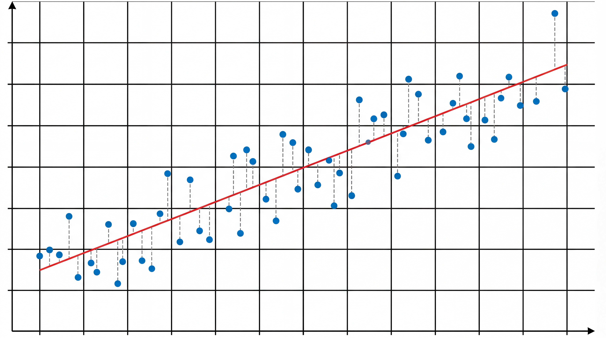
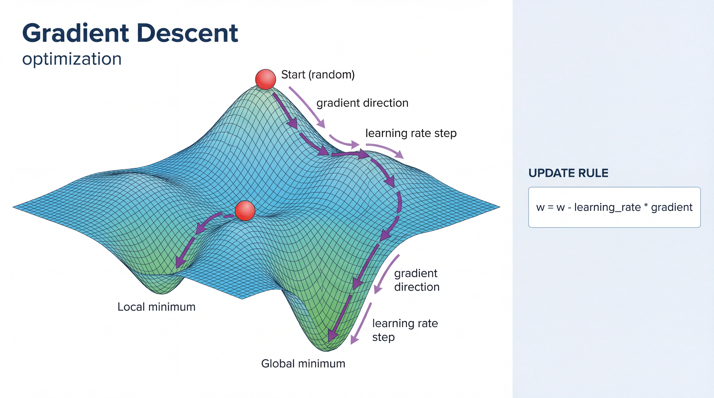
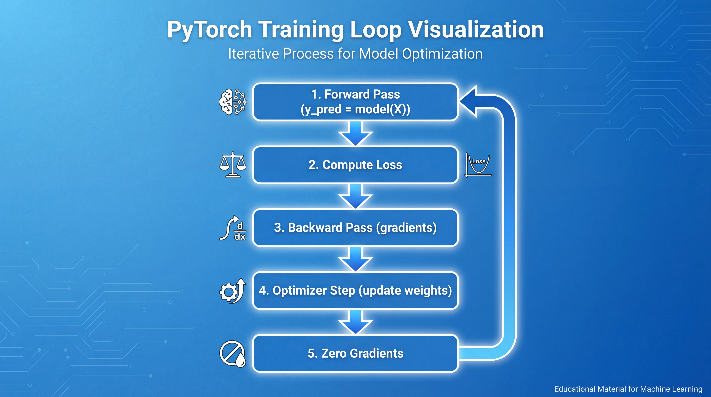
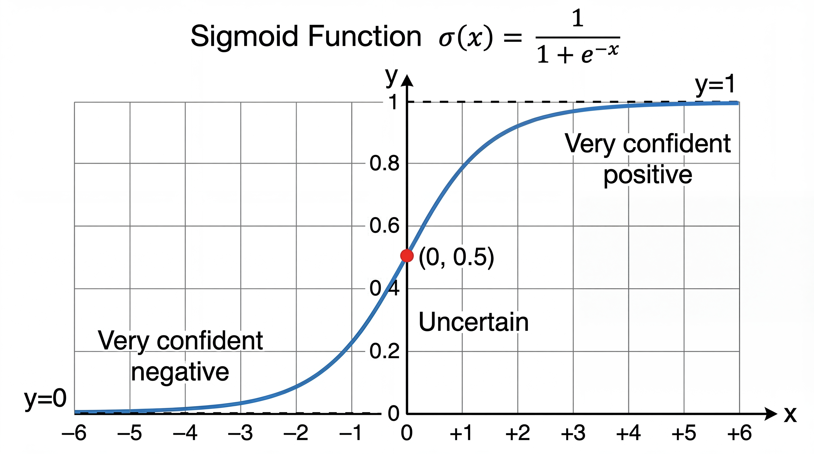

<!-- _class: title-slide -->
<!-- _paginate: false -->

# Supervised Learning
# Deep Dive

## Linear & Logistic Regression

**Nipun Batra** | IIT Gandhinagar

---

# Learning Goals

By the end of this lecture, you will:

1. **Understand** how linear regression finds the best line
2. **Learn** how to find optimal weights (optimization!)
3. **Apply** logistic regression for classification
4. **Connect** sklearn to PyTorch for neural networks

---

# Recap: Supervised Learning

**We have:**
- Features (X): What we know about each example
- Labels (y): What we want to predict

**Goal:** Learn a function f where f(X) ≈ y

| If y is... | Task | Example |
|------------|------|---------|
| A number | Regression | Predict house price |
| A category | Classification | Spam or not spam |

---

<!-- _class: section-divider -->

# Part 1: Linear Regression

## Finding the Best Line

---

# The Simplest Prediction Problem

**Scenario:** You're a real estate agent. A client asks:

> "I'm looking at a 1750 sqft house. What should I expect to pay?"

You have data from recent sales:

| Size (sqft) | Price (₹ lakhs) |
|-------------|-----------------|
| 1000 | 40 |
| 1500 | 60 |
| 2000 | 80 |
| 2500 | 100 |

**Can you see the pattern?**

---

# Visualizing the Data



When we plot the data:
- X-axis: House size
- Y-axis: Price

The points seem to follow a line!

**Linear regression = finding the best line through the points**

---

# The Pattern is Clear!

Every 500 sqft adds ₹20 lakhs.

| Size | Price | Pattern |
|------|-------|---------|
| 1000 | 40 | |
| 1500 | 60 | +500 sqft → +₹20 lakhs |
| 2000 | 80 | +500 sqft → +₹20 lakhs |
| 2500 | 100 | +500 sqft → +₹20 lakhs |

**So 1750 sqft should cost... ₹70 lakhs!**

You just did linear regression in your head.

---

# The Equation of a Line

$$\hat{y} = w \cdot x + b$$

| Symbol | Name | Meaning | Our Example |
|--------|------|---------|-------------|
| $x$ | Input | Feature value | Size (sqft) |
| $\hat{y}$ | Output | Predicted value | Price |
| $w$ | Weight | Slope | 0.04 |
| $b$ | Bias | Intercept | 0 |

**The "hat" on y means it's our prediction!**

---

# What Does the Weight Mean?

**Weight w = 0.04 means:**

> "For every 1 sqft increase, price increases by ₹0.04 lakhs"

Or equivalently:
> "For every 100 sqft increase, price increases by ₹4 lakhs"

<div class="insight">

The weight tells you the **sensitivity** — how much does output change when input changes?

</div>

---

# What Does the Bias Mean?

**Bias b = 0 means:**

> "A 0 sqft house would cost ₹0"

In reality, bias captures the **baseline** cost:
- Land value
- Permits and fees
- Minimum construction cost

If b = 10, then even a tiny house costs at least ₹10 lakhs.

---

# Multiple Features: The General Form

What if price depends on more than just size?

$$\hat{y} = w_1 x_1 + w_2 x_2 + \ldots + w_d x_d + b$$

Or in **vector form**:

$$\hat{y} = \mathbf{w}^\top \mathbf{x} + b$$

| Symbol | Shape | Example |
|--------|-------|---------|
| $\mathbf{x}$ | (d,) | [1500, 3, 2] — size, beds, baths |
| $\mathbf{w}$ | (d,) | [0.03, 5.0, 8.0] — learned weights |
| $b$ | scalar | -10 |

---

# Interpreting Multiple Weights

```python
# After training on multiple features:
# coef_ = [0.03, 5.0, 8.0]
# intercept_ = -10
```

| Feature | Weight | Interpretation |
|---------|--------|----------------|
| Size (sqft) | 0.03 | +100 sqft → +₹3 lakhs |
| Bedrooms | 5.0 | +1 bedroom → +₹5 lakhs |
| Bathrooms | 8.0 | +1 bathroom → +₹8 lakhs |

<div class="insight">

Each weight shows that feature's **independent contribution** to price!

</div>

---

<!-- _class: section-divider -->

# Part 2: Finding the Best Weights

## The Optimization Problem

---

# But What if Data Isn't Perfect?

Real data has **noise** — points don't fall exactly on a line.

| Size | Actual Price | On the Line? |
|------|--------------|--------------|
| 1000 | 42 | No (line says 40) |
| 1500 | 58 | No (line says 60) |
| 2000 | 83 | No (line says 80) |
| 2500 | 97 | No (line says 100) |

**Which line is "best"?**

---

# The Goal: Minimize Errors

**Residual** = Actual - Predicted = $y - \hat{y}$

| Size | Actual | Predicted | Residual |
|------|--------|-----------|----------|
| 1000 | 42 | 40 | +2 |
| 1500 | 58 | 60 | -2 |
| 2000 | 83 | 80 | +3 |
| 2500 | 97 | 100 | -3 |

**Goal:** Find w and b that make residuals as small as possible!

---

# Why Squared Errors?

We minimize **Sum of Squared Errors** (SSE):

$$\text{SSE} = \sum_{i=1}^{n} (y_i - \hat{y}_i)^2$$

| Why Square? | Reason |
|-------------|--------|
| Errors don't cancel | +3 and -3 both contribute positively |
| Penalizes big errors more | Error of 10 costs 100, not 10 |
| Has nice math properties | Differentiable, convex |

---

# Mean Squared Error (MSE)

**More commonly, we use MSE (average of squared errors):**

$$\text{MSE} = \frac{1}{n}\sum_{i=1}^{n} (y_i - \hat{y}_i)^2$$

This is also called the **Loss Function** or **Cost Function**:

$$\mathcal{L}(\mathbf{w}, b) = \frac{1}{n}\sum_{i=1}^{n} (y_i - (\mathbf{w}^\top \mathbf{x}_i + b))^2$$

<div class="insight">

**Our goal:** Find $\mathbf{w}$ and $b$ that minimize $\mathcal{L}$

</div>

---

# Two Ways to Find the Best Weights

| Method | How It Works | When to Use |
|--------|--------------|-------------|
| **Normal Equation** | Direct formula, one-shot | Small datasets |
| **Gradient Descent** | Iterative, step-by-step | Large datasets, neural nets |

**Let's learn both!**

---

# Method 1: The Normal Equation

For linear regression, there's a **closed-form solution**:

$$\mathbf{w} = (\mathbf{X}^\top \mathbf{X})^{-1} \mathbf{X}^\top \mathbf{y}$$

**In plain English:**
1. Take your data matrix X and labels y
2. Do some matrix math
3. Get the optimal weights directly!

---

# Normal Equation: The Intuition

Why does this work?

1. We want to minimize $(y - Xw)^2$
2. Take derivative with respect to w
3. Set derivative = 0 (finding the minimum)
4. Solve for w

**Result:** $\mathbf{w} = (\mathbf{X}^\top \mathbf{X})^{-1} \mathbf{X}^\top \mathbf{y}$

<div class="warning">

**Limitation:** Matrix inversion is expensive for large datasets (O(n³))

</div>

---

# Normal Equation in NumPy

```python
import numpy as np

# Our data
X = np.array([[1000], [1500], [2000], [2500]])
y = np.array([40, 60, 80, 100])

# Add column of 1s for bias term
X_bias = np.column_stack([np.ones(len(X)), X])

# Normal equation!
w = np.linalg.inv(X_bias.T @ X_bias) @ X_bias.T @ y

print(f"Bias (b): {w[0]:.2f}")    # ≈ 0
print(f"Weight (w): {w[1]:.4f}")  # ≈ 0.04
```

---

# Method 2: Gradient Descent

**The idea:** Take small steps downhill until you reach the minimum!



1. Start with random weights
2. Compute the gradient (slope)
3. Take a step opposite to gradient
4. Repeat until converged

---

# Gradient Descent: The Algorithm

**Update rule:**

$$w_{\text{new}} = w_{\text{old}} - \eta \cdot \nabla \mathcal{L}$$

| Symbol | Name | Meaning |
|--------|------|---------|
| $\eta$ | Learning rate | How big each step is |
| $\nabla \mathcal{L}$ | Gradient | Direction of steepest increase |
| $-\nabla \mathcal{L}$ | | Direction of steepest decrease |

---

# The Gradient for MSE

For our loss $\mathcal{L} = \frac{1}{n}\sum(y_i - \hat{y}_i)^2$:

$$\frac{\partial \mathcal{L}}{\partial w} = -\frac{2}{n}\sum_{i=1}^{n} (y_i - \hat{y}_i) \cdot x_i$$

**Intuition:**
- If predictions are too low ($y > \hat{y}$), increase w
- If predictions are too high ($y < \hat{y}$), decrease w
- Larger errors → larger updates

---

# Gradient Descent in NumPy

```python
import numpy as np

def gradient_descent(X, y, lr=0.0001, epochs=1000):
    w = 0.0  # Start with random weight
    b = 0.0  # Start with random bias
    n = len(y)

    for epoch in range(epochs):
        # Predictions
        y_pred = w * X + b

        # Gradients
        dw = (-2/n) * np.sum((y - y_pred) * X)
        db = (-2/n) * np.sum(y - y_pred)

        # Update weights
        w = w - lr * dw
        b = b - lr * db

    return w, b
```

---

# Learning Rate: The Key Hyperparameter

| Learning Rate | Effect |
|---------------|--------|
| Too small | Very slow convergence |
| Just right | Fast convergence to minimum |
| Too large | Overshoots, may diverge! |

<div class="insight">

**Rule of thumb:** Start with 0.01, adjust if loss doesn't decrease

</div>

---

# Why Gradient Descent Matters

| Normal Equation | Gradient Descent |
|-----------------|------------------|
| One-shot computation | Iterative process |
| Exact solution | Approximate (but close enough) |
| O(n³) complexity | O(n) per iteration |
| Only works for linear models | **Works for ANY differentiable model!** |

<div class="insight">

**This is the foundation of neural network training!**

</div>

---

<!-- _class: section-divider -->

# Part 3: From sklearn to PyTorch

## Building the Bridge

---

# Linear Regression in sklearn

```python
from sklearn.linear_model import LinearRegression
import numpy as np

# Our data
X = np.array([[1000], [1500], [2000], [2500]])
y = np.array([40, 60, 80, 100])

# Create and train model
model = LinearRegression()
model.fit(X, y)

# Now predict!
model.predict([[1750]])  # → 70.0 (₹70 lakhs)
```

---

# Understanding What sklearn Learned

```python
print(f"Weight (w): {model.coef_[0]}")      # 0.04
print(f"Intercept (b): {model.intercept_}")  # 0.0
```

**The equation it learned:**
$$\text{Price} = 0.04 \times \text{Size} + 0$$

**Verify:**
- 1750 sqft → 0.04 × 1750 + 0 = **₹70 lakhs** ✓

---

# The Same Thing in PyTorch!

```python
import torch
import torch.nn as nn

# Data as tensors
X = torch.tensor([[1000.], [1500.], [2000.], [2500.]])
y = torch.tensor([[40.], [60.], [80.], [100.]])

# Normalize for stable training
X_norm = X / 1000

# Linear model: y = wx + b
model = nn.Linear(1, 1)  # 1 input, 1 output
```

---

# Training in PyTorch

```python
# Loss function: Mean Squared Error
criterion = nn.MSELoss()

# Optimizer: Gradient Descent!
optimizer = torch.optim.SGD(model.parameters(), lr=0.1)

# Training loop
for epoch in range(100):
    # Forward pass: compute predictions
    y_pred = model(X_norm)

    # Compute loss
    loss = criterion(y_pred, y)

    # Backward pass: compute gradients
    optimizer.zero_grad()
    loss.backward()

    # Update weights
    optimizer.step()
```

---

# The PyTorch Training Loop



**The 5-step training cycle:**

| Step | Code | Purpose |
|------|------|---------|
| 1 | `y_pred = model(X)` | Forward pass |
| 2 | `loss = criterion(...)` | Compute loss |
| 3 | `loss.backward()` | Compute gradients |
| 4 | `optimizer.step()` | Update weights |
| 5 | `optimizer.zero_grad()` | Clear gradients |

**This same loop works for neural networks!**

---

# Comparing sklearn vs PyTorch

| Aspect | sklearn | PyTorch |
|--------|---------|---------|
| **Simplicity** | 2 lines of code | 10+ lines |
| **Method** | Normal equation | Gradient descent |
| **Customization** | Limited | Full control |
| **Neural nets** | Basic only | Full support |
| **GPU support** | No | Yes! |

**Start with sklearn, move to PyTorch when you need more power!**

---

<!-- _class: section-divider -->

# Part 4: Logistic Regression

## From Numbers to Categories

---

# A Different Problem

**Scenario:** You're building a spam filter.

| Email | Exclamation marks | Has "FREE" | Is Spam? |
|-------|-------------------|------------|----------|
| 1 | 5 | Yes | ✅ Spam |
| 2 | 0 | No | ❌ Not Spam |
| 3 | 3 | Yes | ✅ Spam |
| 4 | 1 | No | ❌ Not Spam |

**The output is a category, not a number!**

---

# Why Can't We Use Linear Regression?

If we use linear regression:

$$\text{Spam Score} = w_1 \times \text{Exclamations} + w_2 \times \text{HasFREE} + b$$

**Problem:** This gives any number (-∞ to +∞)

| Score | What does it mean? |
|-------|-------------------|
| -2.5 | ??? |
| 0.3 | ??? |
| 1.5 | ??? |
| 147 | ??? |

We need something between 0 and 1 (a probability)!

---

# The Sigmoid Function



**Solution:** Squash any number to range (0, 1)

$$\sigma(z) = \frac{1}{1 + e^{-z}}$$

| Input (z) | Output σ(z) |
|-----------|-------------|
| -10 | 0.00005 |
| 0 | 0.50 |
| +10 | 0.99995 |

---

# The Sigmoid Shape

The sigmoid is an **S-curve**:

| Region | Behavior |
|--------|----------|
| Very negative z | Output ≈ 0 |
| z near 0 | Output changes rapidly (decision boundary) |
| Very positive z | Output ≈ 1 |

<div class="insight">

**Key insight:** It converts any number to a probability!

</div>

---

# Logistic Regression Model

**Two steps:**

1. **Linear:** Compute a score (same as linear regression!)
   $$z = w_1 x_1 + w_2 x_2 + b$$

2. **Sigmoid:** Convert to probability
   $$P(\text{spam}) = \sigma(z) = \frac{1}{1 + e^{-z}}$$

---

# A Concrete Example

**Email features:** 5 exclamation marks, has "FREE" (=1)

**Learned weights:** $w_1 = 0.5$, $w_2 = 2.0$, $b = -1.0$

**Step 1: Linear score**
$$z = 0.5 \times 5 + 2.0 \times 1 + (-1.0) = 3.5$$

**Step 2: Sigmoid**
$$P(\text{spam}) = \sigma(3.5) = \frac{1}{1 + e^{-3.5}} = 0.97$$

**Decision:** 97% → This is spam!

---

# The Decision Rule

| If P(spam) | Decision |
|------------|----------|
| > 0.5 | Predict SPAM |
| ≤ 0.5 | Predict NOT SPAM |

**The threshold 0.5 is adjustable!**

| Threshold | Effect |
|-----------|--------|
| 0.5 | Balanced |
| 0.3 | Catch more spam (but more false alarms) |
| 0.7 | Fewer false alarms (but miss some spam) |

---

# Logistic Regression in sklearn

```python
from sklearn.linear_model import LogisticRegression

# Data: [exclamations, has_FREE]
X = [[5, 1], [0, 0], [3, 1], [1, 0], [4, 1], [0, 0]]
y = [1, 0, 1, 0, 1, 0]  # 1=spam, 0=not spam

# Train
model = LogisticRegression()
model.fit(X, y)

# Predict class
model.predict([[4, 1]])  # → [1] (spam)

# Predict probability
model.predict_proba([[4, 1]])  # → [[0.12, 0.88]]
#                                   [P(not spam), P(spam)]
```

---

# Logistic Regression in PyTorch

```python
import torch
import torch.nn as nn

# Model: Linear + Sigmoid
class LogisticRegression(nn.Module):
    def __init__(self, input_dim):
        super().__init__()
        self.linear = nn.Linear(input_dim, 1)
        self.sigmoid = nn.Sigmoid()

    def forward(self, x):
        return self.sigmoid(self.linear(x))

model = LogisticRegression(input_dim=2)
```

---

# Training Logistic Regression

```python
# Binary Cross-Entropy Loss (for classification)
criterion = nn.BCELoss()
optimizer = torch.optim.SGD(model.parameters(), lr=0.1)

for epoch in range(100):
    # Forward pass
    y_pred = model(X)

    # Compute loss (cross-entropy, not MSE!)
    loss = criterion(y_pred, y)

    # Backward pass
    optimizer.zero_grad()
    loss.backward()
    optimizer.step()
```

---

# Why Cross-Entropy Loss?

For classification, MSE doesn't work well!

| Loss Function | Best For | Why |
|---------------|----------|-----|
| MSE | Regression | Measures distance |
| Cross-Entropy | Classification | Measures probability mismatch |

**Cross-Entropy:**
$$\mathcal{L} = -\frac{1}{n}\sum[y_i \log(\hat{y}_i) + (1-y_i)\log(1-\hat{y}_i)]$$

*Penalizes confident wrong predictions severely!*

---

<!-- _class: section-divider -->

# Part 5: Model Evaluation

## How Good is Our Model?

---

# The Golden Rule

<div class="insight">

**Always evaluate on data the model has never seen!**

</div>

```python
from sklearn.model_selection import train_test_split

X_train, X_test, y_train, y_test = train_test_split(
    X, y, test_size=0.2, random_state=42
)

# Train ONLY on training data
model.fit(X_train, y_train)

# Evaluate ONLY on test data
predictions = model.predict(X_test)
```

---

# Regression Metrics

For regression (predicting numbers):

| Metric | Formula | Meaning |
|--------|---------|---------|
| **MSE** | $\frac{1}{n}\sum(y - \hat{y})^2$ | Average squared error |
| **RMSE** | $\sqrt{MSE}$ | Error in same units as y |
| **MAE** | $\frac{1}{n}\sum\|y - \hat{y}\|$ | Average absolute error |

```python
from sklearn.metrics import mean_squared_error, mean_absolute_error
import numpy as np

mse = mean_squared_error(y_test, predictions)
rmse = np.sqrt(mse)
mae = mean_absolute_error(y_test, predictions)
```

---

# Classification Metrics: Accuracy

$$\text{Accuracy} = \frac{\text{Correct Predictions}}{\text{Total Predictions}}$$

```python
from sklearn.metrics import accuracy_score

accuracy = accuracy_score(y_test, predictions)
print(f"Accuracy: {accuracy:.1%}")  # e.g., 92.5%
```

**But accuracy can be misleading...**

---

# The Accuracy Trap

**Scenario:** Disease detection (1% have disease, 99% healthy)

| Model | Strategy | Accuracy |
|-------|----------|----------|
| Dumb | Always predict "healthy" | **99%** |
| Smart | Tries to detect disease | 95% |

<div class="warning">

The "dumb" model has 99% accuracy but **misses ALL sick patients!**

</div>

---

# Precision and Recall

**Precision:** Of those I flagged, how many were correct?
$$\text{Precision} = \frac{TP}{TP + FP}$$

**Recall:** Of all positives, how many did I find?
$$\text{Recall} = \frac{TP}{TP + FN}$$

| Scenario | Priority |
|----------|----------|
| Spam filter | High precision (don't lose important emails!) |
| Cancer screening | High recall (don't miss any cancer!) |

---

# F1 Score: The Balance

$$\text{F1} = 2 \times \frac{\text{Precision} \times \text{Recall}}{\text{Precision} + \text{Recall}}$$

| Precision | Recall | F1 |
|-----------|--------|-----|
| 0.90 | 0.90 | 0.90 |
| 0.95 | 0.50 | 0.65 |
| 0.50 | 0.95 | 0.65 |

**F1 punishes imbalance!**

---

# Summary: The Big Picture

| Concept | Key Takeaway |
|---------|--------------|
| **Linear Regression** | $\hat{y} = \mathbf{w}^\top\mathbf{x} + b$ |
| **Loss Function** | MSE measures how wrong we are |
| **Normal Equation** | Direct solution (small data) |
| **Gradient Descent** | Iterative solution (any data, any model!) |
| **Logistic Regression** | Linear + Sigmoid for classification |
| **Cross-Entropy** | Loss for classification |
| **PyTorch** | Same concepts, more flexible |

---

# Key Takeaways

1. **Linear Regression** fits a line through data
   - Weight = sensitivity (how much output changes per input)
   - Minimize squared errors

2. **Two ways to find optimal weights**
   - Normal equation (direct)
   - Gradient descent (iterative) — **foundation of deep learning!**

3. **Logistic Regression** classifies using the sigmoid
   - Converts any score to probability (0-1)

4. **sklearn → PyTorch** uses the same concepts!

---

<!-- _class: title-slide -->

# You Now Understand the Basics!

## Next: Model Selection & Evaluation

**Key insight:** Gradient descent is how we train neural networks!

```python
# The universal training loop:
for epoch in epochs:
    loss = compute_loss(model(x), y)
    loss.backward()      # Compute gradients
    optimizer.step()     # Update weights
```

**Questions?**
