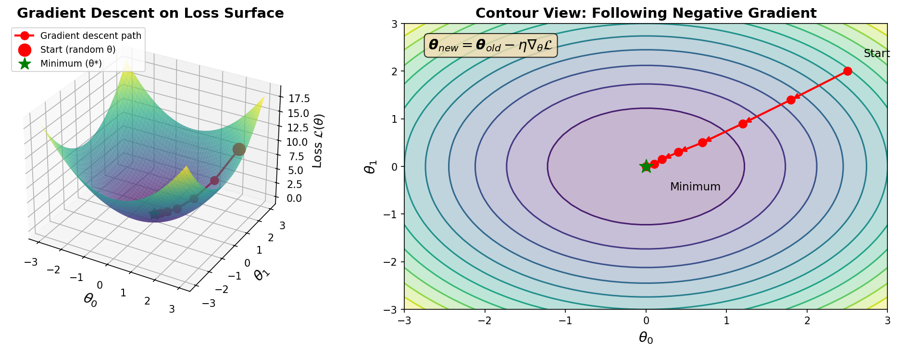
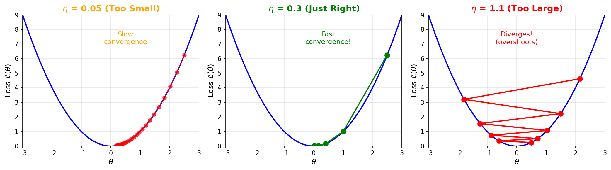
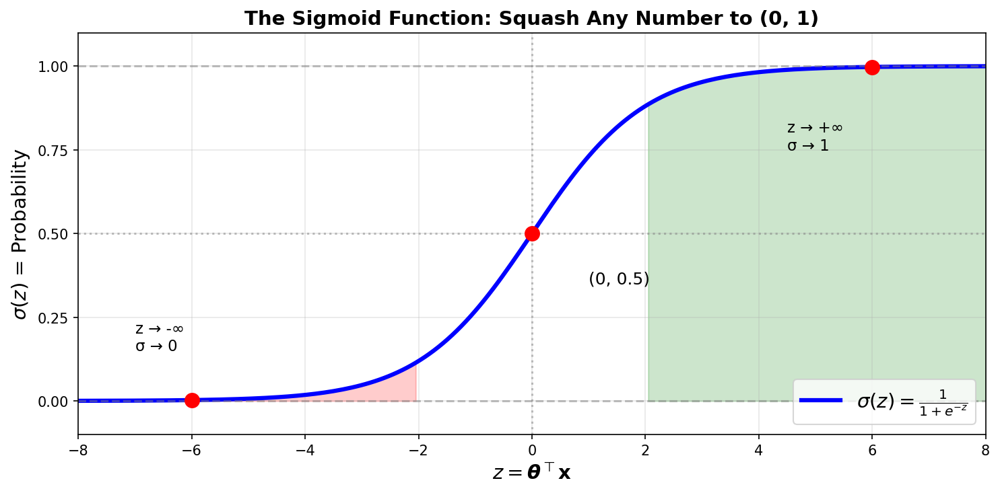
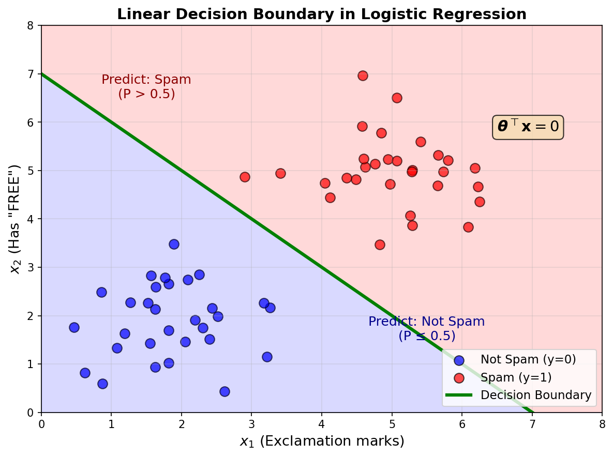
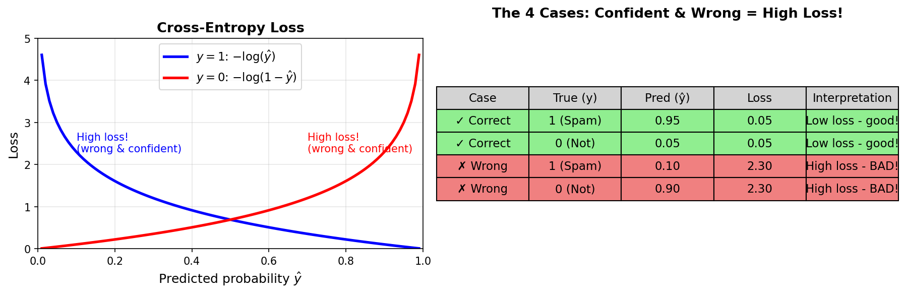

<!-- _class: title-slide -->
<!-- _paginate: false -->

# Supervised Learning
# Deep Dive

## Linear & Logistic Regression

**Nipun Batra** | IIT Gandhinagar

---

# Learning Goals

By the end of this lecture, you will:

1. **Understand** how linear regression finds the best line
2. **Learn** how to find optimal weights (optimization!)
3. **Apply** logistic regression for classification
4. **Connect** sklearn to PyTorch for neural networks

---

# Recap: Supervised Learning

**We have:**
- Features ($\mathbf{X}$): What we know about each example
- Labels ($\mathbf{y}$): What we want to predict

**Goal:** Learn a function $f$ where $f(\mathbf{X}) \approx \mathbf{y}$

| If $\mathbf{y}$ is... | Task | Example |
|------------|------|---------|
| A number | Regression | Predict house price |
| A category | Classification | Spam or not spam |

---

<!-- _class: section-divider -->

# Part 1: Linear Regression

## Finding the Best Line

---

# The Simplest Prediction Problem

**Scenario:** You're a real estate agent. A client asks:

> "I'm looking at a 1750 sqft house. What should I expect to pay?"

You have data from recent sales:

| Size (sqft) | Price (₹ lakhs) |
|-------------|-----------------|
| 1000 | 40 |
| 1500 | 60 |
| 2000 | 80 |
| 2500 | 100 |

**Can you see the pattern?**

---

# Visualizing the Data


When we plot the data:
- X-axis: House size
- Y-axis: Price

The points seem to follow a line!

**Linear regression = finding the best line through the points**

---

# The Pattern is Clear!

Every 500 sqft adds ₹20 lakhs.

| Size | Price | Pattern |
|------|-------|---------|
| 1000 | 40 | |
| 1500 | 60 | +500 sqft → +₹20 lakhs |
| 2000 | 80 | +500 sqft → +₹20 lakhs |
| 2500 | 100 | +500 sqft → +₹20 lakhs |

**So 1750 sqft should cost... ₹70 lakhs!**

You just did linear regression in your head.

---

# The Equation of a Line

$$\hat{y} = w \cdot x + b$$

| Symbol | Name | Meaning | Our Example |
|--------|------|---------|-------------|
| $x$ | Input | Feature value | Size (sqft) |
| $\hat{y}$ | Output | Predicted value | Price |
| $w$ | Weight | Slope | 0.04 |
| $b$ | Bias | Intercept | 0 |

**The "hat" on y means it's our prediction!**

---

# What Does the Weight Mean?

**Weight w = 0.04 means:**

> "For every 1 sqft increase, price increases by ₹0.04 lakhs"

Or equivalently:
> "For every 100 sqft increase, price increases by ₹4 lakhs"

<div class="insight">

The weight tells you the **sensitivity** — how much does output change when input changes?

</div>

---

# What Does the Bias Mean?

**Bias b = 0 means:**

> "A 0 sqft house would cost ₹0"

In reality, bias captures the **baseline** cost:
- Land value
- Permits and fees
- Minimum construction cost

If b = 10, then even a tiny house costs at least ₹10 lakhs.

---

# Multiple Features: The General Form

What if price depends on more than just size?

$$\hat{y} = w_1 x_1 + w_2 x_2 + \ldots + w_d x_d + b$$

Or in **vector form** (both notations are equivalent):

$$\hat{y} = \mathbf{w}^\top \mathbf{x} + b = \langle \mathbf{w}, \mathbf{x} \rangle + b$$

| Symbol | Shape | Example |
|--------|-------|---------|
| $\mathbf{x}$ | (d,) | [1500, 3, 2] — size, beds, baths |
| $\mathbf{w}$ | (d,) | [0.03, 5.0, 8.0] — learned weights |
| $b$ | scalar | -10 |

**Note:** $\mathbf{w}^\top \mathbf{x}$ and $\langle \mathbf{w}, \mathbf{x} \rangle$ both mean **dot product** (sum of element-wise products)

---

# Notation: Absorbing Bias into $\boldsymbol{\theta}$

**Going forward, we combine weights and bias into one vector $\boldsymbol{\theta}$:**

$$\hat{y} = \theta_0 + \theta_1 x_1 + \theta_2 x_2 + \ldots = \boldsymbol{\theta}^\top \mathbf{x}$$

**Trick:** Add a column of 1s to $\mathbf{X}$, so $\theta_0 \cdot 1 = \theta_0$ (the bias)

| Original $\mathbf{x}$ | Augmented $\mathbf{x}$ |
|----------|----------------------|
| $[x_1, x_2]$ | $[1, x_1, x_2]$ |

Now $\boldsymbol{\theta} = [\theta_0, \theta_1, \theta_2, \ldots]^\top$ contains bias + weights!

---

# Interpreting Multiple Weights

```python
# After training on multiple features:
# coef_ = [0.03, 5.0, 8.0]
# intercept_ = -10
```

| Feature | Weight | Interpretation |
|---------|--------|----------------|
| Size (sqft) | 0.03 | +100 sqft → +₹3 lakhs |
| Bedrooms | 5.0 | +1 bedroom → +₹5 lakhs |
| Bathrooms | 8.0 | +1 bathroom → +₹8 lakhs |

<div class="insight">

Each weight shows that feature's **independent contribution** to price!

</div>

---

<!-- _class: section-divider -->

# Part 2: Finding the Best Weights

## The Optimization Problem

---

# But What if Data Isn't Perfect?

Real data has **noise** — points don't fall exactly on a line.

| Size | Actual Price | Ideal Line (0.04x) | Difference |
|------|--------------|-------------------|------------|
| 1000 | 42 | 40 | +2 |
| 1500 | 58 | 60 | -2 |
| 2000 | 83 | 80 | +3 |
| 2500 | 97 | 100 | -3 |

**Which line is "best"?**

---

# The Goal: Minimize Errors

**Residual** = Actual - Predicted = $y - \hat{y}$

| Size | Actual | Predicted | Residual | Residual² |
|------|--------|-----------|----------|-----------|
| 1000 | 42 | 40 | +2 | 4 |
| 1500 | 58 | 60 | -2 | 4 |
| 2000 | 83 | 80 | +3 | 9 |
| 2500 | 97 | 100 | -3 | 9 |

**Goal:** Find $\boldsymbol{\theta}$ that minimizes $\sum(\text{residual})^2 = 4+4+9+9 = 26$

---

# Why Squared Errors?

We minimize **Sum of Squared Errors** (SSE):

$$\text{SSE} = \sum_{i=1}^{n} (y_i - \hat{y}_i)^2$$

| Why Square? | Reason |
|-------------|--------|
| Errors don't cancel | +3 and -3 both contribute positively |
| Penalizes big errors more | Error of 10 costs 100, not 10 |
| Has nice math properties | Differentiable, convex |

---

# Mean Squared Error (MSE)

**More commonly, we use MSE (average of squared errors):**

$$\text{MSE} = \frac{1}{n}\sum_{i=1}^{n} (y_i - \hat{y}_i)^2$$

This is also called the **Loss Function** or **Cost Function**:

$$\mathcal{L}(\boldsymbol{\theta}) = \frac{1}{n}\sum_{i=1}^{n} (y_i - \boldsymbol{\theta}^\top \mathbf{x}_i)^2$$

<div class="insight">

**Our goal:** Find $\boldsymbol{\theta}$ that minimizes $\mathcal{L}$

</div>

---

# Two Ways to Find the Best Weights

| Method | How It Works | When to Use |
|--------|--------------|-------------|
| **Normal Equation** | Direct formula, one-shot | Small datasets |
| **Gradient Descent** | Iterative, step-by-step | Large datasets, neural nets |

**Let's learn both!**

---

# Quick Review: Derivatives and Gradients

| Concept | What it means | Example |
|---------|---------------|---------|
| **Derivative** | Rate of change (1 variable) | $f(x) = x^2 \Rightarrow \frac{df}{dx} = 2x$ |
| **Partial Derivative** | Rate of change w.r.t. one variable (others fixed) | $f(x,y) = x^2 + y^2 \Rightarrow \frac{\partial f}{\partial x} = 2x$ |
| **Gradient** | Vector of all partial derivatives | $\nabla f = \left[\frac{\partial f}{\partial x}, \frac{\partial f}{\partial y}\right] = [2x, 2y]$ |

<div class="insight">

**Key insight:** Gradient points in direction of steepest **increase**. To minimize, go **opposite** to gradient!

</div>

---

# Gradient Example: $f(x,y) = x^2 + y^2$

At point $(1, 2)$:

$$\nabla f = [2x, 2y] = [2, 4]$$

**Interpretation:**
- Moving in $+x$ direction increases $f$ at rate 2
- Moving in $+y$ direction increases $f$ at rate 4
- To **decrease** $f$, move in direction $[-2, -4]$

**Setting $\nabla f = 0$:** Gives us $x=0, y=0$ — the minimum!

---

# Method 1: The Normal Equation

For linear regression, there's a **closed-form solution**:

$$\boldsymbol{\theta} = (\mathbf{X}^\top \mathbf{X})^{-1} \mathbf{X}^\top \mathbf{y}$$

**In plain English:**
1. Augment $\mathbf{X}$ with column of 1s (for bias)
2. Do some matrix math
3. Get the optimal $\boldsymbol{\theta}$ directly!

---

# Normal Equation: The Intuition

Why does this work?

1. We want to minimize $\mathcal{L}(\boldsymbol{\theta}) = \|\mathbf{y} - \mathbf{X}\boldsymbol{\theta}\|^2$
2. Take gradient with respect to $\boldsymbol{\theta}$: $\nabla_{\boldsymbol{\theta}} \mathcal{L}$
3. Set gradient = $\mathbf{0}$ (at minimum, gradient is zero)
4. Solve for $\boldsymbol{\theta}$

**Result:** $\boldsymbol{\theta} = (\mathbf{X}^\top \mathbf{X})^{-1} \mathbf{X}^\top \mathbf{y}$

<div class="warning">

**Limitation:** Matrix inversion is expensive for large datasets — $O(d^3)$ where $d$ = number of features

</div>

---

# Normal Equation in NumPy

```python
import numpy as np

# Our data
X = np.array([[1000], [1500], [2000], [2500]])
y = np.array([40, 60, 80, 100])

# Augment X with column of 1s for bias (theta_0)
X_aug = np.column_stack([np.ones(len(X)), X])

# Normal equation: theta = (X'X)^(-1) X'y
theta = np.linalg.inv(X_aug.T @ X_aug) @ X_aug.T @ y

print(f"theta_0 (bias): {theta[0]:.2f}")   # ≈ 0
print(f"theta_1 (weight): {theta[1]:.4f}") # ≈ 0.04
```

---

# Method 2: Gradient Descent

**The idea:** Take small steps downhill until you reach the minimum!



1. Start with random $\boldsymbol{\theta}$ → 2. Compute gradient → 3. Step opposite → 4. Repeat!

---

# Gradient Descent: The Algorithm

**Update rule:**

$$\boldsymbol{\theta}_{\text{new}} = \boldsymbol{\theta}_{\text{old}} - \eta \cdot \nabla_{\boldsymbol{\theta}} \mathcal{L}$$

| Symbol | Name | Meaning |
|--------|------|---------|
| $\eta$ | Learning rate | How big each step is |
| $\nabla_{\boldsymbol{\theta}} \mathcal{L}$ | Gradient | Direction of steepest increase |
| $-\nabla_{\boldsymbol{\theta}} \mathcal{L}$ | | Direction of steepest decrease |

---

# The Gradient for MSE: Derivation

Our loss: $\mathcal{L}(\boldsymbol{\theta}) = \frac{1}{n}\sum_{i=1}^{n}(y_i - \hat{y}_i)^2$ where $\hat{y}_i = \boldsymbol{\theta}^\top \mathbf{x}_i$

**Step 1:** Expand $\hat{y}_i = \theta_0 x_{i0} + \theta_1 x_{i1} + \ldots + \theta_d x_{id}$

**Step 2:** Partial derivative w.r.t. $\theta_j$:
$$\frac{\partial \mathcal{L}}{\partial \theta_j} = \frac{1}{n}\sum_{i=1}^{n} 2(y_i - \hat{y}_i) \cdot (-x_{ij}) = -\frac{2}{n}\sum_{i=1}^{n} (y_i - \hat{y}_i) \cdot x_{ij}$$

---

# The Gradient for MSE: Vector Form

**For each parameter $\theta_j$:**
$$\frac{\partial \mathcal{L}}{\partial \theta_j} = -\frac{2}{n}\sum_{i=1}^{n} (y_i - \hat{y}_i) \cdot x_{ij}$$

**Stacking all partials into a gradient vector:**
$$\nabla_{\boldsymbol{\theta}} \mathcal{L} = -\frac{2}{n} \mathbf{X}^\top (\mathbf{y} - \mathbf{X}\boldsymbol{\theta})$$

<div class="insight">

**Intuition:** Error $(y_i - \hat{y}_i)$ weighted by feature $x_{ij}$ tells us how to adjust $\theta_j$

</div>

---

# Gradient Descent in NumPy

```python
import numpy as np

def gradient_descent(X, y, lr=0.01, epochs=1000):
    # X is augmented with column of 1s: shape (n, d+1)
    n, d = X.shape
    theta = np.zeros(d)  # Initialize theta to zeros

    for epoch in range(epochs):
        y_pred = X @ theta                    # Predictions
        error = y - y_pred                    # Residuals
        gradient = (-2/n) * (X.T @ error)     # Gradient
        theta = theta - lr * gradient         # Update

    return theta  # theta[0]=bias, theta[1:]=weights
```

---

# Learning Rate: The Key Hyperparameter



| Too small ($\eta$ = 0.05) | Just right ($\eta$ = 0.3) | Too large ($\eta$ = 1.1) |
|---------------------------|---------------------------|--------------------------|
| Slow convergence | Fast convergence ✓ | Diverges! |

---

# Why Gradient Descent Matters

| Normal Equation | Gradient Descent |
|-----------------|------------------|
| One-shot computation | Iterative process |
| Exact solution | Approximate (but close enough) |
| O(n³) complexity | O(n) per iteration |
| Only works for linear models | **Works for ANY differentiable model!** |

<div class="insight">

**This is the foundation of neural network training!**

</div>

---

<!-- _class: section-divider -->

# Part 3: Feature Scaling

## Why Scale Matters

---

# The Scaling Problem

**Different features have different scales:**

| Feature | Range | Scale |
|---------|-------|-------|
| House size | 500 - 5000 sqft | ~1000s |
| Bedrooms | 1 - 6 | ~1s |
| Age | 0 - 100 years | ~10s |

**Problem:** Large-scale features dominate gradient descent!

---

# Why Scaling Helps Gradient Descent

**Without scaling:**
- Size weight needs tiny updates (large values)
- Bedroom weight needs large updates (small values)
- Gradient descent zigzags inefficiently!

**With scaling:**
- All features contribute equally
- Gradient descent converges faster
- More stable training

---

# Two Common Scaling Methods

| Method | Formula | Result |
|--------|---------|--------|
| **Standardization** | $\frac{x - \mu}{\sigma}$ | Mean=0, Std=1 |
| **Min-Max Scaling** | $\frac{x - x_{min}}{x_{max} - x_{min}}$ | Range [0, 1] |

```python
from sklearn.preprocessing import StandardScaler, MinMaxScaler

# Standardization (most common)
scaler = StandardScaler()
X_scaled = scaler.fit_transform(X)

# Min-Max (when you need bounded range)
scaler = MinMaxScaler()
X_scaled = scaler.fit_transform(X)
```

---

# Important: Fit on Train, Transform Both!

```python
# CORRECT way:
scaler = StandardScaler()
X_train_scaled = scaler.fit_transform(X_train)  # Fit AND transform
X_test_scaled = scaler.transform(X_test)         # Only transform!

# WRONG (data leakage!):
X_scaled = scaler.fit_transform(X)  # Fitting on all data
```

<div class="warning">

**Never fit the scaler on test data!** It would leak information.

</div>

---

# When to Scale?

| Algorithm | Needs Scaling? | Why |
|-----------|---------------|-----|
| Linear/Logistic Regression | Yes | Gradient descent |
| Neural Networks | Yes | Gradient descent |
| Decision Trees | No | Split-based, scale-invariant |
| K-Nearest Neighbors | Yes | Distance-based |
| Random Forest | No | Tree-based |

---

<!-- _class: section-divider -->

# Part 4: From sklearn to PyTorch

## Building the Bridge

---

# Linear Regression in sklearn

```python
from sklearn.linear_model import LinearRegression
import numpy as np

# Our data
X = np.array([[1000], [1500], [2000], [2500]])
y = np.array([40, 60, 80, 100])

# Create and train model
model = LinearRegression()
model.fit(X, y)

# Now predict!
model.predict([[1750]])  # → 70.0 (₹70 lakhs)
```

---

# Understanding What sklearn Learned

```python
print(f"Weight (w): {model.coef_[0]}")      # 0.04
print(f"Intercept (b): {model.intercept_}")  # 0.0
```

**The equation it learned:**
$$\text{Price} = 0.04 \times \text{Size} + 0$$

**Verify:**
- 1750 sqft → 0.04 × 1750 + 0 = **₹70 lakhs**

---

# The Same Thing in PyTorch!

```python
import torch
import torch.nn as nn

# Data as tensors
X = torch.tensor([[1000.], [1500.], [2000.], [2500.]])
y = torch.tensor([[40.], [60.], [80.], [100.]])

# Normalize for stable training
X_norm = X / 1000

# Linear model: y = wx + b
model = nn.Linear(1, 1)  # 1 input, 1 output
```

---

# Training in PyTorch

```python
criterion = nn.MSELoss()                              # Loss function
optimizer = torch.optim.SGD(model.parameters(), lr=0.1)  # Optimizer

for epoch in range(100):
    y_pred = model(X_norm)      # 1. Forward pass
    loss = criterion(y_pred, y) # 2. Compute loss
    optimizer.zero_grad()       # 3. Clear gradients
    loss.backward()             # 4. Compute gradients
    optimizer.step()            # 5. Update weights
```

**After training:** `model.weight` ≈ 0.04, `model.bias` ≈ 0 (same as sklearn!)

---

# The PyTorch Training Loop

**The 5-step training cycle (memorize this!):**

| Step | Code | What it does |
|------|------|--------------|
| 1 | `y_pred = model(X)` | Forward pass: compute predictions |
| 2 | `loss = criterion(y_pred, y)` | Measure error |
| 3 | `optimizer.zero_grad()` | Clear old gradients |
| 4 | `loss.backward()` | Compute new gradients |
| 5 | `optimizer.step()` | Update θ using gradients |

<div class="insight">

**This exact loop works for ANY neural network - from linear regression to GPT!**

</div>

---

# Comparing sklearn vs PyTorch

| Aspect | sklearn | PyTorch |
|--------|---------|---------|
| **Simplicity** | 2 lines of code | 10+ lines |
| **Method** | Closed-form (SVD) | Gradient descent |
| **Customization** | Limited | Full control |
| **Neural nets** | Basic only | Full support |
| **GPU support** | No | Yes! |

**Start with sklearn, move to PyTorch when you need more power!**

---

<!-- _class: section-divider -->

# Part 4: Logistic Regression

## From Numbers to Categories

---

# A Different Problem

**Scenario:** You're building a spam filter.

| Email | Exclamation marks | Has "FREE" | Is Spam? |
|-------|-------------------|------------|----------|
| 1 | 5 | Yes | Spam |
| 2 | 0 | No | Not Spam |
| 3 | 3 | Yes | Spam |
| 4 | 1 | No | Not Spam |

**The output is a category, not a number!**

---

# Why Can't We Use Linear Regression?

If we use linear regression:

$$\text{Spam Score} = \theta_1 \times \text{Exclamations} + \theta_2 \times \text{HasFREE} + \theta_0$$

**Problem:** This gives any number (-∞ to +∞)

| Score | What does it mean? |
|-------|-------------------|
| -2.5 | ??? |
| 0.3 | ??? |
| 1.5 | ??? |
| 147 | ??? |

We need something between 0 and 1 (a probability)!

---

# The Sigmoid Function

**Solution:** Squash any number to range (0, 1)



$$\sigma(z) = \frac{1}{1 + e^{-z}}$$

---

# The Sigmoid Shape

The sigmoid is an **S-curve**:

| Region | Behavior |
|--------|----------|
| Very negative z | Output ≈ 0 |
| z near 0 | Output changes rapidly (decision boundary) |
| Very positive z | Output ≈ 1 |

<div class="insight">

**Key insight:** It converts any number to a probability!

</div>

---

# Logistic Regression Model

**Two steps:**

1. **Linear:** Compute a score (same as linear regression!)
   $$z = \theta_1 x_1 + \theta_2 x_2 + \theta_0 = \boldsymbol{\theta}^\top \mathbf{x}$$

2. **Sigmoid:** Convert to probability
   $$P(\text{spam}) = \sigma(z) = \frac{1}{1 + e^{-z}}$$

---

# A Concrete Example

**Email features:** 5 exclamation marks, has "FREE" (=1)

**Learned weights:** $w_1 = 0.5$, $w_2 = 2.0$, $b = -1.0$

**Step 1: Linear score**
$$z = 0.5 \times 5 + 2.0 \times 1 + (-1.0) = 3.5$$

**Step 2: Sigmoid**
$$P(\text{spam}) = \sigma(3.5) = \frac{1}{1 + e^{-3.5}} = 0.97$$

**Decision:** 97% → This is spam!

---

# The Decision Rule



| If P(spam) | Decision | Threshold can be tuned! |
|------------|----------|------------------------|
| > 0.5 | Predict SPAM | Lower → catch more spam |
| ≤ 0.5 | Predict NOT SPAM | Higher → fewer false alarms |

---

# Logistic Regression in sklearn

```python
from sklearn.linear_model import LogisticRegression

X = [[5, 1], [0, 0], [3, 1], [1, 0]]  # [exclamations, has_FREE]
y = [1, 0, 1, 0]                       # 1=spam, 0=not spam

model = LogisticRegression()
model.fit(X, y)

model.predict([[4, 1]])       # → [1] (spam)
model.predict_proba([[4, 1]]) # → [[0.12, 0.88]] = [P(not spam), P(spam)]
```

---

# Logistic Regression in PyTorch

```python
import torch
import torch.nn as nn

# Model: Linear + Sigmoid
class LogisticRegression(nn.Module):
    def __init__(self, input_dim):
        super().__init__()
        self.linear = nn.Linear(input_dim, 1)
        self.sigmoid = nn.Sigmoid()

    def forward(self, x):
        return self.sigmoid(self.linear(x))

model = LogisticRegression(input_dim=2)
```

---

# Training Logistic Regression

```python
# Binary Cross-Entropy Loss (for classification)
criterion = nn.BCELoss()
optimizer = torch.optim.SGD(model.parameters(), lr=0.1)

for epoch in range(100):
    # Forward pass
    y_pred = model(X)

    # Compute loss (cross-entropy, not MSE!)
    loss = criterion(y_pred, y)

    # Backward pass
    optimizer.zero_grad()
    loss.backward()
    optimizer.step()
```

---

# Why Cross-Entropy Loss?

For classification, MSE doesn't work well — Cross-Entropy penalizes **confident wrong predictions** severely!

$$\mathcal{L} = -\frac{1}{n}\sum[y_i \log(\hat{y}_i) + (1-y_i)\log(1-\hat{y}_i)]$$

---

# Cross-Entropy: The 4 Cases



**Key insight:** Being confident AND wrong = very high loss!

---

<!-- _class: section-divider -->

# Part 5: Feature Engineering

## Making Linear Models More Powerful

---

# The Limitation of Linear Models

**Problem:** What if the relationship isn't linear?

| x | y |
|---|---|
| 1 | 1 |
| 2 | 4 |
| 3 | 9 |

A line can't fit $y = x^2$!

**Solution:** Transform the inputs using **basis functions**

---

# Basis Functions: The Key Idea

**Instead of:** $\hat{y} = \theta_0 + \theta_1 x$

**Use:** $\hat{y} = \theta_0 + \theta_1 x + \theta_2 x^2$

| Original Feature | Basis-Expanded Features |
|-----------------|------------------------|
| $x$ | $[1, x, x^2]$ |
| $x$ | $[1, x, x^2, x^3]$ |
| $x$ | $[1, \sin(x), \cos(x)]$ |

**The model is still linear in $\boldsymbol{\theta}$!** (just not in $x$)

---

# Polynomial Features in sklearn

```python
from sklearn.preprocessing import PolynomialFeatures
from sklearn.linear_model import LinearRegression

X = np.array([[1], [2], [3], [4]])  # Original: just x
y = np.array([1, 4, 9, 16])         # y = x²

# Transform x → [1, x, x²]
poly = PolynomialFeatures(degree=2)
X_poly = poly.fit_transform(X)      # Shape: (4, 3)

model = LinearRegression()
model.fit(X_poly, y)  # Now it can fit y = x²!
```

---

# Visualizing Basis Expansion

| Degree | Features | Can Fit |
|--------|----------|---------|
| 1 | $[1, x]$ | Lines |
| 2 | $[1, x, x^2]$ | Parabolas |
| 3 | $[1, x, x^2, x^3]$ | Cubics |
| n | $[1, x, \ldots, x^n]$ | Complex curves |

<div class="warning">

**Danger:** High degree → overfitting! (Covered in Lecture 4)

</div>

---

# Summary: The Big Picture

| Concept | Key Takeaway |
|---------|--------------|
| **Linear Regression** | $\hat{y} = \boldsymbol{\theta}^\top\mathbf{x}$ |
| **Loss Function** | MSE measures how wrong we are |
| **Gradient Descent** | $\boldsymbol{\theta} \leftarrow \boldsymbol{\theta} - \eta \nabla \mathcal{L}$ |
| **Logistic Regression** | Linear + Sigmoid for classification |
| **Cross-Entropy** | Loss for classification |
| **Basis Functions** | Transform inputs for nonlinear patterns |

---

# Key Takeaways

1. **Linear Regression** fits a line through data
   - Weight = sensitivity (how much output changes per input)
   - Minimize squared errors

2. **Two ways to find optimal weights**
   - Normal equation (direct)
   - Gradient descent (iterative) — **foundation of deep learning!**

3. **Logistic Regression** classifies using the sigmoid
   - Converts any score to probability (0-1)

4. **sklearn → PyTorch** uses the same concepts!

---

<!-- _class: title-slide -->

# You Now Understand the Basics!

**Key insight:** Gradient descent is how we train ALL neural networks!

<div style="text-align: left;">

```python
for epoch in epochs:               # The universal training loop
    loss = compute_loss(model(x), y)
    loss.backward()                # Compute gradients
    optimizer.step()               # Update θ
```

</div>

**Next lecture:** Model Selection & Evaluation — How good is our model?
