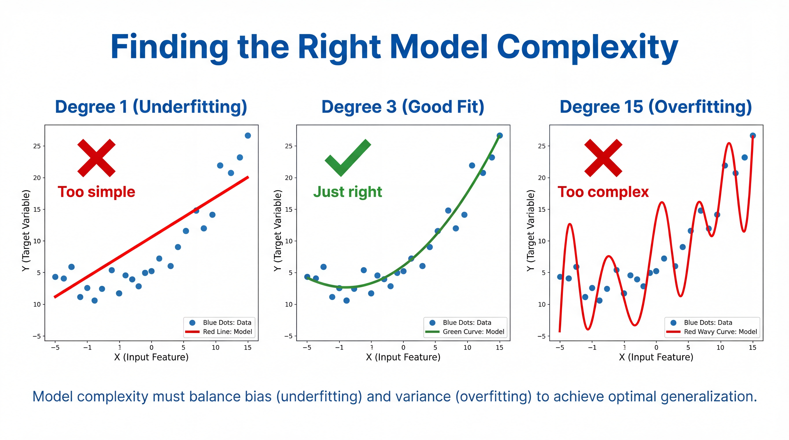
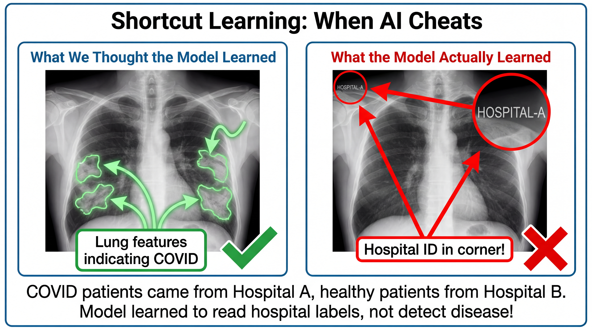
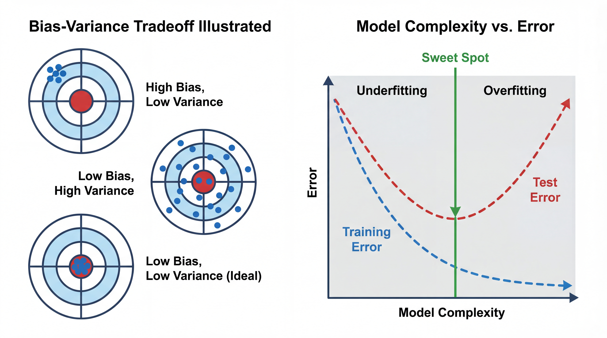
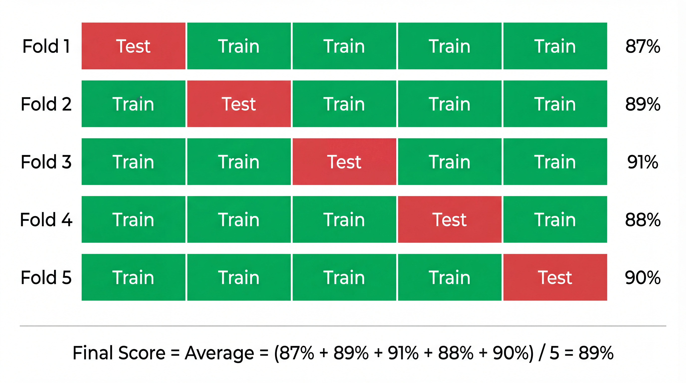
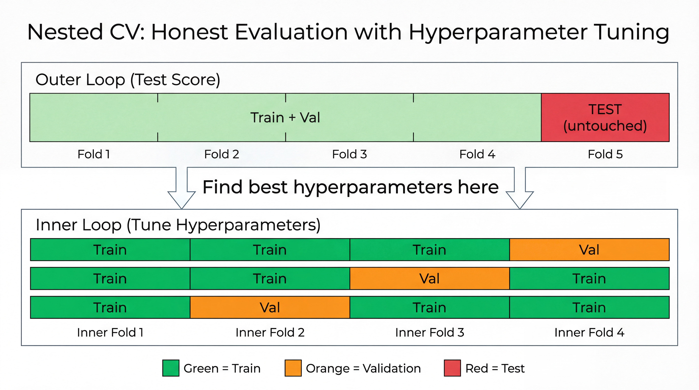
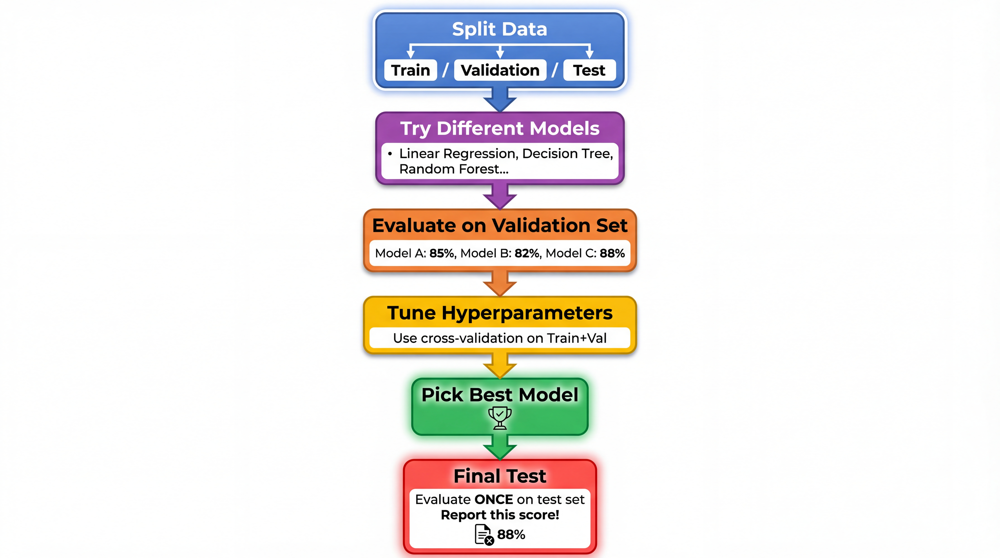
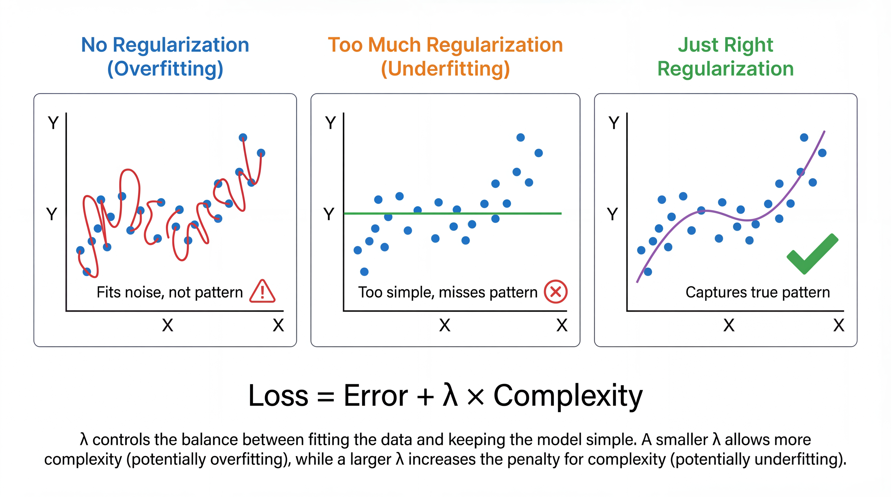
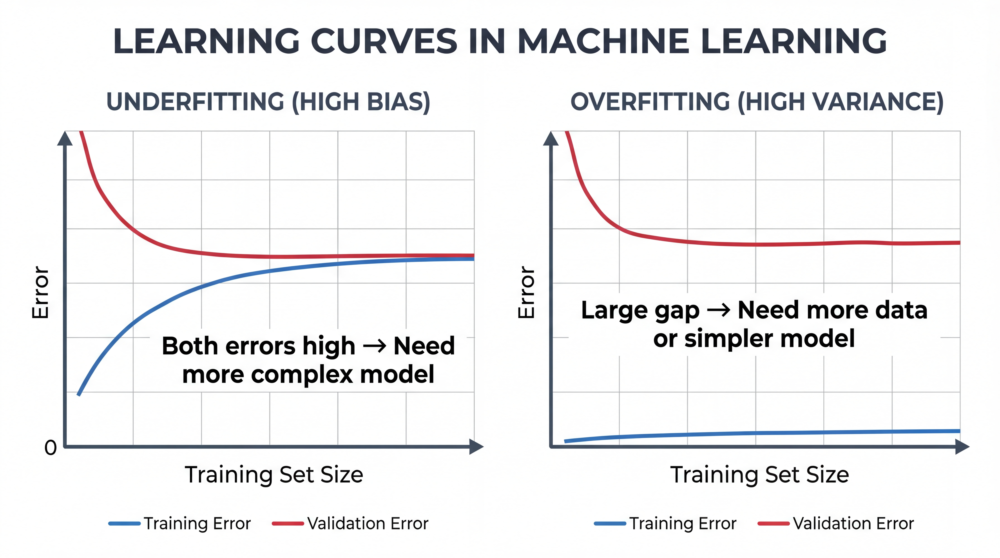

<!-- _class: title-slide -->
<!-- _paginate: false -->

# Model Selection
# & Evaluation

## Why Models Fail and How to Fix It

**Nipun Batra** | IIT Gandhinagar

---

# The Story So Far

| Lecture | What We Learned |
|---------|-----------------|
| 2 | Data, features, train/test split |
| 3 | Linear & Logistic Regression |
| **4** | **Why models fail & how to evaluate them** |

---

# The Problem We're Solving

You trained a model. It looks great on your data.

**But will it work on NEW data?**

| On Training Data | On New Data | Status |
|-----------------|-------------|--------|
| 95% accuracy | 50% accuracy | 😱 Problem! |
| 85% accuracy | 83% accuracy | Good! |

---

# Today's Questions

1. Why do some models fail on new data?
2. How do we detect this problem?
3. How do we choose between different models?

---

<!-- _class: section-divider -->

# Part 1: The Two Ways Models Fail

## Underfitting & Overfitting

---

# A Simple Example

**Task:** Predict house prices from size

You have 10 houses with prices. You fit a model.

**Question:** Which model is best?

| Model | Strategy | Training Error |
|-------|----------|----------------|
| A | Predict average for all | High |
| B | Fit a line | Medium |
| C | Memorize each point | **Zero!** |

---

# Model 1: Too Simple (Underfitting)

**Model:** Average price for all houses = ₹50 lakhs

| House Size | Actual Price | Prediction |
|------------|--------------|------------|
| 500 sq ft | ₹30 lakhs | ₹50 lakhs |
| 1000 sq ft | ₹45 lakhs | ₹50 lakhs |
| 2000 sq ft | ₹80 lakhs | ₹50 lakhs |

**Problem:** The model ignores the pattern completely!

---

# Model 2: Too Complex (Overfitting)

**Model:** Memorizes every house exactly

| House Size | Actual Price | Prediction |
|------------|--------------|------------|
| 500 sq ft | ₹30 lakhs | ₹30 lakhs |
| 1000 sq ft | ₹45 lakhs | ₹45 lakhs |
| 2000 sq ft | ₹80 lakhs | ₹80 lakhs |

**Perfect on training data!**

But for a NEW house of 1500 sq ft? → Crazy prediction!

---

# Model 3: Just Right

**Model:** Price = ₹20 lakhs + ₹30 per sq ft

| House Size | Actual Price | Prediction |
|------------|--------------|------------|
| 500 sq ft | ₹30 lakhs | ₹35 lakhs |
| 1000 sq ft | ₹45 lakhs | ₹50 lakhs |
| 2000 sq ft | ₹80 lakhs | ₹80 lakhs |

**Not perfect on training, but captures the pattern!**

For a NEW house of 1500 sq ft? → ₹65 lakhs (reasonable!)

---

# The Key Insight

| Model Type | Training Error | Test Error | Problem |
|------------|---------------|------------|---------|
| **Underfitting** | High | High | Too simple |
| **Overfitting** | Low | HIGH | Too complex |
| **Good fit** | Low | Low | Just right! |

<div class="insight">

**Overfitting = Memorizing instead of Learning**

</div>

---

# Visual: Polynomial Fitting Example



---

# What Controls Complexity?

| Factor | Less Complex | More Complex |
|--------|--------------|--------------|
| **Polynomial degree** | Degree 1 (line) | Degree 10 (wiggly) |
| **Tree depth** | Depth 2 | Depth 20 |
| **Number of features** | 3 features | 100 features |
| **Neural network size** | 10 neurons | 10,000 neurons |

**More complexity = More risk of overfitting!**

---

# Underfitting: Like a Student Who Skipped Class

**Symptoms:**
- Bad on training data
- Bad on test data
- Model is too simple to capture the pattern

**Solutions:**
- Use more features
- Use a more complex model
- Train longer

---

# Overfitting: Like a Student Who Memorized Without Understanding

**Symptoms:**
- Great on training data
- Bad on test data
- Model memorized the training examples

**Solutions:**
- Get more training data
- Use a simpler model
- Use regularization

---

# Analogy: Studying for an Exam

Think of it like preparing for a test:

- **Underfitting:** Didn't study → Failed homework, failed exam
- **Overfitting:** Memorized answers → Perfect homework, failed exam
- **Good fit:** Understood concepts → Good on both!

<div class="insight">

We want models that **understand patterns**, not **memorize examples**.

</div>

---

# More Everyday Analogies

| Scenario | Underfitting | Overfitting | Good Fit |
|----------|--------------|-------------|----------|
| **Learning to drive** | "Just press pedals" | Memorized one route | Understands driving rules |
| **Learning recipes** | "Just add heat" | Memorized exact measurements | Understands cooking principles |
| **Learning language** | "Hello" and "Goodbye" only | Memorized phrases | Understands grammar |

**Good models generalize to new situations!**

---

# Signs You're Overfitting

Watch out for these warning signs:

| Warning Sign | What It Means |
|--------------|---------------|
| Training accuracy 99%, test accuracy 70% | Classic overfitting |
| Model performs great on your data, fails on new data | Didn't generalize |
| Adding more features hurts test performance | Too complex |
| Small changes in data cause big changes in predictions | Unstable model |

---

# Signs You're Underfitting

| Warning Sign | What It Means |
|--------------|---------------|
| Both training and test accuracy are low | Model too simple |
| Model gives similar predictions for very different inputs | Not learning patterns |
| Increasing training time doesn't help | Need more capacity |
| Residuals show clear patterns | Missing important features |

---

# Real-World Overfitting: COVID X-Ray Detection



**What happened:** Model achieved 90%+ accuracy but learned to read **hospital IDs** in corner of X-rays, not lung features! COVID patients came from specific hospitals.

<div class="warning">

**Shortcut learning:** Model finds the easiest pattern, not the right one!

</div>

---

# How Much Data is Enough?

**Rough guidelines:**

| Model Complexity | Data Needed |
|------------------|-------------|
| Linear Regression | 10 samples per feature |
| Decision Tree | 100+ samples per class |
| Neural Network | 1000+ samples per class |
| Deep Learning | 10,000+ samples total |

<div class="insight">

**Rule of thumb:** More parameters = More data needed

</div>

---

# Visual: The Complexity Tradeoff



---

# The Bias-Variance Tradeoff

| Term | Meaning | Problem |
|------|---------|---------|
| **Bias** | Model's assumptions are too simple | Underfitting |
| **Variance** | Model is too sensitive to training data | Overfitting |

**Total Error = Bias² + Variance + Noise**

| Model | Bias | Variance | Result |
|-------|------|----------|--------|
| Too simple | High | Low | Underfitting |
| Too complex | Low | High | Overfitting |
| Just right | Low | Low | Good! ✅ |

---

# The Sweet Spot

**Goal:** Find the model complexity that minimizes TOTAL error

| If you're underfitting... | If you're overfitting... |
|---------------------------|--------------------------|
| Increase complexity | Decrease complexity |
| Add more features | Remove features |
| Use deeper trees | Use shallower trees |
| Train longer | Stop earlier |
| Use less regularization | Use more regularization |

---

<!-- _class: section-divider -->

# Part 2: Detecting the Problem

## Train, Validation, and Test Sets

---

# Why We Need Multiple Sets

**Scenario:** You train a model and evaluate it on the same data.

```python
model.fit(X, y)           # Train on all data
accuracy = model.score(X, y)  # Test on same data
print(f"Accuracy: {accuracy:.0%}")  # 99% !!!
```

**Problem:** Of course it's high - the model saw these examples!

---

# The Solution: Hold Out Test Data

```python
from sklearn.model_selection import train_test_split

# Split: 80% train, 20% test
X_train, X_test, y_train, y_test = train_test_split(
    X, y, test_size=0.2, random_state=42
)

# Train on training set only
model.fit(X_train, y_train)

# Evaluate on unseen test set
test_accuracy = model.score(X_test, y_test)  # Honest evaluation!
```

---

# Train vs Test Error

```python
train_accuracy = model.score(X_train, y_train)  # 95%
test_accuracy = model.score(X_test, y_test)     # 85%
```

| Comparison | What It Means |
|------------|---------------|
| Train ≈ Test | Good! Model generalizes |
| Train >> Test | Overfitting! Model memorized |
| Train and Test both low | Underfitting! Model too simple |

---

# The Gap Tells You Everything

```python
gap = train_accuracy - test_accuracy
```

| Gap | Diagnosis | |
|-----|-----------|--|
| < 5% | Good generalization | ✅ |
| 5-15% | Some overfitting | ⚠️ |
| > 15% | Severe overfitting | ❌ |

---

# What About Model Selection?

**Problem:** You want to try different models and pick the best.

If you use the test set to choose... you're peeking!

```python
# Don't do this!
for model in [model1, model2, model3]:
    model.fit(X_train, y_train)
    score = model.score(X_test, y_test)  # Using test to choose!
```

---

# Three-Way Split

**Solution:** Add a validation set for model selection.


---

# The Three Sets

| Set | Purpose | When to Use |
|-----|---------|-------------|
| **Training** | Learn model weights | During training |
| **Validation** | Compare models, tune settings | During development |
| **Test** | Final honest evaluation | Only at the very end! |

<div class="warning">

**Golden rule:** Never touch the test set until you're completely done!

</div>

---

# In Code

```python
from sklearn.model_selection import train_test_split

# First split: separate test set
X_temp, X_test, y_temp, y_test = train_test_split(
    X, y, test_size=0.2, random_state=42
)

# Second split: train and validation
X_train, X_val, y_train, y_val = train_test_split(
    X_temp, y_temp, test_size=0.25, random_state=42
)

# Now: 60% train, 20% val, 20% test
```

---

# Using the Three Sets

```python
# 1. Try different models on validation set
for model in models:
    model.fit(X_train, y_train)
    val_score = model.score(X_val, y_val)
    print(f"{model}: {val_score:.2%}")

# 2. Pick the best model
best_model = ...  # Based on validation scores

# 3. Final evaluation on test set (ONCE!)
final_score = best_model.score(X_test, y_test)
print(f"Final test score: {final_score:.2%}")
```

---

<!-- _class: section-divider -->

# Part 3: Cross-Validation

## Getting Reliable Performance Estimates

---

# Why Do We Need Cross-Validation?

**Problem:** A single train/test split can be lucky or unlucky!

```python
train_test_split(X, y, random_state=1)  # Score: 87%
train_test_split(X, y, random_state=2)  # Score: 92%
train_test_split(X, y, random_state=3)  # Score: 84%
```

**Which is the true score?** We don't know!

---

# The Problem with Single Splits

| Issue | What Happens |
|-------|--------------|
| **Small test set** | Score varies wildly depending on which examples end up in test |
| **Unlucky split** | A good model looks bad because hard examples are in test |
| **Lucky split** | A bad model looks good because easy examples are in test |
| **Wasted data** | 20% of data never used for training |

**We need a more reliable way to estimate performance!**

---

# K-Fold Cross-Validation: The Solution



**Key insight:** Every data point gets to be in the test set exactly once!

---

# Why K-Fold Works

| Single Split | K-Fold CV |
|--------------|-----------|
| Uses 80% for training | Uses 100% of data (across all folds) |
| One score (could be lucky) | K scores → average is more reliable |
| High variance | Low variance |
| Can't detect unstable models | Standard deviation shows stability |

**Example:** Score = 89% ± 1.5% tells us much more than just "89%"

---

# K-Fold in sklearn

```python
from sklearn.model_selection import cross_val_score
from sklearn.linear_model import LogisticRegression

model = LogisticRegression()

# 5-fold cross-validation
scores = cross_val_score(model, X, y, cv=5)

print(f"Scores per fold: {scores}")
# [0.87, 0.89, 0.91, 0.88, 0.90]

print(f"Mean: {scores.mean():.3f} ± {scores.std():.3f}")
# Mean: 0.890 ± 0.015
```

---

# Choosing K: Trade-offs

| K | Name | Pros | Cons |
|---|------|------|------|
| **5** | 5-Fold | Fast, good default | Slightly higher variance |
| **10** | 10-Fold | More reliable estimate | 2x slower |
| **n** | Leave-One-Out | Uses maximum data | Very slow, high variance |

<div class="insight">

**Rule of thumb:** Use K=5 for quick experiments, K=10 for final evaluation.

</div>

---

# But Wait... What About Hyperparameters?

**New problem:** We want to tune hyperparameters (like regularization C)

```python
# Which C is best?
for C in [0.01, 0.1, 1, 10, 100]:
    model = LogisticRegression(C=C)
    score = cross_val_score(model, X, y, cv=5).mean()
    print(f"C={C}: {score}")
```

**Danger:** We used the test folds to CHOOSE the best C!

Now our "test" score is biased — we've leaked information!

---

# The Data Leakage Problem

**What went wrong:**

1. We evaluated C=0.01 on folds → got a score
2. We evaluated C=0.1 on folds → got a score
3. We picked the C with best score
4. We reported that score as "test accuracy"

**But that score was used to MAKE A DECISION!**

It's like a student seeing the test before the exam.

---

# Nested Cross-Validation: The Fix



---

# How Nested CV Works

| Loop | What It Does | Uses |
|------|--------------|------|
| **Outer loop** | Gives honest test score | Test fold (never touched during tuning) |
| **Inner loop** | Finds best hyperparameters | Train + Val folds only |

**Process for each outer fold:**
1. Hold out test fold (don't touch it!)
2. Run inner CV on remaining data to find best hyperparameters
3. Train final model with best hyperparameters
4. Evaluate on test fold → one honest score

Average all outer fold scores → reliable estimate!

---

# Nested CV in sklearn

```python
from sklearn.model_selection import cross_val_score, GridSearchCV
from sklearn.linear_model import LogisticRegression

# Inner loop: find best hyperparameters using 3-fold CV
param_grid = {'C': [0.01, 0.1, 1, 10, 100]}
inner_cv = GridSearchCV(LogisticRegression(), param_grid, cv=3)

# Outer loop: honest evaluation using 5-fold CV
scores = cross_val_score(inner_cv, X, y, cv=5)

print(f"Nested CV score: {scores.mean():.3f} ± {scores.std():.3f}")
# This score is honest — no data leakage!
```

---

# Summary: When to Use What

| Situation | Method | Why |
|-----------|--------|-----|
| Evaluate a fixed model | **K-Fold CV** | Reliable score, no tuning needed |
| Tune hyperparameters + evaluate | **Nested CV** | No data leakage |
| Compare two models (no tuning) | **K-Fold CV** | Compare mean ± std |
| Final deployment | **Retrain on ALL data** | Use every example |

<div class="insight">

**Golden rule:** Never use the same data to both CHOOSE and EVALUATE your model!

</div>

---

<!-- _class: section-divider -->

# Part 4: Practical Guidelines

## Making Good Model Choices

---

# The Model Selection Workflow



---

# Step-by-Step: Model Selection

| Step | Action | Tools |
|------|--------|-------|
| **1. Split** | Separate test set (don't touch!) | `train_test_split` |
| **2. Explore** | Try different model types | `LogisticRegression`, `DecisionTree`, etc. |
| **3. Compare** | Use cross-validation | `cross_val_score` |
| **4. Tune** | Find best hyperparameters | `GridSearchCV` |
| **5. Select** | Pick best model | Look at mean ± std |
| **6. Final Test** | Report honest score | Evaluate on test set ONCE |

---

# Common Mistakes to Avoid

| Mistake | Why It's Bad | Fix |
|---------|--------------|-----|
| Testing on training data | Overly optimistic scores | Always use separate test set |
| Tuning on test set | Leaks information | Use validation set for tuning |
| Picking model by test score | Test set becomes validation | Use cross-validation |
| Reporting validation score as final | Not an honest estimate | Report test score |
| Testing multiple times | "Overfitting" to test set | Test only ONCE |

---

# Common Hyperparameters

**Hyperparameters** = Settings YOU choose before training

| Model | Hyperparameter | What It Does |
|-------|---------------|--------------|
| Linear Regression | - | None (that's its beauty!) |
| Logistic Regression | `C` | Controls regularization |
| Decision Tree | `max_depth` | Limits tree complexity |
| Neural Network | Learning rate | How fast to learn |

---

# Simple Hyperparameter Tuning

```python
# Try different max_depth values
for depth in [2, 3, 5, 10, None]:
    model = DecisionTreeClassifier(max_depth=depth)
    scores = cross_val_score(model, X, y, cv=5)
    print(f"depth={depth}: {scores.mean():.3f}")
```

```
depth=2:    0.78  ← Underfitting
depth=3:    0.85
depth=5:    0.88  ← Sweet spot
depth=10:   0.85
depth=None: 0.75  ← Overfitting
```

---

# What to Report

When presenting your model, always report:

| Metric | Why |
|--------|-----|
| Training accuracy | Shows if model learns |
| Validation accuracy | Shows if model generalizes |
| Test accuracy | The honest final score |
| Standard deviation | Shows reliability |

---

# Red Flags to Watch For

| Observation | Problem | Solution |
|-------------|---------|----------|
| Train = 99%, Test = 60% | Overfitting | Simpler model, more data |
| Train = 55%, Test = 50% | Underfitting | Complex model, more features |
| Huge variance in CV scores | Unstable model | More data, simpler model |
| Test score much better than val | Data leakage! | Check your pipeline |

---

# Summary: The Key Ideas

1. **Overfitting** = memorizing, not learning
   - High training accuracy, low test accuracy

2. **Underfitting** = too simple to learn
   - Low training AND test accuracy

3. **Train/Validation/Test split** is essential
   - Never use test set for model selection!

4. **Cross-validation** gives reliable estimates
   - Use `cross_val_score` in sklearn

---

# Regularization: Preventing Overfitting



---

# What is Regularization?

**Regularization = Add a penalty for complexity**

$$\text{Loss} = \text{Error} + \lambda \times \text{Complexity}$$

| λ (lambda) | Effect |
|------------|--------|
| λ = 0 | No regularization → may overfit |
| λ small | Light penalty → slight smoothing |
| λ large | Heavy penalty → may underfit |

**λ is a hyperparameter you tune!**

---

# Types of Regularization

| Type | Formula | Effect |
|------|---------|--------|
| **Ridge (L2)** | $\lambda \sum \theta_j^2$ | Shrinks all weights toward zero |
| **Lasso (L1)** | $\lambda \sum \|\theta_j\|$ | Makes some weights exactly zero |
| **Elastic Net** | Both L1 + L2 | Combines benefits |

```python
from sklearn.linear_model import Ridge, Lasso

model = Ridge(alpha=1.0)   # L2: all features kept, smaller weights
model = Lasso(alpha=0.1)   # L1: some features removed entirely
```

---

# When to Use Regularization?

| Situation | Recommendation |
|-----------|----------------|
| Many features, little data | Strong regularization |
| Few features, lots of data | Light or no regularization |
| Features highly correlated | Ridge (L2) works better |
| Want feature selection | Lasso (L1) |
| Neural networks | Use Dropout or L2 |

<div class="insight">

**Almost always use some regularization** — it rarely hurts!

</div>

---

# Learning Curves: Diagnosing Problems



---

# Reading Learning Curves

| Pattern | Diagnosis | Solution |
|---------|-----------|----------|
| Both high, converge | Underfitting | More features, complex model |
| Train low, Val high, gap | Overfitting | More data, regularization |
| Both low, converge | Good fit! | You're done |

```python
from sklearn.model_selection import learning_curve
train_sizes, train_scores, val_scores = learning_curve(
    model, X, y, cv=5, train_sizes=[0.2, 0.4, 0.6, 0.8, 1.0]
)
```

---

# Grid Search: Automated Tuning

**Instead of manually trying hyperparameters:**

```python
from sklearn.model_selection import GridSearchCV

param_grid = {
    'max_depth': [3, 5, 10, None],
    'min_samples_split': [2, 5, 10]
}

grid_search = GridSearchCV(
    DecisionTreeClassifier(),
    param_grid,
    cv=5,
    scoring='accuracy'
)
grid_search.fit(X_train, y_train)

print(f"Best params: {grid_search.best_params_}")
print(f"Best score: {grid_search.best_score_:.3f}")
```

---

# What We Skipped (Advanced Topics)

These are important but more advanced:

| Topic | What It Is |
|-------|------------|
| Bias-Variance Tradeoff | Mathematical view of underfitting/overfitting |
| Ensemble Methods | Combining multiple models (Random Forest, etc.) |
| Bayesian Optimization | Smarter hyperparameter search |
| Early Stopping | Stop training when validation error increases |

*You'll learn these in advanced ML courses!*

---

# Code Summary

```python
# Split data
X_train, X_test, y_train, y_test = train_test_split(
    X, y, test_size=0.2, random_state=42
)

# Cross-validation comparison
from sklearn.model_selection import cross_val_score

scores = cross_val_score(model, X_train, y_train, cv=5)
print(f"CV Score: {scores.mean():.3f} ± {scores.std():.3f}")

# Final evaluation (only once!)
final_score = model.score(X_test, y_test)
```

---

<!-- _class: title-slide -->

# Key Takeaways

| Concept | Remember This |
|---------|---------------|
| **Overfitting** | Train ✅ Test ❌ → Too complex |
| **Underfitting** | Train ❌ Test ❌ → Too simple |
| **Validation set** | For tuning hyperparameters |
| **Test set** | Touch only ONCE at the end |
| **Cross-validation** | K-fold for reliable scores |
| **Regularization** | Prevents overfitting |

---

<!-- _class: section-divider -->

# Questions?

## Next Lecture: Neural Networks

From linear models to deep learning!
