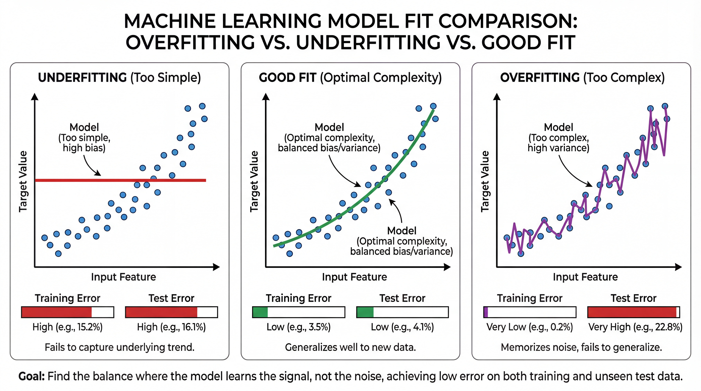
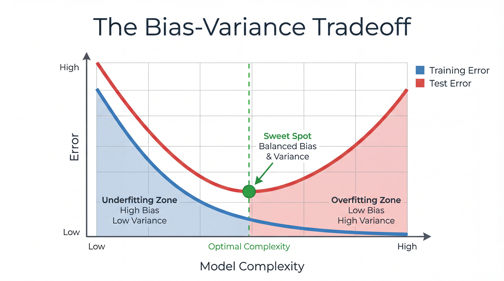
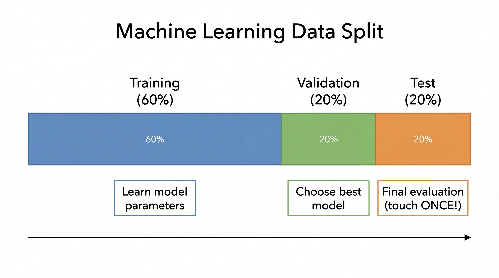
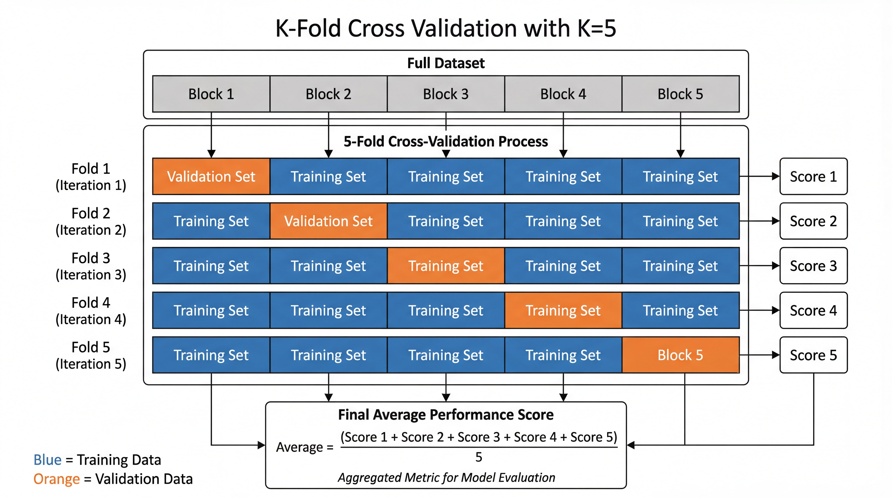

<!-- _class: title-slide -->
<!-- _paginate: false -->

# Model Selection
# & Evaluation

## Why Models Fail and How to Fix It

**Nipun Batra** | IIT Gandhinagar

---

# The Story So Far

| Lecture | What We Learned |
|---------|-----------------|
| 2 | Data, features, train/test split |
| 3 | Linear & Logistic Regression |
| **4** | **Why models fail & how to evaluate them** |

---

# The Problem We're Solving

You trained a model. It looks great on your data.

**But will it work on NEW data?**

| On Training Data | On New Data | Status |
|-----------------|-------------|--------|
| 95% accuracy | 50% accuracy | 😱 Problem! |
| 85% accuracy | 83% accuracy | ✅ Good! |

---

# Today's Questions

1. Why do some models fail on new data?
2. How do we detect this problem?
3. How do we choose between different models?

---

<!-- _class: section-divider -->

# Part 1: The Two Ways Models Fail

## Underfitting & Overfitting

---

# A Simple Example



**Task:** Predict house prices from size

You have 10 houses with prices. You fit a model.

**Question:** Which model is best?

---

# Model 1: Too Simple (Underfitting)

**Model:** Average price for all houses = ₹50 lakhs

| House Size | Actual Price | Prediction |
|------------|--------------|------------|
| 500 sq ft | ₹30 lakhs | ₹50 lakhs |
| 1000 sq ft | ₹45 lakhs | ₹50 lakhs |
| 2000 sq ft | ₹80 lakhs | ₹50 lakhs |

**Problem:** The model ignores the pattern completely!

---

# Model 2: Too Complex (Overfitting)

**Model:** Memorizes every house exactly

| House Size | Actual Price | Prediction |
|------------|--------------|------------|
| 500 sq ft | ₹30 lakhs | ₹30 lakhs ✓ |
| 1000 sq ft | ₹45 lakhs | ₹45 lakhs ✓ |
| 2000 sq ft | ₹80 lakhs | ₹80 lakhs ✓ |

**Perfect on training data!**

But for a NEW house of 1500 sq ft? → Crazy prediction!

---

# Model 3: Just Right

**Model:** Price = ₹20 lakhs + ₹30 per sq ft

| House Size | Actual Price | Prediction |
|------------|--------------|------------|
| 500 sq ft | ₹30 lakhs | ₹35 lakhs |
| 1000 sq ft | ₹45 lakhs | ₹50 lakhs |
| 2000 sq ft | ₹80 lakhs | ₹80 lakhs |

**Not perfect on training, but captures the pattern!**

For a NEW house of 1500 sq ft? → ₹65 lakhs (reasonable!)

---

# The Key Insight

| Model Type | Training Error | Test Error | Problem |
|------------|---------------|------------|---------|
| **Underfitting** | High | High | Too simple |
| **Overfitting** | Low | HIGH | Too complex |
| **Good fit** | Low | Low | Just right! |

<div class="insight">

**Overfitting = Memorizing instead of Learning**

</div>

---

# Underfitting: Like a Student Who Skipped Class

**Symptoms:**
- Bad on training data
- Bad on test data
- Model is too simple to capture the pattern

**Solutions:**
- Use more features
- Use a more complex model
- Train longer

---

# Overfitting: Like a Student Who Memorized Without Understanding

**Symptoms:**
- Great on training data
- Bad on test data
- Model memorized the training examples

**Solutions:**
- Get more training data
- Use a simpler model
- Use regularization

---

# Analogy: Studying for an Exam

| Approach | Training (Homework) | Test (Exam) | Problem |
|----------|-------------------|-------------|---------|
| Didn't study | Failed | Failed | Underfitting |
| Memorized answers | Perfect | Failed | Overfitting |
| Understood concepts | Good | Good | ✅ Good! |

<div class="insight">

We want models that **understand patterns**, not **memorize examples**.

</div>

---

# Real-World Overfitting Examples

| Scenario | What Happened |
|----------|---------------|
| **Stock prediction** | Model learned specific past patterns that never repeat |
| **Spam filter** | Memorized exact spam emails, missed new ones |
| **Medical diagnosis** | Learned artifacts in hospital images, not diseases |
| **Face recognition** | Only recognized faces in training set lighting |

**Overfitting = False sense of success!**

---

# How Much Data is Enough?

**Rough guidelines:**

| Model Complexity | Data Needed |
|------------------|-------------|
| Linear Regression | 10 samples per feature |
| Decision Tree | 100+ samples per class |
| Neural Network | 1000+ samples per class |
| Deep Learning | 10,000+ samples total |

<div class="insight">

**Rule of thumb:** More parameters = More data needed

</div>

---

# Visual: The Complexity Tradeoff



**The U-shaped curve:**

| Zone | Train Error | Test Error |
|------|-------------|------------|
| Left (Underfitting) | High | High |
| Middle (Sweet spot) | Low | Low |
| Right (Overfitting) | Very Low | High |

**Find the minimum of the test error!**

---

<!-- _class: section-divider -->

# Part 2: Detecting the Problem

## Train, Validation, and Test Sets

---

# Why We Need Multiple Sets

**Scenario:** You train a model and evaluate it on the same data.

```python
model.fit(X, y)           # Train on all data
accuracy = model.score(X, y)  # Test on same data
print(f"Accuracy: {accuracy:.0%}")  # 99% !!!
```

**Problem:** Of course it's high - the model saw these examples!

---

# The Solution: Hold Out Test Data

```python
from sklearn.model_selection import train_test_split

# Split: 80% train, 20% test
X_train, X_test, y_train, y_test = train_test_split(
    X, y, test_size=0.2, random_state=42
)

# Train on training set only
model.fit(X_train, y_train)

# Evaluate on unseen test set
test_accuracy = model.score(X_test, y_test)  # Honest evaluation!
```

---

# Train vs Test Error

```python
train_accuracy = model.score(X_train, y_train)  # 95%
test_accuracy = model.score(X_test, y_test)     # 85%
```

| Comparison | What It Means |
|------------|---------------|
| Train ≈ Test | Good! Model generalizes |
| Train >> Test | Overfitting! Model memorized |
| Train and Test both low | Underfitting! Model too simple |

---

# The Gap Tells You Everything

```python
gap = train_accuracy - test_accuracy
```

| Gap | Diagnosis |
|-----|-----------|
| < 5% | ✅ Good generalization |
| 5-15% | ⚠️ Some overfitting |
| > 15% | 🚨 Severe overfitting |

---

# What About Model Selection?

**Problem:** You want to try different models and pick the best.

If you use the test set to choose... you're peeking!

```python
# Don't do this!
for model in [model1, model2, model3]:
    model.fit(X_train, y_train)
    score = model.score(X_test, y_test)  # Using test to choose!
```

---

# Three-Way Split



**Solution:** Add a validation set for model selection.

| Split | Size | Purpose |
|-------|------|---------|
| **Training** | 60% | Learn model parameters |
| **Validation** | 20% | Choose best model |
| **Test** | 20% | Final evaluation (touch ONCE!) |

---

# The Three Sets

| Set | Purpose | When to Use |
|-----|---------|-------------|
| **Training** | Learn model weights | During training |
| **Validation** | Compare models, tune settings | During development |
| **Test** | Final honest evaluation | Only at the very end! |

<div class="warning">

**Golden rule:** Never touch the test set until you're completely done!

</div>

---

# In Code

```python
from sklearn.model_selection import train_test_split

# First split: separate test set
X_temp, X_test, y_temp, y_test = train_test_split(
    X, y, test_size=0.2, random_state=42
)

# Second split: train and validation
X_train, X_val, y_train, y_val = train_test_split(
    X_temp, y_temp, test_size=0.25, random_state=42
)

# Now: 60% train, 20% val, 20% test
```

---

# Using the Three Sets

```python
# 1. Try different models on validation set
for model in models:
    model.fit(X_train, y_train)
    val_score = model.score(X_val, y_val)
    print(f"{model}: {val_score:.2%}")

# 2. Pick the best model
best_model = ...  # Based on validation scores

# 3. Final evaluation on test set (ONCE!)
final_score = best_model.score(X_test, y_test)
print(f"Final test score: {final_score:.2%}")
```

---

<!-- _class: section-divider -->

# Part 3: Cross-Validation

## A Better Way to Evaluate

---

# The Problem with a Single Split

```python
# Random split can be lucky or unlucky
X_train, X_test, y_train, y_test = train_test_split(
    X, y, test_size=0.2, random_state=1
)  # Score: 87%

X_train, X_test, y_train, y_test = train_test_split(
    X, y, test_size=0.2, random_state=2
)  # Score: 92%

X_train, X_test, y_train, y_test = train_test_split(
    X, y, test_size=0.2, random_state=3
)  # Score: 84%
```

**Which one is the true score?**

---

# Cross-Validation: Use ALL Data!



**Idea:** Split data into K parts. Use each part as validation once.

| Fold | Validation | Training | Score |
|------|------------|----------|-------|
| 1 | Block 1 | Blocks 2-5 | 87% |
| 2 | Block 2 | Blocks 1,3-5 | 89% |
| 3 | Block 3 | Blocks 1-2,4-5 | 91% |
| 4 | Block 4 | Blocks 1-3,5 | 88% |
| 5 | Block 5 | Blocks 1-4 | 90% |

**Final Score = Average = 89%**

---

# Why Cross-Validation is Better

| Single Split | Cross-Validation |
|--------------|------------------|
| Uses 80% of data for training | Uses 100% of data |
| One lucky/unlucky score | Average of multiple scores |
| High variance | More reliable estimate |

---

# Cross-Validation in sklearn

```python
from sklearn.model_selection import cross_val_score
from sklearn.linear_model import LogisticRegression

model = LogisticRegression()

# 5-fold cross-validation
scores = cross_val_score(model, X, y, cv=5)

print(f"Scores per fold: {scores}")
# [0.87, 0.89, 0.91, 0.88, 0.90]

print(f"Mean: {scores.mean():.3f} ± {scores.std():.3f}")
# Mean: 0.890 ± 0.015
```

---

# Comparing Models with Cross-Validation

```python
from sklearn.linear_model import LogisticRegression
from sklearn.tree import DecisionTreeClassifier

models = {
    'Logistic Regression': LogisticRegression(),
    'Decision Tree': DecisionTreeClassifier()
}

for name, model in models.items():
    scores = cross_val_score(model, X, y, cv=5)
    print(f"{name}: {scores.mean():.3f} ± {scores.std():.3f}")
```

```
Logistic Regression: 0.850 ± 0.020
Decision Tree:       0.820 ± 0.045  ← More variable!
```

---

# Which K to Use?

| K | Name | Trade-off |
|---|------|-----------|
| 5 | 5-Fold | Fast, common choice |
| 10 | 10-Fold | More reliable, slower |
| n | Leave-One-Out | Most reliable, very slow |

**Rule of thumb:** Use K=5 or K=10 for most cases.

---

# Interpreting Cross-Validation Results

```
Model A: 0.85 ± 0.02   ← Low variance, reliable
Model B: 0.87 ± 0.15   ← High variance, unstable!
```

| What to Look For | Interpretation |
|------------------|----------------|
| High mean, low std | Great! Reliable model |
| High mean, high std | Risky — unstable |
| Low mean, low std | Consistently bad |
| Low mean, high std | Very unstable |

**Prefer consistent models over slightly better but unstable ones!**

---

<!-- _class: section-divider -->

# Part 4: Practical Guidelines

## Making Good Model Choices

---

# The Model Selection Workflow

| Step | What to Do |
|------|------------|
| 1 | Split data into train/validation/test |
| 2 | Train different models on training set |
| 3 | Compare using validation set (or cross-validation) |
| 4 | Pick the best model |
| 5 | Report final score on test set |

---

# Common Hyperparameters

**Hyperparameters** = Settings YOU choose before training

| Model | Hyperparameter | What It Does |
|-------|---------------|--------------|
| Linear Regression | - | None (that's its beauty!) |
| Logistic Regression | `C` | Controls regularization |
| Decision Tree | `max_depth` | Limits tree complexity |
| Neural Network | Learning rate | How fast to learn |

---

# Simple Hyperparameter Tuning

```python
# Try different max_depth values
for depth in [2, 3, 5, 10, None]:
    model = DecisionTreeClassifier(max_depth=depth)
    scores = cross_val_score(model, X, y, cv=5)
    print(f"depth={depth}: {scores.mean():.3f}")
```

```
depth=2:    0.78  ← Underfitting
depth=3:    0.85
depth=5:    0.88  ← Sweet spot
depth=10:   0.85
depth=None: 0.75  ← Overfitting
```

---

# What to Report

When presenting your model, always report:

| Metric | Why |
|--------|-----|
| Training accuracy | Shows if model learns |
| Validation accuracy | Shows if model generalizes |
| Test accuracy | The honest final score |
| Standard deviation | Shows reliability |

---

# Red Flags to Watch For

| Observation | Problem | Solution |
|-------------|---------|----------|
| Train = 99%, Test = 60% | Overfitting | Simpler model, more data |
| Train = 55%, Test = 50% | Underfitting | Complex model, more features |
| Huge variance in CV scores | Unstable model | More data, simpler model |
| Test score much better than val | Data leakage! | Check your pipeline |

---

# Summary: The Key Ideas

1. **Overfitting** = memorizing, not learning
   - High training accuracy, low test accuracy

2. **Underfitting** = too simple to learn
   - Low training AND test accuracy

3. **Train/Validation/Test split** is essential
   - Never use test set for model selection!

4. **Cross-validation** gives reliable estimates
   - Use `cross_val_score` in sklearn

---

# What We Skipped (Advanced Topics)

These are important but too advanced for now:

| Topic | What It Is |
|-------|------------|
| Bias-Variance Tradeoff | Mathematical view of underfitting/overfitting |
| Regularization | Mathematical technique to prevent overfitting |
| Ensemble Methods | Combining multiple models (Random Forest, etc.) |
| Grid Search | Automated hyperparameter tuning |

*You'll learn these in advanced ML courses!*

---

# Code Summary

```python
# Split data
X_train, X_test, y_train, y_test = train_test_split(
    X, y, test_size=0.2, random_state=42
)

# Cross-validation comparison
from sklearn.model_selection import cross_val_score

scores = cross_val_score(model, X_train, y_train, cv=5)
print(f"CV Score: {scores.mean():.3f} ± {scores.std():.3f}")

# Final evaluation (only once!)
final_score = model.score(X_test, y_test)
```

---

<!-- _class: title-slide -->

# You Now Know How to Evaluate Models!

## Next: Neural Networks - Deep Learning Begins

**Key takeaways:**
- Overfitting = memorizing (train good, test bad)
- Underfitting = too simple (both bad)
- Use train/validation/test splits
- Cross-validation for reliable estimates

**Questions?**
