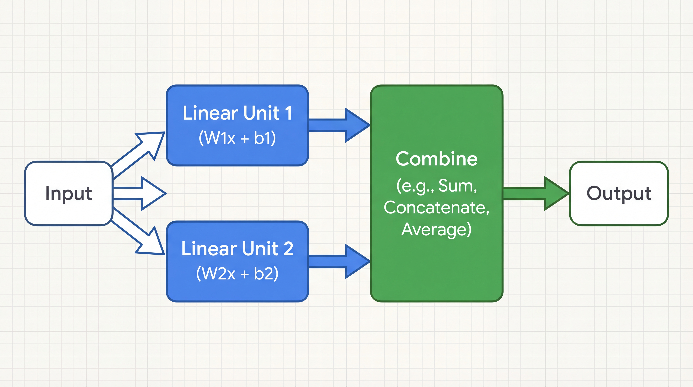
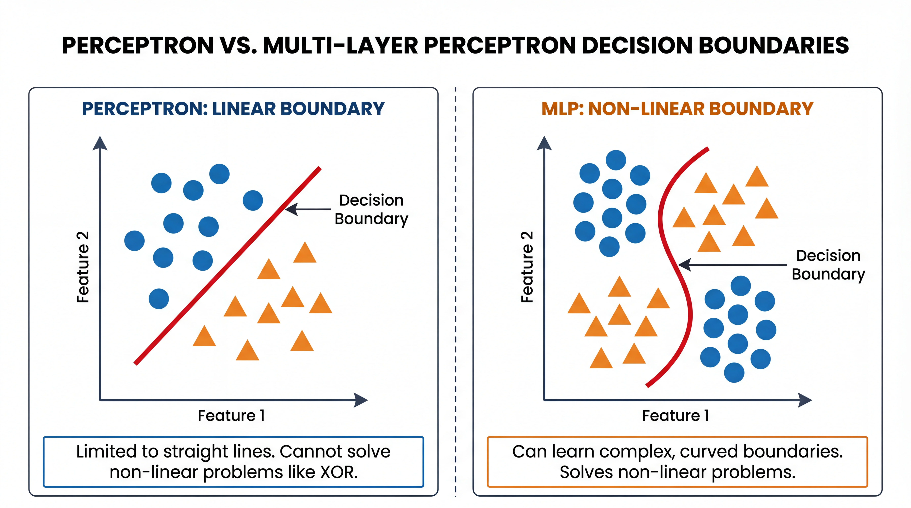
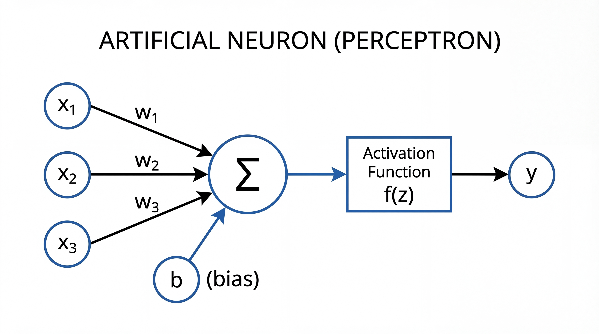
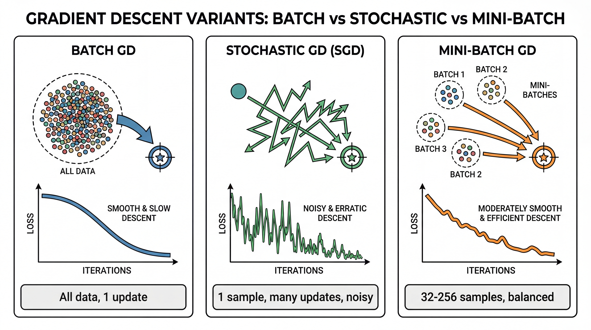

<!-- _class: title-slide -->
<!-- _paginate: false -->

# Neural Networks
# Foundation

## The Building Blocks of Deep Learning

**Nipun Batra** | IIT Gandhinagar

---

# The Story So Far

| Lecture | What We Learned |
|---------|-----------------|
| 2 | Data, features, train/test split |
| 3 | Linear & Logistic Regression |
| 4 | Model selection, overfitting |
| **5** | **Neural networks - the big leap!** |

---

# Today's Goal

By the end, you'll understand:

1. **Why** we need neural networks
2. **What** a neuron computes
3. **How** networks learn (the intuition)
4. **Code** your first neural network in PyTorch

---

# A Brief History

| Year | Milestone |
|------|-----------|
| 1958 | **Perceptron** invented (Rosenblatt) |
| 1969 | Minsky & Papert show limits → "AI Winter" |
| 1986 | **Backpropagation** popularized |
| 2012 | **AlexNet** wins ImageNet → Deep Learning boom! |
| 2023+ | ChatGPT, GPT-4, Claude → AI everywhere |

**Neural networks are 60+ years old!** But only recently got the data and compute to shine.

---

# Why Now? Three Ingredients

| Ingredient | Before | Now |
|------------|--------|-----|
| **Data** | Thousands of examples | Billions of examples |
| **Compute** | CPU (slow) | GPU (1000x faster) |
| **Algorithms** | Basic backprop | Better optimizers, architectures |

**All three came together around 2012 → Deep Learning revolution**

---

# Try It: TensorFlow Playground

**Interactive demo:** [playground.tensorflow.org](https://playground.tensorflow.org)

- Visualize neural networks learning in real-time
- Experiment with layers, neurons, activation functions
- See decision boundaries form

<div class="insight">

**Play with XOR dataset** — watch how adding a hidden layer solves it!

</div>

---

<!-- _class: section-divider -->

# Part 1: Why Neural Networks?

## The Limits of Linear Models

---

# A Problem Linear Models Can't Solve

**The XOR Function:**

| Input A | Input B | Output |
|---------|---------|--------|
| 0 | 0 | 0 (same) |
| 0 | 1 | **1** (different) |
| 1 | 0 | **1** (different) |
| 1 | 1 | 0 (same) |

**Rule:** Output is 1 if inputs are *different*

---

# XOR Visualized

**The XOR pattern:**

| $x_1$ | $x_2$ | $y$ | Plot |
|-------|-------|-----|------|
| 0 | 0 | 0 | ⚪ bottom-left |
| 0 | 1 | 1 | 🔴 top-left |
| 1 | 0 | 1 | 🔴 bottom-right |
| 1 | 1 | 0 | ⚪ top-right |

**Challenge:** Can you draw ONE straight line to separate 🔴 from ⚪?

---

# No Single Line Works!

**No matter how you draw the line:**
- Horizontal line? Fails.
- Vertical line? Fails.
- Diagonal line? Still fails.

**XOR is NOT linearly separable!**

Linear regression, logistic regression → **CAN'T solve this!**

This is why we need neural networks with hidden layers.

---

# Linear Separability

**Formal definition:** Data is *linearly separable* if there exists a hyperplane $\mathbf{w}^\top \mathbf{x} + b = 0$ that separates the classes.

| Dataset | Linearly Separable? | Single Perceptron? |
|---------|--------------------|--------------------|
| AND gate | ✅ Yes | ✅ Works |
| OR gate | ✅ Yes | ✅ Works |
| XOR gate | ❌ No | ❌ Fails |

**Most real-world problems are NOT linearly separable:**
- Image pixels → complex, nonlinear boundaries
- Text → semantic meaning requires composition
- Time series → patterns span multiple scales

**Solution:** Compose multiple linear functions with nonlinearities!

---

# The Solution: Combine Simple Units

**Key insight:** One linear model can't solve XOR.

**But what if we combine MULTIPLE linear models + non-linearity?**



Input feeds into multiple linear units with **non-linear activations**, which are then combined to produce the output.

**This is the neural network idea!**

---

# Perceptron vs MLP



| | **Perceptron** | **MLP** |
|---|---|---|
| **Structure** | One layer | Multiple layers |
| **Boundary** | Straight line | Complex curves |
| **XOR** | Cannot solve | Can solve |

<div class="insight">

**Adding hidden layers + non-linearity = dramatically more powerful!**

</div>

---

<!-- _class: section-divider -->

# Part 2: The Neuron

## The Building Block

---

# Inspiration: The Brain

**Your brain has ~86 billion neurons**

Each neuron:
1. Receives signals from other neurons
2. Processes them
3. Decides whether to "fire" (send a signal)

```
Inputs → [Processing] → Fire or Not?
```

---

# The Artificial Neuron



**A neuron does two things:**

1. **Weighted sum:** $z = w_1 x_1 + w_2 x_2 + w_3 x_3 + b$
2. **Activation:** $y = f(z)$

---

# Weights = Importance

Each weight says "how important is this input?"

| Input | Weight | Meaning |
|-------|--------|---------|
| $x_1$ (has "FREE") | $w_1 = 2.0$ | Very important for spam |
| $x_2$ (has images) | $w_2 = 0.5$ | Slightly matters |
| $x_3$ (from friend) | $w_3 = -1.5$ | Reduces spam likelihood |

**Weights are LEARNED from data!**

---

# Bias = Threshold

The bias shifts the decision point.

$$z = w_1 x_1 + w_2 x_2 + b$$

| Bias | Effect |
|------|--------|
| $b = 0$ | Needs positive evidence to fire |
| $b = 5$ | Fires easily (biased toward yes) |
| $b = -5$ | Hard to fire (biased toward no) |

---

# The Activation Function

**Why do we need it?**

Without activation:
$$\text{Layer 2}(\text{Layer 1}(x)) = W_2(W_1 x) = (W_2 W_1)x$$

**Still a linear function!** Stacking linear = still linear.

<div class="insight">

**Activation functions add non-linearity → Networks can learn curves!**

</div>

---

# Why Non-Linearity? A Visual Intuition

**Linear functions can only draw straight lines:**

| Linear (no activation) | Non-linear (with activation) |
|------------------------|------------------------------|
| Can only separate data with a line | Can separate with curves |
| 100 layers = still a line | Each layer adds a "bend" |
| XOR impossible | XOR possible! |

**Think of it like this:**
- Linear = "I can only cut the paper straight"
- Non-linear = "I can fold AND cut"

**Folding (non-linearity) lets you make complex shapes!**

---

# ReLU: The Modern Choice


$$\text{ReLU}(z) = \max(0, z)$$

**Simple rule:**
- If z > 0: output z
- If z < 0: output 0

**Why it works:** Adds non-linearity while being computationally simple.

---

# Why ReLU is Great

| Property | Why It Matters |
|----------|---------------|
| **Super simple** | Just `max(0, z)` — very fast! |
| **No saturation** | For positive z, gradient is always 1 |
| **Sparse** | Many zeros → efficient |
| **Works!** | Default choice for most networks |

---

# ReLU: A Numerical Example

**Let's trace through some values:**

| Input z | ReLU(z) = max(0, z) | Gradient |
|---------|---------------------|----------|
| -5.0 | 0 | 0 (dead) |
| -0.1 | 0 | 0 (dead) |
| 0.0 | 0 | 0 |
| 0.1 | 0.1 | 1 (alive!) |
| 5.0 | 5.0 | 1 (alive!) |

**Positive inputs pass through unchanged. Negative inputs become zero.**

<div class="insight">

About 50% of neurons "die" (output 0) — this sparsity actually helps!

</div>

---

# Other Activation Functions


You'll encounter others later:

- **Sigmoid:** Output between 0-1 (binary classification)
- **Softmax:** Multi-class (probabilities sum to 1)
- **Tanh:** Output between -1 and +1

<div class="insight">

**For now:** Just use ReLU for hidden layers. It works great!

</div>

---

# A Single Neuron in Python

```python
import numpy as np

def neuron(x, w, b):
    """A single neuron with ReLU activation."""
    z = np.dot(w, x) + b    # Weighted sum
    return max(0, z)         # ReLU activation

# Example: Spam detection
x = [1, 0, 0]                # Has "FREE", no images, unknown sender
w = [2.0, 0.5, -1.5]         # Learned weights
b = -0.5                      # Learned bias

output = neuron(x, w, b)      # = max(0, 2*1 + 0.5*0 - 1.5*0 - 0.5)
print(output)                 # = max(0, 1.5) = 1.5
```

---

# Visualizing a Neuron's Decision

**A single neuron creates a linear boundary:**

| Side of Line | Output |
|--------------|--------|
| Positive side | ReLU outputs positive value |
| Negative side | ReLU outputs 0 |

**The weights determine the angle of the line**
**The bias shifts the line left/right**

<div class="insight">

One neuron = one straight line. Many neurons = many lines = complex boundaries!

</div>

---

<!-- _class: section-divider -->

# Part 3: Multi-Layer Networks

## Going Deep

---

# The Multi-Layer Perceptron (MLP)


**Three types of layers:**

| Layer | Role |
|-------|------|
| **Input** | Receives raw features |
| **Hidden** | Learns useful patterns |
| **Output** | Makes final prediction |

Each connection has a **weight** — these are what the network learns!

*Also called "Fully Connected" or "Dense" network — every neuron connects to all neurons in the next layer.*

---

# Why Hidden Layers?

**Input layer:** Raw features (pixels, words, numbers)
**Hidden layers:** Learn useful patterns automatically!
**Output layer:** Final prediction

| Layer | What It Learns |
|-------|----------------|
| Hidden 1 | Simple patterns (edges, basic shapes) |
| Hidden 2 | Combinations (corners, textures) |
| Hidden 3 | Complex patterns (faces, objects) |

---

# Solving XOR with 2 Layers!

```python
# XOR Network: 2 inputs → 2 hidden → 1 output
#
# The hidden layer transforms the space:
#
# Original:              After hidden layer:
#     ○    ●                  ●    ●
#                    →
#     ●    ○                  ○    ○
#
# Now a line CAN separate them!
```

**Hidden layers transform data into a space where it becomes separable!**

---

# How Deep?

| Depth | What It Can Learn | Examples |
|-------|-------------------|----------|
| 1 layer | Linear functions | Linear regression |
| 2-3 layers | Simple curves | XOR, basic patterns |
| 10+ layers | Complex patterns | Image classification |
| 100+ layers | Very complex | GPT, state-of-the-art |

<div class="insight">

**Deeper networks can learn more complex patterns!**

</div>

---

# The Universal Approximation Theorem

**Mind-blowing fact:**

> A neural network with just ONE hidden layer (with enough neurons) can approximate ANY continuous function!

| What This Means | Reality Check |
|-----------------|---------------|
| NNs are incredibly powerful | "Can" ≠ "Easy to train" |
| Any function is learnable | May need millions of neurons |
| No fundamental limit | Deeper is often more efficient |

**In practice:** We use deeper networks (more layers) instead of very wide ones.

---

# Width vs Depth

| Approach | Structure | Trade-off |
|----------|-----------|-----------|
| **Wide** | Few layers, many neurons | Harder to train, more parameters |
| **Deep** | Many layers, fewer neurons | Easier to train, builds hierarchy |

**Example:** For image classification
- Wide: 1 hidden layer with 10,000 neurons 😰
- Deep: 10 layers with 100 neurons each 👍

**Deep networks learn hierarchical features:** edges → shapes → objects

---

<!-- _class: section-divider -->

# Part 4: How Networks Learn

## The Training Process

---

# The Big Picture


**The training loop:**

1. **Forward:** Compute prediction
2. **Loss:** Measure how wrong
3. **Backward:** Compute gradients
4. **Update:** Adjust weights
5. **Repeat** until good enough

---

# Step 1: Forward Pass

**Feed input through the network:**

```python
# Input: image of a cat
x = [pixel values...]

# Layer 1: Detect edges
h1 = relu(W1 @ x + b1)

# Layer 2: Detect shapes
h2 = relu(W2 @ h1 + b2)

# Output: Class probabilities
output = softmax(W3 @ h2 + b3)
# → [0.9, 0.1]  = 90% cat, 10% dog
```

---

# Forward Pass: Concrete Numbers

**A tiny network: 2 inputs → 2 hidden → 1 output**

```
Inputs: x = [1.0, 0.5]

Hidden layer (2 neurons):
  W1 = [[0.1, 0.2],    b1 = [0.0, 0.1]
        [0.3, 0.4]]

  z1 = W1 @ x + b1 = [0.2, 0.6]
  h1 = relu(z1) = [0.2, 0.6]  (both positive!)

Output layer:
  W2 = [0.5, 0.5],  b2 = -0.3

  z2 = W2 @ h1 + b2 = 0.1 + 0.3 - 0.3 = 0.1
  output = sigmoid(0.1) = 0.52  → 52% "yes"
```

---

# Step 2: Compute Loss

**How wrong is our prediction?**

| True Label | Prediction | Loss |
|------------|------------|------|
| Cat (100%) | 90% cat | Small (good!) |
| Cat (100%) | 10% cat | Large (bad!) |

**Common loss functions:**
- **Cross-entropy:** For classification
- **MSE:** For regression

---

# Loss Intuition

**Cross-entropy loss:**

| Prediction for correct class | Loss |
|-----------------------------|------|
| 99% confident | 0.01 (very good!) |
| 50% confident | 0.69 (uncertain) |
| 1% confident | 4.6 (very wrong!) |

**Punishes confident wrong predictions severely!**

---

# Step 3: Backpropagation


**Key question:** Which weights caused the error?

**Answer:** Use calculus to trace the error backward!

| Direction | What Flows |
|-----------|-----------|
| **Forward** | Data, activations |
| **Backward** | Error gradients |

**Each weight gets a "gradient" = how much it contributed to the error**

---

# The Chain Rule: Backprop's Secret

**If you change a weight, how does the loss change?**

```
Weight → Neuron output → Next layer → ... → Final loss
```

**Chain rule:** Multiply the effects at each step!

$$\frac{\partial \text{Loss}}{\partial w_1} = \frac{\partial \text{Loss}}{\partial h_2} \times \frac{\partial h_2}{\partial h_1} \times \frac{\partial h_1}{\partial w_1}$$

**Don't worry about the math!** PyTorch does this automatically.

---

# Backprop: The Blame Game

**Think of it like tracing back responsibility:**

```
Output was wrong by 0.5
  ↓
Final layer contributed 0.3 of that
  ↓
Hidden layer 2 contributed 0.15 of that 0.3
  ↓
Hidden layer 1 contributed 0.05 of that 0.15
  ↓
This specific weight contributed 0.01 of that 0.05
```

**Each weight gets assigned its share of the blame!**

<div class="insight">

Backprop = "Who's responsible for this error?"

</div>

---

# Why Backprop Was Revolutionary

**Before backprop (1980s):**
- No efficient way to train multi-layer networks
- Each weight updated independently → very slow

**After backprop:**
- Compute all gradients in ONE backward pass
- Enabled training of deep networks
- Made modern deep learning possible!

---

# Step 4: Update Weights

**Gradient descent:** Move parameters to reduce loss

$$\boldsymbol{\theta}_{\text{new}} = \boldsymbol{\theta}_{\text{old}} - \eta \cdot \nabla_{\boldsymbol{\theta}} \mathcal{L}$$

| Symbol | Meaning |
|--------|---------|
| $\boldsymbol{\theta}$ | All parameters (weights & biases) |
| $\eta$ | Learning rate (step size) |
| $\nabla_{\boldsymbol{\theta}} \mathcal{L}$ | Gradient of loss |

---

# Gradient Descent Visualization

**Imagine a ball rolling downhill:**

| Step | What Happens |
|------|--------------|
| Start | Random weights (high loss) |
| Each step | Roll toward lower loss |
| End | Reach minimum (low loss) |

**The gradient tells us which direction is "downhill"**

---

# Learning Rate: The Step Size


| Learning Rate | Effect |
|---------------|--------|
| Too small | Very slow convergence |
| Just right | Efficient training |
| Too large | Unstable, may diverge |

**Typical values:** 0.001, 0.01, 0.0001

---

# Batch vs SGD vs Mini-batch



| Method | Data per update |
|--------|----------------|
| **Batch GD** | All data (slow, stable) |
| **SGD** | 1 sample (fast, noisy) |
| **Mini-batch** | 32-256 (best of both!) |

<div class="insight">

**In practice:** We use **mini-batch** (batch size 32-256)

</div>

GPU parallelism + some noise = efficient training!

---

# Mini-batch: The Voting Analogy

**Should we update weights based on:**

| Method | Analogy | Problem |
|--------|---------|---------|
| All data | "Survey every citizen" | Too slow! |
| 1 sample | "Ask one random person" | Too noisy! |
| 32 samples | "Ask a focus group" | Just right! |

**Why mini-batch works:**
- 32 samples is usually representative enough
- GPU can process 32 in parallel (same time as 1!)
- Some noise is actually good (helps escape local minima)

**Common batch sizes:** 32, 64, 128, 256

---

# The Training Loop Summary

```python
for epoch in range(num_epochs):
    for batch in data:
        # 1. Forward pass
        predictions = model(batch.inputs)

        # 2. Compute loss
        loss = loss_function(predictions, batch.labels)

        # 3. Backward pass (compute gradients)
        loss.backward()

        # 4. Update weights
        optimizer.step()
```

**That's it!** This is how ALL neural networks train.

---

# What's an Epoch?

| Term | Meaning |
|------|---------|
| **Epoch** | One complete pass through ALL training data |
| **Batch** | A small group of samples (e.g., 32 images) |
| **Iteration** | One weight update (one batch) |

**Example:** 10,000 training images, batch size 100
- 1 epoch = 100 iterations (10,000 / 100)
- 10 epochs = 1,000 iterations total

**Typical training:** 10-100 epochs

---

# Watching Training Progress

**What to track:**

| Metric | Good Sign | Bad Sign |
|--------|-----------|----------|
| **Training loss** | Goes down | Stuck or going up |
| **Validation loss** | Goes down with train | Goes up while train goes down |
| **Accuracy** | Increases | Stays random (~10% for 10 classes) |

```
Epoch 1:  Train Loss = 2.3,  Val Loss = 2.3,  Acc = 10%
Epoch 5:  Train Loss = 0.8,  Val Loss = 0.9,  Acc = 75%
Epoch 20: Train Loss = 0.1,  Val Loss = 0.3,  Acc = 92%
```

---

# Overfitting in Neural Networks

**The classic problem:**

| Symptom | What's Happening |
|---------|------------------|
| Training loss very low | Model memorized training data |
| Validation loss high | Doesn't generalize to new data |
| Training acc: 99%, Val acc: 60% | Overfitting! |

**Solutions (you'll learn later):**
- More training data
- Data augmentation
- Dropout (randomly disable neurons)
- Early stopping

---

# The Loss Landscape

**Visualizing what gradient descent is doing:**

| Feature | What It Means |
|---------|---------------|
| **Valleys** | Good solutions (low loss) |
| **Hills** | Bad solutions (high loss) |
| **Local minima** | Stuck in okay-but-not-best spot |
| **Global minimum** | The best possible solution |

**Gradient descent** = rolling a ball downhill to find valleys

<div class="insight">

Deep learning magic: despite complex landscapes, SGD often finds good solutions!

</div>

---

<!-- _class: section-divider -->

# Part 5: PyTorch Basics

## From Theory to Code

---

# Why PyTorch?

| Feature | Benefit |
|---------|---------|
| **Automatic gradients** | No manual calculus! |
| **GPU support** | 10-100x faster |
| **Industry standard** | Used by Tesla, Meta, OpenAI |
| **Easy debugging** | Works like normal Python |

```python
import torch
import torch.nn as nn
```

---

# PyTorch vs TensorFlow

| | **PyTorch** | **TensorFlow** |
|---|---|---|
| **Style** | Pythonic, dynamic | Static graphs (historically) |
| **Debugging** | Easy (normal Python) | Harder |
| **Research** | Most papers use it | More industry deployment |
| **Learning curve** | Gentle | Steeper |

**For this course:** We use PyTorch. Both are great!

---

# Tensors: PyTorch's Arrays

```python
import torch

# Create tensors
x = torch.tensor([1.0, 2.0, 3.0])
y = torch.zeros(3, 4)         # 3×4 of zeros
z = torch.randn(3, 4)         # Random numbers

# Operations (like numpy!)
result = x + 1                # Add scalar
product = x @ y               # Matrix multiply

# Move to GPU (if available)
x_gpu = x.cuda()
```

---

# CPU vs GPU Training

| | **CPU** | **GPU** |
|---|---|---|
| **Speed** | 1x | 10-100x faster |
| **Best for** | Small models, debugging | Training deep networks |
| **Memory** | System RAM | GPU VRAM (8-80 GB) |

```python
# Check if GPU available
print(torch.cuda.is_available())  # True/False

# Move model and data to GPU
model = model.cuda()
data = data.cuda()
```

**Google Colab gives you free GPU access!**

---

# Data Loading: DataLoader

```python
from torch.utils.data import DataLoader

# Create batches automatically
train_loader = DataLoader(
    train_dataset,
    batch_size=64,      # 64 samples per batch
    shuffle=True,       # Randomize order each epoch
    num_workers=4       # Load data in parallel
)

# Training loop
for images, labels in train_loader:
    # images: (64, 1, 28, 28) - batch of 64 images
    # labels: (64,) - their labels
    ...
```

---

# Automatic Gradients

**PyTorch computes gradients automatically!**

```python
# Create tensor that tracks gradients
x = torch.tensor([2.0], requires_grad=True)

# Forward: compute y = x² + 3x
y = x**2 + 3*x

# Backward: compute dy/dx automatically!
y.backward()

print(x.grad)  # tensor([7.])
# Because dy/dx = 2x + 3 = 2(2) + 3 = 7
```

---

# Building a Network

```python
import torch.nn as nn

class SimpleNet(nn.Module):
    def __init__(self):
        super().__init__()
        self.layer1 = nn.Linear(784, 128)  # Input → Hidden
        self.layer2 = nn.Linear(128, 10)   # Hidden → Output

    def forward(self, x):
        x = torch.relu(self.layer1(x))     # ReLU activation
        x = self.layer2(x)                  # Output (logits)
        return x

model = SimpleNet()
```

---

# Easier: nn.Sequential

```python
# Same network, simpler code:
model = nn.Sequential(
    nn.Linear(784, 128),    # Input → Hidden
    nn.ReLU(),              # Activation
    nn.Linear(128, 10)      # Hidden → Output
)

# Use it:
x = torch.randn(32, 784)    # Batch of 32 images
output = model(x)            # Shape: (32, 10)
```

---

# The Complete Training Loop

```python
# 1. Setup
model = nn.Sequential(...)
criterion = nn.CrossEntropyLoss()
optimizer = torch.optim.Adam(model.parameters(), lr=0.001)

# 2. Training
for epoch in range(10):
    for images, labels in train_loader:
        # Forward
        outputs = model(images)
        loss = criterion(outputs, labels)

        # Backward
        optimizer.zero_grad()   # Reset gradients
        loss.backward()         # Compute gradients
        optimizer.step()        # Update weights

    print(f"Epoch {epoch}: Loss = {loss.item():.4f}")
```

---

# Understanding Each Line

| Code | What It Does |
|------|--------------|
| `outputs = model(images)` | Forward pass |
| `loss = criterion(...)` | Compute how wrong we are |
| `optimizer.zero_grad()` | Clear old gradients |
| `loss.backward()` | Compute new gradients (backprop) |
| `optimizer.step()` | Update all weights |

---

# Optimizers: Beyond SGD

| Optimizer | Key Feature |
|-----------|-------------|
| **SGD** | Basic, but needs tuning |
| **SGD + Momentum** | Faster, smooths updates |
| **Adam** | Adaptive learning rate, just works! |
| **AdamW** | Adam + weight decay, state-of-the-art |

```python
# Adam is usually the best starting point
optimizer = torch.optim.Adam(model.parameters(), lr=0.001)
```

---

# Why Adam "Just Works"

**The problem with plain SGD:**
- Same learning rate for ALL parameters
- Some parameters need big updates, others need tiny

**Adam's insight:**
| If gradient is... | Adam does... |
|-------------------|--------------|
| Consistently large | Smaller steps (already learning fast) |
| Consistently small | Larger steps (needs more push) |
| Noisy | Smooths it out (momentum) |

**Result:** Each parameter gets its own adaptive learning rate!

<div class="insight">

**When in doubt, use Adam.** It handles most situations well!

</div>

---

# Output Layers: Matching Your Task

| Task | Output Activation | Loss Function |
|------|-------------------|---------------|
| **Binary classification** | Sigmoid | BCELoss |
| **Multi-class** | Softmax | CrossEntropyLoss |
| **Regression** | None (linear) | MSELoss |

```python
# Multi-class (10 classes)
model = nn.Sequential(
    nn.Linear(784, 128), nn.ReLU(),
    nn.Linear(128, 10)  # 10 raw scores (logits)
)
# CrossEntropyLoss applies softmax internally!
```

---

# Evaluating the Model

```python
model.eval()  # Switch to evaluation mode
correct = 0
total = 0

with torch.no_grad():  # Don't compute gradients
    for images, labels in test_loader:
        outputs = model(images)
        _, predicted = outputs.max(1)  # Get predicted class
        total += labels.size(0)
        correct += (predicted == labels).sum().item()

print(f"Accuracy: {100 * correct / total:.1f}%")
```

---

# MNIST Example: Digit Recognition

```python
from torchvision import datasets, transforms

# Load MNIST (handwritten digits)
train_data = datasets.MNIST('data', download=True,
                            transform=transforms.ToTensor())
train_loader = DataLoader(train_data, batch_size=64)

# Model: 784 → 128 → 10
model = nn.Sequential(
    nn.Flatten(),  nn.Linear(784, 128),
    nn.ReLU(),     nn.Linear(128, 10)
)
# Train and get ~97% accuracy!
```

---

# Your First Neural Network: Summary

**What you just learned to do:**

| Step | Code | What It Does |
|------|------|--------------|
| 1. Load data | `DataLoader(...)` | Batches for training |
| 2. Build model | `nn.Sequential(...)` | Stack layers |
| 3. Train | `loss.backward()` | Learn weights |
| 4. Evaluate | `model.eval()` | Test accuracy |

**You can now train neural networks on ANY dataset!**

---

# Common Mistakes to Avoid

| Mistake | Symptom | Fix |
|---------|---------|-----|
| Forgot `zero_grad()` | Loss doesn't decrease | Add it before `backward()` |
| Forgot `model.eval()` | Bad test accuracy | Add before evaluation |
| Learning rate too high | Loss goes to infinity | Try 0.001 or 0.0001 |
| Wrong input shape | Shape error | Check your dimensions |

---

# Hyperparameters: What You Choose

**Things the model DOESN'T learn (you set them):**

| Hyperparameter | Typical Values | Effect |
|----------------|----------------|--------|
| Learning rate | 0.001, 0.01 | How fast to learn |
| Batch size | 32, 64, 128 | Memory vs noise trade-off |
| Hidden layers | 2-5 for simple tasks | Model capacity |
| Neurons per layer | 64, 128, 256 | Model capacity |
| Epochs | 10-100 | Training duration |

**How to choose?** Try a few, pick what works best on validation set!

---

# Putting It All Together

**The neural network recipe:**

```
1. ARCHITECTURE: How many layers? How many neurons?
2. DATA: Load and preprocess your dataset
3. LOSS: CrossEntropy for classification, MSE for regression
4. OPTIMIZER: Adam (usually works great!)
5. TRAIN: Loop over epochs and batches
6. EVALUATE: Check accuracy on test set
7. TUNE: Adjust hyperparameters if needed
```

---

# Summary: Neural Network Recipe

```python
# 1. Define architecture
model = nn.Sequential(
    nn.Linear(input_size, hidden_size),
    nn.ReLU(),
    nn.Linear(hidden_size, output_size)
)

# 2. Define loss and optimizer
criterion = nn.CrossEntropyLoss()
optimizer = torch.optim.Adam(model.parameters(), lr=0.001)

# 3. Training loop
for epoch in range(epochs):
    for x, y in dataloader:
        loss = criterion(model(x), y)
        optimizer.zero_grad()
        loss.backward()
        optimizer.step()
```

---

# Key Takeaways

1. **Neural networks solve non-linear problems** (like XOR)

2. **A neuron = weighted sum + activation**
   - Weights are learned, activation adds non-linearity

3. **Hidden layers learn useful representations**
   - More layers = more complex patterns

4. **Training = Forward → Loss → Backward → Update**
   - Gradient descent finds good weights

5. **PyTorch makes this easy**
   - Automatic gradients, GPU support, clean API

---

# What We Skipped (Advanced Topics)

| Topic | What It Is |
|-------|------------|
| Batch normalization | Stabilize training |
| Dropout | Prevent overfitting |
| Advanced optimizers | Adam, AdamW internals |
| Weight initialization | How to start training |
| Regularization | L1, L2 penalties |

*You'll learn these in advanced deep learning courses!*

---

<!-- _class: title-slide -->

# Welcome to Deep Learning!

## Next: Computer Vision - How Machines See

**Key takeaways:**
- Neurons = weighted sum + activation
- Hidden layers learn features automatically
- Training = minimize loss via gradient descent
- PyTorch: forward → loss → zero_grad → backward → step

**Questions?**
