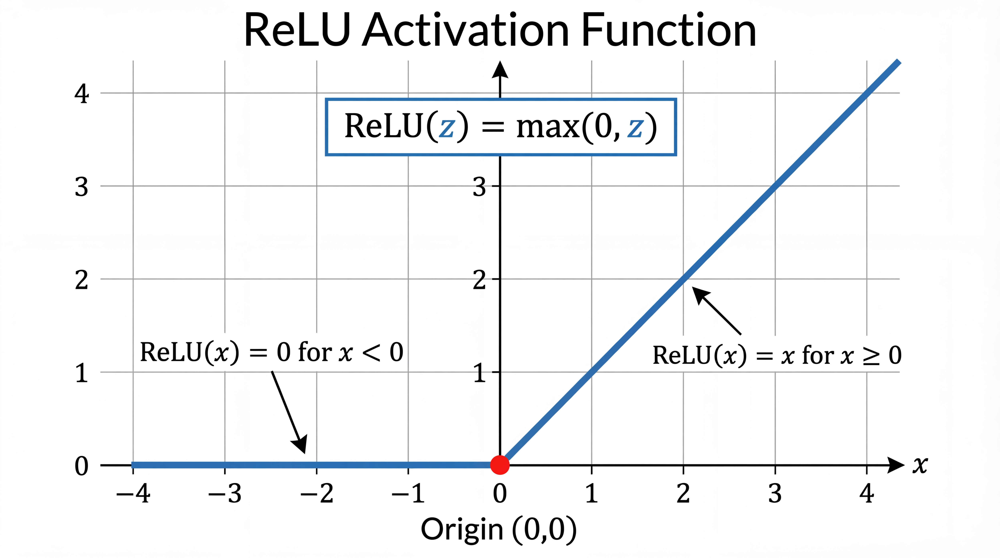
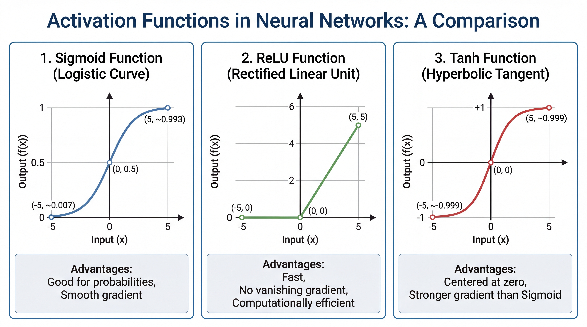
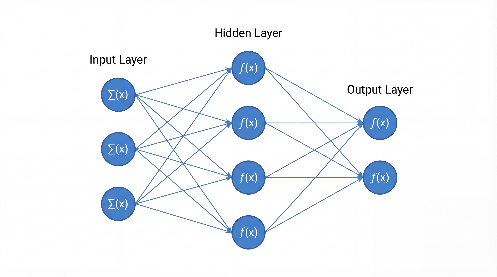
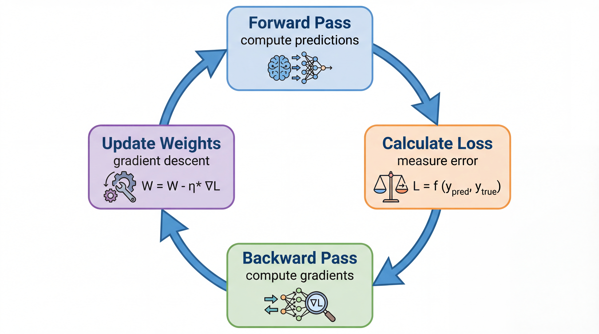
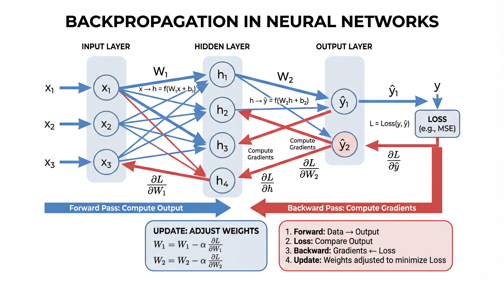
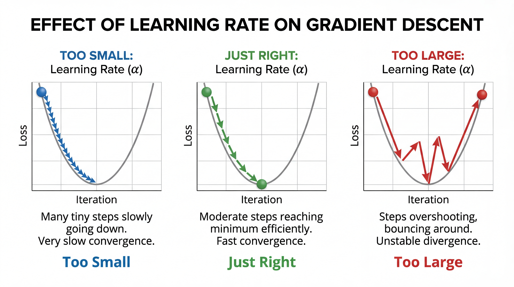

<!-- _class: title-slide -->
<!-- _paginate: false -->

# Neural Networks
# Foundation

## The Building Blocks of Deep Learning

**Nipun Batra** | IIT Gandhinagar

---

# The Story So Far

| Lecture | What We Learned |
|---------|-----------------|
| 2 | Data, features, train/test split |
| 3 | Linear & Logistic Regression |
| 4 | Model selection, overfitting |
| **5** | **Neural networks - the big leap!** |

---

# Today's Goal

By the end, you'll understand:

1. **Why** we need neural networks
2. **What** a neuron computes
3. **How** networks learn (the intuition)
4. **Code** your first neural network in PyTorch

---

# Try It Yourself: TensorFlow Playground

**Interactive demo:** [playground.tensorflow.org](https://playground.tensorflow.org)

- Visualize neural networks learning in real-time
- Experiment with layers, neurons, activation functions
- See decision boundaries form

<div class="insight">

**Play with XOR dataset** — watch how adding a hidden layer solves it!

</div>

---

<!-- _class: section-divider -->

# Part 1: From Features to End-to-End Learning

## The Big Shift in Machine Learning

---

# Traditional ML: Feature Engineering

**The old workflow:**

```
Raw Data → [HUMAN designs features] → Features → Model → Prediction
```

| Domain | Hand-crafted Features |
|--------|----------------------|
| Images | SIFT, HOG, edge detectors |
| Text | Bag-of-words, TF-IDF, n-grams |
| Audio | MFCCs, spectrograms |
| Tabular | Domain expertise required |

**Problem:** Feature engineering is hard, domain-specific, and doesn't scale!

---

# Deep Learning: End-to-End Learning

**The new workflow:**

```
Raw Data → [Neural Network learns features] → Prediction
```

| Traditional | Deep Learning |
|-------------|---------------|
| Human designs features | Network learns features |
| Domain expertise needed | Data + compute needed |
| Separate feature + model | End-to-end optimization |
| Limited by human creativity | Limited by data + architecture |

<div class="insight">

**Key insight:** Neural networks learn both features AND classifier together!

</div>

---

# Example: Image Classification

| Traditional ML | Deep Learning |
|----------------|---------------|
| 1. Detect edges | 1. Input raw pixels |
| 2. Find corners | 2. Network learns edges |
| 3. Compute HOG | 3. Network learns shapes |
| 4. Bag of visual words | 4. Network learns objects |
| 5. Train SVM | 5. End-to-end training |

**Same data, same task — Deep Learning learns what matters!**

---

<!-- _class: section-divider -->

# Part 2: Why Neural Networks?

## The Limits of Linear Models

---

# A Problem Linear Models Can't Solve

**The XOR Function:**

| Input A | Input B | Output |
|---------|---------|--------|
| 0 | 0 | 0 (same) |
| 0 | 1 | **1** (different) |
| 1 | 0 | **1** (different) |
| 1 | 1 | 0 (same) |

**Rule:** Output is 1 if inputs are *different*

---

# XOR Visualized

**The XOR pattern:**

| $x_1$ | $x_2$ | $y$ | Plot |
|-------|-------|-----|------|
| 0 | 0 | 0 | ⚪ bottom-left |
| 0 | 1 | 1 | 🔴 top-left |
| 1 | 0 | 1 | 🔴 bottom-right |
| 1 | 1 | 0 | ⚪ top-right |

**Challenge:** Can you draw ONE straight line to separate 🔴 from ⚪?

---

# No Single Line Works!

**No matter how you draw the line:**
- Horizontal line? Fails.
- Vertical line? Fails.
- Diagonal line? Still fails.

**XOR is NOT linearly separable!**

Linear regression, logistic regression → **CAN'T solve this!**

This is why we need neural networks with hidden layers.

---

# Why This Matters: Linear Separability

**Formal definition:** Data is *linearly separable* if there exists a hyperplane $\boldsymbol{\theta}^\top \mathbf{x} = 0$ that separates the classes.

| Dataset | Linearly Separable? | Single Perceptron? |
|---------|--------------------|--------------------|
| AND gate | ✅ Yes | ✅ Works |
| OR gate | ✅ Yes | ✅ Works |
| XOR gate | ❌ No | ❌ Fails |

**Most real-world problems are NOT linearly separable:**
- Image pixels → complex, nonlinear boundaries
- Text → semantic meaning requires composition
- Time series → patterns span multiple scales

**Solution:** Compose multiple linear functions with nonlinearities!

---

# The Solution: Linear + Non-linearity

**Key insight:** One linear model can't solve XOR.

**But:** Linear transformation + Non-linear activation + Another linear = **Can solve XOR!**

$$\mathbf{h} = \sigma(\boldsymbol{\theta}_1^\top \mathbf{x})$$
$$y = \boldsymbol{\theta}_2^\top \mathbf{h}$$

| Component | What it does |
|-----------|--------------|
| Linear ($\boldsymbol{\theta}^\top \mathbf{x}$) | Rotate/scale the space |
| Non-linear ($\sigma$) | Bend the space |
| Stack them | Learn any function! |

---

<!-- _class: section-divider -->

# Part 3: The Neuron

## The Building Block

---

# Inspiration: The Brain

**Your brain has ~86 billion neurons**

Each neuron:
1. Receives signals from other neurons
2. Processes them
3. Decides whether to "fire" (send a signal)

```
Inputs → [Processing] → Fire or Not?
```

---

# The Artificial Neuron

**A neuron does two things:**

1. **Weighted sum:** $z = \theta_1 x_1 + \theta_2 x_2 + \theta_3 x_3 + \theta_0 = \boldsymbol{\theta}^\top \mathbf{x}$
2. **Activation:** $y = f(z)$

| Step | Formula | Purpose |
|------|---------|---------|
| Linear | $z = \boldsymbol{\theta}^\top \mathbf{x}$ | Combine inputs |
| Non-linear | $y = f(z)$ | Add non-linearity |

---

# Parameters = Importance

Each parameter $\theta_j$ says "how important is input $x_j$?"

| Input | Parameter | Meaning |
|-------|-----------|---------|
| $x_1$ (has "FREE") | $\theta_1 = 2.0$ | Very important for spam |
| $x_2$ (has images) | $\theta_2 = 0.5$ | Slightly matters |
| $x_3$ (from friend) | $\theta_3 = -1.5$ | Reduces spam likelihood |

**Parameters $\boldsymbol{\theta}$ are LEARNED from data!**

---

# Bias Term = Threshold

The bias $\theta_0$ shifts the decision point.

$$z = \theta_1 x_1 + \theta_2 x_2 + \theta_0$$

| Bias $\theta_0$ | Effect |
|-----------------|--------|
| $\theta_0 = 0$ | Needs positive evidence to fire |
| $\theta_0 = 5$ | Fires easily (biased toward yes) |
| $\theta_0 = -5$ | Hard to fire (biased toward no) |

---

# The Activation Function

**Why do we need it?**

Without activation:
$$\text{Layer 2}(\text{Layer 1}(\mathbf{x})) = \boldsymbol{\Theta}_2(\boldsymbol{\Theta}_1 \mathbf{x}) = (\boldsymbol{\Theta}_2 \boldsymbol{\Theta}_1)\mathbf{x}$$

**Still a linear function!** Stacking linear = still linear.

<div class="insight">

**Activation functions add non-linearity → Networks can learn curves!**

</div>

---

# ReLU: The Modern Choice



$$\text{ReLU}(z) = \max(0, z)$$

**Simple rule:**
- If z > 0: output z
- If z < 0: output 0

**Why it works:** Adds non-linearity while being computationally simple.

---

# Why ReLU is Great

| Property | Why It Matters |
|----------|---------------|
| **Super simple** | Just `max(0, z)` — very fast! |
| **No saturation** | For positive z, gradient is always 1 |
| **Sparse** | Many zeros → efficient |
| **Works!** | Default choice for most networks |

---

# Other Activation Functions



You'll encounter others later:

- **Sigmoid:** Output between 0-1 (binary classification)
- **Softmax:** Multi-class (probabilities sum to 1)
- **Tanh:** Output between -1 and +1

---

# Activation Function Comparison

| Activation | Formula | Range | Use Case |
|------------|---------|-------|----------|
| **ReLU** | $\max(0, z)$ | $[0, \infty)$ | Hidden layers (default) |
| **Sigmoid** | $\frac{1}{1+e^{-z}}$ | $(0, 1)$ | Binary output |
| **Tanh** | $\frac{e^z - e^{-z}}{e^z + e^{-z}}$ | $(-1, 1)$ | Centered output |
| **Softmax** | $\frac{e^{z_i}}{\sum e^{z_j}}$ | $(0, 1)$ | Multi-class |

---

# The Vanishing Gradient Problem

**Sigmoid/Tanh issue:** Gradients get very small for large |z|

| z | Sigmoid | Gradient |
|---|---------|----------|
| 0 | 0.5 | 0.25 (good) |
| 5 | 0.99 | 0.007 (tiny!) |
| 10 | 0.9999 | 0.00005 (vanished!) |

**Result:** Deep networks with sigmoid don't learn well.

**ReLU solution:** Gradient is 1 for z > 0, never saturates!

---

# Quick Summary: Activations

| When | Use |
|------|-----|
| Hidden layers | **ReLU** (or Leaky ReLU, GELU) |
| Binary classification output | **Sigmoid** |
| Multi-class output | **Softmax** |
| Recurrent networks | **Tanh** (sometimes) |

<div class="insight">

**Rule of thumb:** ReLU for hidden, Sigmoid/Softmax for output!

---

# A Single Neuron in Python

```python
import numpy as np

def neuron(x, theta):
    """A single neuron with ReLU activation."""
    z = np.dot(theta[1:], x) + theta[0]  # θᵀx
    return max(0, z)                      # ReLU

# Example: Spam detection
x = [1, 0, 0]                  # Has "FREE", no images, unknown sender
theta = [-0.5, 2.0, 0.5, -1.5] # θ₀=bias, θ₁, θ₂, θ₃

output = neuron(x, theta)      # = max(0, 2*1 + 0.5*0 - 1.5*0 - 0.5)
print(output)                  # = max(0, 1.5) = 1.5
```

---

<!-- _class: section-divider -->

# Part 4: Multi-Layer Networks

## Going Deep

---

# The Multi-Layer Perceptron (MLP)



**Three types of layers:**

| Layer | Role |
|-------|------|
| **Input** | Receives raw features |
| **Hidden** | Learns useful patterns |
| **Output** | Makes final prediction |

Each connection has a **parameter** — these are what the network learns!

---

# Why Hidden Layers?

**Input layer:** Raw features (pixels, words, numbers)
**Hidden layers:** Learn useful patterns automatically!
**Output layer:** Final prediction

| Layer | What It Learns |
|-------|----------------|
| Hidden 1 | Simple patterns (edges, basic shapes) |
| Hidden 2 | Combinations (corners, textures) |
| Hidden 3 | Complex patterns (faces, objects) |

---

# Solving XOR with 2 Layers!

```python
# XOR Network: 2 inputs → 2 hidden → 1 output
#
# The hidden layer transforms the space:
#
# Original:              After hidden layer:
#     ○    ●                  ●    ●
#                    →
#     ●    ○                  ○    ○
#
# Now a line CAN separate them!
```

**Hidden layers transform data into a space where it becomes separable!**

---

# How Deep?

| Depth | What It Can Learn | Examples |
|-------|-------------------|----------|
| 1 layer | Linear functions | Linear regression |
| 2-3 layers | Simple curves | XOR, basic patterns |
| 10+ layers | Complex patterns | Image classification |
| 100+ layers | Very complex | GPT, state-of-the-art |

<div class="insight">

**Deeper networks can learn more complex patterns!**

</div>

---

# Universal Function Approximation Theorem

**Theorem (Cybenko, 1989; Hornik, 1991):**

> A feedforward network with a single hidden layer containing a finite number of neurons can approximate any continuous function on compact subsets of $\mathbb{R}^n$.

**In simple terms:** Given enough neurons, a neural network can learn ANY function!

---

# What Universal Approximation Means

| Statement | True/False |
|-----------|------------|
| NNs can represent any function | ✅ True (with enough neurons) |
| NNs will always find the right function | ❌ False (training matters) |
| One hidden layer is always enough | ✅ True in theory, not in practice |
| Deeper is always better | ❌ Not always (harder to train) |

<div class="warning">

**Caveat:** The theorem says NNs CAN approximate — not that gradient descent WILL find it!

</div>

---

# Why Depth Helps in Practice

**Width vs Depth:**

| Wide Network | Deep Network |
|--------------|--------------|
| Many neurons, few layers | Few neurons per layer, many layers |
| Can approximate anything | Can approximate anything |
| Needs exponentially many neurons | Needs polynomial neurons |
| Harder to train | Easier to train (with tricks) |

**Deep networks are more parameter-efficient for hierarchical features!**

---

<!-- _class: section-divider -->

# Part 5: How Networks Learn

## The Training Process

---

# The Big Picture



**The training loop:**

1. **Forward:** Compute prediction
2. **Loss:** Measure how wrong
3. **Backward:** Compute gradients
4. **Update:** Adjust weights
5. **Repeat** until good enough

---

# Step 1: Forward Pass

**Feed input through the network:**

```python
# Input: image of a cat
x = [pixel values...]

# Layer 1: Detect edges
h1 = relu(W1 @ x + b1)

# Layer 2: Detect shapes
h2 = relu(W2 @ h1 + b2)

# Output: Class probabilities
output = softmax(W3 @ h2 + b3)
# → [0.9, 0.1]  = 90% cat, 10% dog
```

---

# Step 2: Compute Loss

**How wrong is our prediction?**

| True Label | Prediction | Loss |
|------------|------------|------|
| Cat (100%) | 90% cat | Small (good!) |
| Cat (100%) | 10% cat | Large (bad!) |

**Common loss functions:**
- **Cross-entropy:** For classification
- **MSE:** For regression

---

# Loss Intuition

**Cross-entropy loss:**

| Prediction for correct class | Loss |
|-----------------------------|------|
| 99% confident | 0.01 (very good!) |
| 50% confident | 0.69 (uncertain) |
| 1% confident | 4.6 (very wrong!) |

**Punishes confident wrong predictions severely!**

---

# Step 3: Backward Pass (Backpropagation)



**Key question:** Which weights caused the error?

**Answer:** Use calculus to trace the error backward!

| Direction | What Flows |
|-----------|-----------|
| **Forward** | Data, activations |
| **Backward** | Error gradients |

**Each weight gets a "gradient" = how much it contributed to the error**

---

# Step 4: Update Weights

**Gradient descent:** Move weights to reduce loss

$$w_{\text{new}} = w_{\text{old}} - \eta \times \text{gradient}$$

| Symbol | Meaning |
|--------|---------|
| $w$ | Weight |
| $\eta$ | Learning rate (step size) |
| gradient | Direction to move |

---

# Gradient Descent Visualization

**Imagine a ball rolling downhill:**

| Step | What Happens |
|------|--------------|
| Start | Random weights (high loss) |
| Each step | Roll toward lower loss |
| End | Reach minimum (low loss) |

**The gradient tells us which direction is "downhill"**

---

# Learning Rate: The Step Size



| Learning Rate | Effect |
|---------------|--------|
| Too small | Very slow convergence |
| Just right | Efficient training |
| Too large | Unstable, may diverge |

**Typical values:** 0.001, 0.01, 0.0001

---

# The Training Loop Summary

```python
for epoch in range(num_epochs):
    for batch in data:
        # 1. Forward pass
        predictions = model(batch.inputs)

        # 2. Compute loss
        loss = loss_function(predictions, batch.labels)

        # 3. Backward pass (compute gradients)
        loss.backward()

        # 4. Update weights
        optimizer.step()
```

**That's it!** This is how ALL neural networks train.

---

<!-- _class: section-divider -->

# Part 6: PyTorch Basics

## From Theory to Code

---

# Why PyTorch?

| Feature | Benefit |
|---------|---------|
| **Automatic gradients** | No manual calculus! |
| **GPU support** | 10-100x faster |
| **Industry standard** | Used by Tesla, Meta, OpenAI |
| **Easy debugging** | Works like normal Python |

```python
import torch
import torch.nn as nn
```

---

# Tensors: PyTorch's Arrays

```python
import torch

# Create tensors
x = torch.tensor([1.0, 2.0, 3.0])
y = torch.zeros(3, 4)         # 3×4 of zeros
z = torch.randn(3, 4)         # Random numbers

# Operations (like numpy!)
result = x + 1                # Add scalar
product = x @ y               # Matrix multiply

# Move to GPU (if available)
x_gpu = x.cuda()
```

---

# Automatic Gradients

**PyTorch computes gradients automatically!**

```python
# Create tensor that tracks gradients
x = torch.tensor([2.0], requires_grad=True)

# Forward: compute y = x² + 3x
y = x**2 + 3*x

# Backward: compute dy/dx automatically!
y.backward()

print(x.grad)  # tensor([7.])
# Because dy/dx = 2x + 3 = 2(2) + 3 = 7
```

---

# Building a Network

```python
import torch.nn as nn

class SimpleNet(nn.Module):
    def __init__(self):
        super().__init__()
        self.layer1 = nn.Linear(784, 128)  # Input → Hidden
        self.layer2 = nn.Linear(128, 10)   # Hidden → Output

    def forward(self, x):
        x = torch.relu(self.layer1(x))     # ReLU activation
        x = self.layer2(x)                  # Output (logits)
        return x

model = SimpleNet()
```

---

# Easier: nn.Sequential

```python
# Same network, simpler code:
model = nn.Sequential(
    nn.Linear(784, 128),    # Input → Hidden
    nn.ReLU(),              # Activation
    nn.Linear(128, 10)      # Hidden → Output
)

# Use it:
x = torch.randn(32, 784)    # Batch of 32 images
output = model(x)            # Shape: (32, 10)
```

---

# The Complete Training Loop

```python
# 1. Setup
model = nn.Sequential(...)
criterion = nn.CrossEntropyLoss()
optimizer = torch.optim.Adam(model.parameters(), lr=0.001)

# 2. Training
for epoch in range(10):
    for images, labels in train_loader:
        # Forward
        outputs = model(images)
        loss = criterion(outputs, labels)

        # Backward
        optimizer.zero_grad()   # Reset gradients
        loss.backward()         # Compute gradients
        optimizer.step()        # Update weights

    print(f"Epoch {epoch}: Loss = {loss.item():.4f}")
```

---

# Understanding Each Line

| Code | What It Does |
|------|--------------|
| `outputs = model(images)` | Forward pass |
| `loss = criterion(...)` | Compute how wrong we are |
| `optimizer.zero_grad()` | Clear old gradients |
| `loss.backward()` | Compute new gradients (backprop) |
| `optimizer.step()` | Update all weights |

---

# Evaluating the Model

```python
model.eval()  # Switch to evaluation mode
correct = 0
total = 0

with torch.no_grad():  # Don't compute gradients
    for images, labels in test_loader:
        outputs = model(images)
        _, predicted = outputs.max(1)  # Get predicted class
        total += labels.size(0)
        correct += (predicted == labels).sum().item()

print(f"Accuracy: {100 * correct / total:.1f}%")
```

---

# MNIST Example: Digit Recognition

```python
from torchvision import datasets, transforms

# Load MNIST (handwritten digits)
train_data = datasets.MNIST(
    'data', train=True, download=True,
    transform=transforms.ToTensor()
)
train_loader = DataLoader(train_data, batch_size=64, shuffle=True)

# Model: 784 → 128 → 10
model = nn.Sequential(
    nn.Flatten(),           # 28×28 → 784
    nn.Linear(784, 128),
    nn.ReLU(),
    nn.Linear(128, 10)
)

# Train and get ~97% accuracy!
```

---

# Common Mistakes to Avoid

| Mistake | Symptom | Fix |
|---------|---------|-----|
| Forgot `zero_grad()` | Loss doesn't decrease | Add it before `backward()` |
| Forgot `model.eval()` | Bad test accuracy | Add before evaluation |
| Learning rate too high | Loss goes to infinity | Try 0.001 or 0.0001 |
| Wrong input shape | Shape error | Check your dimensions |

---

# Summary: Neural Network Recipe

```python
# 1. Define architecture
model = nn.Sequential(
    nn.Linear(input_size, hidden_size),
    nn.ReLU(),
    nn.Linear(hidden_size, output_size)
)

# 2. Define loss and optimizer
criterion = nn.CrossEntropyLoss()
optimizer = torch.optim.Adam(model.parameters(), lr=0.001)

# 3. Training loop
for epoch in range(epochs):
    for x, y in dataloader:
        loss = criterion(model(x), y)
        optimizer.zero_grad()
        loss.backward()
        optimizer.step()
```

---

# Common Network Architectures

| Name | Architecture | Use Case |
|------|-------------|----------|
| **MLP** | Fully connected layers | Tabular data, simple tasks |
| **CNN** | Convolutional layers | Images, spatial data |
| **RNN/LSTM** | Recurrent connections | Sequences, time series |
| **Transformer** | Self-attention | Text, modern LLMs |

**We'll cover CNNs in the next lecture!**

---

# Training Tips: Learning Rate

| Learning Rate | Effect |
|---------------|--------|
| Too small (1e-6) | Training too slow |
| Too large (1.0) | Training unstable, diverges |
| Just right (1e-3 to 1e-4) | Steady progress |

**Start with:** `lr=0.001` for Adam, `lr=0.01` for SGD

---

# Training Tips: Batch Size

| Batch Size | Effect |
|------------|--------|
| Small (8-32) | Noisy gradients, good generalization |
| Large (256-1024) | Stable gradients, faster training |
| Very large (>4096) | May hurt generalization |

**Start with:** 32 or 64, increase if GPU memory allows

---

# Training Tips: When to Stop

**Monitor validation loss:**

| Pattern | Meaning | Action |
|---------|---------|--------|
| Train ↓, Val ↓ | Learning! | Continue |
| Train ↓, Val flat | Starting to overfit | Consider stopping |
| Train ↓, Val ↑ | Overfitting! | Stop, reduce model |

**Early stopping:** Stop when validation loss stops improving

---

# Debugging Neural Networks

| Problem | Likely Cause | Fix |
|---------|--------------|-----|
| Loss not decreasing | LR too small/large | Try different LR |
| Loss = NaN | LR too large, bad data | Lower LR, check data |
| Train good, val bad | Overfitting | More data, dropout, regularization |
| Both train/val bad | Underfitting | Bigger model, more epochs |

---

# The Neural Network Workflow

1. **Prepare data** → Normalize, split train/val/test
2. **Define model** → Choose architecture, activations
3. **Choose loss** → MSE for regression, CrossEntropy for classification
4. **Choose optimizer** → Adam is a good default
5. **Train** → Forward → Loss → Backward → Update
6. **Evaluate** → Check validation performance
7. **Iterate** → Adjust hyperparameters, architecture

---

# Hyperparameters to Tune

| Hyperparameter | Typical Values | Start With |
|----------------|----------------|------------|
| Learning rate | 1e-5 to 1e-1 | 1e-3 |
| Batch size | 8 to 1024 | 32 |
| Hidden layers | 1 to 10 | 2-3 |
| Neurons per layer | 16 to 1024 | 64-128 |
| Epochs | 10 to 1000 | 100 |

**Use validation set to choose best hyperparameters!**

---

# Key Takeaways

1. **Neural networks solve non-linear problems** (like XOR)

2. **A neuron = weighted sum + activation**
   - Weights are learned, activation adds non-linearity

3. **Hidden layers learn useful representations**
   - More layers = more complex patterns

4. **Training = Forward → Loss → Backward → Update**
   - Gradient descent finds good weights

5. **PyTorch makes this easy**
   - Automatic gradients, GPU support, clean API

---

# What We Skipped (Advanced Topics)

| Topic | What It Is |
|-------|------------|
| Batch normalization | Stabilize training |
| Dropout | Prevent overfitting |
| Advanced optimizers | Adam, AdamW internals |
| Weight initialization | How to start training |
| Regularization | L1, L2 penalties |

*You'll learn these in advanced deep learning courses!*

---

<!-- _class: title-slide -->

# Welcome to Deep Learning!

## Next: Computer Vision - How Machines See

**Key takeaways:**
- Neurons = weighted sum + activation
- Hidden layers learn features automatically
- Training = minimize loss via gradient descent
- PyTorch: forward → loss → zero_grad → backward → step

**Questions?**
