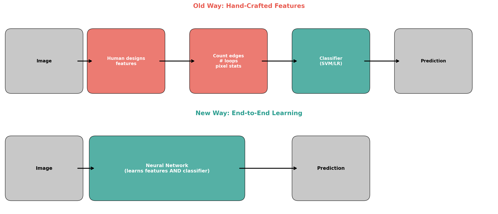
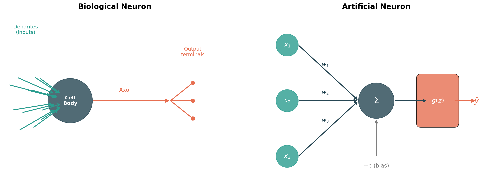
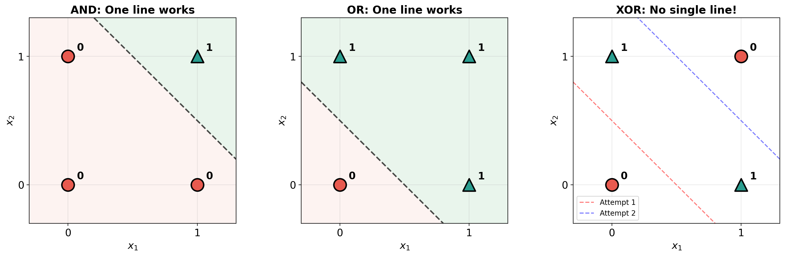
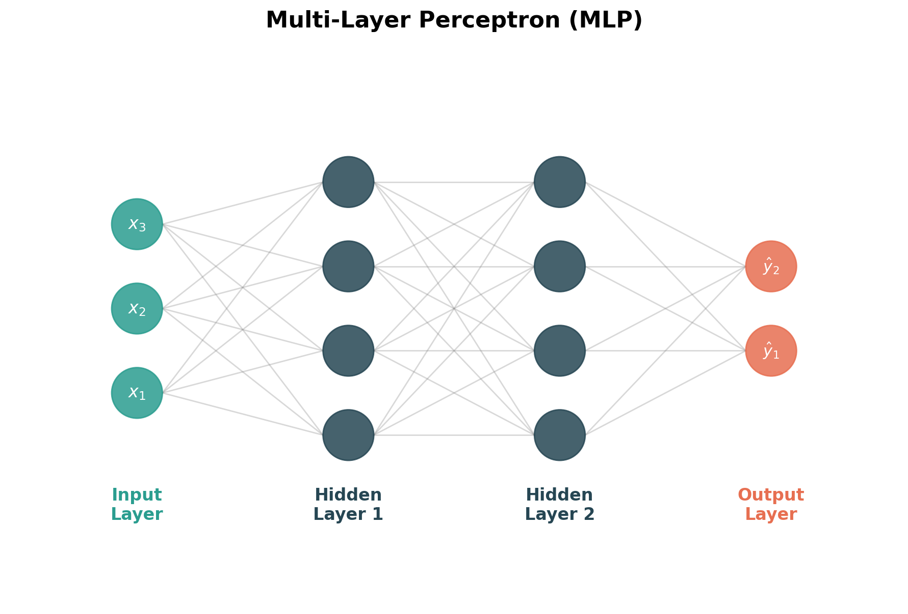
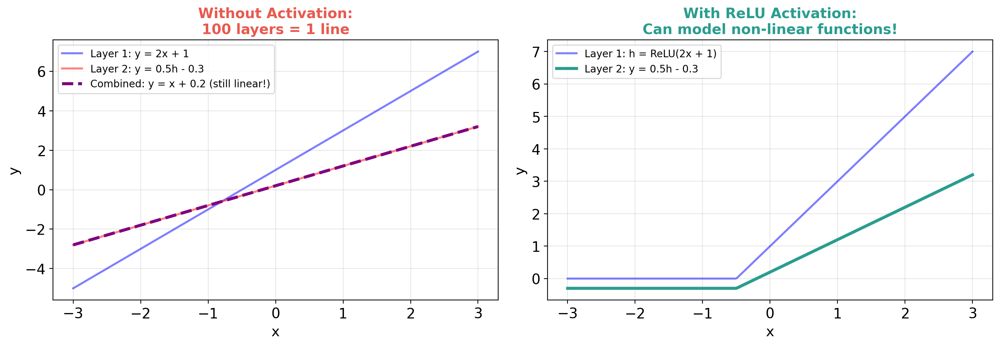
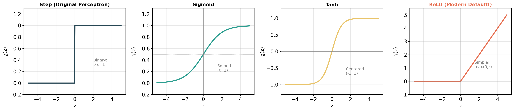
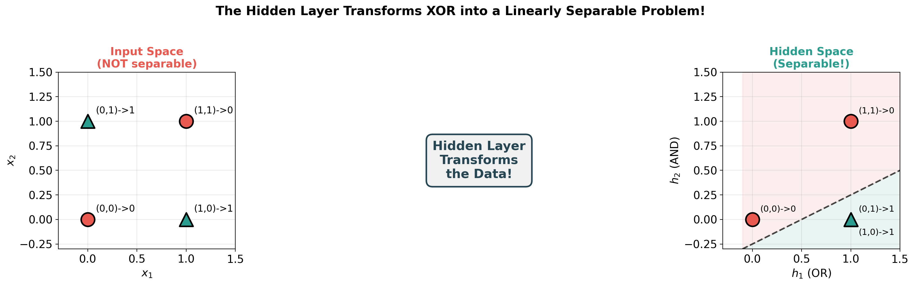
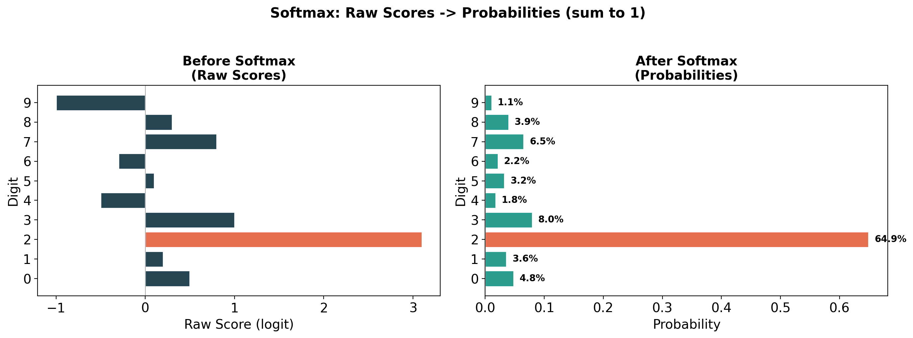

<!-- _class: title-slide -->
<!-- _paginate: false -->

# Neural Networks
# Part 1: From Linear Models to Neural Networks

## Building the most powerful function approximator

**Nipun Batra** | IIT Gandhinagar

---

# The Story So Far

| Lecture | What We Learned |
|---------|-----------------|
| 2 | Data — features, labels, train/test |
| 3 | Linear regression: $\hat{y} = \mathbf{w}^\top \mathbf{x} + b$ |
| 3 | Logistic regression: $\hat{y} = \sigma(\mathbf{w}^\top \mathbf{x} + b)$ |
| 4 | Model selection, overfitting, bias-variance |
| **5** | **Neural networks — the big leap!** |

**Today:** How do we go from a single neuron to networks that power ChatGPT?

---

# Where Neural Networks Are Today

**State-of-the-art in almost EVERY field:**

| Domain | Application | What It Does |
|--------|-------------|-------------|
| Vision | Instagram filters, Face ID | Recognizes objects, faces |
| Language | ChatGPT, Claude, Google Translate | Understands & generates text |
| Audio | Siri, Alexa, Spotify recommendations | Speech recognition, music |
| Science | AlphaFold, drug discovery | Predicts protein structures |
| Games | AlphaGo, game bots | Superhuman game play |

**The same basic idea powers ALL of these.**

---

# Today's Roadmap

**Lecture 5A (today):** Building the network

```
1. The Paradigm Change     — why neural networks are different
2. The Perceptron          — the simplest neuron
3. Logic Gates             — what one neuron can do
4. The XOR Problem         — where one neuron FAILS
5. Multi-Layer Perceptrons — the fix!
6. Activation Functions    — why non-linearity matters
7. Forward Propagation     — how data flows through
8. Softmax                 — multi-class output
```

**Lecture 5B (next):** Training the network

---

<!-- _class: section-divider -->

# Part 1: The Paradigm Change

## Why neural networks changed everything

---

# The Old Way: Hand-Crafted Features

**Problem:** Classify handwritten digits (is this a 2? a 7?)

**The old approach (before deep learning):**

```
Image → [Human designs features] → [Classifier learns] → Prediction
```

**Step 1: Human expert** designs features:
- Average pixel intensity
- Number of horizontal lines
- Number of loops
- Percentage of black pixels
- ...

**Step 2:** Feed these features into logistic regression / SVM

---

# The Problem with Hand-Crafted Features

**The features are HAND-CRAFTED** — designed by a human expert

**The classifier is TRAINABLE** — learned from data

| Component | Who designs it? |
|-----------|----------------|
| Feature extractor | **Human** (slow, error-prone, domain-specific) |
| Classifier | **Algorithm** (learned from data) |

**What's wrong with this?**
- Features for digits ≠ features for faces ≠ features for text
- Requires domain expertise for every new problem
- Human intuition about "good features" is often wrong
- Doesn't scale to new problems

---

# The Neural Network Way: Learn EVERYTHING



**EVERYTHING is trainable!**

| Component | Who? |
|-----------|------|
| Low-level features | **Learned** |
| High-level features | **Learned** |
| Classifier | **Learned** |

<div class="insight">

**Paradigm change:** Stop hand-crafting features. Let the network learn them from data.

</div>

---

# Why This Matters: One Architecture, Many Problems

**Old way:** New problem = hire new domain expert, design new features

**Neural network way:** Same architecture works for everything!

| Problem | Input | Output | Same NN idea? |
|---------|-------|--------|---------------|
| Digit recognition | 28x28 image | Which digit (0-9) | Yes |
| Spam detection | Email text | Spam or not | Yes |
| House price | Features | Price | Yes |
| Next word | Text so far | Next word | Yes |

**The only thing that changes is the data.**

---

# But How? Let's Build Up From What We Know

**You already know logistic regression:**

$$\hat{y} = \sigma(\mathbf{w}^\top \mathbf{x} + b)$$

This is:
1. A **weighted sum** of inputs: $z = w_1 x_1 + w_2 x_2 + \ldots + w_d x_d + b$
2. Passed through an **activation function**: $\hat{y} = \sigma(z)$

**Key insight: This is exactly ONE neuron!**

Logistic regression = a single neuron with sigmoid activation.

A neural network = MANY of these neurons, connected together.

---

<!-- _class: section-divider -->

# Part 2: The Perceptron

## The simplest neural network: a single neuron

---

# Inspiration: The Biological Neuron



**How your brain works:**
1. **Dendrites** receive signals from other neurons
2. **Cell body** processes (sums) the signals
3. If signal is strong enough → **fires!**
4. Signal travels down the **axon** to next neuron

**The artificial neuron mimics this!**

---

# The Perceptron (Rosenblatt, 1958)

**The first artificial neuron** — inspired by biological neurons

A neuron does **two things:**

**1. Summation:** Weighted sum of inputs
$$z = w_1 x_1 + w_2 x_2 + \ldots + w_d x_d + b = \mathbf{w}^\top \mathbf{x} + b$$

**2. Activation:** Apply a non-linear function
$$\hat{y} = g(z)$$

For the original perceptron, $g$ was the **step function:**

$$\hat{y} = \begin{cases} 1 & \text{if } z > 0 \\ 0 & \text{if } z \leq 0 \end{cases}$$

**The neuron "fires" when the weighted sum exceeds the threshold!**

---

# A Neuron = Something You Already Know!

**What happens if we use different activation functions?**

| Activation $g(z)$ | Model Name |
|--------------------|------------|
| Step function | Perceptron |
| $\sigma(z) = \frac{1}{1+e^{-z}}$ (sigmoid) | **Logistic Regression!** |
| $g(z) = z$ (identity / no activation) | **Linear Regression!** |

<div class="insight">

**You already know two kinds of neurons!**
- Linear regression = neuron with identity activation
- Logistic regression = neuron with sigmoid activation
- Perceptron = neuron with step activation

</div>

---

# Building Logic Gates with Perceptrons

**Let's see what a single neuron can compute**

**Challenge:** Can we find weights $w_1$, $w_2$, and bias $b$ for each logic gate?

The perceptron computes: $\hat{y} = \text{step}(w_1 x_1 + w_2 x_2 + b)$

Where step$(z) = 1$ if $z > 0$, else $0$.

---

# AND Gate

| $x_1$ | $x_2$ | $y$ (AND) |
|-------|-------|-----------|
| 0 | 0 | 0 |
| 0 | 1 | 0 |
| 1 | 0 | 0 |
| 1 | 1 | **1** |

**Solution:** $w_1 = 1, \; w_2 = 1, \; b = -1.5$

**Let's verify:**
- $(0,0)$: step$(0 + 0 - 1.5) =$ step$(-1.5) = 0$ ✓
- $(0,1)$: step$(0 + 1 - 1.5) =$ step$(-0.5) = 0$ ✓
- $(1,0)$: step$(1 + 0 - 1.5) =$ step$(-0.5) = 0$ ✓
- $(1,1)$: step$(1 + 1 - 1.5) =$ step$(0.5) = 1$ ✓

---

# OR Gate

| $x_1$ | $x_2$ | $y$ (OR) |
|-------|-------|----------|
| 0 | 0 | 0 |
| 0 | 1 | **1** |
| 1 | 0 | **1** |
| 1 | 1 | **1** |

**Solution:** $w_1 = 1, \; w_2 = 1, \; b = -0.5$

**Let's verify:**
- $(0,0)$: step$(0 + 0 - 0.5) =$ step$(-0.5) = 0$ ✓
- $(0,1)$: step$(0 + 1 - 0.5) =$ step$(0.5) = 1$ ✓
- $(1,0)$: step$(1 + 0 - 0.5) =$ step$(0.5) = 1$ ✓
- $(1,1)$: step$(1 + 1 - 0.5) =$ step$(1.5) = 1$ ✓

---

# NOT Gate

| $x_1$ | $y$ (NOT) |
|-------|-----------|
| 0 | **1** |
| 1 | 0 |

**Solution:** $w_1 = -1, \; b = 0.5$

**Verify:**
- $(0)$: step$(0 + 0.5) =$ step$(0.5) = 1$ ✓
- $(1)$: step$(-1 + 0.5) =$ step$(-0.5) = 0$ ✓

**Intuition:** A negative weight means "this input DECREASES the chance of firing."

---

# What Does the Perceptron Actually Do?

**The decision boundary is a straight line!**

$$w_1 x_1 + w_2 x_2 + b = 0$$

| Gate | Decision Boundary | Side with $\hat{y}=1$ |
|------|-------------------|----------------------|
| AND | $x_1 + x_2 = 1.5$ | Above the line |
| OR | $x_1 + x_2 = 0.5$ | Above the line |

**A single perceptron divides the input space with a straight line.**

This is exactly like logistic regression's decision boundary!

---

# Visualizing Decision Boundaries



---

# Exercise: Try NAND Yourself!

| $x_1$ | $x_2$ | $y$ (NAND) |
|-------|-------|------------|
| 0 | 0 | **1** |
| 0 | 1 | **1** |
| 1 | 0 | **1** |
| 1 | 1 | 0 |

**Can you find $w_1$, $w_2$, $b$?**

*Hint 1:* NAND = NOT(AND). What if you just flip the sign?

*Hint 2:* Try $w_1 = -1, \; w_2 = -1, \; b = 1.5$

**Or:** Compose AND → NOT (two neurons in sequence!)

---

<!-- _class: section-divider -->

# Part 3: The XOR Problem

## Where a single neuron fails

---

# Now Try: XOR Gate

| $x_1$ | $x_2$ | $y$ (XOR) |
|-------|-------|-----------|
| 0 | 0 | 0 |
| 0 | 1 | **1** |
| 1 | 0 | **1** |
| 1 | 1 | 0 |

**Output is 1 if inputs are DIFFERENT.**

Can we find $w_1$, $w_2$, $b$ such that $\hat{y} = \text{step}(w_1 x_1 + w_2 x_2 + b)$ works?

**Try it!** ... You'll find it's impossible.

---

# Why XOR is Impossible for One Neuron

**Look at the decision boundary diagram we saw earlier:**

- **AND:** One line above both — easy!
- **OR:** One line below both — easy!
- **XOR:** The 1s are on **opposite corners**

**No matter how you draw one straight line, you can't separate the 1s from the 0s!**

XOR is **NOT linearly separable**.

This was a **huge deal** in the 1960s!

---

# The Minsky & Papert Crisis (1969)

Marvin Minsky and Seymour Papert published **"Perceptrons"** — proving that a single-layer perceptron **cannot** learn XOR.

**The reaction:** "Neural networks are useless!"

**The consequence:** Funding dried up → **First AI Winter** (1970s-80s)

**But they were wrong about one thing:**
They proved single-layer perceptrons are limited.
They did NOT prove multi-layer networks are limited!

**The fix was already known: just add more layers.**

---

# Two Ways to Fix the XOR Problem

## Approach 1: Hand-Craft a New Feature

Add feature $x_3 = x_1 \cdot x_2$ (the interaction term):

| $x_1$ | $x_2$ | $x_1 x_2$ | $y$ |
|-------|-------|-----------|-----|
| 0 | 0 | 0 | 0 |
| 0 | 1 | 0 | **1** |
| 1 | 0 | 0 | **1** |
| 1 | 1 | **1** | 0 |

Now a single neuron with $w_1=1, w_2=1, w_3=-2, b=-0.5$ works!

**But this is hand-crafting features again!** We want the network to learn them.

---

# Two Ways to Fix the XOR Problem

## Approach 2: Add More Neurons (the neural network way!)

**What if we use TWO layers of neurons?**

**Input (x1, x2) → Hidden (h1, h2) → Output (y)**

Each input connects to every hidden neuron, each hidden neuron connects to the output.

- **Hidden neuron h1** draws one line (acts like OR)
- **Hidden neuron h2** draws another line (acts like AND)
- **Output neuron** combines them: OR but NOT AND = XOR!

**Two lines can separate XOR!**

---

# The Key Idea: Transform the Space

**The hidden layer doesn't classify — it TRANSFORMS the data!**

In the original space: XOR is not linearly separable.
In the hidden layer's space: it becomes separable!

**Analogy:** You can't cut a crumpled piece of paper with one straight cut. But if you **unfold** the paper first, you can!

The hidden layer **unfolds** the data.

---

<!-- _class: section-divider -->

# Notebook Time!

## `notebook_05.ipynb` — Section 1

**Let's code perceptrons and see XOR fail!**

---

<!-- _class: section-divider -->

# Part 4: The Multi-Layer Perceptron

## Stacking neurons to build powerful networks

---

# The MLP: Input → Hidden → Output



**A Multi-Layer Perceptron has:**

| Layer | What it does |
|-------|-------------|
| **Input** | Receives raw features |
| **Hidden** | Learns intermediate representations |
| **Output** | Makes the final prediction |

**Each neuron in a layer connects to ALL neurons in the next layer.**

Also called **"fully connected"** or **"dense"** network.

---

# Why "Hidden"?

**Input layer:** We see the data going in.
**Output layer:** We see the predictions coming out.
**Hidden layer:** We DON'T tell it what to compute — it figures that out on its own!

| Layer | What it figures out |
|-------|---------------------|
| Layer 1 | "Is there a curve in the top half?" |
| Layer 2 | "Is there a loop at the bottom?" |
| Layer 3 | "Does this look like a 2?" |

**The network discovers its own features!**

This is the paradigm change — no hand-crafting needed.

---

# But Wait — Why Do We Need Non-Linearity?

**Critical question:** What happens if we stack linear neurons?

**Layer 1:** $\mathbf{h} = W_1 \mathbf{x} + \mathbf{b}_1$
**Layer 2:** $\hat{y} = W_2 \mathbf{h} + \mathbf{b}_2$

**Substitute:**
$$\hat{y} = W_2 (W_1 \mathbf{x} + \mathbf{b}_1) + \mathbf{b}_2 = \underbrace{(W_2 W_1)}_{W'} \mathbf{x} + \underbrace{(W_2 \mathbf{b}_1 + \mathbf{b}_2)}_{\mathbf{b}'}$$

$$\hat{y} = W' \mathbf{x} + \mathbf{b}'$$

**Still just a linear function!** 100 linear layers = 1 linear layer.

<div class="insight">

**Without non-linearity, depth is useless!** We MUST add activation functions between layers.

</div>

---

# With vs Without Activation: Visual Proof



---

# Activation Functions: Adding the "Bends"

**Think of it like paper folding:**
- Linear = "I can only cut paper in a straight line"
- Non-linear = "I can **fold** and THEN cut" → complex shapes!

| Activation | Formula | Range | Used Where |
|-----------|---------|-------|-----------|
| **Step** | 0 or 1 | $\{0, 1\}$ | Original perceptron |
| **Sigmoid** | $\frac{1}{1+e^{-z}}$ | $(0, 1)$ | Output (binary) |
| **Tanh** | $\frac{e^z - e^{-z}}{e^z + e^{-z}}$ | $(-1, 1)$ | Hidden layers (older) |
| **ReLU** | $\max(0, z)$ | $[0, \infty)$ | Hidden layers (modern!) |

---

# Activation Functions: Visual Comparison



---

# ReLU: The Modern Default

$$\text{ReLU}(z) = \max(0, z)$$

```python
def relu(z):
    return max(0, z)
```

| Input $z$ | ReLU($z$) | Gradient |
|-----------|-----------|----------|
| -5.0 | 0 | 0 |
| -0.1 | 0 | 0 |
| 0.1 | 0.1 | 1 |
| 5.0 | 5.0 | 1 |

**Why ReLU won:**
- Dead simple: just `max(0, z)`
- Fast to compute
- Gradient is either 0 or 1 (no vanishing gradient problem)
- Works amazingly well in practice

---

# XOR Solved: Step Activations by Hand

**Hidden layer:** reuse our AND and OR perceptrons!
- $h_1 = \text{step}(x_1 + x_2 - 0.5) \quad$ → **OR gate**
- $h_2 = \text{step}(x_1 + x_2 - 1.5) \quad$ → **AND gate**

**Output layer:** OR but NOT AND = XOR!
- $\hat{y} = \text{step}(h_1 - 2h_2 - 0.5)$

| $x_1$ | $x_2$ | $h_1$ (OR) | $h_2$ (AND) | $\hat{y}$ |
|-------|-------|-----------|-----------|------|
| 0 | 0 | 0 | 0 | **0** ✓ |
| 0 | 1 | 1 | 0 | **1** ✓ |
| 1 | 0 | 1 | 0 | **1** ✓ |
| 1 | 1 | 1 | 1 | **0** ✓ |

**We'll also solve this with PyTorch in the notebook — and let PyTorch LEARN the weights!**

---

# What Just Happened?

**The hidden layer TRANSFORMED the data!**

| | Original space ($x_1, x_2$) | Hidden space ($h_1, h_2$) |
|---|---|---|
| (0,0) → 0 | Not separable | (0, 0) → **separable!** |
| (0,1) → 1 | | (1, 0) |
| (1,0) → 1 | | (1, 0) |
| (1,1) → 0 | | (1, 1) |

**In the hidden layer's space:**
- Class 0: (0,0) and (1,1)
- Class 1: (1,0) and (1,0) — they collapsed to the same point!

**Now a single line CAN separate them!**

<div class="insight">

**Key insight:** Hidden layers transform data into a space where it becomes linearly separable!

</div>

---

# Visualizing the Transformation



---

# The Big Picture

| Stage | What happens |
|-------|-------------|
| Raw Data | Pixels, numbers |
| Hidden Layer 1 | Transforms into simple features (edges) |
| Hidden Layer 2 | Transforms into complex features (shapes) |
| Output | Final classification |

| Depth | What It Can Learn | Example |
|-------|-------------------|---------|
| 0 hidden layers | Linear boundaries | Logistic regression |
| 1 hidden layer | Simple curves | XOR, basic patterns |
| 2-5 hidden layers | Complex patterns | Image classification |
| 10+ hidden layers | Very complex | GPT, modern AI |

**Deeper = more complex transformations = more powerful**

---

<!-- _class: section-divider -->

# Part 5: Forward Propagation

## How data flows through a network

---

# Forward Pass: The Big Idea

**Data flows left → right through the network:**

| Step | Operation | What it does |
|------|-----------|-------------|
| 1 | Multiply + Add | $z = Wx + b$ |
| 2 | Activation | $h = \text{ReLU}(z)$ |
| 3 | Multiply + Add | $z_{out} = w^\top h + b$ |
| 4 | Activation | $\hat{y} = \sigma(z_{out})$ |

**That's it!** Each layer does two things:
1. **Linear:** weighted sum ($z = Wx + b$)
2. **Non-linear:** activation ($h = g(z)$)

---

# Worked Example: A Tiny Network

**Network:** 2 inputs → 2 hidden (ReLU) → 1 output (sigmoid)

**All weights and biases:**

| | Neuron $h_1$ | Neuron $h_2$ |
|---|---|---|
| Weight from $x_1$ | $w_{11} = 0.5$ | $w_{21} = -0.3$ |
| Weight from $x_2$ | $w_{12} = 0.8$ | $w_{22} = 0.6$ |
| Bias | $b_1 = -0.1$ | $b_2 = 0.2$ |

**Output neuron:** weights $[0.7, -0.5]$, bias $= -0.1$

**Input:** $x_1 = 1.0, \; x_2 = 0.5$

**Follow along on paper or in the notebook!**

---

# Worked Example: Step by Step

**Step 1: Hidden layer — weighted sums**

$$z_1 = 0.5 \times 1.0 + 0.8 \times 0.5 + (-0.1) = 0.5 + 0.4 - 0.1 = \mathbf{0.8}$$
$$z_2 = -0.3 \times 1.0 + 0.6 \times 0.5 + 0.2 = -0.3 + 0.3 + 0.2 = \mathbf{0.2}$$

**Step 2: ReLU activation**

$$h_1 = \max(0, 0.8) = \mathbf{0.8}$$
$$h_2 = \max(0, 0.2) = \mathbf{0.2}$$

---

# Worked Example: Output

**Step 3: Output neuron — weighted sum**

$$z_{out} = 0.7 \times 0.8 + (-0.5) \times 0.2 + (-0.1) = 0.56 - 0.10 - 0.1 = \mathbf{0.36}$$

**Step 4: Sigmoid activation**

$$\hat{y} = \sigma(0.36) = \frac{1}{1 + e^{-0.36}} \approx \mathbf{0.59}$$

**Prediction: 59% probability of class 1.**

That's the entire forward pass! Just multiply, add, activate, repeat.

---

# How Many Parameters Does This Have?

| Connection | Weights | Biases | Total |
|---|---|---|---|
| 2 inputs → 2 hidden | $2 \times 2 = 4$ | 2 | **6** |
| 2 hidden → 1 output | $2 \times 1 = 2$ | 1 | **3** |
| **Total** | | | **9 parameters** |

**For MNIST (784 → 128 → 10):** 101,770 parameters!

The network needs to learn all of these from data.

---

<!-- _class: section-divider -->

# Notebook Time!

## `notebook_05.ipynb` — Section 2

**Let's code this forward pass and solve XOR with PyTorch!**

---

# Multi-Class: From 2 Classes to 10

**For MNIST (10 digits), we need 10 outputs:**

$$\mathbf{z}^{[2]} = W^{[2]} \mathbf{h} + \mathbf{b}^{[2]} \quad \text{(10-dimensional vector)}$$

**Softmax** converts raw scores to probabilities:

$$P(\text{class } i) = \frac{e^{z_i}}{\sum_{j=1}^{k} e^{z_j}}$$

**Example:** Raw scores $[2.0, 1.0, 0.1]$

$$P = \left[\frac{e^{2.0}}{e^{2.0}+e^{1.0}+e^{0.1}}, \; \frac{e^{1.0}}{...}, \; \frac{e^{0.1}}{...}\right] = [0.659, 0.242, 0.099]$$

All probabilities sum to 1! Predicted class = argmax = class 0.

---

# Softmax: Visual



---

# Softmax: A Worked Example

**MNIST digit classifier outputs raw scores for each digit:**

| Digit | Raw Score $z_i$ | $e^{z_i}$ | Probability |
|-------|----------------|-----------|-------------|
| 0 | 0.5 | 1.65 | 5.5% |
| 1 | 0.2 | 1.22 | 4.1% |
| **2** | **3.1** | **22.2** | **74.0%** |
| 3 | 1.0 | 2.72 | 9.1% |
| 4 | -0.5 | 0.61 | 2.0% |
| 5-9 | ... | ... | 5.3% |

**Prediction:** It's a **2** with 74% confidence!

**Key:** Softmax amplifies the largest score and suppresses the rest.

---

# Summary of Part 1

**What you've learned:**

1. **Paradigm change:** Hand-crafted features → learned features
2. **A neuron** = weighted sum + activation (you already knew this from logistic regression!)
3. **Single neurons** can compute AND, OR, NOT — but **NOT XOR**
4. **Adding hidden layers** = transforming data into separable space
5. **Activation functions** (especially ReLU) add the non-linearity we need
6. **Forward propagation** = matrix multiply → activation → repeat
7. **Softmax** for multi-class classification

---

# What's Missing?

**We built the architecture. We can compute the forward pass.**

**But all the weights were GIVEN to us!**

```python
# We just made these up!
W1 = np.array([[0.2, 0.4], [-0.5, 0.1], [0.3, -0.2]])
```

**The critical question:**

> How do we FIND good weights from data?

**Answer: Training! (Next lecture)**

The network starts with random weights → makes terrible predictions → gradually improves.

---

<!-- _class: section-divider -->

# ☕ Break

## Part 1 done! Part 2: How do networks LEARN?

---

<!-- _class: title-slide -->
<!-- _paginate: false -->

# Neural Networks
# Part 2: Training Neural Networks

## How networks learn from data

**Nipun Batra** | IIT Gandhinagar

---

# Recap: Where We Are

**Part 1 gave us:**
- A neuron = weighted sum + activation
- Hidden layers transform data into separable spaces
- Forward pass: input → multiply → activate → repeat → prediction

**The problem:**
- All weights were **given** (hand-picked by us)
- With **random** weights, predictions are garbage

**Today's question:** How do we find good weights from data?

---

<!-- _class: section-divider -->

# Part 6: The Learning Problem

## Measuring how wrong we are

---

# Random Weights → Random Predictions

```python
import numpy as np

# Random weights!
W1 = np.random.randn(128, 784) * 0.01
b1 = np.zeros(128)
W2 = np.random.randn(10, 128) * 0.01
b2 = np.zeros(10)

# Show a "7" to the network
prediction = forward(image_of_7, W1, b1, W2, b2)
# → [0.10, 0.10, 0.10, 0.10, 0.10, 0.10, 0.10, 0.10, 0.10, 0.10]
# "I have no idea — every digit is equally likely"
```

**We need the network to output [0, 0, 0, 0, 0, 0, 0, 1, 0, 0] for a "7".**

**How far off are we?** → That's what the **loss function** measures.

---

# Loss Functions: Measuring "How Wrong"

**You already know these from Lecture 3!**

**For regression** (predicting a number):

$$\mathcal{L}_{\text{MSE}} = \frac{1}{N} \sum_{i=1}^{N} (y_i - \hat{y}_i)^2$$

**For classification** (predicting a class):

$$\mathcal{L}_{\text{CE}} = -\frac{1}{N} \sum_{i=1}^{N} \left[ y_i \log(\hat{y}_i) + (1 - y_i) \log(1 - \hat{y}_i) \right]$$

**Cross-entropy punishes confident wrong predictions HARD:**

| Prediction for correct class | Cross-entropy loss |
|-----------------------------|-------------------|
| 99% confident (good!) | 0.01 |
| 50% confident (meh) | 0.69 |
| 1% confident (terrible!) | 4.6 |

---

# The Goal: Minimize the Loss

**Training = finding weights that minimize the loss**

$$\boldsymbol{\theta}^* = \arg\min_{\boldsymbol{\theta}} \mathcal{L}(\boldsymbol{\theta})$$

where $\boldsymbol{\theta}$ = all weights and biases in the network.

**For our MNIST network:** 101,770 parameters to optimize!

**How?** The same tool you learned in Lecture 3: **gradient descent**.

$$\boldsymbol{\theta}_{\text{new}} = \boldsymbol{\theta}_{\text{old}} - \eta \cdot \nabla_{\boldsymbol{\theta}} \mathcal{L}$$

**But how do we compute $\nabla_{\boldsymbol{\theta}} \mathcal{L}$ for 100K parameters?**

---

<!-- _class: section-divider -->

# Part 7: Backpropagation

## Finding who's responsible for the error

---

# The Gradient Question

**We need to know:** For each weight, how much does the loss change if I change this weight a tiny bit?

$$\frac{\partial \mathcal{L}}{\partial w_{ij}} = \; ?$$

**Naive approach:** Change each weight by $\epsilon$, re-run forward pass, measure loss change.

For 100K parameters → 100K forward passes. **Way too slow!**

**Backpropagation:** Compute ALL gradients in ONE backward pass.

---

# The Computational Graph

**Every forward pass is a chain of operations:**

$$x \xrightarrow{W_1} z_1 \xrightarrow{\text{ReLU}} h \xrightarrow{W_2} z_2 \xrightarrow{\sigma} \hat{y} \xrightarrow{} \mathcal{L}$$

**The chain rule lets us work backward:**

$$\frac{\partial \mathcal{L}}{\partial W_1} = \frac{\partial \mathcal{L}}{\partial \hat{y}} \cdot \frac{\partial \hat{y}}{\partial z_2} \cdot \frac{\partial z_2}{\partial \mathbf{h}} \cdot \frac{\partial \mathbf{h}}{\partial \mathbf{z}_1} \cdot \frac{\partial \mathbf{z}_1}{\partial W_1}$$

**Each factor is simple!** We just multiply them together going backward.

---

# Backprop Intuition: The Blame Game

**Think of it like tracing responsibility in a company:**

```
CEO made a bad decision (high loss)
  ↓ Who contributed?
VP of Sales contributed 60%, VP of Engineering 40%
  ↓ Within Engineering?
Backend team 70%, Frontend team 30%
  ↓ Within Backend?
Alice's code contributed 50%, Bob's 50%
```

**Backprop = assigning blame to each weight for the final error.**

- Weights that contributed MORE to the error get LARGER gradients
- Weights that contributed LESS get smaller gradients
- Update magnitude is proportional to blame!

---

# Backprop: You Don't Need to Do It by Hand!

**The beautiful thing about modern deep learning:**

```python
# PyTorch computes ALL gradients automatically!

# Forward pass
predictions = model(images)
loss = criterion(predictions, labels)

# Backward pass — ONE line!
loss.backward()  # Computes gradients for ALL parameters

# That's it. PyTorch traced the computation graph
# and applied the chain rule automatically.
```

**This is called "automatic differentiation" (autograd).**

PyTorch builds the computational graph during the forward pass, then walks backward through it.

---

# PyTorch Autograd: A Simple Demo

```python
import torch

# Create a tensor that tracks gradients
x = torch.tensor([2.0], requires_grad=True)

# Forward: compute y = x² + 3x
y = x**2 + 3*x  # y = 4 + 6 = 10

# Backward: compute dy/dx
y.backward()

print(x.grad)  # tensor([7.])
# Because dy/dx = 2x + 3 = 2(2) + 3 = 7 ✓
```

**PyTorch figured out the derivative automatically!**

Now imagine this for a network with millions of operations — same idea, just bigger graph.

---

<!-- _class: section-divider -->

# Notebook Time!

## `notebook_05.ipynb` — Section 3

**Let's see autograd in action!**

---

<!-- _class: section-divider -->

# Part 8: The Training Loop

## Putting it all together

---

# The Training Loop: 4 Steps, Repeat

| Step | What | Code |
|------|------|------|
| 1. **Forward** | Get predictions | `output = model(images)` |
| 2. **Loss** | How wrong? | `loss = criterion(output, labels)` |
| 3. **Backward** | Compute gradients | `loss.backward()` |
| 4. **Update** | Fix weights | `optimizer.step()` |

**Repeat for every batch, for many epochs.**

**That's it.** This is how EVERY neural network trains. From a 2-neuron XOR network to GPT-4.

---

# The Training Loop in PyTorch

```python
import torch
import torch.nn as nn

# 1. Define the network
model = nn.Sequential(
    nn.Linear(784, 128),   # Input → Hidden
    nn.ReLU(),             # Activation
    nn.Linear(128, 10)     # Hidden → Output (10 digits)
)

# 2. Define loss and optimizer
criterion = nn.CrossEntropyLoss()
optimizer = torch.optim.SGD(model.parameters(), lr=0.01)

# 3. Train!
for epoch in range(10):
    for images, labels in train_loader:
        output = model(images)            # Forward
        loss = criterion(output, labels)  # Loss
        optimizer.zero_grad()             # Clear old gradients
        loss.backward()                   # Backward
        optimizer.step()                  # Update weights
```

---

# Understanding Each Line

| Line | What It Does | Why |
|------|-------------|-----|
| `model(images)` | Forward pass | Get predictions |
| `criterion(output, labels)` | Compute loss | How wrong are we? |
| `optimizer.zero_grad()` | Clear previous gradients | Gradients accumulate by default |
| `loss.backward()` | Backprop | Compute all gradients |
| `optimizer.step()` | Update weights | Move toward better weights |

**Why `zero_grad()`?** PyTorch **accumulates** gradients. Without clearing, old gradients add up with new ones — usually not what we want.

---

# Learning Rate: How Big a Step?

**The learning rate $\eta$ controls how much we adjust weights:**

$$w_{\text{new}} = w_{\text{old}} - \eta \cdot \frac{\partial \mathcal{L}}{\partial w}$$

| Learning Rate | What Happens |
|---------------|-------------|
| Too small ($\eta = 0.0001$) | Very slow training, might get stuck |
| Just right ($\eta = 0.01$) | Steady progress toward minimum |
| Too large ($\eta = 1.0$) | Unstable! Loss may explode |

**Analogy:** Walking down a mountain in fog.
- Too small steps → you'll get there... eventually
- Right steps → efficient descent
- Too large steps → you overshoot and end up higher!

---

# Mini-Batch: Not Too Much, Not Too Little

**How many examples per weight update?**

| Method | Examples per Update | Trade-off |
|--------|-------------------|-----------|
| **Batch GD** | ALL training data | Stable but slow (one update per epoch) |
| **SGD** | 1 example | Fast but very noisy |
| **Mini-batch** | 32-256 examples | Best of both worlds! |

**Why mini-batch wins:**
1. GPUs process 32 examples almost as fast as 1
2. Averaging over 32 reduces noise
3. Some noise is actually **helpful** — escapes bad local minima

**Common batch sizes:** 32, 64, 128, 256

---

# Epochs, Batches, Iterations

| Term | Meaning | Example (10K images, batch=100) |
|------|---------|------|
| **Batch** | One group of examples | 100 images |
| **Iteration** | One weight update (one batch) | 1 update |
| **Epoch** | One pass through ALL data | 100 iterations |

**Typical training:** 10–100 epochs

```
Epoch 1:  Loss = 2.30   Accuracy = 10%   (random guessing!)
Epoch 5:  Loss = 0.50   Accuracy = 85%   (learning!)
Epoch 20: Loss = 0.08   Accuracy = 97%   (pretty good!)
Epoch 50: Loss = 0.01   Accuracy = 99%   (excellent!)
```

---

# Watching Training Progress

**Good signs:**

```
Training loss ↓  AND  Validation loss ↓  → Learning well!
```

**Bad sign — Overfitting:**

```
Training loss ↓  BUT  Validation loss ↑  → Memorizing, not learning!
```

| Epoch | Train Loss | Val Loss | Diagnosis |
|-------|-----------|----------|-----------|
| 1 | 2.3 | 2.3 | Starting |
| 10 | 0.1 | 0.3 | Training well |
| 50 | 0.001 | 0.5 | **Overfitting!** |

**When val loss starts going up → stop training!** (Early stopping)

---

<!-- _class: section-divider -->

# Notebook Time!

## `notebook_05.ipynb` — Section 4

**Let's train on MNIST and watch it learn!**

---

<!-- _class: section-divider -->

# Part 9: What Do Hidden Layers Learn?

## The magic inside the black box

---

# Hidden Layers Learn a Hierarchy of Features

**For image recognition:**

| Layer | What It Learns | Example |
|-------|---------------|---------|
| Layer 1 | Edges, gradients | horizontal, vertical, diagonal lines |
| Layer 2 | Corners, curves | combinations of edges |
| Layer 3 | Parts | eyes, wheels, loops |
| Layer 4+ | Objects | faces, cars, digits |

**Each layer builds on the previous one:**
- Edges → combine into corners → combine into parts → combine into objects

**The network discovers this hierarchy automatically from data!**

---

# The Universal Approximation Theorem

> **A neural network with ONE hidden layer (with enough neurons) can approximate ANY continuous function.**

**This is incredible!** But there's a catch:

| What the theorem says | Reality |
|---|---|
| Any function is learnable | May need millions of neurons |
| One hidden layer suffices | Deeper is more **efficient** |
| Solution exists | Finding it may be hard |

**In practice:** We use deeper networks (more layers, fewer neurons per layer) rather than one giant layer.

**Deep networks learn hierarchical features — much more efficient!**

---

# Width vs Depth

| Approach | Example | Trade-off |
|----------|---------|-----------|
| **Wide** | 1 layer × 10,000 neurons | Can represent anything, but hard to train |
| **Deep** | 10 layers × 100 neurons | Learns hierarchical features, easier to train |

**Why deep beats wide:**
- Layer 1: detects edges (reusable!)
- Layer 2: combines edges into corners (builds on layer 1!)
- Layer 3: combines corners into shapes
- ...

**Each layer reuses what the previous layer learned.** That's efficient!

A wide network has to learn everything from scratch in one shot.

---

<!-- _class: section-divider -->

# Part 10: Practical Tips & Looking Ahead

## What you need to know to actually train networks

---

# Choosing Your Architecture

| Task | Output Activation | Loss Function |
|------|-------------------|---------------|
| **Binary classification** (spam/not) | Sigmoid | BCELoss |
| **Multi-class** (which digit?) | Softmax | CrossEntropyLoss |
| **Regression** (predict price) | None (linear) | MSELoss |

```python
# Binary classification
model = nn.Sequential(nn.Linear(d, 128), nn.ReLU(), nn.Linear(128, 1))
loss = nn.BCEWithLogitsLoss()

# Multi-class (10 classes)
model = nn.Sequential(nn.Linear(d, 128), nn.ReLU(), nn.Linear(128, 10))
loss = nn.CrossEntropyLoss()  # includes softmax!
```

---

# The Neural Network Recipe

```
1. CHOOSE architecture:   How many layers? How many neurons?
2. CHOOSE activation:     ReLU for hidden layers (almost always)
3. CHOOSE output + loss:  Sigmoid+BCE or Softmax+CrossEntropy
4. CHOOSE optimizer:      Adam (usually a great default)
5. CHOOSE learning rate:  Start with 0.001
6. TRAIN:                 Forward → Loss → Backward → Update
7. MONITOR:               Watch train AND validation loss
8. STOP:                  When validation loss stops improving
```

---

# Optimizers: SGD → Adam

**SGD (what we discussed):**
$$w \leftarrow w - \eta \cdot \nabla_w \mathcal{L}$$

Same learning rate for ALL parameters. Works, but needs tuning.

**Adam (what you should use in practice):**
- Gives each parameter its **own adaptive learning rate**
- If gradient is consistently large → take smaller steps
- If gradient is consistently small → take larger steps
- Also adds **momentum** (keeps moving in a consistent direction)

```python
# Just use Adam. It handles most situations well.
optimizer = torch.optim.Adam(model.parameters(), lr=0.001)
```

---

# Putting It All Together: MNIST in 20 Lines

```python
import torch, torch.nn as nn
from torchvision import datasets, transforms
from torch.utils.data import DataLoader

# Data
train = datasets.MNIST('data', train=True, download=True,
                        transform=transforms.ToTensor())
loader = DataLoader(train, batch_size=64, shuffle=True)

# Model
model = nn.Sequential(nn.Flatten(), nn.Linear(784, 128),
                       nn.ReLU(), nn.Linear(128, 10))

# Train
opt = torch.optim.Adam(model.parameters(), lr=0.001)
for epoch in range(5):
    for imgs, labels in loader:
        loss = nn.functional.cross_entropy(model(imgs), labels)
        opt.zero_grad(); loss.backward(); opt.step()
    print(f"Epoch {epoch}: Loss = {loss.item():.4f}")
# → ~97% accuracy!
```

---

# How This Connects to Everything Else

```
Logistic Regression (L03)
  = 1 neuron, sigmoid activation
    ↓ add more neurons
Neural Network (L05 — today!)
  = many neurons, multiple layers, learned features
    ↓ use convolutions for images
CNNs (L06 — next)
  = specialized architecture for images
    ↓ use for sequences/text
Language Models (L07)
  = neural network that predicts the next character/token
    ↓ add instruction following
ChatGPT/Claude (L08)
  = language model + alignment
```

**The same core ideas (neurons, layers, backprop, gradient descent) power ALL of these!**

---

# Bridge to Next Lecture: From Classification to Generation

**Today:** Network takes an image → outputs a class (which digit?)

**What if instead:** Network takes text → outputs the next character?

| Input | Output |
|-------|--------|
| "nip" | "u" |
| "nipu" | "n" |
| "The cat sat on the" | " " |

**Same architecture.** Same training loop. Same backprop.

Just a different task: **classification** → **generation**.

This is exactly how ChatGPT works (at massive scale)!

---

<!-- _class: section-divider -->

# Notebook Time!

## `notebook_05.ipynb` — Section 5

**Let's put it all together: train MNIST and visualize what the network learns!**

---

# Key Takeaways

**1. A neuron = weighted sum + activation** (logistic regression is a neuron!)

**2. Single neurons can't solve everything** (XOR problem)

**3. Hidden layers transform data** into a space where it becomes separable

**4. Activation functions (ReLU)** add the non-linearity that makes depth useful

**5. Training = Forward → Loss → Backward → Update**, repeat

**6. Backpropagation** computes gradients automatically via chain rule

**7. The same ideas** (neurons + backprop) power everything from XOR to ChatGPT

---

<!-- _class: title-slide -->

# You Can Now Build Neural Networks!

## Next: Computer Vision — How Machines See

**What we'll build on:**
- Same neurons, but arranged for images → CNNs
- Same training loop
- Transfer learning: reuse what others have trained

**Questions?**
