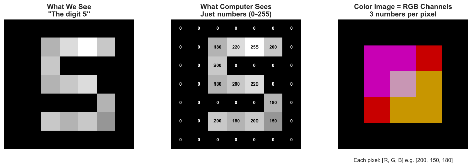
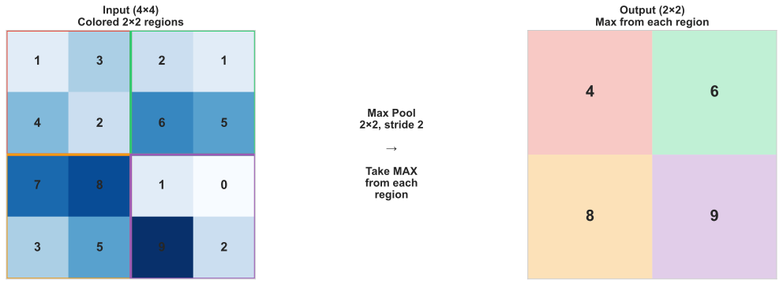
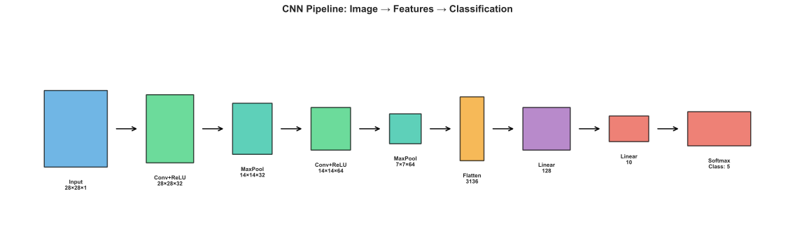
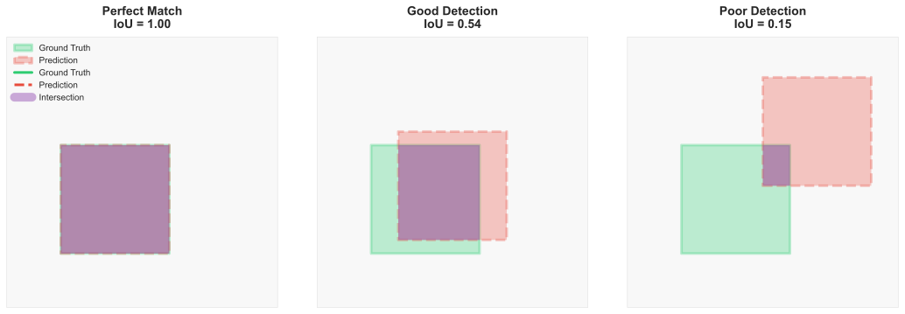
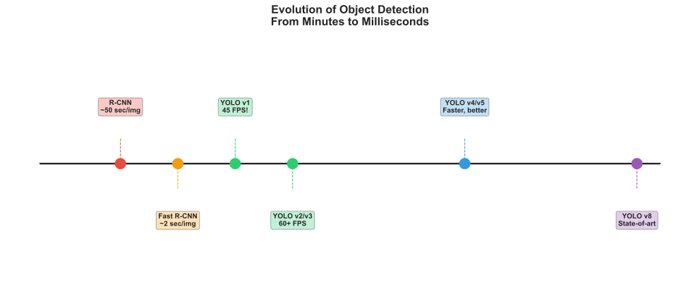

<!-- _class: title-slide -->
<!-- _paginate: false -->

# Computer Vision
# How Machines See

## From Pixels to Object Detection

**Nipun Batra** | IIT Gandhinagar

---

# The Story So Far

| Week | We Learned |
|------|------------|
| 5 | Neural networks: MLPs, backprop, PyTorch |
| **6** | **How to apply neural networks to IMAGES** |

---

# A Child vs. A Computer

**A 3-year-old child can:**
- Recognize their parent in any photo
- Spot a dog across the street
- Know if a picture is upside down

**A computer sees:**
- Just numbers (pixels)
- No concept of "dog" or "parent"
- 224 × 224 × 3 = 150,528 values

<div class="insight">
Today: How do we bridge this gap?
</div>

---

# Why Computer Vision Matters

| Application | What CV Does | Impact |
|-------------|--------------|--------|
| Self-driving cars | Detect pedestrians, signs | Safety |
| Medical imaging | Find tumors, diagnose | Healthcare |
| Instagram filters | Face detection, AR | Entertainment |
| Security cameras | Person tracking | Safety |
| Quality control | Defect detection | Manufacturing |
| Agriculture | Crop disease detection | Food security |

---

# The Big Picture: Vision Tasks


---

# Today's Agenda

1. **Images as Data** - How computers "see"
2. **Convolution: The Key Insight** - Why it works
3. **CNN Architecture** - Building blocks
4. **From Classification to Detection** - The progression
5. **Object Detection** - What + Where
6. **YOLO** - Real-time magic

---

<!-- _class: section-divider -->

# Part 1: Images as Data

## How Computers "See"

---

# What Is an Image to a Computer?



---

# Grayscale vs Color

| Type | Dimensions | Example |
|------|------------|---------|
| Grayscale | Height × Width | 28 × 28 = 784 values |
| Color (RGB) | Height × Width × 3 | 224 × 224 × 3 = 150,528 values |

**RGB = Red, Green, Blue channels**

```python
img = np.array(Image.open('cat.jpg'))
print(img.shape)  # (224, 224, 3) → height, width, channels
print(img[100, 200])  # [142, 87, 34] → R, G, B values
```

---

# MNIST: The "Hello World" of Vision

Each MNIST digit is a 28×28 grayscale image = 784 pixels

| Property | Value |
|----------|-------|
| Image size | 28 × 28 |
| Channels | 1 (grayscale) |
| Pixel range | 0-255 |
| Total pixels | 784 |

**Task:** Given 784 numbers, predict which digit (0-9)

---

# Image Representation in Python

```python
import numpy as np
from PIL import Image

# Load an image
img = Image.open('cat.jpg')
pixels = np.array(img)

print(pixels.shape)  # (480, 640, 3)
#                      Height, Width, RGB

# What does a pixel look like?
print(pixels[100, 200])  # [142, 87, 34]
#                          Red=142, Green=87, Blue=34 (brownish)

# Normalize for neural networks
pixels_normalized = pixels / 255.0  # Scale to 0-1
```

---

# Quiz: What's the Difference?

**Image A:** A photo of a dog
**Image B:** The same photo, but flipped horizontally

To a human: Same dog!
To a computer: **Completely different numbers!**

```python
np.array_equal(img_A, img_B)  # False!
```

<div class="insight">
This is the fundamental challenge: same concept, different pixels.
</div>

---

# The Three Challenges

| Challenge | Why It's Hard | What We Need |
|-----------|--------------|--------------|
| **Too many pixels** | 224×224×3 = 150K features | Efficient architecture |
| **Position doesn't matter** | Cat on left = Cat on right | Translation invariance |
| **Local patterns matter** | Edges, textures, shapes | Local feature detection |

---

# Why Not Use MLPs for Images?

**Problem 1: Too many parameters**

- Image: 224 × 224 × 3 = 150,528 inputs
- Hidden layer: 1,000 neurons
- Parameters: 150,528 × 1,000 = **150 million weights!**

---

# Why Not Use MLPs for Images? (cont.)

**Problem 2: No spatial awareness**

```
Original:    Shifted:
┌────┐       ┌────┐
│  ☺ │       │ ☺  │
│    │   →   │    │
└────┘       └────┘

MLP sees completely different pixels!
```

The same object at different positions looks completely different to an MLP.

---

# What We Need

| Requirement | Solution |
|-------------|----------|
| Fewer parameters | Weight sharing |
| Translation invariance | Local patterns |
| Spatial structure | Keep 2D arrangement |

**Enter: Convolutional Neural Networks (CNNs)**

---

<!-- _class: section-divider -->

# Part 2: Convolutional Neural Networks

## The Breakthrough (2012)

---

# The Key Insight

**Instead of connecting every pixel to every neuron...**

Connect small **local regions** to neurons!

```
Image:              Filter:
┌─────────────┐     ┌───────┐
│ x x x . . . │     │ w w w │
│ x x x . . . │  *  │ w w w │  =  one output
│ x x x . . . │     │ w w w │
│ . . . . . . │     └───────┘
└─────────────┘      3×3 filter
```

---

# Convolution Operation

Slide a small filter across the image:

```
Image           Filter         Output
┌─────────┐    ┌─────┐
│1 2 3 0 1│    │1 0 1│
│0 1 2 3 2│  * │0 1 0│  =  [12, ...]
│1 2 1 0 1│    │1 0 1│
│0 1 2 3 2│    └─────┘
│2 1 0 1 2│
└─────────┘

1×1 + 2×0 + 3×1 + 0×0 + 1×1 + 2×0 + 1×1 + 2×0 + 1×1 = 12
```

---

# Why Convolution Works

| Property | Benefit |
|----------|---------|
| **Local connectivity** | Each neuron sees a small region |
| **Weight sharing** | Same filter applied everywhere |
| **Translation equivariance** | Object detected regardless of position |

---

# Weight Sharing: The Big Win

**Without sharing (MLP):**
- 150,528 inputs × 1000 hidden = 150 million weights
- Each position has different weights

**With sharing (CNN):**
- 3×3 filter × 3 channels × 32 filters = 864 weights!
- Same filter slides across entire image

```
┌───────────────────────────────────────────────┐
│  150,000,000  vs  864  parameters             │
│  (MLP)            (CNN)                        │
│                                               │
│  That's 173,000× fewer parameters!            │
└───────────────────────────────────────────────┘
```

---

# Translation Equivariance

**If the input shifts, the output shifts the same way:**


**Same filter detects the cat regardless of position!**

---

# Filters Learn Features

Different filters detect different patterns:

| Filter | What It Detects |
|--------|-----------------|
| Edge detector | Boundaries between regions |
| Corner detector | Sharp corners |
| Texture detector | Repeating patterns |

**The network LEARNS which filters are useful!**

---

# Convolution in Code

```python
import torch.nn as nn

# Convolutional layer
conv = nn.Conv2d(
    in_channels=3,    # RGB input
    out_channels=32,  # 32 filters
    kernel_size=3,    # 3×3 filters
    padding=1         # Keep same size
)

# Apply to image
x = torch.randn(1, 3, 224, 224)  # [batch, channels, H, W]
out = conv(x)  # [1, 32, 224, 224]
```

---

# Feature Maps

Each filter produces a **feature map**:

```
Input Image     32 Filters        32 Feature Maps
(3 channels)    (3×3 each)        (one per filter)
┌───────┐       ┌───┐┌───┐        ┌───────┐
│ R G B │   *   │   ││   │...  =  │       │ × 32
│       │       └───┘└───┘        │       │
└───────┘                         └───────┘
```

---

<!-- _class: section-divider -->

# Part 3: CNN Architecture

## The Building Blocks

---

# CNN Building Blocks

| Layer | Purpose | Output Change |
|-------|---------|---------------|
| **Conv** | Detect features | Different channels |
| **ReLU** | Non-linearity | Same size |
| **Pooling** | Reduce size | Smaller spatial |
| **Flatten** | 2D → 1D | Vector |
| **Linear** | Classification | Class scores |

---

# Max Pooling

Take the maximum value in each region:



**Reduces spatial size by 2×**

---

# Why Pooling?

| Benefit | Explanation |
|---------|-------------|
| Reduces parameters | Smaller feature maps |
| Provides invariance | Small shifts don't matter |
| Increases receptive field | Later layers "see" more |

---

# A Simple CNN

```python
class SimpleCNN(nn.Module):
    def __init__(self):
        super().__init__()
        self.conv1 = nn.Conv2d(1, 32, 3, padding=1)  # 28→28
        self.pool1 = nn.MaxPool2d(2)                  # 28→14
        self.conv2 = nn.Conv2d(32, 64, 3, padding=1) # 14→14
        self.pool2 = nn.MaxPool2d(2)                  # 14→7
        self.fc = nn.Linear(64 * 7 * 7, 10)          # Classify

    def forward(self, x):
        x = F.relu(self.conv1(x))
        x = self.pool1(x)
        x = F.relu(self.conv2(x))
        x = self.pool2(x)
        x = x.view(-1, 64 * 7 * 7)  # Flatten
        x = self.fc(x)
        return x
```

---

# CNN for MNIST



---

# Famous CNN Architectures

| Year | Model | Key Innovation |
|------|-------|----------------|
| 1998 | LeNet | First CNN |
| 2012 | **AlexNet** | Deep CNN, GPU training |
| 2014 | VGG | Very deep (16-19 layers) |
| 2015 | ResNet | Skip connections (152 layers!) |
| 2017 | EfficientNet | Neural architecture search |

---

# AlexNet: The Game Changer

```
ImageNet 2012:
┌─────────────────────────────────────┐
│ Previous best (hand-crafted): 25.8% │
│ AlexNet (CNN):               16.4% │  ← 9% improvement!
│ Human performance:           ~5%    │
└─────────────────────────────────────┘
```

**This started the deep learning revolution!**

---

# Transfer Learning

**Don't train from scratch!** Use pre-trained models:

```python
import torchvision.models as models

# Load pre-trained ResNet (trained on ImageNet)
model = models.resnet50(pretrained=True)

# Replace last layer for your task
model.fc = nn.Linear(2048, num_classes)

# Fine-tune on your data
```

---

<!-- _class: section-divider -->

# Part 4: From Classification to Detection

## The Journey from "What" to "What + Where"

---

# The Progression of Vision Tasks


**Classification → Localization → Detection**

Each step adds more information about the objects in an image.

---

# Classification vs Localization vs Detection

| Task | # Objects | Output | Example |
|------|-----------|--------|---------|
| **Classification** | 1 (assumed) | Class label | "This is a cat" |
| **Localization** | 1 | Class + 1 box | "Cat at (x,y,w,h)" |
| **Detection** | 0 to many | Classes + boxes | "Cat at..., Dog at..." |

<div class="insight">
Detection = Classification + Localization + Handle multiple objects
</div>

---

# Why Detection is Harder

| Challenge | Why It's Difficult |
|-----------|-------------------|
| **Variable count** | 0, 1, 5, or 100 objects in an image |
| **Variable sizes** | Same object can be huge or tiny |
| **Overlapping objects** | Objects can occlude each other |
| **Background clutter** | Must ignore non-objects |
| **Real-time requirement** | Self-driving cars need 30+ FPS |

---

# Why Detection Matters

**Self-driving car needs to know:**
- What is there? (pedestrian, car, sign)
- Where is it? (position, distance)
- How many? (one child or five?)

**Classification can't answer "where"!**

---

# Bounding Boxes

A bounding box = 4 numbers describing a rectangle:


---

# Detection Output

For each object:
- **Class label**: "dog", "car", "person"
- **Bounding box**: (x1, y1, x2, y2)
- **Confidence**: 0.95 (95% sure)

```python
detections = [
    {"class": "dog", "box": [100, 50, 300, 200], "conf": 0.95},
    {"class": "cat", "box": [400, 100, 550, 250], "conf": 0.87},
]
```

---

# IoU: Measuring Box Overlap

**Intersection over Union** - How good is a predicted box?

$$\text{IoU} = \frac{\text{Area of Overlap}}{\text{Area of Union}}$$

| IoU Value | Quality |
|-----------|---------|
| 1.0 | Perfect match |
| > 0.5 | Good detection |
| < 0.3 | Poor detection |

---

# IoU Examples



---

# IoU Thresholds

| IoU Threshold | Meaning | Use Case |
|---------------|---------|----------|
| **IoU ≥ 0.5** | "Good enough" | Standard detection (PASCAL VOC) |
| **IoU ≥ 0.75** | "Precise" | High-quality detection |
| **IoU ≥ 0.95** | "Near perfect" | Fine-grained applications |

**mAP@0.5:0.95** averages performance across multiple IoU thresholds.

---

# Computing IoU in Python

```python
def compute_iou(box1, box2):
    """
    Boxes are [x1, y1, x2, y2] format
    """
    # Intersection coordinates
    x1 = max(box1[0], box2[0])
    y1 = max(box1[1], box2[1])
    x2 = min(box1[2], box2[2])
    y2 = min(box1[3], box2[3])

    # Areas
    intersection = max(0, x2-x1) * max(0, y2-y1)
    area1 = (box1[2]-box1[0]) * (box1[3]-box1[1])
    area2 = (box2[2]-box2[0]) * (box2[3]-box2[1])
    union = area1 + area2 - intersection

    return intersection / union if union > 0 else 0
```

---

# Non-Maximum Suppression (NMS)

**Problem:** Model often detects the same object multiple times.

**Solution:** Keep only the best detection, remove overlapping ones.

```python
# Many boxes for same dog
boxes = [[100,50,300,200], [105,55,305,205], [110,48,295,198]]
confs = [0.95, 0.92, 0.88]

# After NMS: keep only [100,50,300,200] with conf 0.95
```

---

<!-- _class: section-divider -->

# Part 5: YOLO

## You Only Look Once

---

# YOLO: The Revolution

Before YOLO (2015): Detection was SLOW (seconds per image)

After YOLO: **Real-time detection** (30-60 FPS!)

| Approach | Speed | How |
|----------|-------|-----|
| R-CNN | ~50 sec | Propose regions, classify each |
| Fast R-CNN | ~2 sec | Share computation |
| **YOLO** | **~0.02 sec** | One network, one pass |

---

# YOLO Key Idea

**Process the entire image in one forward pass:**

1. Divide image into grid (e.g., 7×7)
2. Each cell predicts:
   - Bounding boxes
   - Confidence scores
   - Class probabilities
3. Single neural network does everything!

---

# YOLO Grid


---

# Using YOLO in Practice

```python
from ultralytics import YOLO

# Load pre-trained model
model = YOLO('yolov8n.pt')

# Detect objects
results = model('image.jpg')

# Process results
for result in results:
    for box in result.boxes:
        x1, y1, x2, y2 = box.xyxy[0].tolist()
        conf = box.conf[0].item()
        cls = int(box.cls[0].item())
        print(f"Class {cls}: ({x1:.0f},{y1:.0f}) to ({x2:.0f},{y2:.0f})")
```

---

# YOLO Model Sizes

| Model | Speed | Accuracy | Use Case |
|-------|-------|----------|----------|
| YOLOv8n | Fastest | Lower | Mobile, edge |
| YOLOv8s | Fast | Medium | General use |
| YOLOv8m | Medium | Good | Better accuracy |
| YOLOv8l | Slower | Better | High accuracy |
| YOLOv8x | Slowest | Best | Maximum accuracy |

---

# Training Your Own Detector

```python
from ultralytics import YOLO

# Start with pre-trained model
model = YOLO('yolov8n.pt')

# Train on custom data
model.train(
    data='my_dataset.yaml',
    epochs=100,
    imgsz=640
)

# Evaluate
metrics = model.val()
print(f"mAP@0.5: {metrics.box.map50:.3f}")
```

---

# Detection Metrics

| Metric | What It Measures |
|--------|------------------|
| **Precision** | Of detections, how many correct? |
| **Recall** | Of actual objects, how many found? |
| **mAP@0.5** | Average precision at IoU=0.5 |
| **mAP@0.5:0.95** | Average over IoU thresholds |

---

# Detection Speed Evolution



---

# Real-World Detection Applications

| Application | Objects Detected | Speed Requirement |
|-------------|-----------------|-------------------|
| **Self-driving cars** | Cars, pedestrians, signs | Real-time (30+ FPS) |
| **Retail analytics** | People, products | Near real-time |
| **Medical imaging** | Tumors, lesions | Accuracy > speed |
| **Sports analysis** | Players, ball | Real-time |
| **Security cameras** | People, vehicles | Real-time |
| **Manufacturing QC** | Defects, parts | High accuracy |

---

# Beyond Detection: Segmentation

**Instance Segmentation** = Detection + Pixel-level masks

| Task | Output | Use Case |
|------|--------|----------|
| Detection | Bounding boxes | "Where are objects?" |
| Semantic Seg. | Pixel classes | "What is each pixel?" |
| Instance Seg. | Pixel masks per object | "Which pixels belong to which object?" |

---

# Segmentation Variants Comparison


---

# Segmentation with YOLO

```python
from ultralytics import YOLO

# Load segmentation model
model = YOLO('yolov8n-seg.pt')

# Run segmentation
results = model('image.jpg')

# Access masks
for result in results:
    masks = result.masks  # Segmentation masks
    boxes = result.boxes  # Bounding boxes
```

---

# Pose Estimation

**Beyond "what" and "where" → "how is it positioned?"**

Pose estimation detects keypoints (joints) on bodies:
- 17 keypoints for humans (COCO format)
- Enables gesture recognition, action detection
- Used in sports, healthcare, gaming

```python
# Pose estimation with YOLO
model = YOLO('yolov8n-pose.pt')
results = model('person.jpg')

# Get keypoints
for result in results:
    keypoints = result.keypoints  # Shape: (n_persons, 17, 3)
```

---

# The Vision AI Stack

| Layer | Components |
|-------|------------|
| **Applications** | Self-driving, Medical, Retail, Security, Robotics |
| **High-Level Tasks** | Pose Estimation, Tracking, Action Recognition |
| **Core Tasks** | Classification, Detection, Segmentation |
| **Building Blocks** | CNNs, Transformers (ViT), Feature Extractors |
| **Fundamentals** | Images as Tensors, Convolutions, Pooling |

<div class="insight">
Each layer builds on the ones below it!
</div>

---

# From Images to Video

**Video = Sequence of Images (Frames)**

| Task | Description | Challenge |
|------|-------------|-----------|
| **Object Tracking** | Follow objects across frames | Maintain ID consistency |
| **Action Recognition** | Classify what's happening | Temporal understanding |
| **Video Object Detection** | Detect objects in video | Real-time processing |

**Tracking adds a new dimension: TIME**

---

# Multi-Object Tracking (MOT)

**Challenge:** Same dog appears in frame 1, 2, 3...
How do we know it's the SAME dog?

**Solution:** Track IDs

```python
from ultralytics import YOLO

model = YOLO('yolov8n.pt')

# Track objects across video frames
results = model.track(source='video.mp4', persist=True)

# Each detection now has a track ID
for result in results:
    for box in result.boxes:
        track_id = box.id  # Consistent across frames!
```

---

# Key Takeaways

1. **Images = grids of numbers** (pixels)

2. **CNNs use convolutions** for efficient image processing
   - Weight sharing (fewer parameters)
   - Translation equivariance (detect anywhere)

3. **CNN building blocks**: Conv → ReLU → Pool → Flatten → Linear

4. **Detection = Classification + Localization**
   - Bounding boxes + class labels + confidence

5. **IoU** measures box overlap (threshold typically 0.5)

6. **YOLO** enables real-time detection (single forward pass)

7. **Beyond detection:** Segmentation, Pose, Tracking

---

# Connecting to Next Week

**Computer Vision answers:** "What's in this image?"

**Next question:** "What does this text mean?"

| This Week | Next Week |
|-----------|-----------|
| Images → Pixels → CNNs | Text → Tokens → Transformers |
| Object Detection | Next Token Prediction |
| YOLO (real-time vision) | LLMs (language understanding) |

<div class="insight">
Same principle: Learn patterns from data to make predictions!
</div>

---

<!-- _class: title-slide -->

# You Can Now Make Computers See!

## Next: Language Models - How Machines Understand Text

**Lab:** Build a CNN classifier and run YOLO detection

*"The question is not whether intelligent machines can have any emotions, but whether machines can be intelligent without any emotions."*
— Marvin Minsky

**Questions?**
