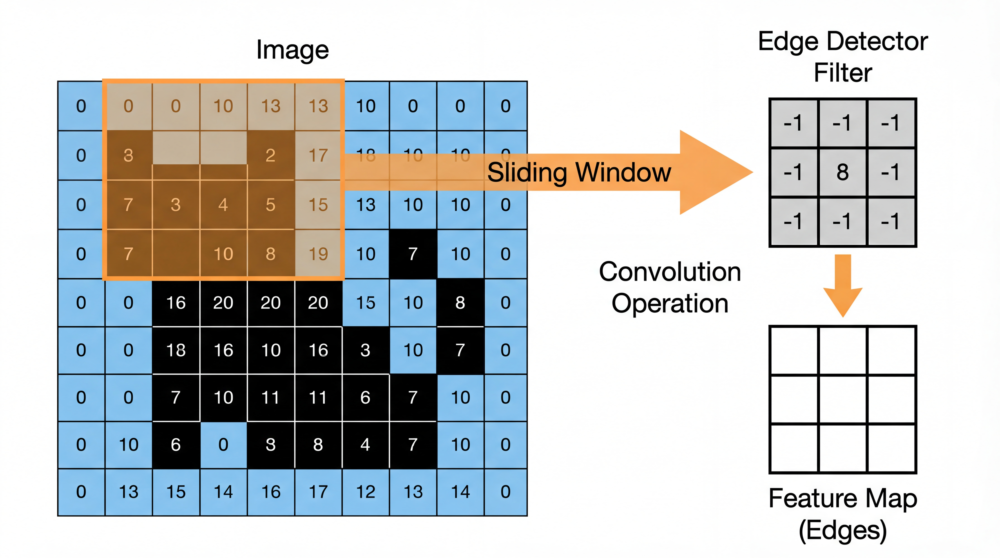
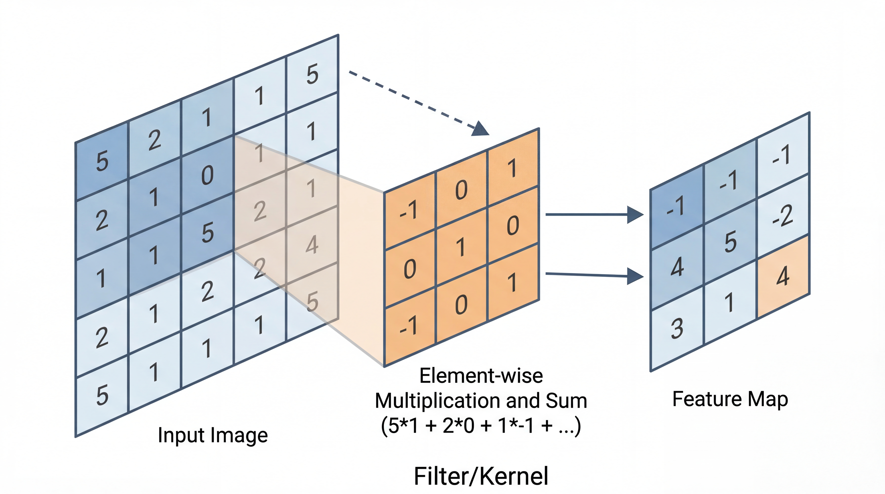
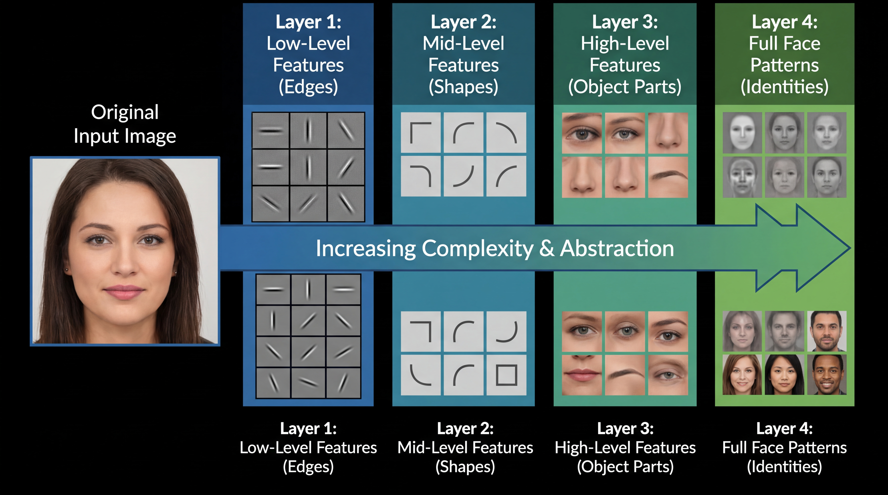
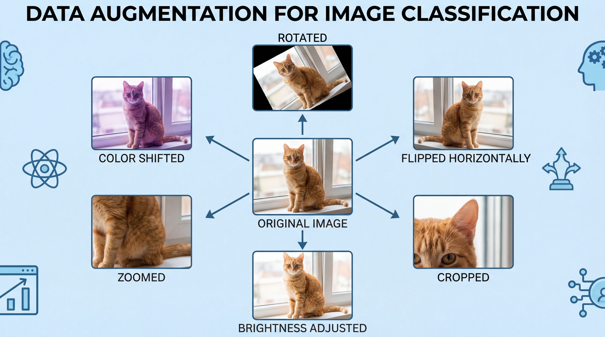
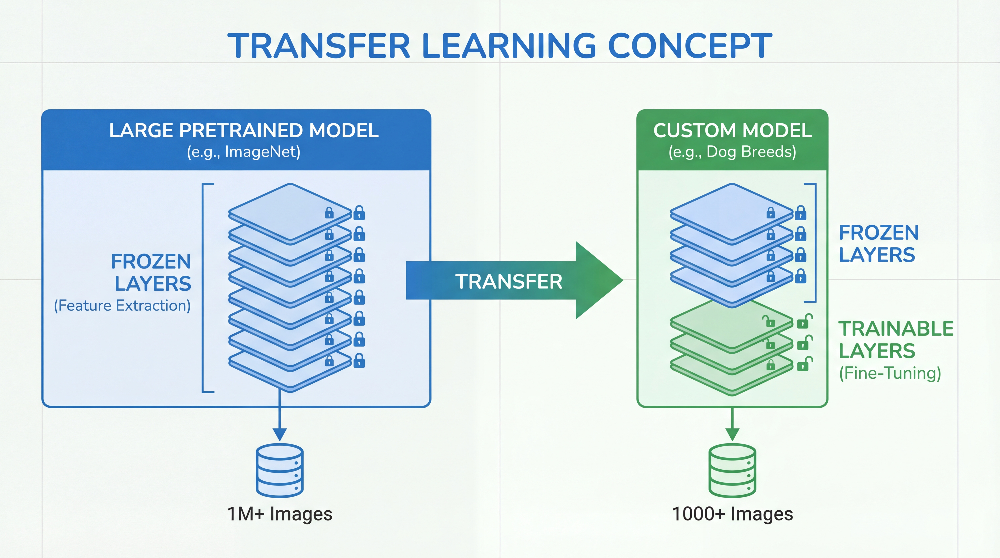
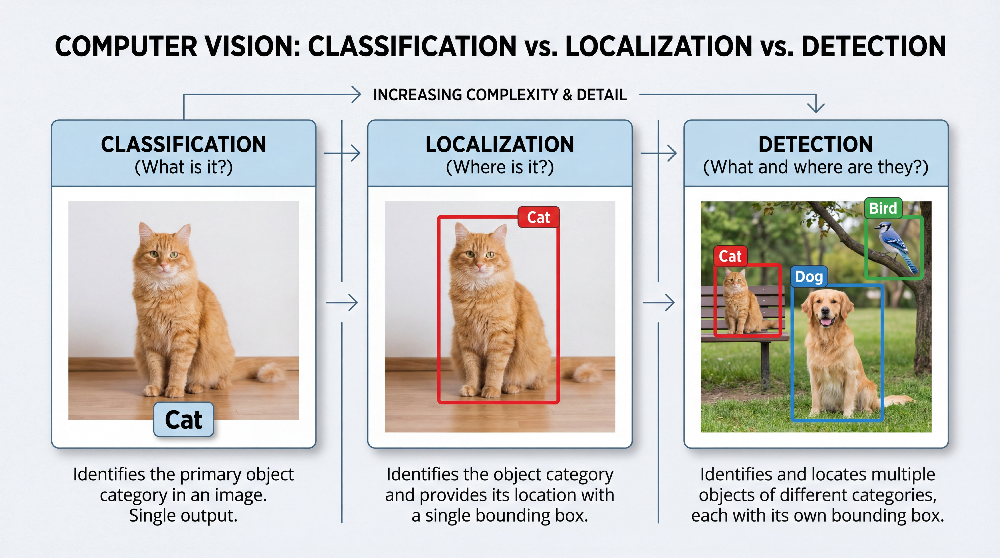
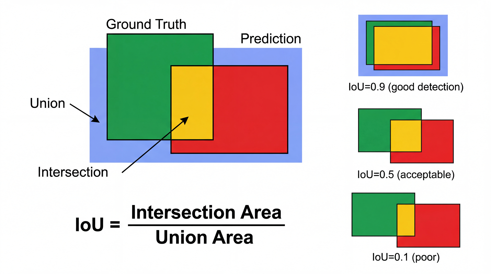
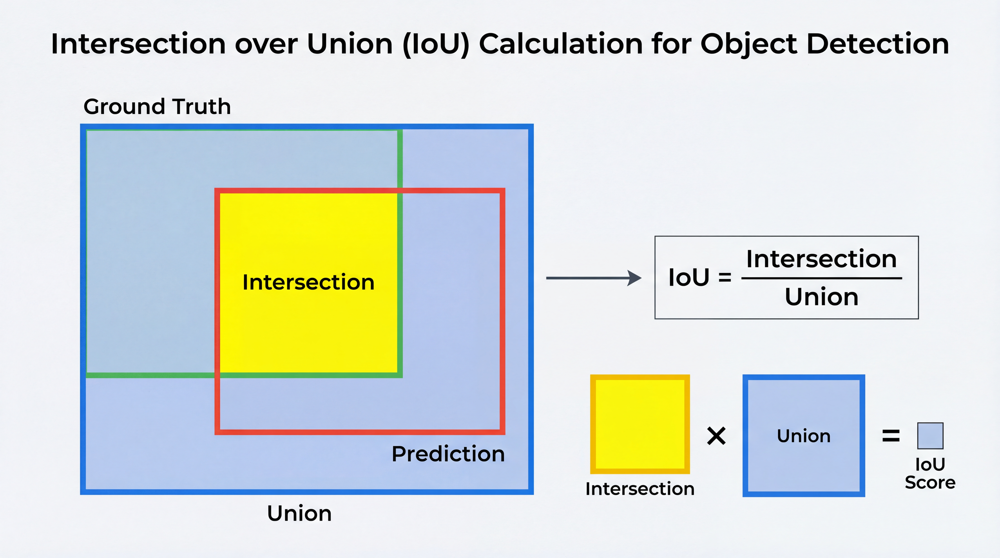
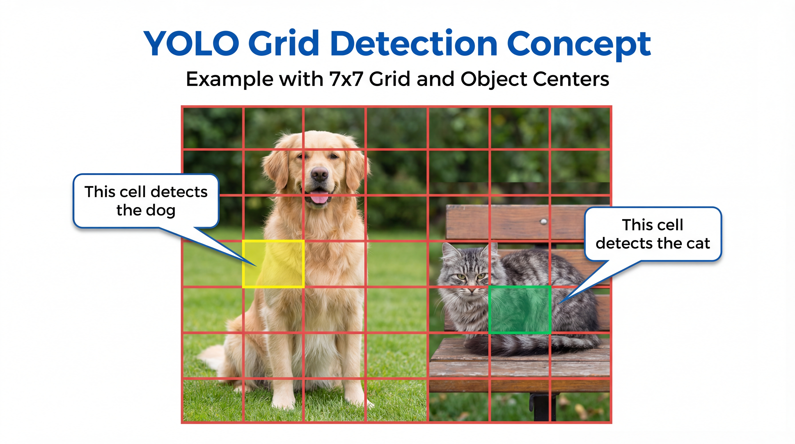

<!-- _class: title-slide -->
<!-- _paginate: false -->

# Computer Vision
# How Machines See

## From Pixels to Object Detection

**Nipun Batra** | IIT Gandhinagar

---

# The Story So Far

| Lecture | What We Learned |
|---------|-----------------|
| 5 | Neural networks, layers, training |
| **6** | **How neural networks see images** |

---

# A Child vs. A Computer

**A 3-year-old child can:**
- Recognize their parent in any photo
- Spot a dog across the street
- Know if a picture is upside down

**A computer sees:**
- Just numbers (pixels)
- No concept of "dog" or "parent"
- Millions of numbers

<div class="insight">
Today: How do we bridge this gap?
</div>

---

# Why Computer Vision Matters

| Application | What It Does |
|-------------|--------------|
| Self-driving cars | Detect pedestrians, cars, signs |
| Medical imaging | Find tumors, diagnose diseases |
| Phone cameras | Face detection, filters |
| Security cameras | Person detection |
| Manufacturing | Defect detection |

---

# Today's Agenda

1. **Images as Data** - How computers "see"
2. **CNNs** - Neural networks for images
3. **Object Detection** - Finding objects and their locations
4. **YOLO** - Real-time detection

---

<!-- _class: section-divider -->

# Part 1: Images as Data

## What a Computer Actually Sees

---

# What Is an Image to a Computer?

**An image is just a grid of numbers!**

| Image Size | What Computer Sees |
|------------|-------------------|
| 28 × 28 grayscale | 784 numbers (0-255) |
| 224 × 224 color | 150,528 numbers |

Each number = brightness of one pixel

---

# Grayscale Images

**Each pixel = one number (0-255)**

| Value | Meaning |
|-------|---------|
| 0 | Black |
| 128 | Gray |
| 255 | White |

```python
import numpy as np
from PIL import Image

img = Image.open('digit.png').convert('L')  # Grayscale
pixels = np.array(img)
print(pixels.shape)  # (28, 28)
print(pixels[14, 14])  # Value at center pixel
```

---

# Color Images (RGB)

**Each pixel = 3 numbers (Red, Green, Blue)**

| Color | RGB Values |
|-------|------------|
| Red | (255, 0, 0) |
| Green | (0, 255, 0) |
| Blue | (0, 0, 255) |
| White | (255, 255, 255) |
| Black | (0, 0, 0) |

```python
img = Image.open('cat.jpg')
pixels = np.array(img)
print(pixels.shape)  # (224, 224, 3) → Height × Width × RGB
```

---

# MNIST: The "Hello World" of Vision

**Handwritten digits:** 28×28 grayscale images

| Property | Value |
|----------|-------|
| Image size | 28 × 28 pixels |
| Colors | Grayscale (1 channel) |
| Total pixels | 784 |
| Task | Classify as 0-9 |

**This is what your phone keyboard uses for handwriting!**

---

# The Challenge

**The same dog in different positions looks COMPLETELY different to a computer:**

| Position | Pixel Values |
|----------|--------------|
| Dog on left | [14, 82, 201, 55, ...] |
| Dog on right | [201, 55, 14, 82, ...] |

**To a human:** Same dog!
**To a computer:** Completely different numbers!

<div class="insight">
We need neural networks that understand "dog" regardless of position.
</div>

---

<!-- _class: section-divider -->

# Part 2: CNNs

## Neural Networks for Images

---

# Why Not Use Regular Neural Networks?

**Problem 1: Too many parameters**

| Input | Hidden Layer | Parameters |
|-------|-------------|------------|
| 224×224×3 = 150K inputs | 1000 neurons | 150 MILLION weights! |

**Problem 2: No spatial understanding**
- Moving an object changes ALL pixel values
- Regular neural networks don't understand "position"

---

# The Key Idea: Look at Small Regions



**Instead of looking at entire image at once...**

Look at **small patches** and find patterns!

A small filter (like a 3x3 edge detector) slides across the entire image, detecting patterns everywhere.

**Same edge detector works EVERYWHERE in the image!**

---

# Filters (Kernels)



A **filter** is a small grid of numbers that detects a pattern:

| Filter Type | What It Detects |
|-------------|-----------------|
| Edge filter | Boundaries between regions |
| Corner filter | Sharp corners |
| Texture filter | Repeating patterns |

**The network LEARNS which filters are useful!**

---

# CNN: The Big Picture

**Convolutional Neural Network:**

```
Image → [Conv → ReLU → Pool] → [Conv → ReLU → Pool] → FC → Output
         ↓                       ↓                      ↓
      Detect               Detect complex          Classify
      edges                patterns (ears, eyes)
```

| Layer | What It Does |
|-------|--------------|
| Conv | Apply filters to detect patterns |
| ReLU | Add non-linearity (like before!) |
| Pool | Shrink the image (keep important info) |
| FC | Final classification (like before!) |

---

# Pooling: Shrinking the Image


**Max Pooling:** Take the maximum value from each region

| Why Pool? | Benefit |
|-----------|---------|
| Reduces size | Fewer parameters, faster |
| Translation invariance | Small shifts don't matter |
| Keeps important features | Max = strongest signal |

---

# A Simple CNN in PyTorch

```python
import torch.nn as nn

class SimpleCNN(nn.Module):
    def __init__(self):
        super().__init__()
        # Convolutional layers
        self.conv1 = nn.Conv2d(1, 32, kernel_size=3)
        self.conv2 = nn.Conv2d(32, 64, kernel_size=3)
        self.pool = nn.MaxPool2d(2)

        # Classification layer
        self.fc = nn.Linear(64 * 5 * 5, 10)

    def forward(self, x):
        x = self.pool(F.relu(self.conv1(x)))
        x = self.pool(F.relu(self.conv2(x)))
        x = x.view(-1, 64 * 5 * 5)  # Flatten
        return self.fc(x)
```

---

# Why CNNs Work So Well

| Feature | Why It Helps |
|---------|--------------|
| **Weight sharing** | Same filter applied everywhere = fewer parameters |
| **Local patterns** | Detect edges, corners, textures locally |
| **Hierarchy** | Early layers → edges; Later layers → complex shapes |
| **Position invariance** | Cat on left ≈ Cat on right |

---

# The Feature Hierarchy: A Deep Dive

**What each layer learns:**

| Layer | What It Sees | Example |
|-------|--------------|---------|
| **Layer 1** | Edges, gradients | Horizontal lines, vertical lines |
| **Layer 2** | Corners, textures | Corners, stripes, dots |
| **Layer 3** | Parts | Eyes, ears, wheels |
| **Layer 4** | Objects | Faces, cars, dogs |
| **Layer 5+** | Concepts | "Happy face", "Running dog" |

**Deeper = More abstract!**

---

# Visualizing CNN Layers



**What each layer learns:**

| Layer | Detects |
|-------|---------|
| 1 | Edges, lines |
| 2 | Corners, shapes |
| 3 | Parts (eyes, wheels) |
| 4 | Full objects |

**Early layers are SHARED across all object types!**

---

# Famous CNN Moment: ImageNet 2012

```
Before CNNs (hand-crafted features): 25.8% error
AlexNet (deep CNN):                  16.4% error  ← HUGE jump!
Human performance:                   ~5% error
```

**This started the deep learning revolution!**

---

# Famous CNN Architectures

| Year | Architecture | Key Innovation |
|------|--------------|----------------|
| 2012 | **AlexNet** | Deep CNNs work! GPU training |
| 2014 | **VGGNet** | Deeper = better (16-19 layers) |
| 2015 | **ResNet** | Skip connections (152 layers!) |
| 2017 | **EfficientNet** | Smart scaling |
| 2020 | **ViT** | Transformers for vision |

**Trend:** Deeper networks with clever tricks to train them!

---

# Data Augmentation



**Problem:** Not enough training images?

**Solution:** Create variations of existing images!

| Augmentation | Effect |
|--------------|--------|
| Flip | Mirror horizontally |
| Rotate | Small angle rotations |
| Crop | Random crops |
| Color | Brightness, contrast |

---

# Data Augmentation in PyTorch

```python
from torchvision import transforms

train_transform = transforms.Compose([
    transforms.RandomHorizontalFlip(),
    transforms.RandomRotation(10),
    transforms.ColorJitter(brightness=0.2),
    transforms.RandomResizedCrop(224),
    transforms.ToTensor(),
])

# Apply during training
train_dataset = ImageFolder('train/', transform=train_transform)
```

**Result:** 1000 images become effectively 10,000+!

---

# Transfer Learning



**The big insight:** CNNs trained on ImageNet learn general features!

| Layer | What It Learned | Reusable? |
|-------|-----------------|-----------|
| Early | Edges, textures | Yes! (universal) |
| Middle | Shapes, parts | Mostly yes |
| Late | Specific objects | Needs fine-tuning |

---

# Transfer Learning in Practice

```python
from torchvision import models

# Load pre-trained ResNet
model = models.resnet18(pretrained=True)

# Freeze early layers (don't train them)
for param in model.parameters():
    param.requires_grad = False

# Replace final layer for our task (e.g., 10 classes)
model.fc = nn.Linear(512, 10)

# Now train only the new layer!
```

**Result:** Train on 1000 images instead of millions!

---

# When to Use Transfer Learning?

| Your Dataset | Strategy |
|--------------|----------|
| Small (< 1000) | Freeze all, train only final layer |
| Medium (1000-10K) | Freeze early, fine-tune later layers |
| Large (> 10K) | Fine-tune everything (or train from scratch) |

<div class="insight">

**Transfer learning is almost always better than training from scratch!**

</div>

---

<!-- _class: section-divider -->

# Part 3: Object Detection

## Finding WHAT and WHERE

---

# From Classification to Detection



| Task | Output |
|------|--------|
| **Classification** | Just the label: "Cat" |
| **Localization** | One box + label |
| **Detection** | Multiple boxes + labels |

**Detection = Classification + Location**

---

# Why Detection Matters More

**Self-driving car needs to know:**

| Just Classification | Detection |
|---------------------|-----------|
| "There's a pedestrian" | "Pedestrian at position (x, y)" |
| Not enough info! | Can avoid collision! |

**Location is critical for real-world applications!**

---

# Real-World Detection Applications

| Application | What Gets Detected |
|-------------|-------------------|
| **Tesla Autopilot** | Cars, pedestrians, lane lines, traffic signs |
| **Airport Security** | Weapons, liquids, prohibited items in bags |
| **Retail Analytics** | Customers, products, shopping patterns |
| **Wildlife Monitoring** | Animals, poachers, vehicles |
| **Quality Control** | Defects, missing parts, misalignments |

**Detection is everywhere!**

---

# Bounding Boxes

A **bounding box** = 4 numbers describing a rectangle:

| Format | Numbers | Meaning |
|--------|---------|---------|
| Corner format | (x1, y1, x2, y2) | Top-left and bottom-right corners |
| Center format | (cx, cy, w, h) | Center point + width + height |

```python
# Example detection output
box = {
    "class": "dog",
    "x1": 100, "y1": 50,   # Top-left corner
    "x2": 300, "y2": 200,  # Bottom-right corner
    "confidence": 0.95     # 95% sure it's a dog
}
```

---

# Object Detection = Predict Coordinates!

**The key insight:**

Object detection is just **predicting 4 numbers** for each object!

| What to Predict | Type |
|-----------------|------|
| x1 (left edge) | Regression (number) |
| y1 (top edge) | Regression (number) |
| x2 (right edge) | Regression (number) |
| y2 (bottom edge) | Regression (number) |
| class | Classification (category) |

**It's like predicting house prices, but for box coordinates!**

---

# Multiple Objects

**What if there are 3 dogs in the image?**

Output: 3 sets of (box + class + confidence)

```python
detections = [
    {"class": "dog", "box": [100, 50, 200, 150], "conf": 0.95},
    {"class": "dog", "box": [300, 100, 400, 200], "conf": 0.88},
    {"class": "cat", "box": [500, 50, 600, 180], "conf": 0.92}
]
```

---

# Measuring Detection Quality: IoU



**IoU = Intersection over Union**

$$\text{IoU} = \frac{\text{Overlap Area}}{\text{Total Area of Both Boxes}}$$

| IoU Value | Quality |
|-----------|---------|
| 1.0 | Perfect match |
| 0.5+ | Good detection |
| 0.0 | Completely wrong |

---

# IoU Example



**Comparing Ground Truth (green) vs Prediction (red):**

| Metric | Value |
|--------|-------|
| Overlap area | 50% |
| Union area | 150% |
| **IoU** | 0.33 |

**Threshold:** Usually IoU >= 0.5 counts as "correct detection"

---

<!-- _class: section-divider -->

# Part 4: YOLO

## Real-Time Object Detection

---

# The Speed Problem

**Early detectors were SLOW:**

| Method | Speed | Problem |
|--------|-------|---------|
| R-CNN (2014) | ~50 seconds/image | Too slow for video! |
| Fast R-CNN | ~2 seconds | Still too slow |
| **YOLO (2016)** | **~0.02 seconds** | Real-time! |

**Self-driving cars need 30+ detections per second!**

---

# YOLO: You Only Look Once

**The breakthrough:** Process entire image in ONE forward pass!

**How it works:**

1. Divide image into a grid (e.g., 7×7)
2. Each cell predicts: "Is there an object centered here?"
3. If yes, predict the bounding box coordinates
4. Single neural network does everything at once!

---

# YOLO Grid



**How YOLO divides the image:**

- Image is divided into a grid (e.g., 7x7)
- Each cell is responsible for detecting objects whose center falls in that cell
- The cell containing the dog's center predicts the dog
- The cell containing the cat's center predicts the cat

**Each cell predicts:** (x, y, width, height, confidence, class)

---

# Using YOLO in Practice

```python
from ultralytics import YOLO

# Load pre-trained model
model = YOLO('yolov8n.pt')

# Detect objects in an image
results = model('photo.jpg')

# Print detections
for result in results:
    for box in result.boxes:
        x1, y1, x2, y2 = box.xyxy[0].tolist()
        confidence = box.conf[0].item()
        class_id = int(box.cls[0].item())
        print(f"Found object at ({x1:.0f}, {y1:.0f}) to ({x2:.0f}, {y2:.0f})")
```

---

# YOLO Model Sizes

| Model | Speed | Accuracy | Best For |
|-------|-------|----------|----------|
| YOLOv8n | Fastest | Lower | Mobile phones |
| YOLOv8s | Fast | Medium | General use |
| YOLOv8m | Medium | Good | Better accuracy |
| YOLOv8x | Slowest | Best | Maximum accuracy |

**"n" = nano (smallest), "x" = extra-large**

---

# Speed vs Accuracy Trade-off

**Why does this matter?**

| Application | Needs | Model Choice |
|-------------|-------|--------------|
| Self-driving car | Real-time (30+ FPS) | YOLOv8n or s |
| Medical diagnosis | High accuracy | YOLOv8x |
| Phone app | Low battery usage | YOLOv8n |
| Surveillance | Balance | YOLOv8s or m |

**You choose based on your constraints!**

---

# IoU Calculation: Step by Step

**Ground Truth box:** (30, 30) to (100, 100)
**Predicted box:** (50, 50) to (120, 120)

| Step | Calculation |
|------|-------------|
| **1. Find intersection** | x: max(30,50)=50 to min(100,120)=100 |
| | y: max(30,50)=50 to min(100,120)=100 |
| | Area = 50 × 50 = 2,500 |
| **2. Find union** | GT area = 70×70 = 4,900 |
| | Pred area = 70×70 = 4,900 |
| | Union = 4,900 + 4,900 - 2,500 = 7,300 |
| **3. IoU** | 2,500 / 7,300 = **0.34** |

**IoU = 0.34 → Not a good match (need > 0.5)**

---

# Real-World Detection

| Application | What YOLO Detects |
|-------------|-------------------|
| Self-driving cars | People, cars, traffic signs |
| Retail stores | Customers, products |
| Sports analysis | Players, ball |
| Security cameras | People, vehicles |
| Medical imaging | Tumors, lesions |

---

# Summary: The Vision Pipeline

| Step | What Happens |
|------|--------------|
| 1. Image | Grid of pixels (numbers) |
| 2. CNN | Extract features (edges → shapes → objects) |
| 3. Detection | Predict box coordinates + class |
| 4. Output | List of (box, class, confidence) |

---

# Key Takeaways

1. **Images are grids of numbers** (pixels)

2. **CNNs** use filters to detect patterns
   - Same filter works everywhere (weight sharing)
   - Build hierarchy: edges → shapes → objects

3. **Object Detection = Classification + Location**
   - Predict 4 coordinates for each box
   - IoU measures overlap quality

4. **YOLO** enables real-time detection
   - One forward pass for entire image
   - Fast enough for self-driving cars!

---

# What We Skipped (Advanced Topics)

| Topic | What It Is |
|-------|------------|
| Convolution math | Detailed filter operations |
| CNN architectures | ResNet, VGG, EfficientNet |
| Non-Maximum Suppression | Removing duplicate detections |
| Segmentation | Pixel-level object boundaries |
| Pose estimation | Detecting body keypoints |

*You'll learn these in advanced CV courses!*

---

<!-- _class: title-slide -->

# You Now Understand Computer Vision!

## Next: Language Models - How Machines Understand Text

**Key takeaways:**
- Images = grids of pixels
- CNNs detect patterns hierarchically
- Detection = predict box coordinates
- YOLO = real-time detection

**Questions?**
