<!-- _class: title-slide -->
<!-- _paginate: false -->

# Computer Vision
# How Machines See

## From Pixels to Object Detection

**Nipun Batra** | IIT Gandhinagar

---

# The Story So Far

| Lecture | What We Learned |
|---------|-----------------|
| 5 | Neural networks, layers, training |
| **6** | **How neural networks see images** |

---

# A Child vs. A Computer

**A 3-year-old child can:**
- Recognize their parent in any photo
- Spot a dog across the street
- Know if a picture is upside down

**A computer sees:**
- Just numbers (pixels)
- No concept of "dog" or "parent"
- Millions of numbers

<div class="insight">
Today: How do we bridge this gap?
</div>

---

# Why Computer Vision Matters

| Application | What It Does |
|-------------|--------------|
| Self-driving cars | Detect pedestrians, cars, signs |
| Medical imaging | Find tumors, diagnose diseases |
| Phone cameras | Face detection, filters |
| Security cameras | Person detection |
| Manufacturing | Defect detection |

---

# Today's Agenda

1. **Images as Data** - How computers "see"
2. **CNNs** - Neural networks for images
3. **Object Detection** - Finding objects and their locations
4. **YOLO** - Real-time detection

---

<!-- _class: section-divider -->

# Part 1: Images as Data

## What a Computer Actually Sees

---

# What Is an Image to a Computer?

**An image is just a grid of numbers!**

| Image Size | What Computer Sees |
|------------|-------------------|
| 28 × 28 grayscale | 784 numbers (0-255) |
| 224 × 224 color | 150,528 numbers |

Each number = brightness of one pixel

---

# Human View vs Computer View

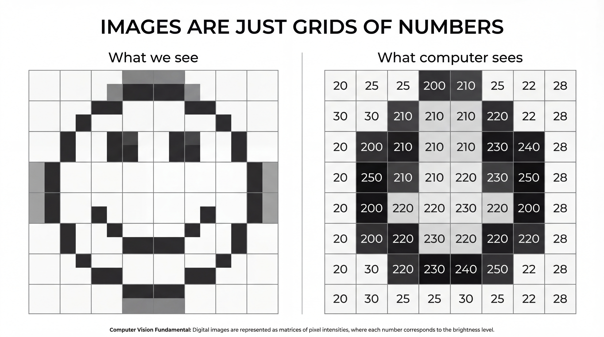

**Same image, different perspectives:**

| We see | Computer sees |
|--------|---------------|
| A picture | Numbers |
| Shapes, objects | 0 to 255 values |
| Meaning | Just math |

<div class="insight">
Every photo on your phone is millions of numbers!
</div>

---

# Grayscale Images

**Each pixel = one number (0-255)**

| Value | Meaning |
|-------|---------|
| 0 | Black |
| 128 | Gray |
| 255 | White |

```python
import numpy as np
from PIL import Image

img = Image.open('digit.png').convert('L')  # Grayscale
pixels = np.array(img)
print(pixels.shape)  # (28, 28)
print(pixels[14, 14])  # Value at center pixel
```

---

# Color Images (RGB)

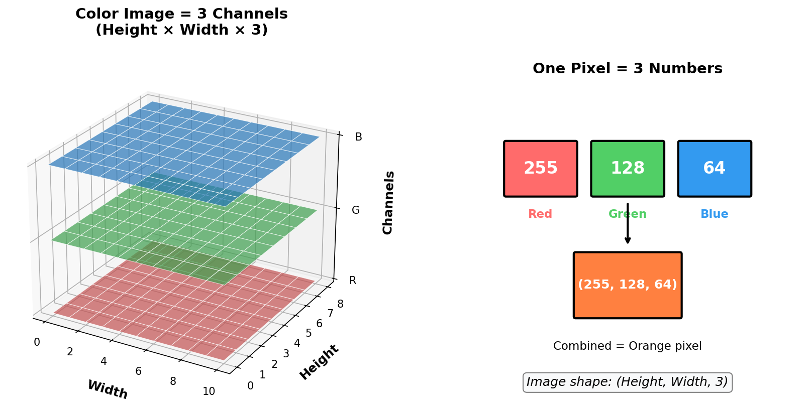

**Each pixel = 3 numbers (Red, Green, Blue)**

| Color | RGB Values |
|-------|------------|
| Red | (255, 0, 0) |
| Green | (0, 255, 0) |
| Blue | (0, 0, 255) |
| White | (255, 255, 255) |

```python
pixels = np.array(img)
print(pixels.shape)  # (224, 224, 3)
#                      Height × Width × RGB
```

---

# MNIST: The "Hello World" of Vision

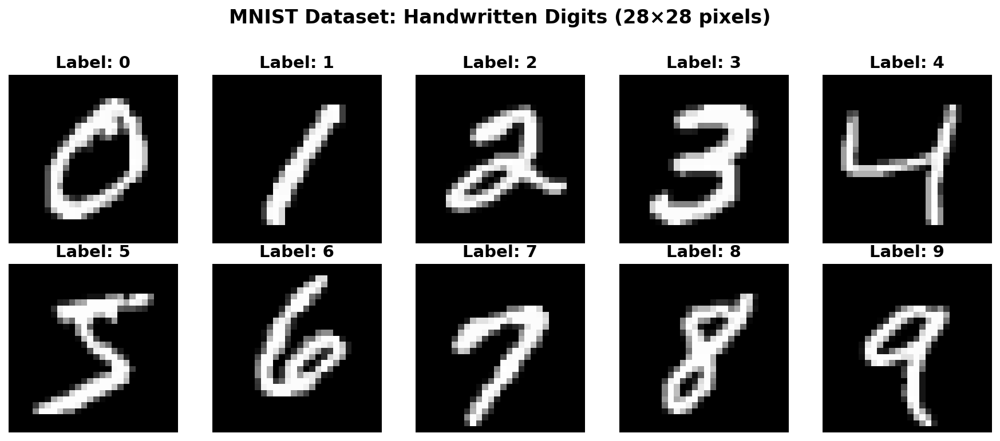

**Handwritten digits:** 28×28 grayscale

- Each image is a single digit (0-9)
- Just 784 numbers per image
- Task: Classify which digit it is

**This is what your phone keyboard uses for handwriting!**

---

# MNIST: What the Computer Sees

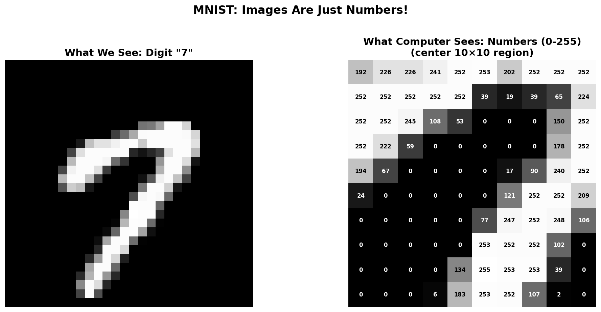

**Same image, two views:**

| Human | Computer |
|-------|----------|
| "It's a 7!" | 784 numbers |
| Instant recognition | Needs ML to learn |

Each pixel is a number from 0 (black) to 255 (white).

---

# The Challenge

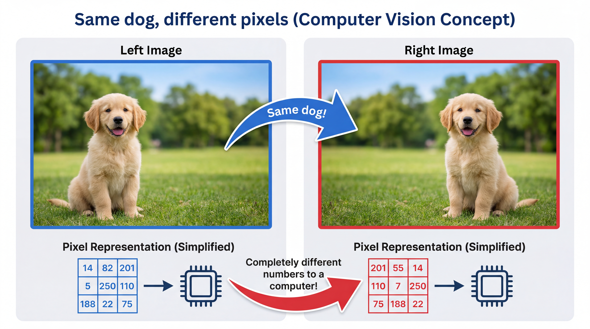

**Same dog, different positions:**

| Position | Pixel Values |
|----------|--------------|
| Dog on left | [14, 82, 201, ...] |
| Dog on right | [201, 55, 14, ...] |

**To a human:** Same dog!
**To a computer:** Completely different!

<div class="insight">
We need neural networks that understand "dog" regardless of position.
</div>

---

# MNIST: Real Examples

**What the computer actually sees:**

| Digit | Human View | Computer View |
|-------|------------|---------------|
| "3" | The number 3 | 784 numbers (0-255) |
| "7" | The number 7 | Different 784 numbers |

```python
# Loading real MNIST data
from torchvision import datasets
mnist = datasets.MNIST('./data', download=True)
image, label = mnist[0]
print(image.size)  # (28, 28)
print(label)       # 5 (it's a digit 5!)
```

---

# Why is Vision Hard?

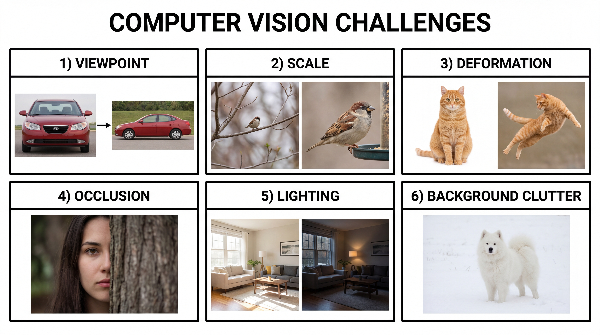

| Challenge | Example |
|-----------|---------|
| **Viewpoint** | Front vs side |
| **Scale** | Tiny vs huge |
| **Deformation** | Sitting vs jumping |
| **Occlusion** | Partially hidden |
| **Lighting** | Bright vs dark |
| **Background** | Camouflage |

**A good vision system must handle ALL of these!**

---

<!-- _class: section-divider -->

# Part 2: CNNs

## Neural Networks for Images

---

# Why Not Fully Connected Networks?

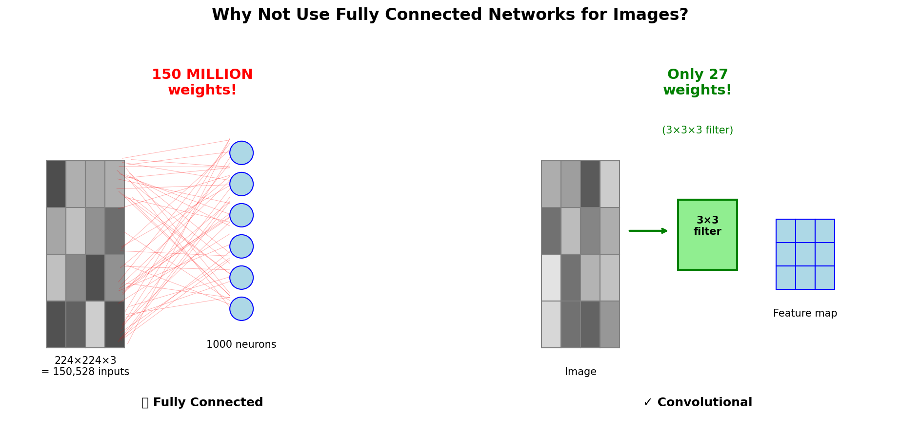

**Problem 1: Too many parameters**

| Network | Parameters |
|---------|------------|
| Fully Connected | 150 MILLION |
| CNN (3×3 filter) | Just 27! |

**Problem 2: No spatial understanding**
- FC treats every pixel independently
- CNN looks at neighboring pixels together

---

# The Key Idea: Look at Small Regions


**Instead of looking at entire image at once...**

Look at **small patches** and find patterns!

A small filter (like a 3x3 edge detector) slides across the entire image, detecting patterns everywhere.

**Same edge detector works EVERYWHERE in the image!**

---

# Filters (Kernels)


A **filter** is a small grid of numbers that detects a pattern:

| Filter Type | What It Detects |
|-------------|-----------------|
| Edge filter | Boundaries between regions |
| Corner filter | Sharp corners |
| Texture filter | Repeating patterns |

**The network LEARNS which filters are useful!**

---

# Convolution: Step by Step

**How a 3×3 filter slides across an image:**

```
Image (5×5):          Filter (3×3):        Output:
[1 2 3 4 5]           [1 0 -1]
[1 2 3 4 5]     *     [1 0 -1]      =     [? ? ?]
[1 2 3 4 5]           [1 0 -1]            [? ? ?]
[1 2 3 4 5]                               [? ? ?]
[1 2 3 4 5]
```

1. Place filter at top-left
2. Multiply element-wise, sum up → one output number
3. Slide right, repeat
4. Slide down, repeat

---

# Convolution Example

**Detecting vertical edges:**

```
Input patch:     Filter:         Calculation:
[10 10 100]     [1  0 -1]       10×1 + 10×0 + 100×(-1) +
[10 10 100]  ×  [1  0 -1]   =   10×1 + 10×0 + 100×(-1) +
[10 10 100]     [1  0 -1]       10×1 + 10×0 + 100×(-1)

                            =   30 - 300 = -270 (strong edge!)
```

**High output = strong edge detected at this location!**

---

# Why Does This Filter Detect Edges?

**Look at what the filter does:**

| Left Column | Middle | Right Column |
|-------------|--------|--------------|
| +1 (add it) | 0 (ignore) | -1 (subtract it) |

**If left = right:** Sum ≈ 0 (no edge)
**If left ≠ right:** Sum is large (EDGE!)

**Example:**
- Uniform region [100, 100, 100]: +100 - 100 = 0
- Edge region [10, 10, 200]: +10 - 200 = -190 (strong!)

<div class="insight">

The filter computes: "Is left different from right?"

</div>

---

# Vertical vs Horizontal Filters

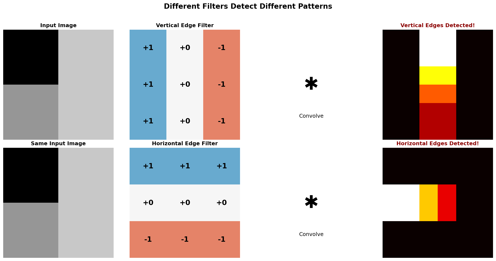

**Same image, different filters → different edges detected!**

---

# Edge Detection in Action

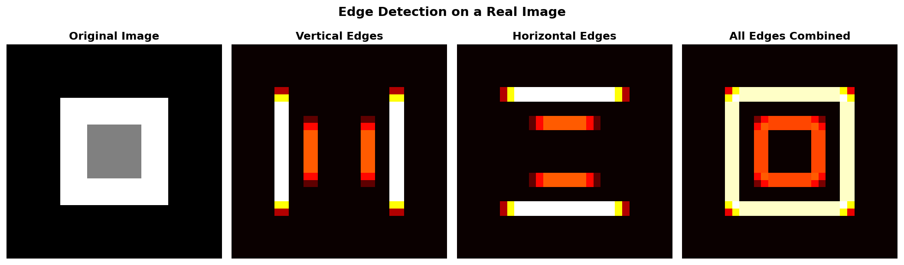

**Combining filters reveals all edges in an image!**

---

# Multiple Filters, Multiple Features

| Input | Filters | Output |
|-------|---------|--------|
| 1 image | 32 different filters | 32 feature maps |

**Each filter detects something different:**
- Filter 1: Vertical edges
- Filter 2: Horizontal edges
- Filter 3: Diagonal edges
- Filter 4: Corners
- ... and so on

**The network learns what filters are useful for the task!**

---

# Channels: From Grayscale to Color

| Input Type | Channels | Filter Shape |
|------------|----------|--------------|
| Grayscale | 1 | 3×3×1 |
| Color (RGB) | 3 | 3×3×3 |
| After Conv1 (32 filters) | 32 | 3×3×32 |

**Each channel gets its own filter weights, then sum them up!**

---

# CNN: The Big Picture

**Convolutional Neural Network:**

```
Image → [Conv → ReLU → Pool] → [Conv → ReLU → Pool] → FC → Output
         ↓                       ↓                      ↓
      Detect               Detect complex          Classify
      edges                patterns (ears, eyes)
```

| Layer | What It Does |
|-------|--------------|
| Conv | Apply filters to detect patterns |
| ReLU | Add non-linearity (like before!) |
| Pool | Shrink the image (keep important info) |
| FC | Final classification (like before!) |

---

# Pooling: Shrinking the Image

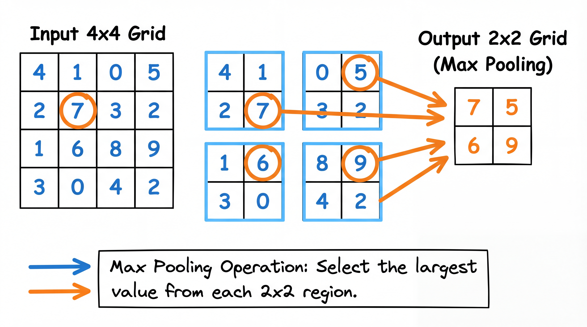

**Max Pooling:** Take the maximum value from each region

| Why Pool? | Benefit |
|-----------|---------|
| Reduces size | Fewer parameters, faster |
| Translation invariance | Small shifts don't matter |
| Keeps important features | Max = strongest signal |

---

# Pooling: The Intuition

**Think of it like summarizing:**

| Full Description | Pooled Summary |
|------------------|----------------|
| "There's a strong edge at pixel (10,20), a medium edge at (10,21), a weak edge at (11,20)" | "There's an edge around (10,20)" |

**Why max pooling specifically?**
- If ANY pixel detected a feature strongly → keep it!
- Exact location doesn't matter, presence does
- Cat moved 2 pixels left? Same features detected!

<div class="insight">

Pooling says: "I don't care WHERE exactly, just WHETHER!"

</div>

---

# Stride and Padding

**Two important concepts:**

| Concept | What It Does | Example |
|---------|--------------|---------|
| **Stride** | How far filter moves each step | Stride 2 = skip every other position |
| **Padding** | Add zeros around edges | Keeps output size = input size |

```
Stride 1: Filter moves 1 pixel → larger output
Stride 2: Filter moves 2 pixels → smaller output (half size)
```

---

# Receptive Field

**Each neuron in later layers "sees" a larger part of the image:**

| Layer | Receptive Field |
|-------|-----------------|
| Conv1 (3×3) | 3×3 pixels |
| Conv2 (3×3) | 5×5 pixels |
| Conv3 (3×3) | 7×7 pixels |
| Deeper... | Larger and larger |

**Deep layers see the whole image!** This is how CNNs understand global context.

---

# A Simple CNN in PyTorch

```python
import torch.nn as nn

class SimpleCNN(nn.Module):
    def __init__(self):
        super().__init__()
        # Convolutional layers
        self.conv1 = nn.Conv2d(1, 32, kernel_size=3)
        self.conv2 = nn.Conv2d(32, 64, kernel_size=3)
        self.pool = nn.MaxPool2d(2)

        # Classification layer
        self.fc = nn.Linear(64 * 5 * 5, 10)

    def forward(self, x):
        x = self.pool(F.relu(self.conv1(x)))
        x = self.pool(F.relu(self.conv2(x)))
        x = x.view(-1, 64 * 5 * 5)  # Flatten
        return self.fc(x)
```

---

# Why CNNs Work So Well

| Feature | Why It Helps |
|---------|--------------|
| **Weight sharing** | Same filter applied everywhere = fewer parameters |
| **Local patterns** | Detect edges, corners, textures locally |
| **Hierarchy** | Early layers → edges; Later layers → complex shapes |
| **Position invariance** | Cat on left ≈ Cat on right |

---

# The Feature Hierarchy


**Why CNNs work:** Each layer builds on the previous one!

- **Layer 1:** Edges, lines (simple)
- **Layer 2:** Corners, textures (combinations)
- **Layer 3:** Parts like eyes, ears (meaningful)
- **Layer 4+:** Full objects and concepts (abstract)

<div class="insight">

**Key insight:** Deeper = more abstract. Early layers (edges) are shared across ALL object types!

</div>

---

# What Does the CNN "See"?

**Imagine you're the network looking at a cat photo:**

| Layer | What Activates | Analogy |
|-------|---------------|---------|
| Layer 1 | "There's a sharp edge here!" | Seeing brush strokes |
| Layer 2 | "This looks like fur texture!" | Seeing patterns |
| Layer 3 | "This could be an ear shape!" | Seeing parts |
| Layer 4 | "This has cat-like features!" | Understanding |
| Output | "95% confident: CAT" | Decision |

**The network builds up understanding layer by layer!**

---

# Famous CNN Moment: ImageNet 2012

```
Before CNNs (hand-crafted features): 25.8% error
AlexNet (deep CNN):                  16.4% error  ← HUGE jump!
Human performance:                   ~5% error
```

**This started the deep learning revolution!**

---

# ImageNet: The Game Changer

| Property | Value |
|----------|-------|
| Images | 14 million+ |
| Classes | 1,000 categories |
| Examples | Dog breeds, cars, foods, objects |
| Challenge | Annual competition (2010-2017) |

**Why it mattered:**
- Large enough to train deep networks
- Diverse enough to test generalization
- Competition drove rapid progress!

---

# The ImageNet Journey

| Year | Model | Error Rate | Key Innovation |
|------|-------|------------|----------------|
| 2011 | Hand-crafted | 25.8% | SIFT, HOG features |
| 2012 | **AlexNet** | 16.4% | Deep CNNs, GPU training |
| 2014 | VGG | 7.3% | Deeper (19 layers) |
| 2015 | **ResNet** | 3.6% | Skip connections (152 layers!) |
| 2017 | SENet | 2.3% | Attention mechanisms |

**2015: ResNet beat human-level performance!**

---

# Famous CNN Architectures

| Year | Architecture | Key Innovation |
|------|--------------|----------------|
| 2012 | **AlexNet** | Deep CNNs work! GPU training |
| 2014 | **VGGNet** | Deeper = better (16-19 layers) |
| 2015 | **ResNet** | Skip connections (152 layers!) |
| 2017 | **EfficientNet** | Smart scaling |
| 2020 | **ViT** | Transformers for vision |

**Trend:** Deeper networks with clever tricks to train them!

---

# Data Augmentation


**Problem:** Not enough training images?

**Solution:** Create variations of existing images!

| Augmentation | Effect |
|--------------|--------|
| Flip | Mirror horizontally |
| Rotate | Small angle rotations |
| Crop | Random crops |
| Color | Brightness, contrast |

---

# Data Augmentation in PyTorch

```python
from torchvision import transforms

train_transform = transforms.Compose([
    transforms.RandomHorizontalFlip(),
    transforms.RandomRotation(10),
    transforms.ColorJitter(brightness=0.2),
    transforms.RandomResizedCrop(224),
    transforms.ToTensor(),
])

# Apply during training
train_dataset = ImageFolder('train/', transform=train_transform)
```

**Result:** 1000 images become effectively 10,000+!

---

# Transfer Learning


**The big insight:** CNNs trained on ImageNet learn general features!

| Layer | What It Learned | Reusable? |
|-------|-----------------|-----------|
| Early | Edges, textures | Yes! (universal) |
| Middle | Shapes, parts | Mostly yes |
| Late | Specific objects | Needs fine-tuning |

---

# Transfer Learning in Practice

```python
from torchvision import models

# Load pre-trained ResNet
model = models.resnet18(pretrained=True)

# Freeze early layers (don't train them)
for param in model.parameters():
    param.requires_grad = False

# Replace final layer for our task (e.g., 10 classes)
model.fc = nn.Linear(512, 10)

# Now train only the new layer!
```

**Result:** Train on 1000 images instead of millions!

---

# When to Use Transfer Learning?

| Your Dataset | Strategy |
|--------------|----------|
| Small (< 1000) | Freeze all, train only final layer |
| Medium (1000-10K) | Freeze early, fine-tune later layers |
| Large (> 10K) | Fine-tune everything (or train from scratch) |

<div class="insight">

**Transfer learning is almost always better than training from scratch!**

</div>

---

# Transfer Learning: The School Analogy

**Instead of teaching a child from scratch:**

| From Scratch | Transfer Learning |
|--------------|-------------------|
| Teach what "edge" means | Already knows edges! |
| Teach what "shapes" are | Already knows shapes! |
| Teach to recognize cats | Just teach this part! |

**ImageNet pre-training gives you:**
- 10+ years of "visual education"
- Knowledge of edges, textures, shapes
- Just add your specific knowledge on top!

**This is why models fine-tuned on 100 images beat models trained from scratch on 1000!**

---

<!-- _class: section-divider -->

# Part 3: Object Detection

## Building Up Step by Step

---

# Let's Build Up Gradually

**We'll go step by step:**

| Step | Task | Output |
|------|------|--------|
| 1 | Classification | "This is a cat" |
| 2 | Localization | "Cat is HERE" (one box) |
| 3 | Detection | "Cat HERE, dog THERE" (multiple boxes) |

**Each step adds complexity. Let's master each one!**

---

# Step 1: Classification (Review)

**What the neural network outputs:**

```
Image → CNN → FC → Softmax → [0.9, 0.05, 0.05]
                              cat   dog   bird
```

| Output | Meaning |
|--------|---------|
| 1 number per class | Probability of each class |
| Sum = 1.0 | Probabilities add up |

**Loss:** Cross-entropy (how wrong is the class prediction?)

---

# Step 2: Localization - Add 4 Numbers!

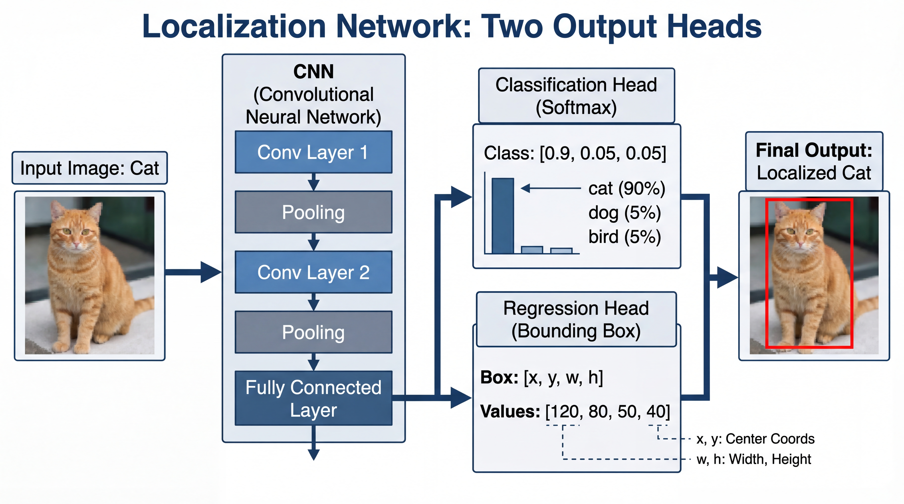

**New idea:** Predict class AND location!

**Network outputs TWO things:**

| Output | Size | Meaning |
|--------|------|---------|
| Class probs | C numbers | What is it? |
| Bounding box | 4 numbers | Where is it? |

**Same CNN backbone, two output heads!**

---

# What Do the 4 Numbers Mean?

**Bounding box = 4 numbers:**

| Number | Meaning | Example |
|--------|---------|---------|
| **x** | Center x-coordinate | 120 pixels from left |
| **y** | Center y-coordinate | 80 pixels from top |
| **w** | Width of box | 50 pixels wide |
| **h** | Height of box | 40 pixels tall |

**Two common formats:**

| Format | Values | Used By |
|--------|--------|---------|
| Center | (x, y, w, h) | YOLO |
| Corner | (x1, y1, x2, y2) | COCO, VOC |

---

# Localization: Two Losses!

**We need to train BOTH outputs:**

$$\mathcal{L}_{\text{total}} = \mathcal{L}_{\text{class}} + \lambda \cdot \mathcal{L}_{\text{box}}$$

| Loss | What It Measures | Type |
|------|------------------|------|
| $\mathcal{L}_{\text{class}}$ | Wrong class? | Cross-entropy |
| $\mathcal{L}_{\text{box}}$ | Wrong position? | MSE (L2 loss) |

**$\lambda$** balances the two losses (usually 1-10).

---

# Box Loss: How Far Off?

**Mean Squared Error on coordinates:**

$$\mathcal{L}_{\text{box}} = (x - \hat{x})^2 + (y - \hat{y})^2 + (w - \hat{w})^2 + (h - \hat{h})^2$$

| True | Predicted | Error |
|------|-----------|-------|
| x=100 | x̂=105 | $(100-105)^2 = 25$ |
| y=80 | ŷ=75 | $(80-75)^2 = 25$ |
| w=60 | ŵ=55 | $(60-55)^2 = 25$ |
| h=40 | ĥ=45 | $(40-45)^2 = 25$ |

**Total box loss:** $25 + 25 + 25 + 25 = 100$

---

# Localization in PyTorch

```python
class LocalizationNet(nn.Module):
    def __init__(self):
        super().__init__()
        self.cnn = ...  # CNN backbone
        self.fc_class = nn.Linear(512, 3)   # 3 classes
        self.fc_box = nn.Linear(512, 4)     # 4 box coords

    def forward(self, x):
        features = self.cnn(x)
        class_out = self.fc_class(features)  # [batch, 3]
        box_out = self.fc_box(features)      # [batch, 4]
        return class_out, box_out

# Two losses!
class_loss = F.cross_entropy(class_pred, class_true)
box_loss = F.mse_loss(box_pred, box_true)
total_loss = class_loss + 5 * box_loss
```

---

# Measuring Box Quality: IoU

**How do we know if a predicted box is good?**

**IoU = Intersection over Union**

$$\text{IoU} = \frac{\text{Area of Overlap}}{\text{Area of Union}}$$

| IoU Value | Meaning |
|-----------|---------|
| 1.0 | Perfect match! |
| 0.7 | Good overlap |
| 0.5 | Acceptable (threshold) |
| 0.0 | No overlap at all |

**IoU is used everywhere:** loss functions, evaluation, NMS

---

# The Challenge: Multiple Objects!

**Localization works great for ONE object.**

**But what if there are 3 cats and 2 dogs?**

```
Image with 5 objects → Neural Network → ???
```

| Problem | Why It's Hard |
|---------|---------------|
| Variable output size | 1 image might have 2 objects, another has 10 |
| Different classes | Mix of cats, dogs, cars... |
| Overlapping objects | Objects can be on top of each other |

**Neural networks want FIXED output size!**

---

# Naive Approach: Sliding Window

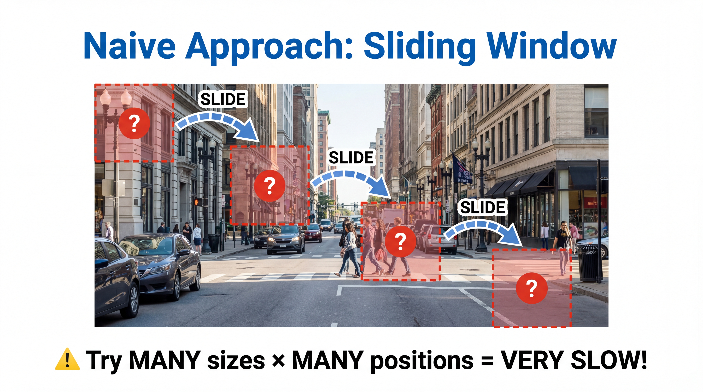

**Idea:** Slide a window, classify each patch.

**Problems:**

| Issue | Why It's Bad |
|-------|--------------|
| Many sizes | Small cat? Big cat? Try all! |
| Many positions | Thousands of patches |
| Slow | Classify each one separately |

**Result:** ~50 seconds per image! Way too slow.

---

# We Need a Smarter Approach!

**What we want:**
- Fixed output size (neural nets like this!)
- Find ALL objects in ONE forward pass
- Fast enough for real-time (30+ FPS)

**The insight:**

> Instead of sliding a window...
> **Divide the image into a grid!**

---

<!-- _class: section-divider -->

# Part 4: YOLO

## You Only Look Once

---

# YOLO's Big Idea

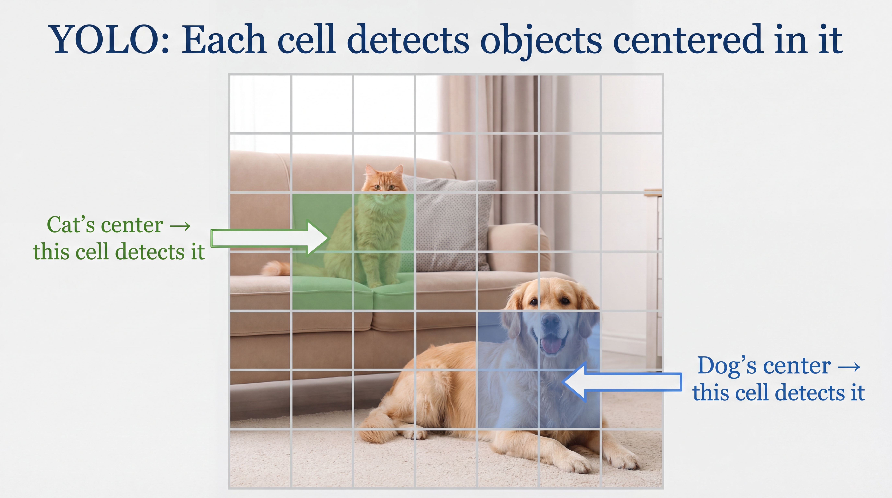

**Divide image into S × S grid (e.g., 7×7)**

| Concept | Meaning |
|---------|---------|
| Grid | 49 cells covering image |
| Responsibility | Each cell detects objects whose CENTER is in it |
| Output | Each cell predicts boxes + classes |

**Rule:** If object's center is in a cell, that cell predicts it!

---

# Why Grid? The Clever Insight

**Think of it like assigning responsibility:**

| Without Grid | With Grid |
|--------------|-----------|
| "Find all objects... somehow" | "Cell (3,4), is there something in you?" |
| Variable-length output (hard!) | Fixed 7×7 output (easy!) |
| Complex architecture | Simple regression |

**Each cell answers TWO questions:**
1. "Is there an object centered in me?"
2. "If yes, what class and where exactly?"

<div class="insight">

Grid converts variable detection into fixed-size prediction!

</div>

---

# What Does Each Cell Predict?

**For EACH cell, predict:**

| Output | Size | Meaning |
|--------|------|---------|
| **x, y** | 2 | Box center (relative to cell) |
| **w, h** | 2 | Box width & height (relative to image) |
| **confidence** | 1 | P(object) × IoU |
| **class probs** | C | P(class | object) for each class |

**Per cell:** $5 + C$ numbers

**Example:** 20 classes → each cell outputs 25 numbers

---

# Understanding Confidence Score

**Confidence = "Is there an object here, and how good is my box?"**

$$\text{Confidence} = P(\text{object}) \times \text{IoU}_{\text{pred}}^{\text{truth}}$$

| Scenario | P(object) | IoU | Confidence |
|----------|-----------|-----|------------|
| No object in cell | 0 | - | 0 |
| Object, perfect box | 1 | 1.0 | 1.0 |
| Object, okay box | 1 | 0.7 | 0.7 |
| Object, bad box | 1 | 0.3 | 0.3 |

**High confidence = "I'm sure there's an object AND my box is accurate"**

---

# Multiple Boxes Per Cell

**What if two objects have centers in the same cell?**

**Solution:** Each cell predicts B boxes (usually B=2)

| Per Cell Output | Count |
|-----------------|-------|
| Box 1: (x, y, w, h, conf) | 5 numbers |
| Box 2: (x, y, w, h, conf) | 5 numbers |
| Class probs: P(cat), P(dog), ... | C numbers |
| **Total** | **B×5 + C** |

**Example:** B=2 boxes, C=20 classes → 30 numbers per cell

---

# The Full YOLO Output

**For an S × S grid with B boxes and C classes:**

```
Output shape: S × S × (B × 5 + C)
```

**Example: S=7, B=2, C=20**

| Dimension | Value | Meaning |
|-----------|-------|---------|
| 7 × 7 | 49 cells | Grid covering image |
| × 30 | 30 numbers/cell | 2 boxes + 20 classes |
| **Total** | **1470 numbers** | Full detection output! |

**ONE forward pass → 1470 predictions!**

---

# YOLO Predicts EVERYTHING at Once

**The full YOLO pipeline:**

| Stage | Input | Output |
|-------|-------|--------|
| Image | 448×448×3 | Raw pixels |
| CNN | Pixels | Features |
| FC/Conv | Features | 7×7×30 tensor |

**Output tensor:** 7×7 grid × 30 numbers per cell = **1470 predictions**

**Key insight:** Detection as a single regression problem!
One forward pass → all boxes + classes + confidences

---

# YOLO Loss Function (3 Parts!)

**Total loss = Box loss + Confidence loss + Class loss**

$$\mathcal{L} = \lambda_{\text{coord}} \mathcal{L}_{\text{box}} + \mathcal{L}_{\text{conf}} + \mathcal{L}_{\text{class}}$$

| Loss | What It Penalizes |
|------|-------------------|
| $\mathcal{L}_{\text{box}}$ | Wrong box coordinates (x, y, w, h) |
| $\mathcal{L}_{\text{conf}}$ | Wrong confidence scores |
| $\mathcal{L}_{\text{class}}$ | Wrong class predictions |

---

# Box Loss in Detail

**Only for cells that HAVE an object:**

$$\mathcal{L}_{\text{box}} = \sum_{i=0}^{S^2} \sum_{j=0}^{B} \mathbb{1}_{ij}^{\text{obj}} \left[ (x_i - \hat{x}_i)^2 + (y_i - \hat{y}_i)^2 \right]$$
$$+ \sum_{i=0}^{S^2} \sum_{j=0}^{B} \mathbb{1}_{ij}^{\text{obj}} \left[ (\sqrt{w_i} - \sqrt{\hat{w}_i})^2 + (\sqrt{h_i} - \sqrt{\hat{h}_i})^2 \right]$$

**Why $\sqrt{w}$ and $\sqrt{h}$?**
- Small boxes: 2 pixel error is big deal!
- Large boxes: 2 pixel error doesn't matter much
- Square root makes errors more equal across sizes

---

# Confidence Loss

**Two cases:**

$$\mathcal{L}_{\text{conf}} = \sum_{i=0}^{S^2} \sum_{j=0}^{B} \mathbb{1}_{ij}^{\text{obj}} (C_i - \hat{C}_i)^2$$
$$+ \lambda_{\text{noobj}} \sum_{i=0}^{S^2} \sum_{j=0}^{B} \mathbb{1}_{ij}^{\text{noobj}} (C_i - \hat{C}_i)^2$$

| Case | What We Want |
|------|--------------|
| Object present | Confidence → high (close to IoU) |
| No object | Confidence → 0 |

**$\lambda_{\text{noobj}} = 0.5$** — don't penalize empty cells too much!

---

# Class Loss

**Only for cells WITH an object:**

$$\mathcal{L}_{\text{class}} = \sum_{i=0}^{S^2} \mathbb{1}_{i}^{\text{obj}} \sum_{c \in \text{classes}} (p_i(c) - \hat{p}_i(c))^2$$

**Simple squared error on class probabilities.**

If cell has a dog:
- Want: P(dog) = 1, P(cat) = 0, P(car) = 0
- Penalize deviation from this

---

# Putting It All Together

**YOLO Training Summary:**

```
For each training image:
1. Divide into 7×7 grid
2. For each object, assign to cell containing its center
3. Forward pass → get 7×7×30 predictions
4. Compute all three losses
5. Backpropagate and update weights
```

**At test time:**
1. Forward pass (one!)
2. Get 7×7×30 = 1470 numbers
3. Filter low-confidence boxes
4. Non-max suppression to remove duplicates

---

# Why YOLO is Fast

| Method | Approach | Speed |
|--------|----------|-------|
| R-CNN | 2000 region proposals, classify each | ~50 sec |
| Fast R-CNN | Share CNN features | ~2 sec |
| **YOLO** | **One forward pass, predict all** | **~0.02 sec** |

**YOLO processes 45 frames per second!**

```
Traditional: Image → Find regions → Classify each → Slow
YOLO:        Image → CNN → All detections at once → Fast!
```

---

# Anchor Boxes (Brief Intuition)

**Problem:** Different objects have different shapes!

| Object | Typical Shape |
|--------|---------------|
| Person | Tall and thin |
| Car | Wide and short |
| Dog | Medium, horizontal |

**Solution:** Pre-define "anchor boxes" of different shapes
- YOLO uses anchor boxes to predict adjustments
- Easier to predict "adjust anchor by 10%" than "raw box from scratch"

---

# Non-Maximum Suppression (NMS)

**Problem:** Multiple cells may detect the same object!

```
Before NMS:        After NMS:
[Dog: 0.9]         [Dog: 0.9]  ← Keep highest
[Dog: 0.8]         (removed)
[Dog: 0.7]         (removed)
```

**Algorithm:**
1. Keep the detection with highest confidence
2. Remove all overlapping boxes (IoU > 0.5)
3. Repeat for remaining detections

**Result:** One clean box per object!

---

# NMS Intuition: Voting with Cleanup

**Think of it like election results:**

| Without NMS | With NMS |
|-------------|----------|
| 3 people claim they found the dog | Best one wins |
| Overlapping claims | Remove duplicates |
| Messy output | Clean output |

**Why do duplicates happen?**
- Object spans multiple grid cells
- Each cell predicts its own box
- All point to roughly the same location

**NMS = "Only the best detection survives!"**

---

# Using YOLO in Practice

```python
from ultralytics import YOLO

# Load pre-trained model
model = YOLO('yolov8n.pt')

# Detect objects in an image
results = model('photo.jpg')

# Print detections
for result in results:
    for box in result.boxes:
        x1, y1, x2, y2 = box.xyxy[0].tolist()
        confidence = box.conf[0].item()
        class_id = int(box.cls[0].item())
        print(f"Found object at ({x1:.0f}, {y1:.0f}) to ({x2:.0f}, {y2:.0f})")
```

---

# YOLO Model Sizes

| Model | Speed | Accuracy | Best For |
|-------|-------|----------|----------|
| YOLOv8n | Fastest | Lower | Mobile phones |
| YOLOv8s | Fast | Medium | General use |
| YOLOv8m | Medium | Good | Better accuracy |
| YOLOv8x | Slowest | Best | Maximum accuracy |

**"n" = nano (smallest), "x" = extra-large**

---

# YOLO Versions: A Quick History

| Version | Year | Key Innovation |
|---------|------|----------------|
| YOLOv1 | 2016 | One-stage detection |
| YOLOv2 | 2016 | Batch norm, anchor boxes |
| YOLOv3 | 2018 | Multi-scale predictions |
| YOLOv4 | 2020 | Bag of tricks |
| YOLOv5 | 2020 | PyTorch, easy to use |
| **YOLOv8** | 2023 | State-of-the-art, anchor-free |

**Use YOLOv8** — it's the most modern and easy to use!

---

# One-Stage vs Two-Stage Detectors

| Type | How It Works | Example |
|------|--------------|---------|
| **Two-stage** | 1) Find regions, 2) Classify | R-CNN, Faster R-CNN |
| **One-stage** | Predict everything at once | YOLO, SSD |

| | Two-Stage | One-Stage |
|---|---|---|
| **Speed** | Slower | Faster |
| **Accuracy** | Slightly better | Good enough |
| **Use case** | When accuracy critical | Real-time |

---

# Speed vs Accuracy Trade-off

**Why does this matter?**

| Application | Needs | Model Choice |
|-------------|-------|--------------|
| Self-driving car | Real-time (30+ FPS) | YOLOv8n or s |
| Medical diagnosis | High accuracy | YOLOv8x |
| Phone app | Low battery usage | YOLOv8n |
| Surveillance | Balance | YOLOv8s or m |

**You choose based on your constraints!**

---

# IoU Calculation: Step by Step

**Ground Truth box:** (30, 30) to (100, 100)
**Predicted box:** (50, 50) to (120, 120)

| Step | Calculation |
|------|-------------|
| **1. Find intersection** | x: max(30,50)=50 to min(100,120)=100 |
| | y: max(30,50)=50 to min(100,120)=100 |
| | Area = 50 × 50 = 2,500 |
| **2. Find union** | GT area = 70×70 = 4,900 |
| | Pred area = 70×70 = 4,900 |
| | Union = 4,900 + 4,900 - 2,500 = 7,300 |
| **3. IoU** | 2,500 / 7,300 = **0.34** |

**IoU = 0.34 → Not a good match (need > 0.5)**

---

# Real-World Detection

| Application | What YOLO Detects |
|-------------|-------------------|
| Self-driving cars | People, cars, traffic signs |
| Retail stores | Customers, products |
| Sports analysis | Players, ball |
| Security cameras | People, vehicles |
| Medical imaging | Tumors, lesions |

---

# Detection Challenges

| Challenge | Why It's Hard |
|-----------|---------------|
| **Small objects** | Few pixels, hard to see |
| **Crowded scenes** | Objects overlap |
| **Unusual angles** | Different from training data |
| **Real-time speed** | Must process 30+ FPS |
| **Class imbalance** | Rare objects (e.g., fire) |

**Modern detectors (YOLO v8) handle most of these well!**

---

# COCO Dataset: The Benchmark

**Common Objects in Context (COCO):**

| Property | Value |
|----------|-------|
| Images | 330,000+ |
| Object instances | 2.5 million |
| Classes | 80 (person, car, dog, pizza, ...) |
| Annotations | Bounding boxes + segmentation |

**If your model works well on COCO, it probably works in the real world!**

---

# From Detection to Segmentation

| Task | Output | Use Case |
|------|--------|----------|
| **Classification** | One label | "Is this a cat?" |
| **Detection** | Boxes + labels | "Where are all cats?" |
| **Segmentation** | Pixel-level masks | "Exact shape of each cat" |

**Segmentation** = Detection's precise cousin
- Self-driving needs to know exact road boundaries
- Medical imaging needs exact tumor boundaries

---

# Training Your Own Detector

**Steps to train YOLO on your data:**

```python
# 1. Collect and label images (use tools like Roboflow)
# 2. Export in YOLO format

# 3. Train
from ultralytics import YOLO
model = YOLO('yolov8n.pt')  # Start from pre-trained
model.train(data='my_data.yaml', epochs=50)

# 4. Use it!
results = model('new_image.jpg')
```

**Transfer learning:** Start from pre-trained weights, fine-tune on your data!

---

# Summary: The Vision Pipeline

| Step | What Happens |
|------|--------------|
| 1. Image | Grid of pixels (numbers) |
| 2. CNN | Extract features (edges → shapes → objects) |
| 3. Detection | Predict box coordinates + class |
| 4. Output | List of (box, class, confidence) |

---

# Key Takeaways

1. **Images are grids of numbers** (pixels)

2. **CNNs** use filters to detect patterns
   - Same filter works everywhere (weight sharing)
   - Build hierarchy: edges → shapes → objects

3. **Object Detection = Classification + Location**
   - Predict 4 coordinates for each box
   - IoU measures overlap quality

4. **YOLO** enables real-time detection
   - One forward pass for entire image
   - Fast enough for self-driving cars!

---

# What We Skipped (Advanced Topics)

| Topic | What It Is |
|-------|------------|
| Convolution math | Detailed filter operations |
| CNN architectures | ResNet, VGG, EfficientNet |
| Non-Maximum Suppression | Removing duplicate detections |
| Segmentation | Pixel-level object boundaries |
| Pose estimation | Detecting body keypoints |

*You'll learn these in advanced CV courses!*

---

<!-- _class: title-slide -->

# You Now Understand Computer Vision!

## Next: Language Models - How Machines Understand Text

**Key takeaways:**
- Images = grids of pixels
- CNNs detect patterns hierarchically
- Detection = predict box coordinates
- YOLO = real-time detection

**Questions?**
