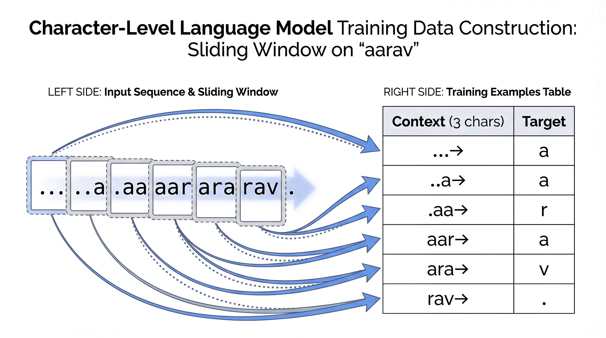
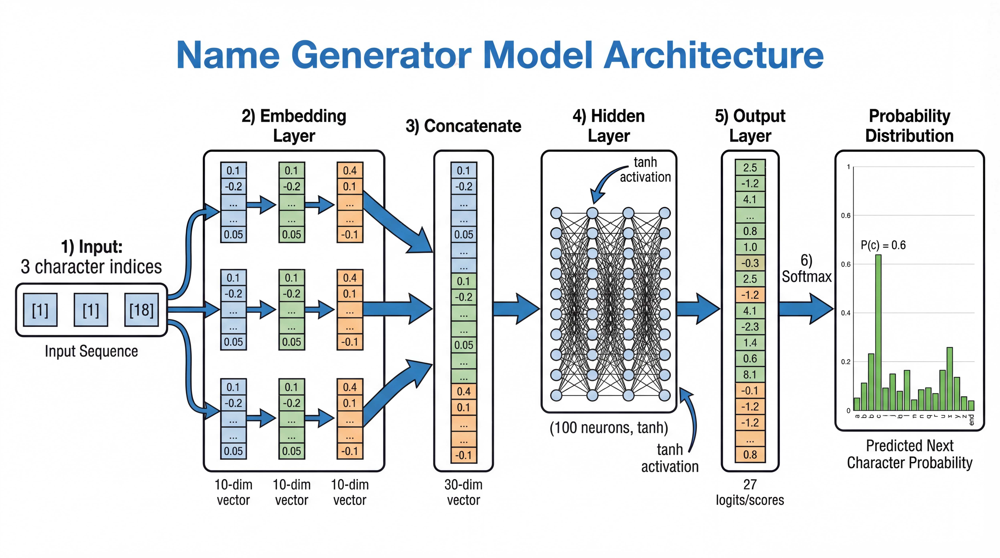
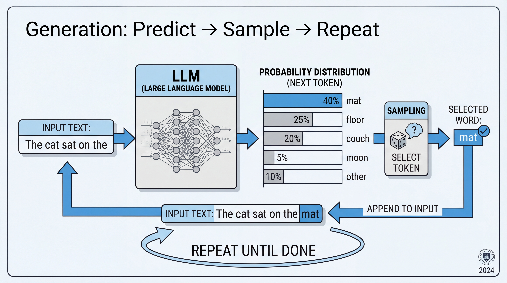
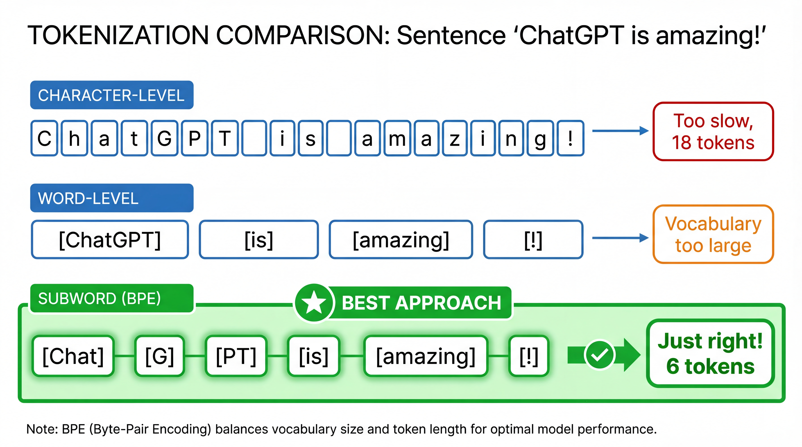

<!-- _class: title-slide -->
<!-- _paginate: false -->

# Language Models
# The Secret Behind ChatGPT

## Learning to Predict the Next Token

**Nipun Batra** | IIT Gandhinagar

---

# The Story So Far

| Lecture | What We Learned |
|---------|-----------------|
| 5 | Neural Networks: Learn from data |
| 6 | CNNs: See images |
| **7** | **LLMs: Generate text** |

**Today:** Build a mini language model from scratch!

---

# The Shocking Truth About ChatGPT

**ChatGPT, Claude, Gemini, LLaMA...**

All these AI systems do ONE thing:

<div class="insight">

**Predict the next word. Then repeat.**

</div>

That's it. That's the whole trick.

---

# You Already Use This!

| App | You Type... | It Predicts... |
|-----|-------------|----------------|
| Phone keyboard | "I'm running" | `late`, `now` |
| Google Search | "how to" | `cook`, `code` |
| Gmail | "Thanks for" | `your help` |

**All next-word prediction!**

---

# Today's Goal

**We'll build a model that generates Indian names!**

| Training Data | Generated Names |
|---------------|-----------------|
| Aarav, Priya, Nipun, Zara | Arya, Neel, Riya, ... |
| Aditya, Kavya, Rohan | Priti, Arav, Kavi, ... |

**Same principle as ChatGPT, just smaller!**

---

<!-- _class: section-divider -->

# Part 1: The Core Idea

## Next Token Prediction

---

# What is Next-Token Prediction?

**The ONE question every language model answers:**

> "Given the text so far, what comes next?"

| Context | Next Token |
|---------|------------|
| "The capital of India is" | "New" |
| "print('Hello" | "World" |
| "nip" | "u" |

---

# Why Prediction = Understanding

**To predict well, you must understand!**

| To Predict... | You Need to Know... |
|---------------|---------------------|
| "Delhi is in ___" | Geography |
| "2 + 2 = ___" | Math |
| "for i in range(___" | Python |

<div class="insight">

Good prediction requires implicit knowledge!

</div>

---

# Our Toy Problem: Name Generation

**Goal:** Generate Indian names character-by-character

**Training data:** A list of names

```
aarav
priya
nipun
kavya
rohan
zara
aditya
```

---

# The Prediction Task

**Given previous characters, predict the next one.**

| Previous | Next |
|----------|------|
| (start) | a |
| a | a |
| aa | r |
| aar | a |
| aara | v |
| aarav | (end) |

**This is ALL we need to learn!**

---

<!-- _class: section-divider -->

# Part 2: Building the Dataset

## From Names to Training Examples

---

# Our Vocabulary

**First, define what characters we can use:**

| Token | ID | Meaning |
|-------|-----|---------|
| `.` | 0 | Start/End marker |
| `a` | 1 | Letter a |
| `b` | 2 | Letter b |
| ... | ... | ... |
| `z` | 26 | Letter z |

**Vocabulary size = 27** (26 letters + 1 special)

---

# Creating Training Examples

**From name "aarav", create (context → target) pairs:**

| Context | Target | Meaning |
|---------|--------|---------|
| `.` | `a` | Start → first letter |
| `a` | `a` | After 'a', predict 'a' |
| `a` | `r` | After 'a', predict 'r' |
| `r` | `a` | After 'r', predict 'a' |
| `a` | `v` | After 'a', predict 'v' |
| `v` | `.` | After 'v', predict END |

---

# Wait, Context is Just 1 Character?

**Problem:** Looking at only the last character isn't enough!

| Context | What We Want |
|---------|--------------|
| Last char: `a` | Could be followed by many things! |
| Last 2: `ra` | More specific |
| Last 3: `ara` | Even better |

**Solution:** Use a window of k previous characters!

---

# Context Window of Size 3



**Each example has 3 chars of context:**

| Context | Target |
|---------|--------|
| `...` | `a` |
| `..a` | `a` |
| `.aa` | `r` |
| `aar` | `a` |
| `ara` | `v` |
| `rav` | `.` |

**Sliding window creates training data!**

---

# Building the Dataset in Python

```python
# Our training names
names = ["aarav", "priya", "nipun", "kavya", "rohan"]

# Create character to index mapping
chars = ['.'] + list('abcdefghijklmnopqrstuvwxyz')
char_to_idx = {c: i for i, c in enumerate(chars)}

# Context window size
context_size = 3

# Build training examples
X, Y = [], []  # X = contexts, Y = targets
for name in names:
    name = '.' * context_size + name + '.'
    for i in range(len(name) - context_size):
        context = name[i:i+context_size]
        target = name[i+context_size]
        X.append([char_to_idx[c] for c in context])
        Y.append(char_to_idx[target])
```

---

# What Does Our Dataset Look Like?

**For name "aarav" with context_size=3:**

| X (context indices) | Y (target index) |
|---------------------|------------------|
| [0, 0, 0] | 1 |
| [0, 0, 1] | 1 |
| [0, 1, 1] | 18 |
| [1, 1, 18] | 1 |
| [1, 18, 1] | 22 |
| [18, 1, 22] | 0 |

**X = input, Y = what we want to predict**

---

<!-- _class: section-divider -->

# Part 3: Embeddings

## From Characters to Vectors

---

# The Problem: Neural Nets Need Numbers

**Neural networks work with continuous numbers, not discrete tokens!**

| Bad Idea | Why It Fails |
|----------|--------------|
| a=1, b=2, c=3 | Implies a is "closer" to b than c |
| One-hot: [1,0,0,...] | 27-dimensional, no relationships |

**Better idea:** Learn a vector for each character!

---

# Character Embeddings

**Give each character a learned vector:**

| Char | Embedding (learned) |
|------|---------------------|
| a | [0.2, -0.5, 0.8, 0.1] |
| b | [0.1, 0.3, -0.2, 0.4] |
| ... | ... |
| z | [-0.3, 0.7, 0.1, -0.5] |

**These vectors are LEARNED during training!**

---

# The Embedding Layer

```python
import torch
import torch.nn as nn

vocab_size = 27      # 26 letters + '.'
embed_dim = 10       # Each char → 10 numbers

# Create embedding layer
embedding = nn.Embedding(vocab_size, embed_dim)

# Look up a character
char_idx = 1  # 'a'
vector = embedding(torch.tensor([char_idx]))
# vector is now a 10-dimensional vector!
```

---

# Why Embeddings Are Powerful

**The embedding layer is a learnable lookup table:**

| Character | → | 10-dim Vector |
|-----------|---|---------------|
| Index 1 (a) | → | Row 1 of weight matrix |
| Index 2 (b) | → | Row 2 of weight matrix |

**During training:**
- Similar characters get similar vectors
- The network learns useful representations

---

# Embeddings Learn Similarity!

**After training, similar characters cluster together:**

| Character Pair | In Names... | Embedding Distance |
|----------------|-------------|-------------------|
| 'a' and 'i' | Both are vowels, common | Close! |
| 'a' and 'z' | Very different usage | Far apart |
| 'k' and 'c' | Often interchangeable | Close! |

**The network discovers:**
- Vowels group together
- Common ending letters cluster
- Rare letters are pushed to the edges

<div class="insight">

Embeddings capture **meaning** that we never explicitly taught!

</div>

---

# Embedding the Context

**Our context is 3 characters. Embed each one!**

```python
context = [1, 1, 18]  # "aar"

# Embed each character
emb1 = embedding(1)   # 10-dim vector for 'a'
emb2 = embedding(1)   # 10-dim vector for 'a'
emb3 = embedding(18)  # 10-dim vector for 'r'

# Concatenate them
context_emb = torch.cat([emb1, emb2, emb3])
# context_emb is now 30-dimensional!
```

---

<!-- _class: section-divider -->

# Part 4: The Model

## From Embeddings to Predictions

---

# Model Architecture



**The full pipeline:**

| Step | Size |
|------|------|
| 1. Embed 3 chars | 3 × 10 = 30 |
| 2. Hidden layer | 100 |
| 3. Output logits | 27 |

**Simple MLP!**

---

# The Model in PyTorch

```python
class NameGenerator(nn.Module):
    def __init__(self, vocab_size=27, embed_dim=10,
                 hidden_dim=100, context_size=3):
        super().__init__()
        self.embedding = nn.Embedding(vocab_size, embed_dim)
        self.fc1 = nn.Linear(context_size * embed_dim, hidden_dim)
        self.fc2 = nn.Linear(hidden_dim, vocab_size)

    def forward(self, x):
        # x: (batch, context_size) - character indices
        emb = self.embedding(x)       # (batch, context, embed_dim)
        emb = emb.view(emb.size(0), -1)  # (batch, context*embed_dim)
        h = torch.tanh(self.fc1(emb))    # (batch, hidden)
        logits = self.fc2(h)              # (batch, vocab_size)
        return logits
```

---

# Understanding the Forward Pass

| Layer | Shape | What Happens |
|-------|-------|--------------|
| Input | (batch, 3) | 3 character indices |
| Embedding | (batch, 3, 10) | Each char → 10-dim vector |
| Flatten | (batch, 30) | Concatenate all embeddings |
| Hidden | (batch, 100) | Learn patterns |
| Output | (batch, 27) | Score for each character |

---

<!-- _class: section-divider -->

# Part 5: Training

## Learning to Predict

---

# The Output: Logits

**The model outputs 27 numbers (one per character):**

```python
logits = model(context)  # Shape: (27,)
# logits = [2.1, 0.5, -1.2, 0.8, ...]
```

**These are NOT probabilities yet!**

| Character | Logit | Meaning |
|-----------|-------|---------|
| a | 2.1 | Highest → most likely |
| b | 0.5 | Medium |
| c | -1.2 | Low → unlikely |

---

# Softmax: Logits → Probabilities

**Convert logits to probabilities:**

$$P(char_i) = \frac{e^{logit_i}}{\sum_j e^{logit_j}}$$

```python
probs = torch.softmax(logits, dim=-1)
# probs = [0.45, 0.12, 0.02, 0.15, ...]
# Now they sum to 1!
```

| Character | Logit | Probability |
|-----------|-------|-------------|
| a | 2.1 | 45% |
| b | 0.5 | 12% |
| c | -1.2 | 2% |

---

# The Loss Function: Cross-Entropy

**How wrong was our prediction?**

$$\mathcal{L} = -\log P(\text{correct character})$$

| True Char | P(true) | Loss |
|-----------|---------|------|
| a | 0.95 | 0.05 (good!) |
| a | 0.50 | 0.69 (okay) |
| a | 0.01 | 4.6 (terrible!) |

**Lower probability for correct answer → higher loss!**

---

# Why Cross-Entropy Works

**Cross-entropy punishes confident wrong predictions:**

| Scenario | Loss |
|----------|------|
| 95% confident, correct | 0.05 |
| 95% confident, WRONG | 3.0 |

**The model learns to be confident only when right!**

---

# Cross-Entropy: Worked Example

**Context "aar" → True next char: 'a' (index 1)**

Model predicts:
```
logits = [0.5, 2.1, 0.3, ...]  # 'a' has score 2.1
probs  = softmax(logits) = [0.12, 0.58, 0.08, ...]
```

**Loss calculation:**
$$\mathcal{L} = -\log(0.58) = 0.54$$

| If P(correct) was... | Loss would be... |
|---------------------|-----------------|
| 0.95 | 0.05 (great!) |
| 0.58 | 0.54 (okay) |
| 0.10 | 2.30 (bad!) |

---

# The Training Loop

```python
model = NameGenerator()
optimizer = torch.optim.Adam(model.parameters(), lr=0.01)
criterion = nn.CrossEntropyLoss()

for epoch in range(1000):
    # Forward pass
    logits = model(X)  # X is our context tensor

    # Compute loss
    loss = criterion(logits, Y)  # Y is target tensor

    # Backward pass
    optimizer.zero_grad()
    loss.backward()
    optimizer.step()

    if epoch % 100 == 0:
        print(f"Epoch {epoch}: Loss = {loss.item():.4f}")
```

---

# What Gets Learned?

| Component | What It Learns |
|-----------|----------------|
| **Embeddings** | Vector for each character |
| **Hidden layer** | Patterns like "aa" → likely "r" |
| **Output layer** | Which chars follow which patterns |

**All weights are learned from data!**

---

# Training Progress

```
Epoch 0:    Loss = 3.29  (random guessing)
Epoch 100:  Loss = 2.45  (learning patterns)
Epoch 500:  Loss = 1.82  (getting better)
Epoch 1000: Loss = 1.54  (good predictions!)
```

**Loss decreases as model learns patterns in names!**

---

<!-- _class: section-divider -->

# Part 6: Generation

## Sampling New Names

---

# Generating a Name



**Algorithm:**
1. Start with context "..."
2. Predict probabilities
3. Sample one character
4. Update context, repeat
5. Stop at end token "."

---

# Generation Code

```python
def generate_name(model, context_size=3):
    context = [0] * context_size  # Start with "..."
    name = ""

    while True:
        # Get probabilities
        logits = model(torch.tensor([context]))
        probs = torch.softmax(logits, dim=-1)

        # Sample next character
        next_idx = torch.multinomial(probs, 1).item()

        if next_idx == 0:  # End token
            break

        name += chars[next_idx]
        context = context[1:] + [next_idx]  # Slide window

    return name
```

---

# Generated Names

**After training on Indian names:**

```
>>> generate_name(model)
'arya'

>>> generate_name(model)
'priti'

>>> generate_name(model)
'kavish'

>>> generate_name(model)
'neha'
```

**The model learned patterns of Indian names!**

---

# Wait... What Did We Just Build?

**Let's appreciate this moment:**

| What You Built | What It Learned (Without Being Told!) |
|----------------|--------------------------------------|
| 27-char vocabulary | Which chars are common |
| Embedding layer | Vowels cluster together |
| Simple MLP | "aa" often followed by "r" |
| Next-token prediction | Patterns in names |

**You gave it names. It learned the RULES of names!**

<div class="insight">

This is the SAME idea that powers ChatGPT. Just scaled up!

</div>

---

# Why Sampling, Not Argmax?

**If we always pick the most likely character:**

```
generate()  →  "a"
generate()  →  "a"
generate()  →  "a"  (same every time!)
```

**Sampling gives variety:**

```
generate()  →  "arya"
generate()  →  "priti"
generate()  →  "neel"  (different each time!)
```

---

<!-- _class: section-divider -->

# Part 7: Temperature

## Controlling Creativity

---

# The Temperature Knob

**Temperature controls how "peaked" the distribution is:**

$$P(char_i) = \frac{e^{logit_i / T}}{\sum_j e^{logit_j / T}}$$

| Temperature | Effect |
|-------------|--------|
| T → 0 | Always pick highest (deterministic) |
| T = 1 | Standard sampling |
| T → ∞ | Uniform random |

---

# Temperature Examples


**How T changes the distribution:**

| T | Effect |
|---|--------|
| 0.5 | Very peaked (safe) |
| 1.0 | Balanced |
| 2.0 | Flat (creative) |

**Low T = predictable, High T = surprising**

---

# Temperature in Code

```python
def generate_with_temp(model, temperature=1.0):
    context = [0] * context_size
    name = ""

    while True:
        logits = model(torch.tensor([context]))

        # Apply temperature!
        logits = logits / temperature

        probs = torch.softmax(logits, dim=-1)
        next_idx = torch.multinomial(probs, 1).item()

        if next_idx == 0:
            break
        name += chars[next_idx]
        context = context[1:] + [next_idx]

    return name
```

---

# Temperature Demo

**Same model, different temperatures:**

| T | Generated Names |
|---|-----------------|
| 0.5 | arya, priya, aarav (common) |
| 1.0 | kavish, neeti, rohan (varied) |
| 1.5 | xylon, qira, zvak (unusual) |

**Low T = safe, High T = creative**

---

# Temperature: A Real-World Analogy

**Imagine the model is choosing where to eat:**

| Temperature | Behavior |
|-------------|----------|
| T = 0.1 | "I'll just go to my favorite place. Always." |
| T = 1.0 | "I'll try any good restaurant, weighted by preference." |
| T = 2.0 | "Let's try that weird new place! Might be great, might be terrible." |

**When to use what?**

| Task | Temperature | Why |
|------|-------------|-----|
| Code generation | Low (0.2-0.5) | Want correct, predictable code |
| Creative writing | High (0.8-1.2) | Want variety and surprise |
| Brainstorming | Higher (1.0-1.5) | Want unusual ideas |

---

<!-- _class: section-divider -->

# Part 8: The Big Picture

## From Toy Model to ChatGPT

---

# What We Built vs ChatGPT

| Feature | Our Model | GPT-4 |
|---------|-----------|-------|
| Vocab | 27 chars | 100K tokens |
| Context | 3 chars | 128K tokens |
| Embedding | 10 dim | 12,288 dim |
| Layers | 2 | ~120 |
| Parameters | ~3,000 | 1,000,000,000,000 |

**Same principle. Different scale!**

---

# Key Differences in Real LLMs

| Our Model | Real LLMs |
|-----------|-----------|
| Characters | Subword tokens |
| MLP | Transformer (attention) |
| 3 char context | Thousands of tokens |
| Train on names | Train on internet |

---

# Tokenization: Not Chars, Not Words



**Real LLMs use subword tokens:**

| Method | Problem |
|--------|---------|
| Characters | Too slow |
| Words | Vocab too big |
| **Subwords** | Just right! |

---

# Tokenization Examples

| Text | Tokens |
|------|--------|
| "Hello" | ["Hello"] |
| "ChatGPT" | ["Chat", "G", "PT"] |
| "unhappiness" | ["un", "happiness"] |
| "Nipun" | ["N", "ip", "un"] |

**Common words = 1 token, rare words = multiple tokens**

---

# The "Strawberry" Problem

**"How many r's in strawberry?"**

The model sees: `["str", "aw", "berry"]`

**It doesn't see individual letters!**

| Task | LLMs struggle because... |
|------|-------------------------|
| Counting letters | Tokens ≠ characters |
| Spelling | Can't see each letter |
| Anagrams | No character access |

---

# Try It Yourself: OpenAI Tokenizer

**https://platform.openai.com/tokenizer**

Type any text and see how it gets tokenized!

| Your Name | Tokens |
|-----------|--------|
| "Nipun" | ? |
| "Aarav" | ? |
| Your name | Try it! |

---

# What is Attention?

**Problem:** Long-range dependencies

> "The cat sat on the mat. It was comfortable."

**What does "It" refer to?**

**Attention:** Let each position "look at" all other positions!

---

# Attention: The Intuition

**Our MLP can only look at fixed 3 characters.**

**What if we need to look at something 100 characters ago?**

| MLP (Fixed Window) | Attention (Dynamic) |
|--------------------|---------------------|
| Always looks at last 3 | Looks at whatever is relevant |
| "mat" can't see "cat" | "It" can attend to "cat" |
| Fixed pattern | Learns where to look! |

**Key insight:** The model LEARNS which positions to attend to!

> "When predicting after 'It', pay attention to 'cat' not 'mat'"

---

# The Transformer (2017)

**"Attention Is All You Need"**

| Innovation | Benefit |
|------------|---------|
| Self-attention | Look at all context |
| Parallel processing | Very fast training |
| Stacking layers | Deep understanding |

**This enabled GPT, BERT, and all modern LLMs!**

---

# From Prediction to Assistant

**Pre-training alone gives a text completer, not an assistant.**

| Stage | What It Learns |
|-------|----------------|
| Pre-training | Predict next token (internet text) |
| Fine-tuning | Follow instructions |
| RLHF | Be helpful, safe, honest |

**Lecture 08 covers this journey!**

---

# Summary: The Recipe

1. **Define vocabulary** (chars or tokens)
2. **Build training data** (context → target pairs)
3. **Create embeddings** (tokens → vectors)
4. **Build model** (embed → hidden → output)
5. **Train with cross-entropy** (predict correctly)
6. **Generate by sampling** (predict → sample → repeat)
7. **Control with temperature** (creativity knob)

---

# Key Takeaways

| Concept | Key Insight |
|---------|-------------|
| **Next-token prediction** | The ONLY task LLMs do |
| **Embeddings** | Tokens become meaningful vectors |
| **Context window** | How much history the model sees |
| **Softmax** | Turn scores into probabilities |
| **Cross-entropy** | Punish wrong predictions |
| **Sampling** | Create variety in generation |
| **Temperature** | Control creativity vs safety |

---

# What's Next?

**Lecture 08: From Language Model to Assistant**

| Topic | Question |
|-------|----------|
| Pre-training | How to train on internet scale? |
| Fine-tuning | How to follow instructions? |
| RLHF | How to be helpful and safe? |
| ChatGPT | How it all comes together? |

---

<!-- _class: title-slide -->

# You Built a Language Model!

## The Secret: Predict Next Token, Repeat

**Key takeaways:**
- LLMs = next-token prediction at scale
- Training = minimize cross-entropy loss
- Generation = sample from predicted distribution
- Temperature = creativity control

**Try it yourself:** Build makemore with Karpathy's tutorial!

**Questions?**
