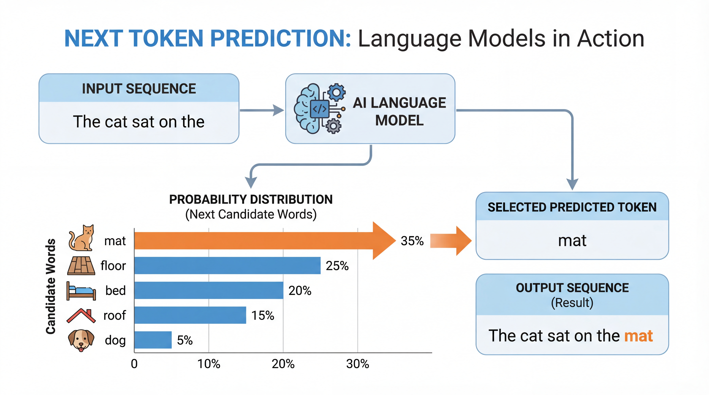
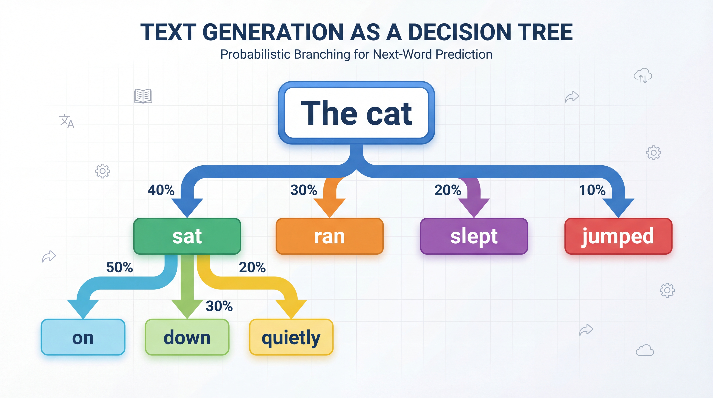
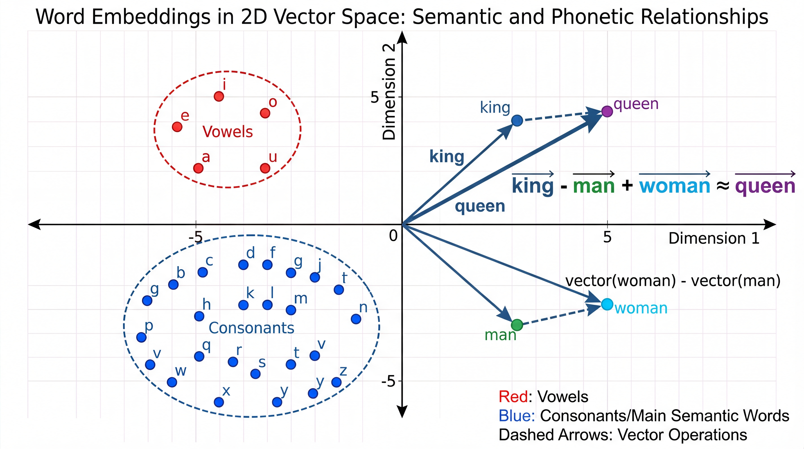
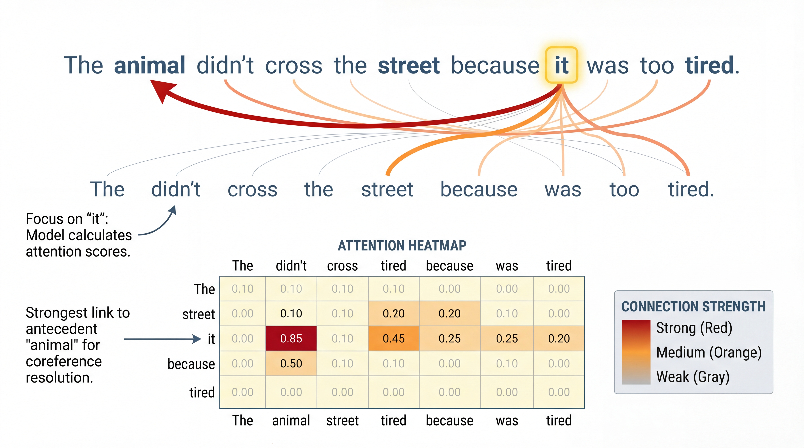
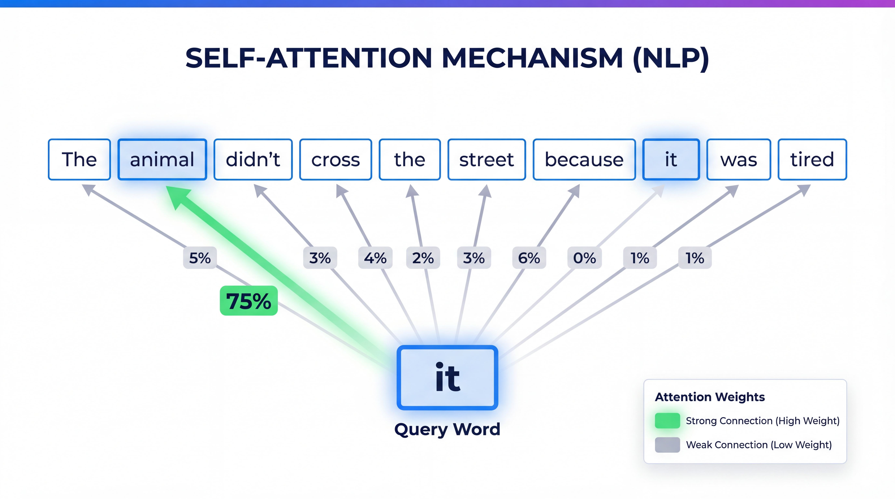
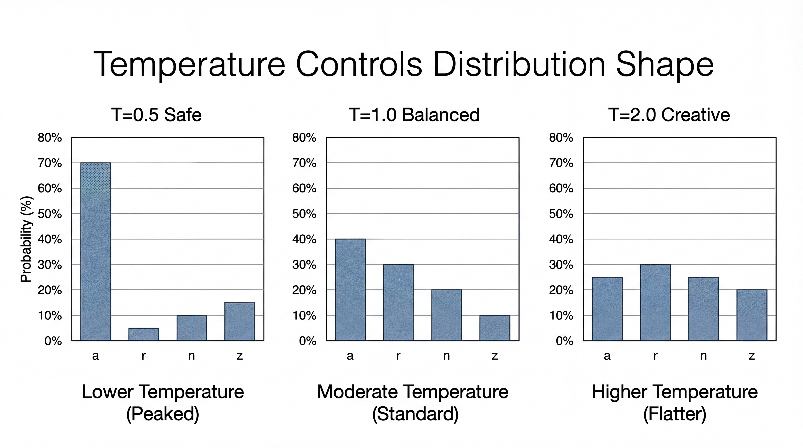

<!-- _class: title-slide -->
<!-- _paginate: false -->

# Language Models
# How Machines Understand Text

## The Secret Behind ChatGPT

**Nipun Batra** | IIT Gandhinagar

---

# The Story So Far

| Lecture | What We Learned |
|---------|-----------------|
| 6 | Computer Vision: Images → Pixels → CNNs |
| **7** | **Language: Text → ? → LLMs** |

**Today's big reveal:** What makes ChatGPT, Claude, and Gemini work!

---

# A Mind-Blowing Fact

**ChatGPT, Claude, Gemini, LLaMA...**

These AI systems can:
- Write essays and code
- Answer complex questions
- Translate languages
- Have conversations

**But here's the shocking truth:**

<div class="insight">

They're ALL playing ONE simple game: **Guess the next word. Repeat.**

</div>

---

# Wait, That's Really It?

Yes. **The entire field of Large Language Models is built on:**

> "Given some text, predict what word comes next."

```
"The capital of France is ___"  →  "Paris"
"To be or not to ___"           →  "be"
"print('Hello ___"              →  "World')"
```

**That's the whole trick!**

---

# You Already Use This Every Day!

| Application | You Type... | It Predicts... |
|-------------|-------------|----------------|
| Phone keyboard | "I'm running" | `late`, `now`, `away` |
| Google Search | "how to make" | `money`, `pancakes`, `coffee` |
| Gmail | "Thanks for the" | `quick response!` |
| YouTube | "How to" | `cook`, `code`, `dance` |

<div class="insight">

All of these are next-word prediction models!

</div>

---

<!-- _class: section-divider -->

# Part 1: The Core Idea

## Next Token Prediction

---

# The One Question Every LLM Answers

Every language model answers **one simple question**:

<div class="insight">

**"Given the text so far, what word is most likely to come next?"**

</div>

**Example:**

> "The capital of France is ___"

A good language model should predict: **"Paris"**

---

# But Wait... How Does Prediction = Understanding?

Here's the key insight:

**If you're REALLY good at predicting what comes next...**

You need to **understand** the content!

| To Predict... | You Need to Know... |
|---------------|---------------------|
| "The capital of France is **Paris**" | Geography |
| "To be or not to **be**" | Shakespeare |
| "print('Hello **World')**" | Python syntax |
| "F = m**a**" | Physics |
| "2 + 2 = **4**" | Math |

---

# The Philosophical Point

A model that can predict text well has **implicitly learned**:
- Facts about the world
- Grammar and language rules
- Logic and reasoning patterns
- Programming syntax
- And much more!

<div class="insight">

**Good prediction requires implicit understanding.**

</div>

---

# Not Just ONE Prediction...



The model predicts **probabilities for ALL possible words**:

**"The cat sat on the ___"**

| Word | Probability |
|------|-------------|
| mat | 35% |
| floor | 25% |
| bed | 20% |
| roof | 15% |
| dog | 5% |

**All probabilities sum to 100%**

---

# Generating Text: The Algorithm

How does ChatGPT write a whole essay?

```python
def generate_text(prompt, model):
    text = prompt

    while not done:
        # Step 1: Predict probabilities for ALL next words
        probabilities = model.predict_next(text)

        # Step 2: Pick one word (sample from probabilities)
        next_word = sample(probabilities)

        # Step 3: Add it to the text
        text = text + " " + next_word

    return text
```

**That's ALL ChatGPT does!** Predict → Sample → Repeat.

---

# Let's Walk Through an Example

**Prompt:** "The weather today is"

| Step | Current Text | Predicted | Added |
|------|--------------|-----------|-------|
| 1 | "The weather today is" | sunny (40%), cold (30%), ... | "sunny" |
| 2 | "The weather today is sunny" | and (50%), . (30%), ... | "and" |
| 3 | "The weather today is sunny and" | warm (45%), nice (30%), ... | "warm" |
| 4 | "The weather today is sunny and warm" | . (60%), , (20%), ... | "." |

**Final output:** "The weather today is sunny and warm."

---

# Generation as a Tree



Each prediction creates **branching possibilities:**

- At "The cat", we could go to "sat" (40%), "ran" (30%), "slept" (20%)...
- If we pick "sat", new branches: "on" (50%), "down" (30%)...
- Different branches = different stories!

**Temperature controls which branches we explore.**

---

# The Key Insight

**ChatGPT has no internal "thoughts" or "beliefs".**

It's just predicting: "Given everything before, what word is most likely next?"

But when you predict REALLY well over BILLIONS of examples...

**The result looks like intelligence!**

---

<!-- _class: section-divider -->

# Part 2: Building Intuition

## How Does a Model Learn to Predict?

---

# Learning from Text

**Training data:** Massive amounts of text from the internet

```
"The cat sat on the mat."
"The dog ran in the park."
"The capital of France is Paris."
"To be or not to be, that is the question."
... (billions of sentences)
```

**Training process:** Show the model tons of text. For each position, ask it to predict the next word. If wrong, adjust the model.

---

# A Simple Example: Character Prediction

Let's start even simpler - predicting the **next character**!

**Training text:** Names like "aabid", "priya", "zeel", "nipun"

**Question:** After seeing 'a', what character comes next?

| Character | Count | Probability |
|-----------|-------|-------------|
| 'a' | 2 times | 25% |
| 'b' | 3 times | 38% |
| 'd' | 1 time | 12% |
| 'r' | 1 time | 12% |
| 'n' | 1 time | 12% |

---

# Generating Names

**Start with a random character, then keep predicting:**

```
Step 1: Start with 'a'
Step 2: After 'a', sample → got 'b'
Step 3: After 'b', sample → got 'i'
Step 4: After 'i', sample → got 'd'
Step 5: After 'd', sample → got '.' (END)

Result: "abid" ← Looks like a real name!
```

**Same principle as ChatGPT, just simpler!**

---

# The Limitation: Memory

**Problem:** A simple model only looks at the LAST character!

**"The cat sat on the ___"**

| Model Type | What It Sees | Problem |
|------------|--------------|---------|
| Looks at last character | "e " | Can't know it's about a cat! |
| Looks at last word | "the" | Still not enough context! |
| We need | Entire sentence | Full understanding |

**This is why we need better architectures!**

---

# The Memory Problem: A Story

**Story:** "Alice picked up the golden key. She walked to the door. She tried to open it with the ___"

**What should fill the blank?** → "key"!

But a simple model that only sees "with the ___" might predict:
- "key" (correct!)
- "hammer"
- "screwdriver"
- "door"

**To get this right, the model needs to "remember" the golden key from earlier!**

---

<!-- _class: section-divider -->

# Part 3: Words as Vectors

## The Embedding Trick

---

# How Do We Feed Words to a Neural Network?

**Problem:** Neural networks work with numbers, not words!

**Bad idea: Number each word**

| Word | Number |
|------|--------|
| cat | 1 |
| dog | 2 |
| fish | 3 |

**Problem:** This implies cat (1) and dog (2) are more similar than cat (1) and fish (3). But that's arbitrary!

---

# The Embedding Idea

**Better idea:** Give each word a LIST of numbers (a vector)!

| Word | Vector (simplified) |
|------|---------------------|
| cat | [0.8, 0.1, 0.9, 0.2] |
| dog | [0.7, 0.2, 0.8, 0.3] |
| fish | [0.2, 0.9, 0.1, 0.1] |

**Notice:** Cat and dog have similar vectors (both are pets!)

Fish has a very different vector (aquatic animal)

---

# The Magic of Embeddings

**These vectors capture meaning!**

Famous example from Word2Vec (2013):

$$\text{king} - \text{man} + \text{woman} ≈ \text{queen}$$

**The vector arithmetic works because:**
- (king - man) = "royal-ness"
- (royal-ness) + woman = queen!

<div class="insight">

Embeddings are learned automatically — the model figures out what each dimension should mean!

</div>

---

# Visualizing Word Embeddings



**When we plot word vectors in 2D:**

- **Royalty cluster:** king, queen near each other
- **Gender dimension:** man→woman parallel to king→queen
- **Pet cluster:** cat, dog close together
- **Programming cluster:** python, java, code

**Similar words cluster together!**

---

# This Works for Characters Too!

**When learning character embeddings:**

| Cluster | Characters | Why? |
|---------|------------|------|
| Vowels | a, e, i, o, u | Similar role in words |
| Hard consonants | b, c, d, g, k | Similar sounds |
| Soft consonants | l, m, n, r | Similar sounds |
| End marker | . or - | Special role |

**The model learns these groupings automatically!**

---

<!-- _class: section-divider -->

# Part 4: The Attention Breakthrough

## Looking at What Matters

---

# The Problem with Sequences



**"The animal didn't cross the street because it was too tired."**

**Question:** What does "it" refer to?

| Option | Makes Sense? |
|--------|--------------|
| "it" = animal | ✓ (animals get tired) |
| "it" = street | ✗ (streets don't get tired) |

**The model needs to look BACK at "animal" to understand "it"!**

---

# The Attention Idea (2017)

**Instead of compressing everything into a fixed summary...**

**Let the model LOOK BACK at any previous word!**

| Old Approach | Attention |
|--------------|-----------|
| Pass info through chain (like telephone game) | Look directly at any word |
| Information gets lost | Nothing is lost |
| "I remember something about an animal..." | "Let me check: yes, animal!" |

---

# How Attention Works: Intuition

**When processing "it", the model asks:**

> "Which previous words are relevant to understanding 'it'?"

| Word | Relevance Score |
|------|-----------------|
| animal | **0.75** (very relevant!) |
| street | 0.10 |
| the | 0.05 |
| didn't | 0.05 |
| other words | 0.05 |

**Then it pays most "attention" to "animal"!**

---

# Visual: Attention in Action



**When processing "it":**

The model looks back at all previous words and calculates attention weights.

| Word | Attention |
|------|-----------|
| animal | **75%** |
| street | 10% |
| other words | 15% |

**"it" attends mostly to "animal" because animals get tired, not streets!**

---

# Why Attention is Revolutionary

| Before Attention | With Attention |
|------------------|----------------|
| Information passes through a chain | Direct access to all words |
| Long sentences lose context | No distance limitation |
| Sequential processing (slow) | Parallel processing (fast!) |

<div class="insight">

**Attention lets the model "look up" any relevant information instantly!**

</div>

---

# The Transformer (2017)

**The paper:** "Attention Is All You Need"

**The architecture:** Stack many attention layers

```
Input → [Attention + Feed-Forward] → [Attention + Feed-Forward] → ... → Output
            Layer 1                      Layer 2                   Layer N
```

| Model | Number of Layers |
|-------|------------------|
| Small | 6 layers |
| GPT-2 | 48 layers |
| GPT-4 | ~120 layers! |

**More layers = more "thinking steps" = better understanding**

---

<!-- _class: section-divider -->

# Part 5: Temperature

## Controlling Creativity

---

# The Creativity Knob



When the model predicts next word probabilities, we can adjust them!

**Temperature** = how "creative" vs "safe" the model is

| Temperature | Effect |
|-------------|--------|
| **Low (0.1-0.3)** | Very predictable, picks top choice |
| **Medium (0.7)** | Balanced, some variety |
| **High (1.5+)** | Wild and creative, risky |

---

# Temperature Example

**Prompt:** "The cat sat on the ___"

**Original probabilities:**

| Word | Probability |
|------|-------------|
| mat | 40% |
| floor | 25% |
| couch | 20% |
| moon | 1% |

---

# Low Temperature (T=0.3)

**Probabilities become SHARPER:**

| Word | Original | After Low T |
|------|----------|-------------|
| mat | 40% | **85%** |
| floor | 25% | 10% |
| couch | 20% | 4% |
| moon | 1% | <1% |

**Result:** Almost always picks "mat" (boring but safe!)

---

# High Temperature (T=2.0)

**Probabilities become FLATTER:**

| Word | Original | After High T |
|------|----------|--------------|
| mat | 40% | 30% |
| floor | 25% | 25% |
| couch | 20% | 22% |
| moon | 1% | **10%** |

**Result:** Might pick unusual words like "moon" (creative but risky!)

---

# The Math Behind Temperature

**Standard softmax:**
$$P(word_i) = \frac{e^{z_i}}{\sum_j e^{z_j}}$$

**Temperature-scaled softmax:**
$$P(word_i) = \frac{e^{z_i / T}}{\sum_j e^{z_j / T}}$$

| T Value | Effect on Distribution |
|---------|----------------------|
| T → 0 | Becomes one-hot (deterministic) |
| T = 1 | Standard probabilities |
| T → ∞ | Becomes uniform (random) |

---

# When to Use Each Temperature

| Use Case | Temperature | Why |
|----------|-------------|-----|
| Math problems | 0 (greedy) | Need exact answer |
| Code generation | 0.2-0.5 | Mostly correct, some variety |
| Conversation | 0.7 | Natural, not boring |
| Creative writing | 0.9-1.2 | Interesting and varied |
| Brainstorming | 1.5+ | Wild ideas! |

---

# Temperature Demo

**Prompt:** "Write a poem about the ocean"

**T=0 (Greedy):**
```
The ocean is blue.
The ocean is deep.
The ocean is big.
```

**T=0.9:**
```
Azure whispers dance on moonlit waves,
Where ancient secrets swim in salty caves,
The tide embraces shores with gentle might,
As starfish dream beneath the fading light.
```

**Same model, same prompt — temperature changes everything!**

---

<!-- _class: section-divider -->

# Part 6: The Full Picture

## From Prediction to ChatGPT

---

# Scale Changes Everything

| Feature | Toy Model | ChatGPT/GPT-4 |
|---------|-----------|---------------|
| Vocabulary | 27 letters | 100,000 tokens |
| Embedding size | 2 | 12,288 |
| Layers | 1 | ~120 |
| Parameters | 1,000 | 175+ BILLION |
| Training data | 1,000 words | 500B+ tokens |

<div class="insight">

**Same algorithm. Same principle. Just MUCH bigger.**

</div>

---

# Tokenization: Not Words, Not Characters

**LLMs use "tokens" — pieces of words:**

| Text | Tokens |
|------|--------|
| "Hello world" | ["Hello", " world"] |
| "ChatGPT" | ["Chat", "G", "PT"] |
| "unhappiness" | ["un", "happiness"] |
| "Anthropic" | ["Anthrop", "ic"] |

**Why?** Balance between characters (too slow) and words (too many)

---

# A Fun Limitation

**"How many r's in 'strawberry'?"**

The model sees: ["str", "aw", "berry"]

**It doesn't see the individual letters!**

This is why LLMs struggle with:
- Counting letters
- Spelling tasks
- Character-level puzzles

<div class="warning">

Tokens ≠ Characters! The model doesn't "see" individual letters.

</div>

---

# The Training Process

| Stage | What Happens | Result |
|-------|--------------|--------|
| **Pre-training** | Predict next word on internet text | Good at completion |
| **Fine-tuning** | Train on instruction-response pairs | Follows instructions |
| **Alignment** | Learn from human preferences | Helpful and safe |

```
Raw internet → Pre-training → Fine-tuning → Alignment → ChatGPT
```

---

# Why Pre-training Alone Isn't Enough

**Pre-trained model:**
- Great at completing text
- Bad at following instructions

**Example:**

| Input | Pre-trained Output | ChatGPT Output |
|-------|-------------------|----------------|
| "What is 2+2?" | "...is a simple math question that..." | "2+2 equals 4." |
| "Write Python code for..." | (random code snippets) | (working code) |

**Fine-tuning teaches the model to be HELPFUL!**

---

# Summary: How LLMs Work

1. **Text → Tokens → Numbers (embeddings)**

2. **Transformer processes the sequence**
   - Attention lets words look at other words
   - Multiple layers = multiple "thinking steps"

3. **Predict probability of next token**

4. **Sample a token, add to sequence, repeat**

5. **Temperature controls creativity**

---

# Key Takeaways

1. **LLMs predict the next token** — that's the whole trick!

2. **Embeddings** turn words into meaningful vectors

3. **Attention** lets the model look at all relevant context

4. **Temperature** controls creativity vs. safety

5. **Scale matters** — same algorithm, bigger = smarter

6. **Fine-tuning** transforms a text predictor into a helpful assistant

---

# What We Skipped (Advanced Topics)

| Topic | What It Is |
|-------|------------|
| Self-attention math | Query, Key, Value matrices |
| Positional encoding | How models know word order |
| Multi-head attention | Multiple attention patterns |
| RLHF | Learning from human preferences |
| Prompt engineering | Getting better outputs |

*You'll learn these in advanced NLP/LLM courses!*

---

<!-- _class: title-slide -->

# You Now Understand How LLMs Work!

## The Secret: Just Predict the Next Word!

**Key takeaways:**
- LLMs = next token prediction at scale
- Attention = look at relevant context
- Temperature = creativity control
- Fine-tuning = helpful behavior

**Try it yourself:**
- Play with ChatGPT temperature settings
- Watch the autocomplete on your phone keyboard

**Questions?**
