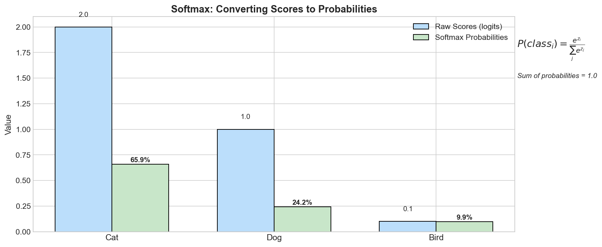
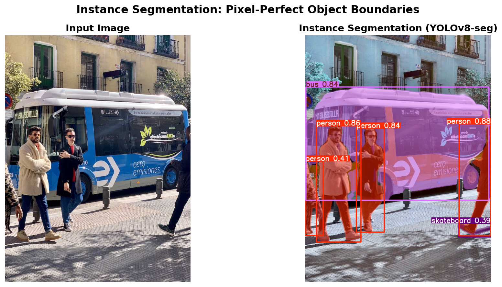
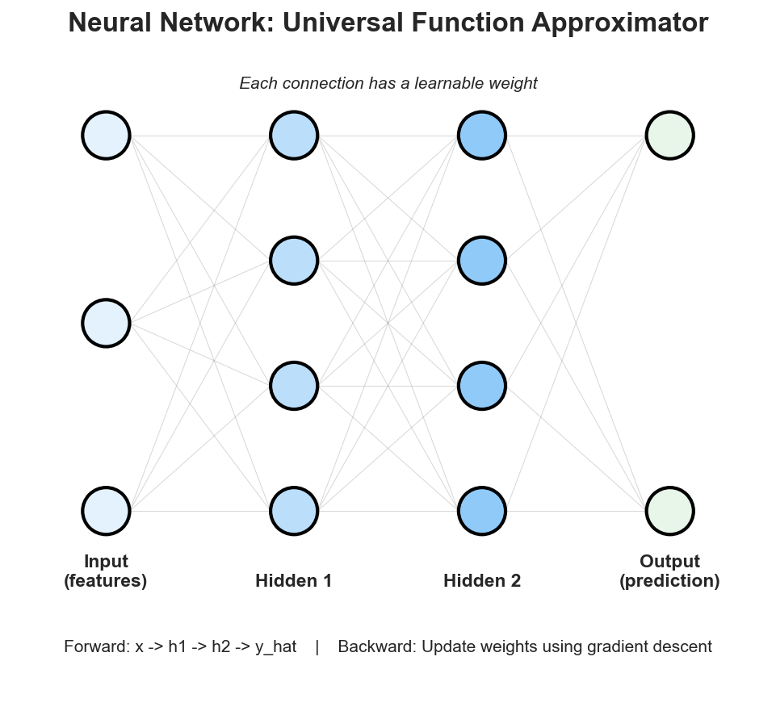

<!-- _class: title-slide -->
<!-- _paginate: false -->

# Machine Learning
# Tasks, Taxonomy & Beyond
## From Classification to Deep Learning

**Nipun Batra** | IIT Gandhinagar

---

# ML is Everywhere in Your Daily Life

| Time | What You Do | ML Behind It |
|------|-------------|--------------|
| Morning | Phone unlocks with your face | Face Recognition |
| Commute | Google Maps predicts traffic | Time Series Prediction |
| Email | Gmail filters spam, suggests replies | Text Classification + Generation |
| Music | Spotify recommends songs | Recommendation Systems |
| Shopping | Amazon shows "You might also like..." | Collaborative Filtering |
| Photos | Google Photos groups by faces | Clustering + Image Classification |
| Evening | Netflix suggests what to watch | Recommendation Systems |
| Chat | You ask ChatGPT a question | Language Models (Generative AI) |

**Each of these is a different ML task!**

---

# ML Notation: The Basics

| Symbol | Meaning | Example |
|--------|---------|---------|
| $\mathbf{X}$ | Input features (matrix) | All training images |
| $\mathbf{x}$ | Single input sample | One image |
| $\mathbf{y}$ | Output/Target | Label, price, category |
| $f(\mathbf{x}; \theta)$ | Model with parameters | Neural network |
| $\hat{y}$ | Model prediction | $\hat{y} = f(\mathbf{x})$ |

| Dataset Term | What it is | Typical Split |
|--------------|-----------|---------------|
| **Training set** | Data to learn from | ~70-80% |
| **Validation set** | Data to tune hyperparameters | ~10-15% |
| **Test set** | Final evaluation (never peek!) | ~10-15% |

<div class="example">

**Example:** Spam detection
- $\mathbf{x}$ = email text ("Buy now! Limited offer!")
- $y$ = label (spam=1, not spam=0)
- Model learns: $f(\mathbf{x}) \rightarrow \hat{y}$ (predicted probability)

</div>

---

# The Big Question

Every ML task boils down to **one question**:

## "What are you trying to PREDICT?"

<div class="columns">
<div>

**Predicting a Category?**
Classification
*"Is this email spam?"*

**Predicting a Number?**
Regression
*"What will be the price?"*

</div>
<div>

**Predicting a Sequence?**
Seq2Seq
*"How do you say this in French?"*

**Creating Something New?**
Generative
*"Draw me a cat in space"*

</div>
</div>

<div class="insight">
Once you know the "output type", you know which family the task belongs to!
</div>

---

# The Three Learning Paradigms


---

# The Universal ML Recipe


What changes between tasks:
- What **X** looks like (image, text, audio, numbers)
- What **Y** looks like (label, number, sequence, image)
- How we **measure success** (accuracy, MSE, IoU, BLEU)

<div class="insight">
The same Transformer architecture powers ChatGPT, DALL-E, and self-driving cars!
</div>

---

<!-- _class: section-divider -->
# Part 1: Classification
## "Which Bucket Does This Belong To?"

---

# Classification: Real Examples from CIFAR-10


You look at the input and pick **one category** from a fixed set. That's classification!

---

# Classification: How a Decision Tree Learns


A decision tree learns **if-then rules** from data:
"If sepal length > 5.5 AND sepal width < 3.0, then iris-versicolor"

---

# Classification: Logistic Regression


Logistic regression learns a **decision boundary** that separates classes.

---

# Binary vs Multi-Class Classification

<div class="columns">
<div>

**Binary Classification**
*Two possible outcomes*

- Spam / Not Spam
- Fraud / Legitimate
- Pass / Fail
- Tumor: Benign / Malignant

</div>
<div>

**Multi-Class Classification**
*Many possible outcomes*

- Digit recognition (0-9)
- ImageNet (1000 classes)
- Emotion detection (6+ emotions)
- Animal species identification

</div>
</div>

<div class="insight">
Same algorithm, just different number of outputs!
</div>

---

# The Math: Softmax Turns Scores into Probabilities



**Softmax** converts raw scores (logits) to probabilities that sum to 1.

The model isn't just saying "Cat" - it's saying "85% sure it's a cat!"

---

<!-- _class: section-divider -->
# Part 2: Regression
## "How Much? How Many?"

---

# Regression: When the Answer is a Number

Classification: *"Which category?"* - Discrete answer
Regression: *"How much?"* - Continuous number

| Question | Answer |
|----------|--------|
| "How old is this person?" | 27.3 years |
| "What's this house worth?" | $425,000 |
| "How many units will sell?" | 1,247 units |
| "What temperature tomorrow?" | 28.5 C |
| "How long until the bus arrives?" | 7.2 minutes |

The output is **any number** on a continuous scale!

---

# Regression in Action: Linear Regression


The model learns: **Price = $50,000 + $150 * (square feet)**

---

# Regression is Hidden Everywhere!

Bounding box detection is actually **regression**:


---

<!-- _class: section-divider -->
# Part 3: Computer Vision Hierarchy
## From Labels to Pixels

---

# The Vision Task Ladder


Each level gives you **more information** but requires **more data and compute**!

---

# Level 1: Image Classification

**What:** Assign one label to an image.


**Use Cases:**
- Google Photos: "Show me all photos with dogs"
- Medical: "Is this X-ray normal or abnormal?"
- Quality Control: "Is this product defective?"

---

# Level 2: Object Detection

**Detection = Classification (what) + Regression (where)**


Output: List of `(class_name, confidence, x, y, width, height)` for each object

---

# Level 3 & 4: Segmentation


---

# Instance Segmentation in Action



<div class="insight">
Self-driving cars need Instance Segmentation - they must track WHICH car is doing what!
</div>

---

# Pose Estimation: Finding Body Keypoints

**What:** Find skeleton keypoints of humans or animals.


**Applications:** Fitness apps, motion capture, sign language, fall detection

---

<!-- _class: section-divider -->
# Part 4: Natural Language Processing
## Teaching Machines to Read & Write

---

# The NLP Task Landscape

| Task Type | What It Does | Example |
|-----------|--------------|---------|
| **Sentiment Analysis** | Classify emotion | "Great movie!" → Positive |
| **Named Entity Recognition** | Find names, places, dates | "Sundar Pichai visited NYC" |
| **Question Answering** | Find answers in text | "When was Einstein born?" |
| **Translation** | Convert between languages | English → Hindi |
| **Summarization** | Shorten long text | 1000 words → 50 words |
| **Text Generation** | Create new text | ChatGPT, Claude |

<div class="realworld">
Modern LLMs (GPT-4, Claude) can do ALL of these with a single model!
</div>

---

# Named Entity Recognition (NER)

Classify **each word** in the sequence:

```
   Input:    "Sundar  Pichai   visited  New    York   yesterday"
              │       │        │        │      │      │
              ▼       ▼        ▼        ▼      ▼      ▼
   Output:   PER     PER       O       LOC    LOC     O

   PER = Person Name
   LOC = Location
   O   = Other (not an entity)
```

<div class="insight">
Think of it as "semantic segmentation for text" - every word gets a label!
</div>

---

<!-- _class: section-divider -->
# Part 5: Unsupervised Learning
## Finding Patterns Without Labels

---

# Supervised vs Unsupervised


**No one tells the model what to look for - it discovers structure on its own!**

---

# Clustering: K-Means in Action


**K-Means:** No labels needed! The algorithm discovers natural groupings.

<div class="realworld">
**Applications:** Customer segmentation, gene expression analysis, document clustering
</div>

---

# Dimensionality Reduction

**Problem:** High-dimensional data is hard to visualize.

```
Original: 1000-dimensional data
         (Can't visualize 1000 axes!)
                    │
               PCA / t-SNE
                    │
                    ▼
         Just 2D: [0.45, -0.23]
                    │
                    ▼
            Can now plot it!

           •  •  •         ← Cluster 1
          •    •
            ▲  ▲  ▲        ← Cluster 2
              ■ ■ ■        ← Cluster 3
```

---

<!-- _class: section-divider -->
# Part 6: Generative Models
## Creating New Data

---

# Generative vs Discriminative


---

# The Generative AI Revolution

| Domain | Tool | What It Does |
|--------|------|--------------|
| **Text** | ChatGPT, Claude | Write essays, code, poems |
| **Images** | DALL-E, Midjourney, Stable Diffusion | Generate any image from text |
| **Music** | Suno, Udio | Create full songs with lyrics |
| **Video** | Sora, Runway | Generate realistic video clips |
| **Code** | GitHub Copilot, Claude | Write and debug code |
| **Voice** | ElevenLabs | Clone and synthesize voices |

<div class="insight">
All of these generate NEW content that never existed before!
</div>

---

<!-- _class: section-divider -->
# Part 7: Multimodal AI
## Combining Everything

---

# Multimodal = Multiple Modalities

**Modalities:** Text, Image, Audio, Video, etc.


<div class="insight">
Modern AI (GPT-4, Claude, Gemini) is multimodal - it can see AND read AND hear!
</div>

---

# Visual Question Answering (VQA)

```
   Image:                      Questions & Answers:
   ┌───────────────────┐
   │                   │      Q: "What color is the car?"
   │    [Red car on    │      A: "Red"
   │     a road with   │
   │     trees]        │      Q: "Is it daytime or night?"
   │                   │      A: "Daytime"
   └───────────────────┘
                              Q: "How many trees are visible?"
   Requires BOTH:             A: "Four trees"
   - Understanding image
   - Understanding language
   - Reasoning about both!
```

---

<!-- _class: section-divider -->
# Part 8: Reinforcement Learning
## Learning Through Interaction

---

# RL: A Different Paradigm


**Goal:** Maximize total reward over time through trial and error.

---

# RL Examples

| Domain | Example | What It Learned |
|--------|---------|-----------------|
| **Games** | AlphaGo | Beat world champion at Go |
| **Games** | AlphaStar | Grandmaster at StarCraft II |
| **Robotics** | Boston Dynamics | Walk, run, dance |
| **Infrastructure** | Google Data Centers | 40% energy reduction |
| **AI Alignment** | RLHF for ChatGPT | Be helpful and safe |

<div class="insight">
RLHF (Reinforcement Learning from Human Feedback) is how ChatGPT learns to be helpful!
</div>

---

<!-- _class: section-divider -->
# Part 9: The Common Thread
## Neural Networks & Deep Learning

---

# Neural Networks: The Universal Tool



**All these tasks use the same fundamental building block:** Neural networks!

---

# NN Output: Binary Classification


**Output:** 1 neuron with **Sigmoid** activation → probability p ∈ [0, 1]

**Loss:** Binary Cross-Entropy = -[y·log(p) + (1-y)·log(1-p)]

<div class="example">
Example: Disease prediction, spam detection, fraud detection
</div>

---

# NN Output: Multi-class Classification


**Output:** C neurons with **Softmax** → probabilities sum to 1.0

**Loss:** Categorical Cross-Entropy = -Σ yᵢ·log(pᵢ)

<div class="example">
Example: Digit recognition (10 classes), ImageNet (1000 classes)
</div>

---

# NN Output: Regression


**Output:** 1 neuron with **No activation** (linear) → any real number

**Loss:** Mean Squared Error (MSE) = (1/n)Σ(yᵢ - ŷᵢ)²

<div class="example">
Example: House prices, stock prediction, age estimation
</div>

---

# NN Output: Object Detection (Multi-task)


**Output per detection:**
- 4 values: Box coordinates (x, y, w, h) - *regression*
- 1 value: Objectness score - *sigmoid*
- C values: Class probabilities - *softmax*

**Loss:** L = λ₁·L_box + λ₂·L_obj + λ₃·L_class

---

# NN Output: Summary

| Task | Output Neurons | Activation | Loss Function |
|------|---------------|------------|---------------|
| **Binary Classification** | 1 | Sigmoid | Binary Cross-Entropy |
| **Multi-class (C classes)** | C | Softmax | Categorical Cross-Entropy |
| **Multi-label** | C | Sigmoid (each) | Binary CE (per label) |
| **Regression** | 1 (or k) | None/Linear | MSE or MAE |
| **Detection** | B × (5 + C) | Mixed | Multi-part loss |

<div class="insight">
The output layer design tells you everything about the task type!
</div>

---

# How Neural Networks Learn: Gradient Descent


**Training = Finding the weights that minimize the loss function**

---

# The Deep Learning Revolution


<div class="insight">
Deep learning learns the features automatically - no hand-engineering needed!
</div>

---

# The Decision Flowchart


---

# Key Takeaways

1. **Classification** - Predict a category (discrete)
2. **Regression** - Predict a number (continuous)
3. **Detection** - Classification + Box Regression
4. **Segmentation** - Classification for every pixel
5. **Seq2Seq** - Sequence in, sequence out
6. **Unsupervised** - Find patterns without labels
7. **Generative** - Create new data
8. **Multimodal** - Combine text, images, audio
9. **RL** - Learn from rewards through interaction

<div class="insight">
Understanding the output type tells you which family of techniques to use!
</div>

---

# Coming Up Next

**Lecture 3:** Language Models
- Next Token Prediction
- Pre-training, SFT, RLHF
- From GPT to ChatGPT

**Lecture 4:** Object Detection
- YOLO and beyond
- Real-time detection

---

<!-- _class: section-divider -->

# Thank You!

**"All models are wrong, but some are useful."**
*— George Box*

### Key Takeaway
Match the **output type** to the right **task formulation**

Questions?

