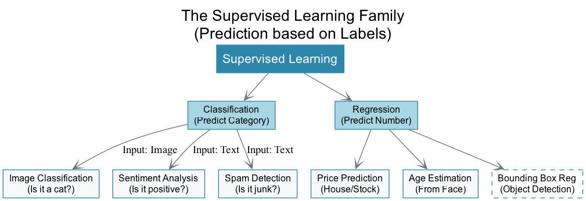
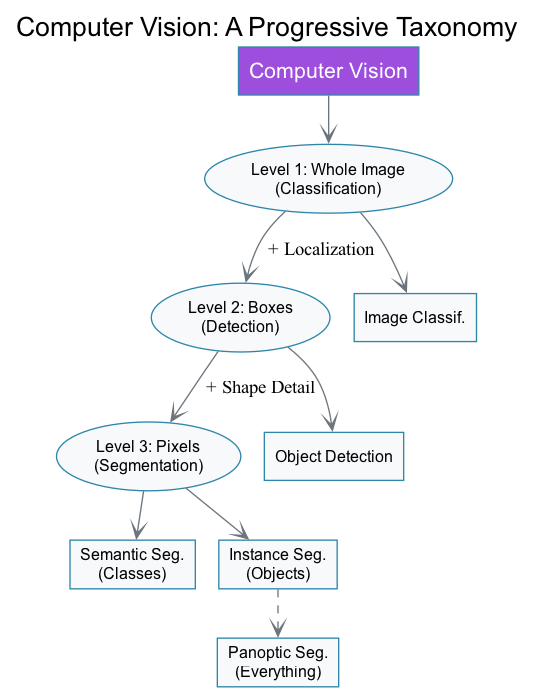
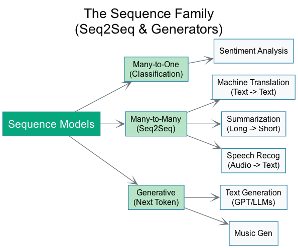
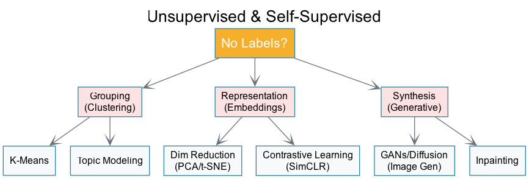

# The Machine Learning Taxonomy
## Organizing 40+ Tasks by their Mathematical Roots

**Nipun Batra**
*IIT Gandhinagar*

---

# The Grand Map

Machine Learning isn't just a list of random tricks. It's a family tree.
Almost every task is a variation of **Classification** or **Regression**.

*   **Predicting a Label?** Classification.
*   **Predicting a Number?** Regression.
*   **Predicting a Sequence?** Repeated Classification.
*   **Predicting a Structure?** Classification + Regression combined.

---

# Part 1: The Supervised Family

---

# Branch A: "Is it X or Y?" (Classification)

The simplest form of ML. $f(x) \rightarrow \{0, 1, \dots, K\}$

<strong>1. Image Classification</strong>
Input: Pixels | Output: Label
Is this image a Cat or Dog?

<strong>2. Sentiment Analysis</strong>
Input: Text | Output: Label
Is this review Positive or Negative?

<strong>3. Spam Detection</strong>
Input: Email | Output: Binary
Is this junk?

<strong>4. Topic Classification</strong>
Input: Document | Output: Category
Is this news about Sports, Politics, or Tech?

---

# Branch B: "How Much?" (Regression)

Predicting continuous values. $f(x) \rightarrow \mathbb{R}$

<strong>5. House Price Prediction</strong>
Input: Features | Output: $ Price
Classic regression.

<strong>6. Age Estimation</strong>
Input: Face Image | Output: Years
Predicting 25.4 years vs 25 years.

<strong>7. Time Series Forecasting</strong>
Input: History | Output: Future Value
Predicting tomorrow's temperature.

<strong>8. Bounding Box Regression</strong>
Input: Image | Output: (x, y, w, h)
Predicting the coordinates of an object (Part of Detection).

---

# Part 2: The Vision Hierarchy
*Combining Classification + Regression*

---

# Level 2: "Where is it?" (Detection)

We combine **Classification** (What) + **Regression** (Where).

<strong>9. Object Detection</strong>
Output: Box + Class
"There is a Car at [10, 50, 200, 300]"

<strong>10. Face Detection</strong>
Output: Box
Finding faces for auto-focus.

<strong>11. Keypoint Detection (Pose)</strong>
Output: (x,y) points
Finding Elbows, Knees, Eyes. (Regression of 17 points).

<strong>12. Text Detection (OCR)</strong>
Output: Box around text
Finding words in street signs.

---

# Level 3: "Which Pixels?" (Segmentation)

Now we classify **every single pixel**.

<strong>13. Semantic Segmentation</strong>
Output: Class per pixel
Road, Sky, Tree (No distinction between two trees).

<strong>14. Instance Segmentation</strong>
Output: Class + ID per pixel
Car #1 vs Car #2.

<strong>15. Image Matting</strong>
Output: Alpha Matte (Transparency)
Zoom background blur / Green screen removal.

---

# Part 3: The Sequence Family
*Predicting Lists of things*

---

# Many-to-Many (Seq2Seq)

Standard Classification is Many-to-One.
Seq2Seq is **Text In, Text Out**.

<strong>16. Machine Translation</strong>
English $\rightarrow$ Hindi
Mapping sequence to sequence.

<strong>17. Text Summarization</strong>
Long Text $\rightarrow$ Short Text
Extracting key information.

<strong>18. Speech Recognition (ASR)</strong>
Audio Wave $\rightarrow$ Text
Mapping sound frames to phonemes/words.

<strong>19. Text-to-Speech (TTS)</strong>
Text $\rightarrow$ Audio Wave
The reverse of ASR.

---

# Token-Level Tasks (Tagging)

Classifying each token in a sequence (like Semantic Seg for text).

<strong>20. Named Entity Recognition (NER)</strong>
Output: [PER, LOC, ORG] per word
Identifying "Sundar Pichai" as PER.

<strong>21. Part-of-Speech Tagging</strong>
Output: [Noun, Verb] per word
Grammatical analysis.

---

# Part 4: Unsupervised & Generative
*Learning without Labels*

---

# Grouping & Representation

<strong>22. Clustering</strong>
Task: Find Groups
Customer segmentation.

<strong>23. Topic Modeling</strong>
Task: Find Themes
Discovering "Sports" cluster in news without labels.

<strong>24. Dimensionality Reduction</strong>
Task: Compression
PCA / t-SNE. Visualizing high-dim data.

<strong>25. Anomaly Detection</strong>
Task: Find Outliers
Credit fraud, manufacturing defects.

---

# Generative Tasks (The New Wave)

Modeling the distribution $P(X)$.

<strong>26. Image Generation</strong>
Noise $\rightarrow$ Image
GANs, Diffusion (Midjourney).

<strong>27. Text Generation</strong>
Prefix $\rightarrow$ Continuation
LLMs (GPT).

<strong>28. Inpainting</strong>
Masked Image $\rightarrow$ Full Image
Filling holes.

<strong>29. Style Transfer</strong>
Content + Style $\rightarrow$ Image
Artistic filters.

---

# Part 5: The Complex Ones (Multimodal + RL)

<strong>30. Visual QA (VQA)</strong>
Image + Text $\rightarrow$ Text
"What color is the car?"

<strong>31. Image Captioning</strong>
Image $\rightarrow$ Text
"A dog running on grass."

<strong>32. Reinforcement Learning</strong>
State $\rightarrow$ Action
Playing Chess, Robot Control.

<strong>33. Recommendation</strong>
User History $\rightarrow$ Item Rank
Netflix/Amazon.

---

# Summary

We didn't just list tasks. We grouped them by their **Mathematical Nature**.

1.  **Classification:** The parent of Vision/NLP classification.
2.  **Regression:** The parent of Prediction/Bounding Boxes.
3.  **Seq2Seq:** The parent of Translation/Speech.
4.  **Generative:** The parent of GPT/DALL-E.

**Understanding the root helps you solve the leaf.**

## Questions?
