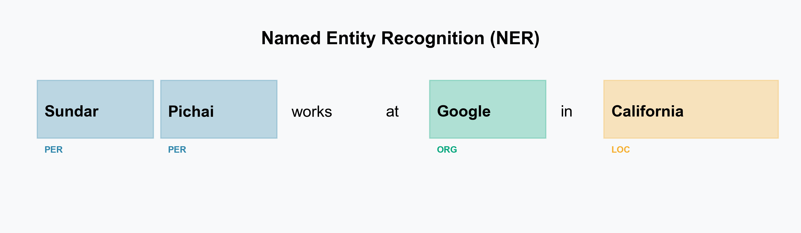
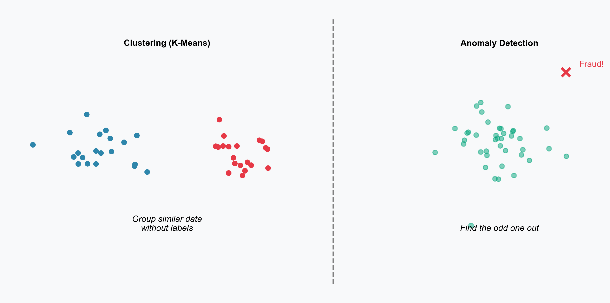
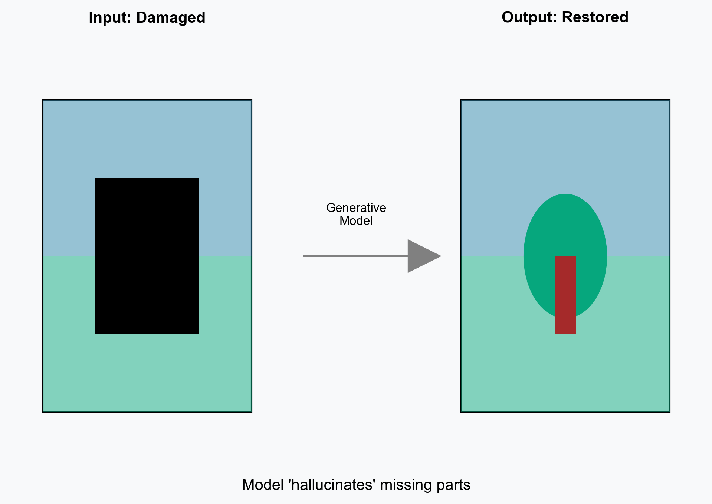

# The Machine Learning Task Zoo
## A Tour of 40+ Supervised & Unsupervised Problems

**Nipun Batra**
*IIT Gandhinagar*

---

# What is a "Task"?

In ML, a task is defined by its **Input ($X$)** and **Output ($Y$)**.

*   **Supervised:** We have pairs of $(X, Y)$. (e.g., Image -> "Cat")
*   **Unsupervised:** We only have $X$. (e.g., Image -> ???)
*   **Reinforcement:** We have State -> Action -> Reward.

Let's explore the ecosystem!

---

# Domain 1: Computer Vision (Seeing)
*From simple labels to pixel-perfect understanding.*

---

# CV 1: The Basics

1.  **Image Classification**: Is there a cat?
2.  **Object Detection**: Where is the cat?
3.  **Semantic Segmentation**: Which pixels are "cat"?

---

# CV 2: Advanced Segmentation

4. Instance Segmentation

Input: Image → Output: Mask per Object

Distinguishing separate people in a crowd, not just "person" pixels.

5. Panoptic Segmentation

Input: Image → Output: Stuff + Things

Combines Semantic (Sky, Road) + Instance (Car #1, Car #2). Crucial for Self-Driving.

6. Pose Estimation

Input: Image → Output: Keypoints (Skeleton)

Yoga apps, Kinect games, Sports analysis.

---

# CV 3: Beyond 2D Labels

7. Depth Estimation

Input: RGB Image → Output: Depth Map

Estimating distance from a single camera (Monocular Depth).

8. Optical Flow

Input: Video Frames → Output: Motion Vectors

Tracking how pixels move between frames.

9. Face Recognition

Input: Face Crop → Output: Person ID

Unlocking your iPhone, Airport security.

10. Visual QA (VQA)

Input: Image + Question → Output: Answer

Q: "What color is the shirt?" A: "Red".

---

# Domain 2: Natural Language Processing (Reading)
*Understanding, Translating, and Generating Text.*

---

# NLP 1: Classification & Tagging

11. Sentiment Analysis

Input: Text → Output: Positive/Negative

"This movie was terrible" → Negative.

12. Topic Classification

Input: Document → Output: Category

Gmail sorting emails into "Promotions", "Social", "Primary".

13. Part-of-Speech (POS) Tagging

Input: Sentence → Output: Verb/Noun tags

"Time(N) flies(V) like(P) an arrow(N)."

---

# NLP 2: Information Extraction

14. Named Entity Recognition (NER)

Input: Text → Output: Spans with types

Extracting Dates, Prices, People from contracts.

---

# NLP 3: Sequence to Sequence (Seq2Seq)

15. Machine Translation

Input: English → Output: Hindi

Google Translate. "Hello" → "Namaste".

16. Text Summarization

Input: Long Article → Output: Short Summary

TL;DR bots, News aggregators.

17. Question Answering (QA)

Input: Context + Query → Output: Answer Span

Google Search Snippets.

---

# NLP 4: Deep Understanding

18. Natural Language Inference (NLI)

Input: Premise + Hypothesis → Output: Entailment?

P: "Man playing soccer." H: "Man is outside." → True.

19. Coreference Resolution

Input: Text → Output: Cluster mentions

"<strong>Elon</strong> bought Twitter. <strong>He</strong> changed the logo." (He = Elon).

---

# Domain 3: Audio & Speech (Hearing)

20. Speech-to-Text (ASR)

Input: Waveform → Output: Text

Siri, Alexa, YouTube Captions.

21. Text-to-Speech (TTS)

Input: Text → Output: Waveform

GPS Navigation voices, Screen readers.

22. Speaker Identification

Input: Voice Clip → Output: Person ID

"Voice Match" to unlock phones.

23. Music Generation

Input: Genre/Lyrics → Output: Song

Suno AI, Udio.

---

# Domain 4: Unsupervised Learning
*Finding patterns without labels.*

---

# Unsupervised Tasks

24. Clustering

Input: Data points → Output: Groups

Customer Segmentation (High spenders vs Browsers).

25. Anomaly Detection

Input: Data → Output: Outlier Score

Credit Card Fraud detection, Factory defect detection.

26. Dimensionality Reduction

Input: High Dim (1000) → Output: Low Dim (2)

PCA, t-SNE. Visualizing complex data in 2D.

27. Association Rule Mining

Input: Transactions → Output: Rules

"People who buy Diapers also buy Beer."

---

# Domain 5: Generative & Self-Supervised
*Creating new data & Learning from itself.*

---

# Generative Tasks

28. Image Generation

Input: Noise/Text → Output: Image

Midjourney, DALL-E (Diffusion Models).

29. Image Inpainting

Input: Masked Image → Output: Full Image

Removing tourists from vacation photos.

30. Style Transfer

Input: Photo + Painting → Output: Stylized Photo

Prisma app (Make my photo look like Van Gogh).

31. Super Resolution

Input: Low Res → Output: High Res

4K Upscaling on TVs, Restoring old photos.

---

# Inpainting Visualized

---

# Self-Supervised Learning (The "Secret Sauce")

These tasks create labels from the data itself!

32. Masked Language Modeling

Input: "Hello [MASK] world" → Output: "my"

How **BERT** is trained. Fill in the blanks.

33. Next Token Prediction

Input: "Hello my" → Output: "world"

How **GPT** is trained. Predict the future.

34. Contrastive Learning

Input: Two augmented images → Output: Same/Different

SimCLR. Learning visual features without labels.

---

# Domain 6: Tabular & RL
*Numbers and Agents.*

35. Regression

Input: Features → Output: Number

Predicting House Prices, Stock prices.

36. Time-Series Forecasting

Input: History → Output: Future

Weather prediction, Sales forecasting.

37. Recommendation

Input: User History → Output: Item Ranking

Netflix "Top picks for you", Amazon products.

38. Reinforcement Learning

Input: State → Output: Action

AlphaGo, Robots learning to walk.

---

# RL Loop Visualized

---

# Summary

We covered **38 different tasks**!

*   **Supervised:** You have the answer key (Labels). Most common in industry.
*   **Unsupervised:** You explore the data structure. Good for analytics.
*   **Self-Supervised:** The data is its own label. The engine behind LLMs.
*   **Reinforcement:** Learning by trial and error.

**Pick a task, find a dataset, and start building!**

## Questions?
