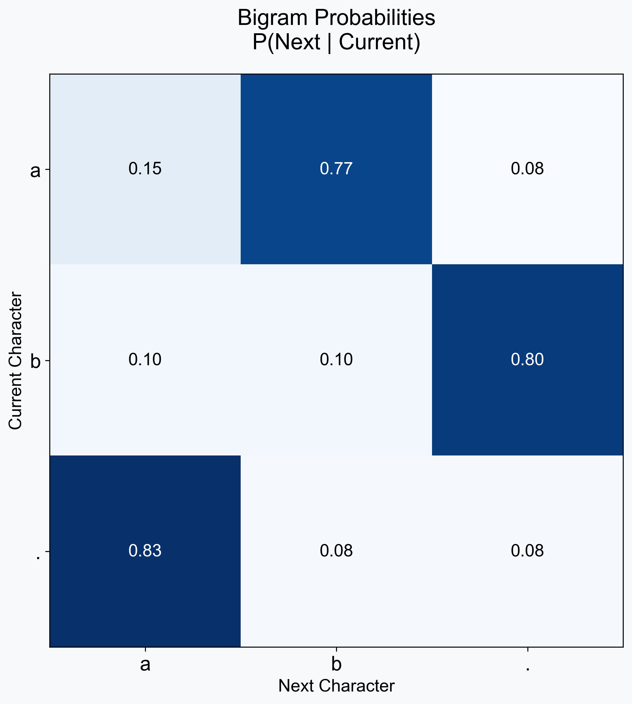
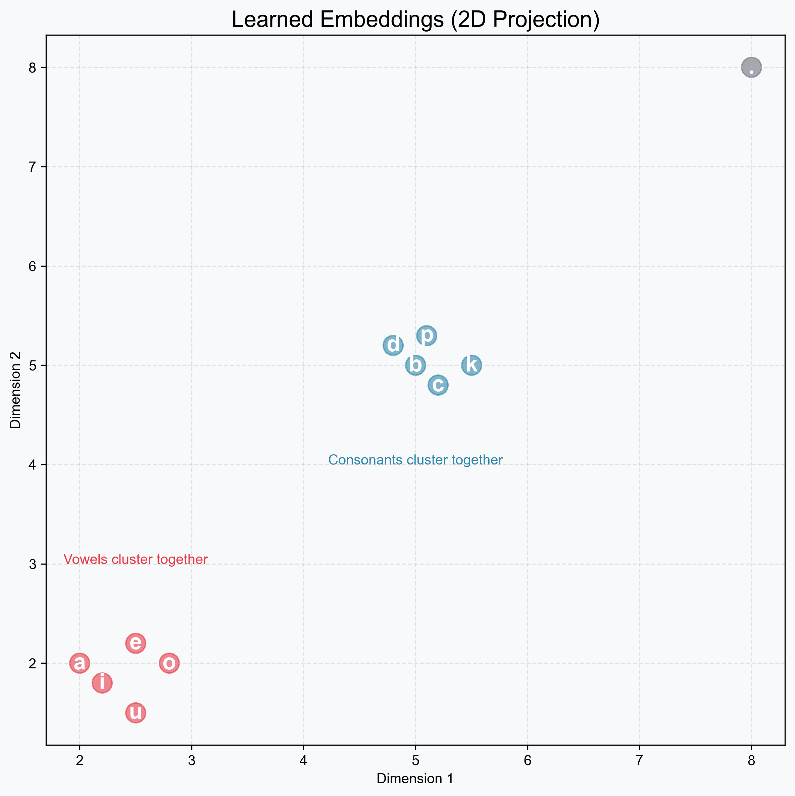
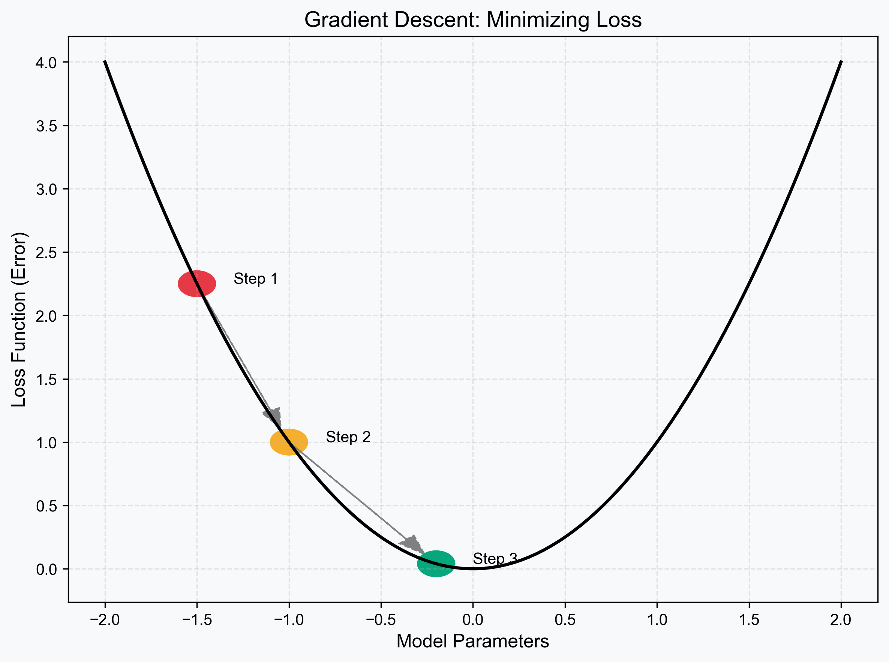
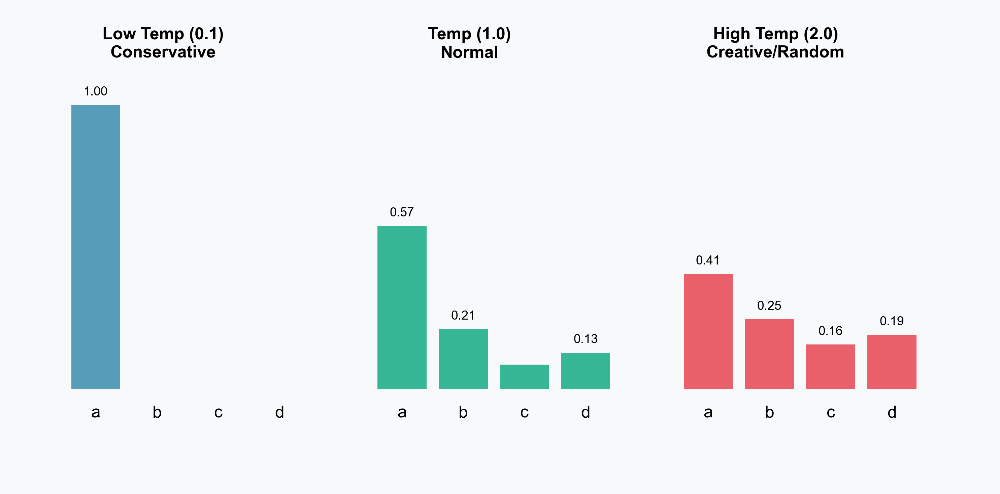

<!-- Slide 1 -->
# Next Token Prediction
## Building ChatGPT from Scratch (Conceptually)

**Nipun Batra**
*IIT Gandhinagar*

---

<!-- Slide 2 -->
# Overview of the Journey

Today we will build a Language Model from scratch.

1.  **The "Autocomplete" Game:** Intuition.
2.  **Level 1: Bigrams:** Just counting letters.
3.  **Level 2: Embeddings:** Representing meaning.
4.  **Level 3: Neural Networks (MLP):** Learning patterns.
5.  **Level 4: RNNs:** Adding memory (briefly).
6.  **Level 5: Transformers:** The "Attention" Revolution.
7.  **Real World:** How ChatGPT actually works.

---

# Part 1: The Intuition

---

<!-- Slide 3 -->
# The Core Problem

Deep Learning, at its heart, often answers one simple question:

**"Given what I have seen so far, what comes next?"**

This is a **Sequence Modeling** problem.

---

<!-- Slide 4 -->
# The "Autocomplete" Game

Let's play. Guess the next word:

**Sequence:** "New Delhi is the capital of ____"
**Your Brain:** "India" (100% confidence)

**Sequence:** "I want to eat ____"
**Your Brain:** "Pizza"? "Apples"? (Uncertainty)

> **Key Insight:** Language modeling is about assigning **probabilities** to the next token.

---

<!-- Slide 5 -->
# It's Just Prediction!

You might think ChatGPT "knows" physics or history.
Actually, it just predicts the next word.

*   **Input:** "F = m"
*   **Prediction:** "a" (Newton's Law)

*   **Input:** "To be or not to"
*   **Prediction:** "be" (Shakespeare)

If you predict well enough, you **appear** intelligent.

---

# Part 2: The "Counting" Era (Bigrams)

---

<!-- Slide 6 -->
# The Simplest Model: Bigrams

Imagine we want to generate Indian names like `aabid`, `zeel`, etc.
Let's look at the dataset: `["aabid", "zeel"]`.

**Idea:** Only look at the **last character**.
If I see `a`, what usually comes next?
*   In `aabid`: `a` -> `a`, `a` -> `b`. (50% each)

This is a **Bigram** (2-gram) model.

---

<!-- Slide 7 -->
# Visualizing Bigram Probabilities

We can build a huge lookup table by just counting.

This table *is* the model. No neural network yet!

---

<!-- Slide 8 -->
# Generating with Bigrams

1.  Start with `.` (start token).
2.  Look at row `.`. High prob for `a`, `z`.
3.  Roll dice -> Get `a`.
4.  Look at row `a`.
5.  Roll dice -> Get `b`.
6.  Repeat until `.` (end token).

**Result:** `abid`, `zel`, `aab`. (It makes decent syllables!)

---

<!-- Slide 9 -->
# Why Counting Fails

What if we want to write a sentence?
`"The quick brown fox jumps..."`

If I only see `fox`, I might predict `runs` or `eats`.
I **forgot** that the sentence started with `"The quick..."`!

*   **Bigram:** Context = 1 char. (Too small)
*   **Trigram:** Context = 2 chars.
*   **N-gram:** Context = N chars?

---

<!-- Slide 10 -->
# The Curse of Dimensionality

Why not just count 10-grams? (Last 10 characters).

*   **1-gram table:** $26$ rows.
*   **2-gram table:** $26^2 = 676$ rows.
*   **3-gram table:** $26^3 = 17,576$ rows.
*   **10-gram table:** $141,000,000,000,000$ rows!

**Impossible!** We need a better way than counting. We need to **approximate**.

---

# Part 3: Representing Meaning (Embeddings)

---

<!-- Slide 11 -->
# How do computers read?

Computers only understand numbers.
Option A: **One-Hot Encoding**

**Problem:** These vectors are **Orthogonal**.
Dot Product(`a`, `b`) = 0.
The computer thinks `a` and `b` are completely different. It doesn't know they are both letters!

---

<!-- Slide 12 -->
# Option B: Dense Embeddings

Let's represent each character as a list of **learnable attributes**.
Maybe:
*   Dim 1: "Is it a vowel?"
*   Dim 2: "Is it a common ending?"

`a` = `[0.9, 0.1]`
`e` = `[0.8, 0.2]`
`b` = `[-0.5, 0.1]`

Now, `a` and `e` are **mathematically close**!

---

<!-- Slide 13 -->
# The Latent Space

If we train a model, these embeddings organize themselves automatically.

This is the foundation of all modern NLP.

---

# Part 4: The Neural Network (MLP)

---

<!-- Slide 14 -->
# Moving to "Deep Learning"

Instead of a lookup table, let's use a **Multi-Layer Perceptron (MLP)**.

**Goal:** Predict $P(\text{next} | \text{context})$ using a function.
$$ y = f(x; W) $$

*   $x$: Context (e.g., 3 previous characters).
*   $W$: Weights (The "Brain").
*   $y$: Probabilities.

---

<!-- Slide 15 -->
# The Sliding Window

We create a dataset by sliding a window over text.

---

<!-- Slide 16 -->
# The Architecture

1.  **Lookup:** Get embeddings for `a`, `a`, `b`.
2.  **Concat:** Merge them into one big vector.
3.  **Hidden Layer:** Mix them (Feature extraction).
4.  **Output:** Softmax (Convert to probability).

---

<!-- Slide 17 -->
# The Architecture Diagram

---

<!-- Slide 18 -->
# How does it learn? (Training)

We start with random weights. The model is stupid.
It predicts `z` when the answer is `i`.

We calculate the **Loss** (Error).
Then we minimize it using **Gradient Descent**.

---

<!-- Slide 19 -->
# Minimizing Loss

We "slide down the hill" to find the best weights.
This updates both the **Weights** and the **Embeddings**!

---

# Part 5: The "Context" Bottleneck

---

<!-- Slide 20 -->
# The Problem with Fixed Windows

Our MLP has a fatal flaw.
It has a **Fixed Block Size** (e.g., 3 characters).

It can **never** see further back than 3 steps.

---

<!-- Slide 21 -->
# The "Alice" Example

The model sees `...with the ?`.
It has **no idea** Alice is holding a key. The key fell off the "Window".

---

<!-- Slide 22 -->
# Attempted Solution: RNNs

**Recurrent Neural Networks (RNNs)** try to fix this by keeping a "Memory".

**Issue:** For long sentences, the memory gets "muddy".
It's like the "Telephone Game". By the end, the message is lost.
(Vanishing Gradient Problem).

---

# Part 6: The Revolution (Transformers)

---

<!-- Slide 23 -->
# Enter Attention

What if, instead of a fixed window or a fading memory...
We could just **look back** at everything?

**Attention Mechanism:**
"I am at step 10. I can 'attend' to step 1, 5, or 9 depending on what is important."

---

<!-- Slide 24 -->
# The "Searchlight" Analogy

<strong>Fixed Window (MLP):</strong> Reading with tunnel vision.
<strong>RNN:</strong> Reading while trying to memorize everything.
<strong>Attention:</strong> Reading with a highlighter and a search engine.

When the model sees `"it"`, it asks: **"What object was mentioned before?"**
And it finds `"animal"`.

---

<!-- Slide 25 -->
# Attention Diagram

This "connection" allows the model to handle contexts of thousands of words!

---

<!-- Slide 26 -->
# How Attention Works (Q, K, V)

It uses a "Database Lookup" logic.

1.  **Query (Q):** What am I looking for? ("Holding object")
2.  **Key (K):** What does this word define? ("Alice", "Door")
3.  **Value (V):** The actual content.

**Score = Match(Q, K)**.

---

<!-- Slide 27 -->
# QKV Visualized

In ChatGPT, this happens **billions** of times in parallel!

---

# Part 7: From Theory to ChatGPT

---

<!-- Slide 28 -->
# Scaling Up

We built a character-level model.
ChatGPT is the **same thing**, just bigger.

*   **Tokens:** Not characters, but sub-words.
*   **Layers:** Not 1 hidden layer, but 96 layers.
*   **Heads:** Not 1 attention head, but 96 heads.
*   **Data:** The entire internet.

---

<!-- Slide 29 -->
# Tokenization

We don't use characters (too slow) or words (too many).
We use **Tokens** (Sub-words).

---

<!-- Slide 30 -->
# Sampling: The "Creativity" Knob

When ChatGPT generates, it picks from the probabilities.
We can control this with **Temperature**.

---

<!-- Slide 31 -->
# The Sampling Tree

Because we sample, we can get different stories every time!

---

<!-- Slide 32 -->
# Summary: The Recipe

To build a modern LLM:

1.  **Input:** Massive text data.
2.  **Tokenize:** Convert to numbers.
3.  **Embed:** Learn meaning.
4.  **Model:** Transformer (Attention) to predict next token.
5.  **Train:** Minimize Cross-Entropy Loss on GPUs for months.
6.  **RLHF:** Fine-tune it to be helpful (not covered today).

---

<!-- Slide 33 -->
# Resources

1.  **Andrej Karpathy:** "Neural Networks: Zero to Hero" (YouTube).
2.  **Jay Alammar:** "The Illustrated Transformer".
3.  **NanoGPT:** Karpathy's code repo to build this in 100 lines of Python.

---

# Thank You

**"The best way to predict the future is to create it."**

## Questions?