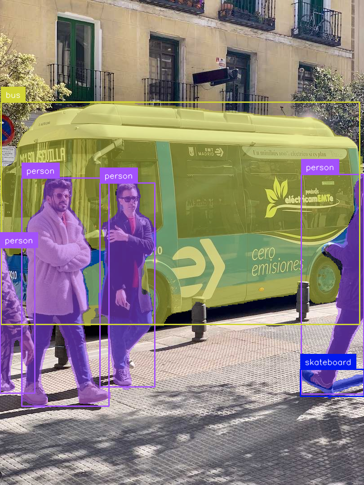

<!-- _class: title-slide -->
<!-- _paginate: false -->

# Object Detection Basics
## Deep Learning for Computer Vision

**Nipun Batra** | IIT Gandhinagar

*Teaching computers to see and locate objects*

---

# Why Object Detection?

**Imagine you're driving...** Your car needs to know:

| Question | Task | Example |
|----------|------|---------|
| **WHAT** is there? | Classification | "pedestrian", "car", "cyclist" |
| **WHERE** is it? | Localization | Bounding box coordinates |
| **HOW MANY?** | Counting | 3 pedestrians, 2 cars |

<div class="warning">
Classification alone says "there's a person somewhere" — not enough for driving!
</div>

<div class="insight">
Object Detection = Classification + Localization + Counting
</div>

---

# What You Will Learn Today

| Part | Topic | Key Question |
|------|-------|--------------|
| **1** | The Core Problem | Classification → Detection → Segmentation |
| **2** | Bounding Boxes | How do we represent "WHERE"? |
| **3** | IoU | How do we measure box quality? |
| **4** | NMS | How do we handle duplicate boxes? |
| **5** | YOLO Architecture | How do real detectors work? |
| **6** | Training & Metrics | How do we train and evaluate? |

---

# Part 1: The Core Problem
## What IS Object Detection?

---

# The Vision Task Hierarchy


---

# Classification vs Detection: Key Difference


**Classification:** ONE label for the whole image
**Detection:** MULTIPLE objects with locations (bounding boxes)

<div class="insight">
Detection = Classification + Localization + Counting (implicitly)
</div>

---

# A More Detailed Comparison

| Aspect | Classification | Detection | Segmentation |
|--------|---------------|-----------|--------------|
| **Output** | Single label | Boxes + labels | Pixel masks |
| **Multiple objects?** | No (or multi-label) | Yes ✓ | Yes ✓ |
| **Location?** | No | Box ✓ | Exact shape ✓ |
| **Typical use** | "What is this?" | "Where are things?" | "Precise boundaries" |
| **Difficulty** | Easier | Medium | Harder |
| **Speed** | Fastest | Fast | Slower |

<div class="realworld">
<strong>Real applications:</strong>
• Classification: "Is this X-ray normal?"
• Detection: "Where are the tumors?"
• Segmentation: "Exact tumor boundary for surgery planning"
</div>

---

# Real-World Detection Applications

<div class="columns">
<div>

**Autonomous Driving**
- Pedestrians, cars, signs
- Traffic lights, lanes

**Retail & Inventory**
- Shelf stock monitoring
- Checkout-free stores

**Security**
- Intrusion detection
- License plate recognition

</div>
<div>

**Smartphone Cameras**
- Face detection for focus
- AR filters positioning

**Medical Imaging**
- Tumor detection
- Cell counting

**Manufacturing**
- Defect detection
- Quality control

</div>
</div>

---

# Instance Segmentation: Beyond Boxes



| Detection | Segmentation |
|-----------|--------------|
| Bounding box (rectangle) | Pixel-perfect mask |
| Includes background | Only the object |
| Faster | More precise |

<div class="insight">
Segmentation is needed for: video editing backgrounds, medical boundaries, precise robotics
</div>

---

# Part 2: Bounding Boxes
## How We Represent "WHERE"

---

# What IS a Bounding Box?

A bounding box is a **RECTANGLE** that tightly contains an object.

The box is defined by **4 numbers**. But WHICH 4?

<div class="warning">
Different systems use different conventions — this causes many bugs!
</div>


---

# The Three Main Formats

| Format | Values | Used By |
|--------|--------|---------|
| **Corner (xyxy)** | (x1, y1, x2, y2) | PyTorch, Pascal VOC |
| **Center (cxcywh)** | (cx, cy, w, h) | YOLO |
| **Corner+Size (xywh)** | (x, y, w, h) | COCO dataset |

**Example:** Box from (100, 50) to (300, 200)

| Format | Values |
|--------|--------|
| Corner | [100, 50, 300, 200] |
| Center | [200, 125, 200, 150] |
| Corner+Size | [100, 50, 200, 150] |

<div class="warning">
Always check your dataset's format before training!
</div>

---

# Format Conversion Cheat Sheet

```python
# Corner (x1,y1,x2,y2) → Center (cx,cy,w,h)
cx = (x1 + x2) / 2
cy = (y1 + y2) / 2
w = x2 - x1
h = y2 - y1

# Center (cx,cy,w,h) → Corner (x1,y1,x2,y2)
x1 = cx - w/2
y1 = cy - h/2
x2 = cx + w/2
y2 = cy + h/2

# Corner+Size (x,y,w,h) → Corner (x1,y1,x2,y2)
x1 = x
y1 = y
x2 = x + w
y2 = y + h
```

<div class="warning">
<strong>Common bug alert!</strong> Always check your dataset's format before training.
COCO uses [x,y,w,h], PASCAL VOC uses [x1,y1,x2,y2], YOLO uses normalized [cx,cy,w,h]
</div>

---

# Absolute vs Normalized Coordinates

| Type | Example | Pros/Cons |
|------|---------|-----------|
| **Absolute** (pixels) | [100, 50, 300, 200] | Breaks on resize |
| **Normalized** (0-1) | [0.156, 0.104, 0.469, 0.417] | Works at any size |

**Conversion:** `x_norm = x_pixel / image_width`

<div class="insight">
YOLO uses normalized center format: [cx/W, cy/H, w/W, h/H] — all values between 0 and 1
</div>

---

# Part 3: Intersection over Union (IoU)
## How Good Is a Detection?

---

# The Core Question

Your model predicted a box. Ground truth is another box.
**Is your prediction "correct"?**


---

# IoU: Visual Examples


---

# IoU Thresholds

| IoU Value | Interpretation | Action |
|-----------|---------------|--------|
| 0.0 | No overlap | Completely wrong |
| 0.3 | Poor overlap | Likely wrong |
| **0.5+** | Good overlap | **Counts as correct (TP)** |
| 0.75+ | Great overlap | High-quality detection |
| 1.0 | Perfect overlap | Identical boxes |

<div class="insight">
IoU ≥ 0.5 is the standard threshold for "correct" detection in most benchmarks.
</div>

---

# Computing IoU: Step by Step

```python
def compute_iou(box1, box2):
    """
    Boxes in format: [x1, y1, x2, y2]
    """
    # Step 1: Find intersection rectangle
    x1_inter = max(box1[0], box2[0])  # leftmost right edge
    y1_inter = max(box1[1], box2[1])  # topmost bottom edge
    x2_inter = min(box1[2], box2[2])  # rightmost left edge
    y2_inter = min(box1[3], box2[3])  # bottommost top edge

    # Step 2: Compute intersection area
    inter_width = max(0, x2_inter - x1_inter)
    inter_height = max(0, y2_inter - y1_inter)
    intersection = inter_width * inter_height

    # Step 3: Compute union area
    area1 = (box1[2] - box1[0]) * (box1[3] - box1[1])
    area2 = (box2[2] - box2[0]) * (box2[3] - box2[1])
    union = area1 + area2 - intersection

    # Step 4: IoU = intersection / union
    return intersection / union if union > 0 else 0
```

---

# Different Benchmarks, Different Thresholds

| Benchmark | Threshold | Classes | Notes |
|-----------|-----------|---------|-------|
| **PASCAL VOC** | IoU ≥ 0.5 | 20 | Older, easier |
| **MS COCO** | 0.50 to 0.95 | 80 | Modern standard |

<div class="insight">
COCO averages over 10 IoU thresholds — same model might get 60% on VOC but only 40% on COCO!
</div>

---

# Part 4: Non-Maximum Suppression (NMS)
## Cleaning Up Duplicate Detections

---

# The Problem: Too Many Boxes!

Detectors output **thousands of candidate boxes** — many for the same object!

**Example:** 5 overlapping boxes all detecting the same dog

| Box | Confidence |
|-----|------------|
| 1 | 0.95 |
| 2 | 0.93 |
| 3 | 0.91 |
| 4 | 0.87 |
| 5 | 0.85 |

**Problem:** We want ONE box per object, not five!

---

# NMS: The Solution

**Non-Maximum Suppression** = "Keep the best, remove the rest"


**The Algorithm:**
1. **Sort** all boxes by confidence (descending)
2. **Take** the best box, add to "keep" list
3. **Remove** all boxes with IoU > threshold (default 0.5) from queue
4. **Repeat** until queue is empty

Result: Multiple overlapping boxes -> One clean box per object!

---

# NMS: The Code

```python
def nms(boxes, scores, iou_threshold=0.5):
    """
    boxes: List of [x1, y1, x2, y2]
    scores: Confidence for each box
    Returns: Indices of boxes to keep
    """
    # Sort by score (descending)
    order = scores.argsort()[::-1]

    keep = []

    while len(order) > 0:
        # Take the best remaining box
        best_idx = order[0]
        keep.append(best_idx)

        # Compute IoU with all remaining boxes
        remaining = order[1:]
        ious = compute_iou_batch(boxes[best_idx], boxes[remaining])

        # Keep only boxes with low overlap (different objects)
        mask = ious <= iou_threshold
        order = remaining[mask]

    return keep
```

---

# NMS Parameters

| Threshold | Behavior | Use When |
|-----------|----------|----------|
| **0.3** (aggressive) | Removes more boxes | Objects far apart |
| **0.5** (standard) | Good balance | Most cases (default) |
| **0.7** (lenient) | Keeps more boxes | Crowded scenes |

<div class="insight">
Rule of thumb: Start with 0.5, adjust based on your data.
</div>

---

# Part 5: How Detectors Work
## The YOLO Architecture

---

# Two Families of Detectors


---

# YOLO: You Only Look Once

**The revolutionary idea (2015):**

| Before YOLO | YOLO |
|-------------|------|
| Run classifier 1000s of times | Run CNN **ONCE** |
| Check each location separately | Output everything directly |
| Very slow (seconds) | Very fast (milliseconds) |

<div class="insight">
YOLO = "You Only Look Once" — the entire detection in a single neural network pass
</div>

---

# YOLO Core Idea: Grid Division


The cell containing the object's **CENTER** is "responsible" for detecting it.

---

# What Each Cell Predicts

Each grid cell outputs:

**Per bounding box (B boxes/cell):**
- x, y = center offset (relative to cell)
- w, h = width, height (relative to image)
- confidence = P(object) × IoU

**Per cell (shared):**
- Class probabilities: P(class1), P(class2), ...

**Output shape:** S × S × (B × 5 + C)

Example: 7 × 7 × (2 × 5 + 20) = 7 × 7 × 30 = **1470 numbers**

---

# Anchor Boxes: Handling Multiple Objects

**Problem:** What if TWO objects have centers in the SAME cell?

**Solution:** Anchor boxes — pre-defined shapes for different object types


Each anchor predicts separately → cell can detect person (tall) AND car (wide)!

---

# YOLO Evolution

| Version | Year | Key Innovation |
|---------|------|----------------|
| **v1** | 2015 | Original breakthrough, 45 FPS |
| **v2** | 2016 | Anchor boxes, batch norm |
| **v3** | 2018 | Multi-scale (3 grid sizes) |
| **v4** | 2020 | Mosaic augmentation |
| **v5-v8** | 2020-23 | PyTorch native, easy API |

---

# YOLO Architecture Overview


---

# YOLOv8 Model Sizes

| Model | Parameters | mAP (COCO) | Speed |
|-------|-----------|------------|-------|
| **v8n** (nano) | 3.2M | 37.3 | ~1 ms |
| **v8s** (small) | 11.2M | 44.9 | ~1.5 ms |
| **v8m** (medium) | 25.9M | 50.2 | ~2.5 ms |
| **v8l** (large) | 43.7M | 52.9 | ~4 ms |
| **v8x** (extra) | 68.2M | 53.9 | ~6 ms |

<div class="insight">
Start with YOLOv8n for prototyping, move to larger models if needed.
</div>

---

# Part 6: Training & Evaluation
## How We Train and Measure Detectors

---

# The Detection Loss Function


Detection models optimize **THREE objectives** simultaneously!

---

# Precision and Recall for Detection

| Term | Meaning |
|------|---------|
| **True Positive (TP)** | Detection matches ground truth (IoU ≥ 0.5, correct class) |
| **False Positive (FP)** | Detection doesn't match any ground truth |
| **False Negative (FN)** | Ground truth object not detected |

<div class="columns">
<div>

**Precision** = TP / (TP + FP)
"Of my detections, how many are correct?"

</div>
<div>

**Recall** = TP / (TP + FN)
"Of actual objects, how many did I find?"

</div>
</div>

---

# Precision-Recall Curve


**AP (Average Precision)** = Area under this curve

---

# Mean Average Precision (mAP)


**mAP** = Mean of AP across all classes

---

# Data Augmentation for Detection

**Important:** When transforming the image, ALSO transform the boxes!

| Augmentation | Box Transformation |
|--------------|-------------------|
| **Horizontal flip** | x_new = W - x_old |
| **Scale/Resize** | Multiply coords by scale |
| **Crop** | Remove/clip boxes, adjust origin |
| **Mosaic** | Combine 4 images → 4× objects! |

---

# Training Tips

| Tip | Why |
|-----|-----|
| **Start with pretrained weights** | Much faster than training from scratch |
| **Balance your dataset** | Or use focal loss for imbalance |
| **Use auto-anchor** | Computes best anchors for your data |
| **Larger images** | Better small object detection |
| **More augmentation** | Better generalization |

<div class="insight">
640×640 is the common default image size for YOLO training.
</div>

---

# Common Detection Benchmarks

| Dataset | Classes | Images | Notes |
|---------|---------|--------|-------|
| **PASCAL VOC** | 20 | ~10K | Classic, mAP@0.5 |
| **MS COCO** | 80 | ~120K | Modern standard |
| **Open Images** | 600 | 1.7M | Largest |
| **Custom** | Your data | Varies | Roboflow, CVAT |

---

# Complete Detection Pipeline


---

# Getting Started: YOLO in 3 Lines

```python
# Install: pip install ultralytics

from ultralytics import YOLO

# Load a pretrained model
model = YOLO('yolov8n.pt')

# Run detection on an image
results = model('your_image.jpg')

# Display results
results[0].show()

# Access detections programmatically
for box in results[0].boxes:
    cls = int(box.cls[0])           # Class index
    conf = float(box.conf[0])       # Confidence
    xyxy = box.xyxy[0].tolist()     # [x1, y1, x2, y2]

    print(f"Class: {model.names[cls]}, Conf: {conf:.2f}")
    print(f"Box: {xyxy}")
```

<div class="realworld">
That's it! You now have a working object detector. Try it on your own photos!
</div>

---

# Training on Custom Data

```python
# Step 1: Prepare your dataset (YOLO format)
# data/
#   images/
#     train/  val/
#   labels/
#     train/  val/
# Each label file: class_id cx cy w h (normalized)

# Step 2: Create data.yaml
"""
path: ./data
train: images/train
val: images/val
names:
  0: cat
  1: dog
  2: bird
"""

# Step 3: Train!
from ultralytics import YOLO

model = YOLO('yolov8n.pt')  # Start from pretrained

results = model.train(
    data='data.yaml',
    epochs=50,
    imgsz=640,
    batch=16
)

# Step 4: Use your trained model
model = YOLO('runs/detect/train/weights/best.pt')
model.predict('test_image.jpg')
```

---

# Summary: Key Takeaways

| # | Concept | Key Point |
|---|---------|-----------|
| 1 | **Detection** | Classification + Localization |
| 2 | **Box Formats** | Check corner vs center, absolute vs normalized |
| 3 | **IoU** | ≥0.5 = correct detection |
| 4 | **NMS** | Keep best, remove overlapping |
| 5 | **YOLO** | One-stage, grid-based, real-time |
| 6 | **mAP** | Gold standard metric |
| 7 | **Pretrained** | Always start with pretrained weights |

---

# Resources for Learning More

<div class="columns">
<div>

**Papers:**
- YOLO v1 (Redmon, 2015)
- Faster R-CNN (Ren, 2015)
- DETR (Carion, 2020)

**Code:**
- Ultralytics YOLOv8
- Roboflow Blog
- PyTorch Detection

</div>
<div>

**Datasets:**
- MS COCO
- Open Images
- Roboflow Universe (100K+)

**Next Steps:**
- Try on your own images
- Fine-tune on custom data
- Explore segmentation

</div>
</div>

---

# Thank You!

**Object Detection opens the door to...**

- Self-driving cars
- Augmented reality
- Medical diagnosis
- Smart retail
- Security systems
- Robotics

And so much more!

**Questions?**

---

# Appendix: Common Pitfalls

| Problem | Solution |
|---------|----------|
| Wrong box format | Always verify format in docs |
| Forgetting to normalize | Use normalized coords |
| NMS too aggressive | Increase threshold (0.5 → 0.7) |
| Small objects missed | Use larger image size |
| Class imbalance | Oversample rare classes, focal loss |

---

# Appendix: IoU Loss Variants

| Loss | Formula | Benefit |
|------|---------|---------|
| **IoU** | L = 1 - IoU | Simple |
| **GIoU** | Adds enclosing box penalty | Handles non-overlap |
| **DIoU** | Adds center distance | Faster convergence |
| **CIoU** | Adds aspect ratio | Best overall |
