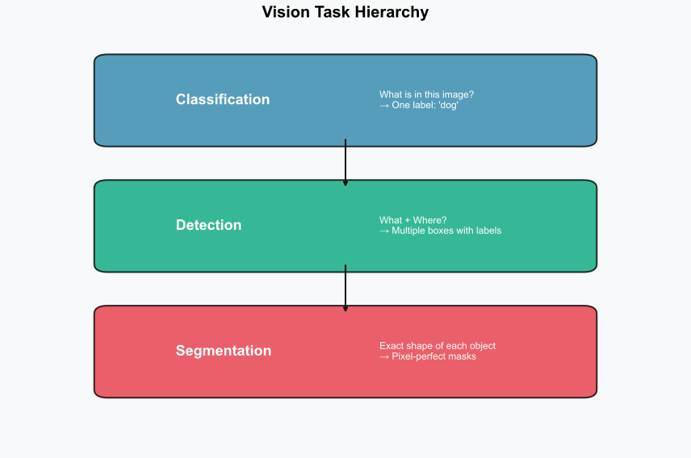
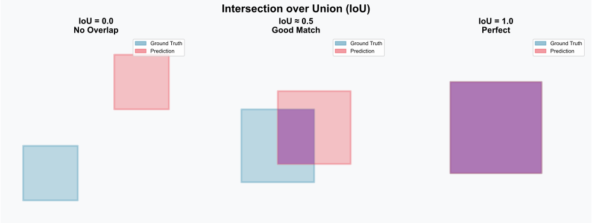
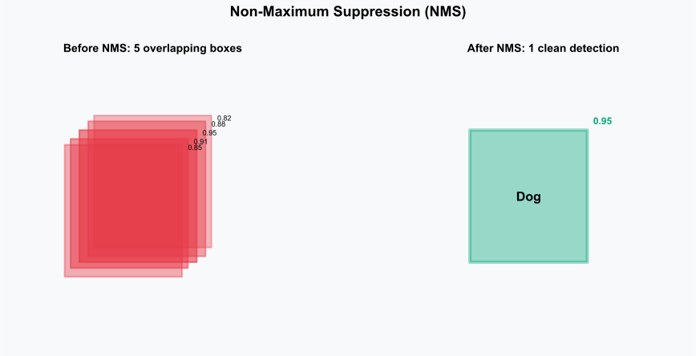
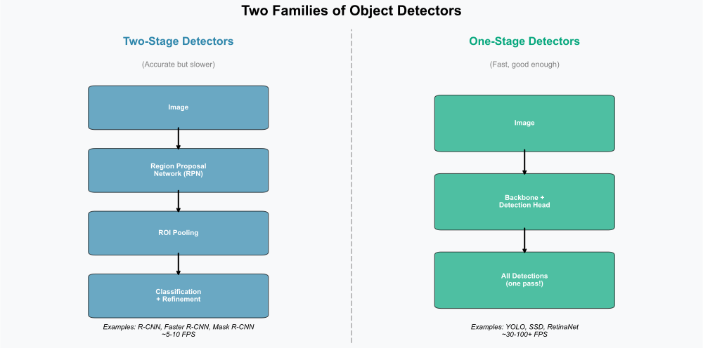
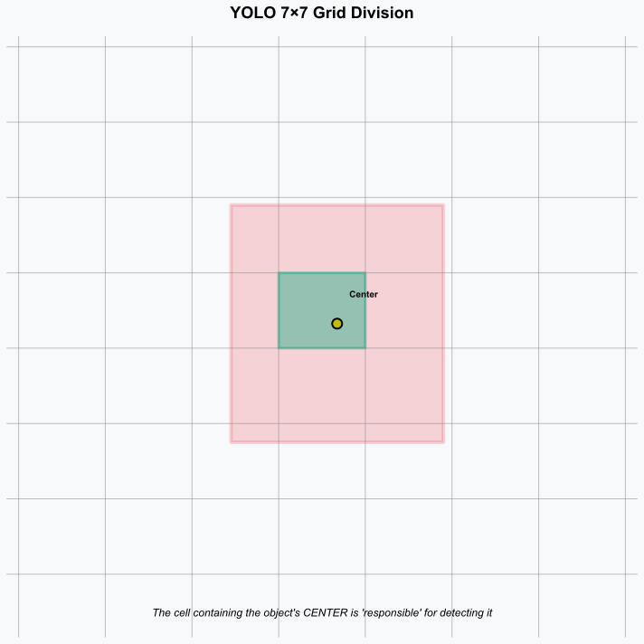
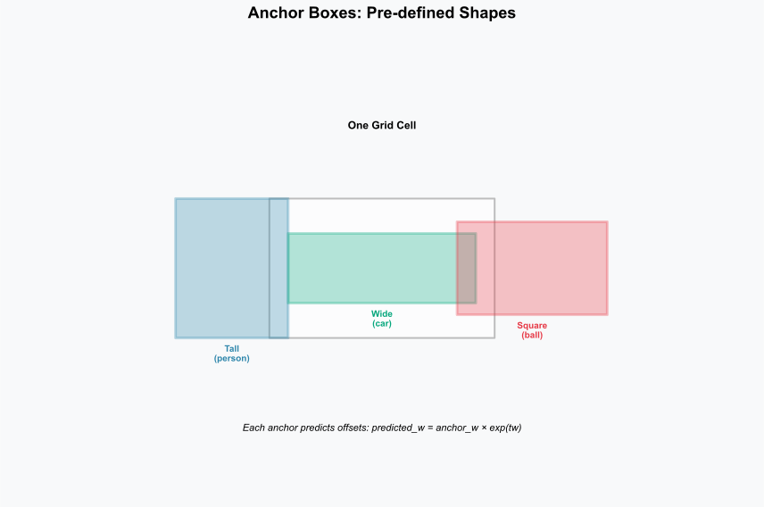
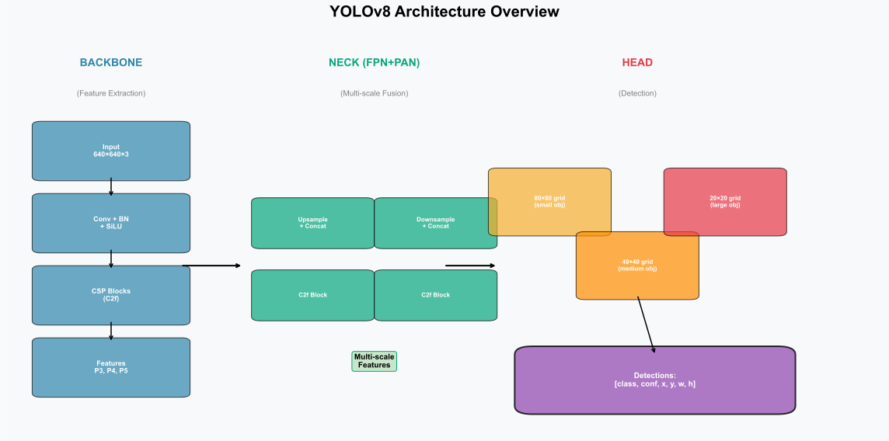
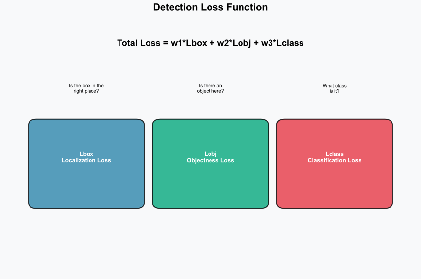
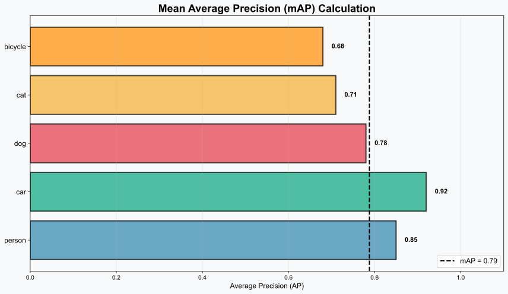

<!-- _class: title-slide -->
<!-- _paginate: false -->

# Object Detection Basics
## Teaching Computers to See and Locate

**Nipun Batra** | IIT Gandhinagar

*From "What's in this image?" to "Where is everything?"*

---

# A Simple Question That Changes Everything

**What do you see?**

A photograph of a street scene...

| Human Answer | Computer Answer (Classification) |
|--------------|----------------------------------|
| "3 people crossing, a red car waiting, a bicycle parked, a dog on the sidewalk" | "street scene" |

<div class="warning">
Classification gives ONE answer for the WHOLE image. But the real world has MANY things!
</div>

---

# The Problem We're Solving

Imagine you're building a **self-driving car**. You need to know:

| Question | Why It Matters |
|----------|----------------|
| **WHAT** is there? | Is it a pedestrian? A car? A traffic cone? |
| **WHERE** is it? | How far? Which lane? Will we collide? |
| **HOW MANY?** | One child? Or five running across? |

<div class="insight">
Classification answers WHAT. Detection answers WHAT + WHERE + HOW MANY.
</div>

---

# What You'll Learn Today

| Part | Topic | The Big Question |
|------|-------|------------------|
| **1** | Why Detection? | What can't classification do? |
| **2** | Bounding Boxes | How do we say "WHERE"? |
| **3** | IoU | How do we know if a detection is correct? |
| **4** | NMS | Why do we get duplicates? How to fix? |
| **5** | YOLO | How does modern detection actually work? |
| **6** | Training & Metrics | How do we measure success? |

---

<!-- _class: section-divider -->

# Part 1: Why Detection?
## From Classification to Understanding Scenes

---

# Classification: The Success Story

**ImageNet Challenge (2012):** Deep learning beat humans at classification!

| What Classification Does Well | Example |
|------------------------------|---------|
| "What animal is this?" | "golden retriever" |
| "Is this X-ray normal?" | "normal" / "abnormal" |
| "What digit is written?" | "7" |

<div class="insight">
Classification = One image → One label (or multiple labels)
</div>

---

# Classification: The Limitation

**The same image, different questions:**

| Question | Classification Answer | What We Actually Need |
|----------|----------------------|----------------------|
| "Any dogs here?" | "Yes" ✓ | "Yes, 2 dogs at these locations" |
| "Where is the dog?" | "Uh..." ✗ | Coordinates: (120, 50) to (280, 200) |
| "How many dogs?" | "At least one?" ✗ | Exactly 2 |

<div class="warning">
Classification loses <strong>spatial information</strong> — it knows WHAT but not WHERE!
</div>

---

# The Vision Task Hierarchy



Each level adds more information about the scene.

---

# Classification → Detection → Segmentation

| Task | Question | Output | Example Application |
|------|----------|--------|---------------------|
| **Classification** | "What is this?" | One label | "Is this email spam?" |
| **Detection** | "What + Where?" | Boxes + labels | "Where are faces in this photo?" |
| **Segmentation** | "Exact boundaries?" | Pixel masks | "Cut out the person for a video call" |

---

# Why Boxes? Why Not Exact Shapes?

**Bounding boxes are a compromise:**

| Approach | Pros | Cons |
|----------|------|------|
| **Bounding Box** | Fast, simple, usually enough | Includes some background |
| **Pixel Mask** | Precise boundaries | Slower, harder to annotate |

<div class="insight">
For self-driving: boxes are enough to avoid hitting a pedestrian.
For medical imaging: you might need the exact tumor boundary.
</div>

---

# Detection in the Real World

<div class="columns">
<div>

**Every Day:**
- Smartphone face detection
- Google Photos search
- Social media filters

**Industry:**
- Warehouse robots
- Quality inspection
- Retail analytics

</div>
<div>

**Critical Applications:**
- Self-driving vehicles
- Medical imaging (tumor detection)
- Security and surveillance

**Research Frontiers:**
- Wildlife monitoring
- Satellite imagery analysis
- Sports analytics

</div>
</div>

---

# Example: Autonomous Driving

A single frame might contain:

| Object Type | Count | Why Detection Matters |
|-------------|-------|----------------------|
| Pedestrians | 5 | Must stop or slow down |
| Vehicles | 12 | Track their trajectories |
| Traffic Signs | 3 | Obey speed limits |
| Traffic Lights | 2 | Red means stop! |
| Lane Markings | 4 | Stay in lane |

**All detected in ~30ms (30+ FPS) — faster than you blink!**

---

# Example: Medical Imaging

**Task:** Find potential tumors in a CT scan

| Without Detection | With Detection |
|-------------------|----------------|
| "This scan may have tumors" | "Found 3 suspicious regions:" |
| Doctor searches entire scan | Box 1: (x, y) - 95% confidence |
| Time: 10-15 minutes | Box 2: (x, y) - 87% confidence |
| May miss small tumors | Box 3: (x, y) - 72% confidence |

<div class="realworld">
Detection doesn't replace doctors — it helps them focus on the right areas!
</div>

---

<!-- _class: section-divider -->

# Part 2: Bounding Boxes
## The Language of "WHERE"

---

# What IS a Bounding Box?

A bounding box is the **smallest rectangle** that completely contains an object.

**Why rectangles?**
- Easy to store (just 4 numbers!)
- Easy to compute with
- Good enough for most applications

<div class="insight">
4 numbers can describe any axis-aligned rectangle. But WHICH 4?
</div>

---

# The 4-Number Question

To describe a rectangle, we need 4 numbers. But there are different ways:

| Convention | The 4 Numbers | Intuition |
|------------|--------------|-----------|
| **Corners** | (x1, y1, x2, y2) | "From here to there" |
| **Center** | (cx, cy, w, h) | "Centered here, this big" |
| **Corner + Size** | (x, y, w, h) | "Starting here, this big" |

---

# Visual Comparison


---

# Format 1: Corner Format (xyxy)

**The 4 numbers:** Top-left corner (x1, y1) and bottom-right corner (x2, y2)

```
Box: [100, 50, 300, 200]
      ↑    ↑   ↑    ↑
      x1   y1  x2   y2
```

| Pros | Cons |
|------|------|
| Intuitive — two corners | Less compact for storage |
| Easy to draw | Need to compute size |
| Used by: PyTorch, PASCAL VOC | |

---

# Format 2: Center Format (cxcywh)

**The 4 numbers:** Center point (cx, cy) and dimensions (width, height)

```
Box: [200, 125, 200, 150]
      ↑    ↑    ↑    ↑
      cx   cy   w    h
```

| Pros | Cons |
|------|------|
| Great for neural networks | Less intuitive |
| Predicting offsets is easier | Need to convert for drawing |
| Used by: YOLO | |

---

# Format 3: Corner + Size (xywh)

**The 4 numbers:** Top-left corner (x, y) and dimensions (width, height)

```
Box: [100, 50, 200, 150]
      ↑    ↑   ↑    ↑
      x    y   w    h
```

| Pros | Cons |
|------|------|
| Compact, widely used | Mixing conventions causes bugs! |
| Used by: COCO dataset | |

---

# The Conversion Cheat Sheet

**From Corners to Center:**
```python
cx = (x1 + x2) / 2    # middle x
cy = (y1 + y2) / 2    # middle y
w = x2 - x1           # width
h = y2 - y1           # height
```

**From Center to Corners:**
```python
x1 = cx - w/2    # left edge
y1 = cy - h/2    # top edge
x2 = cx + w/2    # right edge
y2 = cy + h/2    # bottom edge
```

---

# The Normalization Question

**Absolute coordinates** depend on image size:
- Image: 640×480 → Box: [100, 50, 300, 200]
- Resize to 320×240 → Box needs to change!

**Normalized coordinates** are relative (0 to 1):
- Box: [0.156, 0.104, 0.469, 0.417]
- Works at ANY image size!

**Conversion:**
```python
x_norm = x_pixel / image_width
y_norm = y_pixel / image_height
```

---

# YOLO Format: The Full Picture

YOLO uses **normalized center format**:

```
class_id  cx     cy     w      h
   0     0.45   0.52   0.31   0.42
```

| Property | Value | Meaning |
|----------|-------|---------|
| class_id | 0 | First class (e.g., "person") |
| cx | 0.45 | Center is 45% from left |
| cy | 0.52 | Center is 52% from top |
| w | 0.31 | Width is 31% of image |
| h | 0.42 | Height is 42% of image |

---

# The #1 Bug in Object Detection

<div class="warning">
<strong>Format mismatch!</strong> Your model outputs one format, your loss function expects another.
</div>

| Dataset/Model | Format | Normalized? |
|---------------|--------|-------------|
| PASCAL VOC | (x1, y1, x2, y2) | No (pixels) |
| MS COCO | (x, y, w, h) | No (pixels) |
| YOLO | (cx, cy, w, h) | Yes (0-1) |

**Always check the documentation!**

---

<!-- _class: section-divider -->

# Part 3: IoU
## "How Good Is This Detection?"

---

# The Matching Problem

Your model predicts a box. The ground truth is another box.

**Question:** Is this prediction "correct"?

| Scenario | Should it count as correct? |
|----------|----------------------------|
| Perfect overlap | Yes! ✓ |
| 90% overlap | Probably yes |
| 50% overlap | Maybe? |
| 10% overlap | Probably not |
| No overlap | Definitely no ✗ |

**We need a NUMBER to measure this!**

---

# IoU: Intersection over Union


$$\text{IoU} = \frac{\text{Area of Overlap}}{\text{Area of Union}}$$

---

# IoU: Visual Examples



---

# Understanding IoU Values

| IoU | What it looks like | Interpretation |
|-----|-------------------|----------------|
| **0.0** | No overlap at all | Complete miss |
| **0.3** | Small overlap | Poor detection |
| **0.5** | Decent overlap | Standard threshold |
| **0.75** | Most of both boxes overlap | High-quality |
| **1.0** | Identical boxes | Perfect |

<div class="insight">
IoU = 0.5 is the most common threshold for "correct" detection.
</div>

---

# Why IoU ≥ 0.5?

**IoU ≥ 0.5 means:**
- More than half of the prediction is correct
- More than half of the object is found
- "Reasonable" human judgment threshold

<div class="warning">
But different benchmarks use different thresholds!
</div>

| Benchmark | Threshold | Notes |
|-----------|-----------|-------|
| PASCAL VOC | IoU ≥ 0.5 | Classic, lenient |
| MS COCO | 0.50 to 0.95 | Modern, strict |

---

# Computing IoU: Step by Step

**Given two boxes in (x1, y1, x2, y2) format:**

```python
def compute_iou(box1, box2):
    # Step 1: Find intersection coordinates
    x1_i = max(box1[0], box2[0])  # rightmost left edge
    y1_i = max(box1[1], box2[1])  # bottommost top edge
    x2_i = min(box1[2], box2[2])  # leftmost right edge
    y2_i = min(box1[3], box2[3])  # topmost bottom edge

    # Step 2: Intersection area (0 if no overlap)
    inter = max(0, x2_i - x1_i) * max(0, y2_i - y1_i)

    # Step 3: Union = A + B - Intersection
    area1 = (box1[2]-box1[0]) * (box1[3]-box1[1])
    area2 = (box2[2]-box2[0]) * (box2[3]-box2[1])
    union = area1 + area2 - inter

    return inter / union if union > 0 else 0
```

---

# IoU Intuition: The Venn Diagram

Think of IoU like a Venn diagram:

```
    ┌─────────────────┐
    │   Predicted     │
    │      ┌──────────┼──────┐
    │      │ OVERLAP  │      │
    │      │  (I)     │      │
    └──────┼──────────┘      │
           │    Ground Truth │
           └─────────────────┘
```

$$\text{IoU} = \frac{I}{P + G - I}$$

**IoU penalizes both:**
- Missing parts of the object (low recall)
- Including too much background (low precision)

---

<!-- _class: section-divider -->

# Part 4: NMS
## Cleaning Up the Mess

---

# The Problem: Detection Overload

Modern detectors don't output ONE box per object.

They output **THOUSANDS** of candidates!

| Stage | Number of Boxes |
|-------|-----------------|
| Raw network output | ~8,000+ |
| After confidence filter (>0.5) | ~100-500 |
| After NMS | ~5-20 (actual objects) |

**Why so many?** The network is uncertain — it hedges its bets!

---

# What NMS Sees: Before Cleanup

Imagine detecting a single dog:

| Box ID | Confidence | IoU with Box 1 |
|--------|------------|----------------|
| Box 1 | **0.95** | 1.0 (itself) |
| Box 2 | 0.93 | 0.85 |
| Box 3 | 0.91 | 0.80 |
| Box 4 | 0.88 | 0.75 |
| Box 5 | 0.85 | 0.70 |

**All 5 boxes are detecting the SAME dog!**

---

# NMS: The Intuition

**Non-Maximum Suppression** = "Keep the winners, remove the duplicates"

**Analogy:** Olympic medals
- Many runners cross the finish line
- Only ONE gets the gold (highest confidence)
- Runners "too close" to the winner don't get medals

<div class="insight">
NMS keeps the best box, removes boxes that overlap too much with it.
</div>

---

# NMS: Before and After



---

# NMS Algorithm: Step by Step

```
1. SORT all boxes by confidence (highest first)
2. PICK the best box → add to KEEP list
3. REMOVE all boxes with IoU > threshold with picked box
4. REPEAT steps 2-3 until no boxes remain
5. RETURN the KEEP list
```

**Example with threshold = 0.5:**

| Step | Action | Keep List |
|------|--------|-----------|
| 1 | Pick Box 1 (0.95) | [Box 1] |
| 2 | Remove Box 2-5 (IoU > 0.5 with Box 1) | [Box 1] |
| 3 | Done! | [Box 1] |

---

# NMS in Code

```python
def nms(boxes, scores, iou_threshold=0.5):
    # Sort by confidence (descending)
    order = scores.argsort()[::-1]
    keep = []

    while len(order) > 0:
        # Take the best remaining box
        best = order[0]
        keep.append(best)

        # Remove boxes that overlap too much
        remaining = order[1:]
        ious = compute_iou_batch(boxes[best], boxes[remaining])
        order = remaining[ious <= iou_threshold]

    return keep
```

---

# Choosing the NMS Threshold

| Threshold | Effect | Best For |
|-----------|--------|----------|
| **0.3** (strict) | Removes more boxes | Objects far apart |
| **0.5** (default) | Balanced | Most cases |
| **0.7** (lenient) | Keeps more boxes | Crowded scenes |

<div class="warning">
Too strict → misses overlapping objects (people in a crowd)
Too lenient → keeps duplicates
</div>

---

# NMS Failure Case: Crowded Scenes

**Problem:** Two people standing very close

| Person | Boxes | What happens |
|--------|-------|--------------|
| Person A | Best: 0.95 | ✓ Kept |
| Person B | Best: 0.92, IoU=0.6 with A | ✗ Removed! |

**Solutions:**
- Soft-NMS (reduce score instead of removing)
- Class-aware NMS (only compare same class)
- Learned NMS (let the network decide)

---

<!-- _class: section-divider -->

# Part 5: How Detectors Work
## The YOLO Revolution

---

# Before YOLO: The Slow Way

**R-CNN (2014):** Region-based CNN

1. Generate ~2,000 region proposals
2. For EACH region: crop, resize, run CNN
3. Classify each region

| Pros | Cons |
|------|------|
| Accurate | 2,000 CNN runs per image! |
| | ~47 seconds per image |
| | Cannot run in real-time |

---

# Two Families of Detectors



---

# YOLO: The Big Idea (2015)

**"You Only Look Once"** — process the ENTIRE image in ONE pass!

| Old Approach | YOLO Approach |
|--------------|---------------|
| Propose regions → Classify each | Single neural network |
| 2,000 region classifications | All detections at once |
| ~47 seconds | ~0.02 seconds (45 FPS!) |

<div class="insight">
YOLO reframes detection as a regression problem, not a classification problem.
</div>

---

# YOLO Core Idea: Grid Division



**Key insight:** The cell containing the object's CENTER is responsible for detecting it.

---

# What Each Grid Cell Predicts

For each cell in a 7×7 grid:

| Prediction | What it means |
|------------|---------------|
| (x, y) | Center offset within cell |
| (w, h) | Width and height (relative) |
| confidence | P(object) × IoU |
| class probs | P(dog), P(cat), P(car), ... |

**One forward pass → All predictions at once!**

---

# Understanding YOLO Output

**Example:** 7×7 grid, 2 boxes per cell, 20 classes

| Component | Shape | Description |
|-----------|-------|-------------|
| Grid | 7 × 7 | 49 cells |
| Per box | 5 numbers | x, y, w, h, confidence |
| Boxes per cell | 2 | Handle overlapping objects |
| Classes | 20 | Shared per cell |

**Total output:** 7 × 7 × (2 × 5 + 20) = 7 × 7 × 30 = **1,470 numbers**

---

# The Anchor Box Innovation (YOLOv2)

**Problem:** What if two objects have centers in the same cell?

**Solution:** Anchor boxes — pre-defined shapes



Each anchor specializes in a shape (tall person vs. wide car).

---

# How Anchors Work

Instead of predicting raw (w, h), predict offsets from anchors:

```python
# Anchor: pre-defined (anchor_w, anchor_h)
# Network predicts: (tx, ty, tw, th)

# Final box:
predicted_w = anchor_w * exp(tw)
predicted_h = anchor_h * exp(th)
```

| Benefit | Why |
|---------|-----|
| Easier to learn | Small adjustments, not raw values |
| Shape priors | Network knows "people are tall" |
| Handle same cell | Different anchors, different objects |

---

# YOLO Evolution Timeline

| Version | Year | Key Innovation |
|---------|------|----------------|
| **v1** | 2015 | Original — 45 FPS, mAP 63.4 |
| **v2** | 2016 | Anchor boxes, batch norm, multi-scale |
| **v3** | 2018 | 3 detection scales (small/med/large) |
| **v4** | 2020 | Mosaic augmentation, CSPNet backbone |
| **v5** | 2020 | PyTorch native, Ultralytics |
| **v8** | 2023 | Anchor-free, decoupled head |

---

# YOLO Architecture Overview



---

# The Three Parts of YOLO

| Component | Purpose | Example |
|-----------|---------|---------|
| **Backbone** | Extract features | CSPDarknet, ResNet |
| **Neck** | Combine multi-scale features | FPN, PANet |
| **Head** | Output detections | Decoupled head (v8) |

<div class="insight">
The backbone is often pre-trained on ImageNet. You can swap different backbones!
</div>

---

# Multi-Scale Detection: Why It Matters

**Problem:** Objects come in different sizes

| Grid Size | Best For | Why |
|-----------|----------|-----|
| 80×80 | Small objects | More cells, finer detail |
| 40×40 | Medium objects | Balance |
| 20×20 | Large objects | Larger receptive field |

**YOLOv8 outputs detections at ALL THREE scales simultaneously!**

---

# Choosing a YOLO Model

| Model | Parameters | mAP | Speed | Use Case |
|-------|-----------|-----|-------|----------|
| **YOLOv8n** | 3.2M | 37.3 | ~1ms | Edge devices, phones |
| **YOLOv8s** | 11.2M | 44.9 | ~1.5ms | General use |
| **YOLOv8m** | 25.9M | 50.2 | ~2.5ms | Better accuracy |
| **YOLOv8l** | 43.7M | 52.9 | ~4ms | High accuracy needed |
| **YOLOv8x** | 68.2M | 53.9 | ~6ms | Maximum accuracy |

<div class="insight">
Start with YOLOv8n for prototyping. Only go bigger if you need more accuracy.
</div>

---

<!-- _class: section-divider -->

# Part 6: Training & Metrics
## How We Measure Success

---

# The Detection Loss Function

Unlike classification (one loss), detection has **THREE losses:**



$$\text{Total Loss} = \lambda_1 L_{\text{box}} + \lambda_2 L_{\text{obj}} + \lambda_3 L_{\text{class}}$$

---

# Understanding Each Loss Component

| Loss | Question | Example |
|------|----------|---------|
| **Box Loss** | Is the box in the right place? | IoU loss, GIoU, CIoU |
| **Objectness Loss** | Is there an object here? | Binary cross-entropy |
| **Class Loss** | What type of object? | Cross-entropy |

<div class="insight">
Box loss is the hardest — the model must learn WHERE things are!
</div>

---

# Box Loss: From L1 to CIoU

| Loss | Formula | Problem It Solves |
|------|---------|-------------------|
| **L1** | $\|x_1 - x_1'\| + ...$ | Simple but scale-sensitive |
| **IoU** | $1 - \text{IoU}$ | Scale-invariant |
| **GIoU** | Adds enclosing box | Handles non-overlapping |
| **CIoU** | Adds center + aspect | Best convergence |

**Modern detectors use CIoU or DIoU loss.**

---

# True/False Positives in Detection

| Term | Meaning | Example |
|------|---------|---------|
| **True Positive (TP)** | Correct detection | Found a dog, it's a dog |
| **False Positive (FP)** | Wrong detection | Said "dog" but nothing there |
| **False Negative (FN)** | Missed object | Dog exists but not detected |

<div class="warning">
For TP: need BOTH correct class AND IoU ≥ threshold!
</div>

---

# Precision vs Recall: The Trade-off

**Precision:** "Of my detections, how many are correct?"

$$\text{Precision} = \frac{TP}{TP + FP}$$

**Recall:** "Of actual objects, how many did I find?"

$$\text{Recall} = \frac{TP}{TP + FN}$$

---

# The Precision-Recall Trade-off

| If you... | Precision | Recall |
|-----------|-----------|--------|
| Only detect when very confident | High ↑ | Low ↓ |
| Detect everything suspicious | Low ↓ | High ↑ |

**Example trade-off:**
- Security system: High recall (don't miss intruders!)
- Photo tagging: High precision (don't annoy users with wrong tags)

---

# Precision-Recall Curve


**AP (Average Precision)** = Area under this curve

---

# From AP to mAP

**AP** = Average Precision for ONE class

**mAP** = Mean AP across ALL classes



---

# mAP Variants

| Metric | What It Measures |
|--------|------------------|
| **mAP@0.5** | IoU threshold = 0.5 (lenient) |
| **mAP@0.75** | IoU threshold = 0.75 (strict) |
| **mAP@0.5:0.95** | Average over 10 thresholds (COCO standard) |

<div class="insight">
The same model might get: mAP@0.5 = 65%, mAP@0.5:0.95 = 45%

Always check WHICH mAP is reported!
</div>

---

# Data Augmentation: Detection-Specific

**Key Rule:** When you transform the image, ALSO transform the boxes!

| Augmentation | Image Change | Box Change |
|--------------|--------------|------------|
| Horizontal Flip | Mirror image | x' = W - x |
| Scale | Resize | Scale all coordinates |
| Crop | Cut region | Clip/remove boxes |
| Rotate | Rotate image | Rotate + re-bound |

---

# Mosaic Augmentation (YOLOv4+)

**Combine 4 images into one training sample!**

| Benefits | Why |
|----------|-----|
| 4× more objects per batch | Better use of GPU memory |
| Context diversity | Objects in unusual contexts |
| Small object boost | More small objects visible |

<div class="insight">
Mosaic is one of the most effective augmentations for detection!
</div>

---

# Training Recipe: Quick Start

```python
from ultralytics import YOLO

# 1. Start with pretrained weights (CRITICAL!)
model = YOLO('yolov8n.pt')

# 2. Train on your data
model.train(
    data='your_data.yaml',  # Dataset config
    epochs=100,             # More for small datasets
    imgsz=640,              # Standard size
    batch=16,               # Depends on GPU memory
    patience=20,            # Early stopping
)

# 3. Evaluate
results = model.val()
```

---

# Common Training Pitfalls

| Problem | Symptom | Solution |
|---------|---------|----------|
| Wrong box format | mAP near zero | Check dataset format! |
| Too few epochs | Low accuracy | Train longer |
| Too small images | Miss small objects | Increase imgsz |
| Class imbalance | Poor on rare classes | Oversample or focal loss |
| No augmentation | Overfitting | Enable augmentations |

---

# Inference Pipeline: Full Example

```python
from ultralytics import YOLO

model = YOLO('yolov8n.pt')
results = model('image.jpg')

for result in results:
    for box in result.boxes:
        # Get box coordinates
        x1, y1, x2, y2 = box.xyxy[0].tolist()

        # Get confidence and class
        confidence = box.conf[0].item()
        class_id = int(box.cls[0].item())
        class_name = model.names[class_id]

        print(f"{class_name}: {confidence:.2f} at ({x1:.0f}, {y1:.0f})")
```

---

# Detection Benchmarks

| Dataset | Classes | Images | Notes |
|---------|---------|--------|-------|
| **PASCAL VOC** | 20 | 11K | Classic benchmark |
| **MS COCO** | 80 | 120K | Current standard |
| **Open Images** | 600 | 1.9M | Largest public |
| **Objects365** | 365 | 2M | Diverse |

<div class="realworld">
Start with COCO-pretrained models. Fine-tune on your specific data.
</div>

---

<!-- _class: section-divider -->

# Hands-On: Getting Started

---

# Your First Object Detector

```python
# Install: pip install ultralytics

from ultralytics import YOLO

# Load pretrained model
model = YOLO('yolov8n.pt')

# Run on any image!
results = model('street.jpg')

# Show results
results[0].show()

# Or save
results[0].save('detected.jpg')
```

**That's it! You now have object detection!**

---

# Custom Dataset: YOLO Format

**Directory structure:**
```
dataset/
├── images/
│   ├── train/
│   │   ├── img001.jpg
│   │   └── img002.jpg
│   └── val/
└── labels/
    ├── train/
    │   ├── img001.txt  # Same name as image!
    │   └── img002.txt
    └── val/
```

**Label format (one line per object):**
```
class_id  cx     cy     w      h
   0     0.45   0.52   0.31   0.42
   2     0.78   0.31   0.12   0.25
```

---

# Training on Custom Data

```yaml
# data.yaml
path: ./dataset
train: images/train
val: images/val
names:
  0: person
  1: car
  2: bicycle
```

```python
from ultralytics import YOLO

model = YOLO('yolov8n.pt')  # Start from pretrained!

model.train(
    data='data.yaml',
    epochs=50,
    imgsz=640
)
```

---

# Pro Tips for Custom Detection

| Tip | Why |
|-----|-----|
| **Always start pretrained** | 10× faster convergence |
| **At least 100 images per class** | More is better |
| **Include negatives** | Images with no objects |
| **Diverse backgrounds** | Better generalization |
| **Check annotations** | Garbage in, garbage out |

---

# Tools for Annotation

| Tool | Type | Best For |
|------|------|----------|
| **LabelImg** | Desktop | Simple projects |
| **CVAT** | Web | Teams, complex projects |
| **Roboflow** | Web + AI | Auto-annotation, augmentation |
| **Label Studio** | Web | Multiple annotation types |

<div class="insight">
Roboflow offers free tier with AI-assisted labeling — great for getting started!
</div>

---

<!-- _class: section-divider -->

# Summary & Next Steps

---

# What You've Learned

| Concept | Key Takeaway |
|---------|--------------|
| **Detection vs Classification** | Detection adds WHERE and HOW MANY |
| **Bounding Boxes** | 4 numbers, multiple formats — check carefully! |
| **IoU** | Measures overlap; ≥0.5 = correct |
| **NMS** | Removes duplicate detections |
| **YOLO** | Single-pass, real-time detection |
| **mAP** | Main evaluation metric |

---

# The Detection Pipeline

```
Image → Backbone → Neck → Head → Raw Boxes → NMS → Final Detections
         ↓          ↓       ↓
      Features  Multi-scale  [class, conf, x, y, w, h]
```

**Key insight:** It's all one neural network pass!

---

# What's Next?

| If you want to... | Learn about... |
|-------------------|----------------|
| Handle exact boundaries | Instance Segmentation (Mask R-CNN) |
| Track objects over time | Multi-Object Tracking (SORT, DeepSORT) |
| Detect in 3D | 3D Object Detection (LiDAR, depth) |
| Deploy on phones | Model optimization (quantization, pruning) |
| State-of-the-art | Transformers for detection (DETR, RT-DETR) |

---

# Resources

<div class="columns">
<div>

**Papers:**
- YOLO (Redmon, 2015)
- Faster R-CNN (Ren, 2015)
- DETR (Carion, 2020)
- YOLOv8 (Ultralytics, 2023)

**Tutorials:**
- Ultralytics Docs
- Roboflow Blog
- PyTorch Detection Tutorial

</div>
<div>

**Datasets:**
- MS COCO
- Open Images
- Roboflow Universe

**Tools:**
- Ultralytics/YOLOv8
- Detectron2
- MMDetection

</div>
</div>

---

<!-- _class: title-slide -->

# Thank You!

## Object Detection: Seeing and Locating

**You now understand how computers find objects in images!**

*From self-driving cars to medical imaging — detection is everywhere.*

**Questions?**

---

# Appendix: Quick Reference

| Term | Definition |
|------|------------|
| **IoU** | Intersection / Union of two boxes |
| **NMS** | Remove duplicate detections |
| **Anchor** | Pre-defined box shape |
| **mAP** | Mean Average Precision |
| **FPN** | Feature Pyramid Network |
| **Backbone** | Feature extraction network |

---

# Appendix: Format Conversion Code

```python
def xyxy_to_cxcywh(box):
    """[x1, y1, x2, y2] -> [cx, cy, w, h]"""
    x1, y1, x2, y2 = box
    return [(x1+x2)/2, (y1+y2)/2, x2-x1, y2-y1]

def cxcywh_to_xyxy(box):
    """[cx, cy, w, h] -> [x1, y1, x2, y2]"""
    cx, cy, w, h = box
    return [cx-w/2, cy-h/2, cx+w/2, cy+h/2]

def normalize(box, img_w, img_h):
    """Pixel coords -> Normalized (0-1)"""
    x1, y1, x2, y2 = box
    return [x1/img_w, y1/img_h, x2/img_w, y2/img_h]
```

---

# Appendix: Common Detection Classes (COCO)

| ID | Class | ID | Class | ID | Class |
|----|-------|----|----|---|----|
| 0 | person | 2 | car | 16 | dog |
| 1 | bicycle | 3 | motorcycle | 17 | cat |
| 5 | bus | 7 | truck | 63 | laptop |
| 9 | traffic light | 11 | stop sign | 67 | cell phone |

**COCO has 80 classes total** — see full list in documentation.
