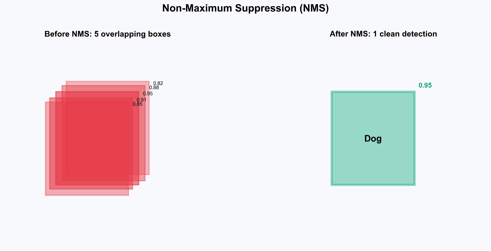
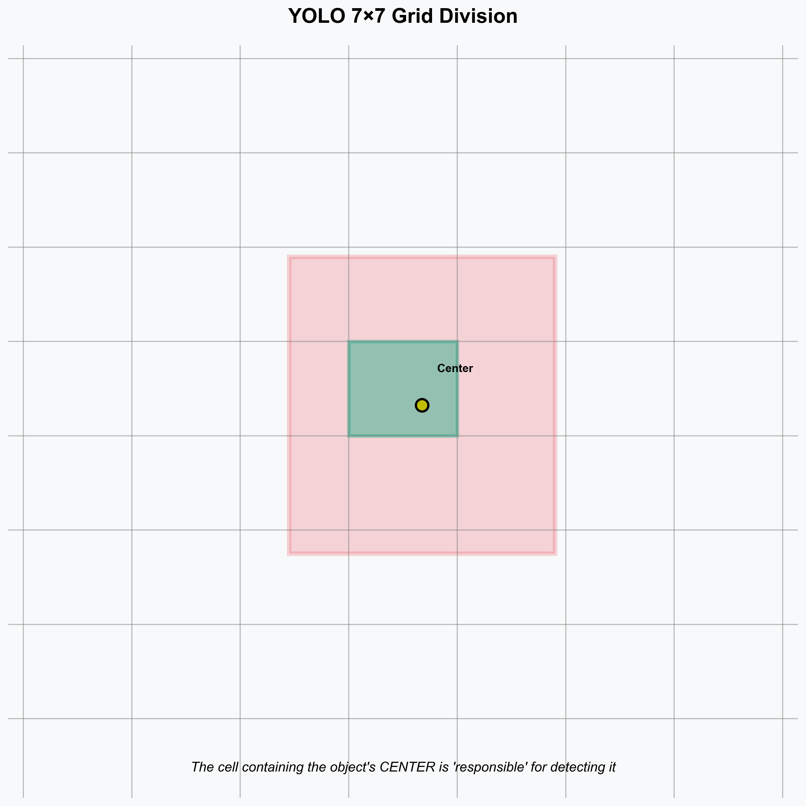

# Object Detection Basics
## Deep Learning for Computer Vision

**Lecture by [Your Name]**
*Inspired by Andrew Ng's teaching style*

---

# What You Will Learn Today

1.  **The Core Problem**: Classification vs. Detection
2.  **The Tools**: Bounding Boxes, Confidence, IoU
3.  **The Algorithm**: How NMS cleans up results
4.  **The Architectures**: YOLO vs. Faster R-CNN
5.  **The Metrics**: How do we measure success? (mAP)
6.  **Practical Tips**: Training & Data Augmentation

---

# 1. Understanding the Goal

**Classification** answers "What is this?"
**Detection** answers "What is this **AND** Where is it?"

---

# The Bounding Box (BBox)

A BBox defines the object's location. It is crucial to understand the format because datasets vary!

> **Pro Tip:** Always check if your coordinates are normalized (0-1) or absolute pixels!

---

# 2. Key Concept: IoU (Intersection over Union)

How do we know if a detection is "correct"? We compare it to the Ground Truth.

**Intuition:**
*   **Intersection:** The shared area (overlap).
*   **Union:** The total combined area.
*   **Ratio:** 0 (No overlap) to 1 (Perfect match).

---

# IoU Visualized

---

# 3. The Problem of Multiple Detections

Detectors often find the same object multiple times.
*   "Is this a car?" -> Yes (90%)
*   "Is this slightly shifted box a car?" -> Yes (85%)

**We need a way to clean this up.**

---

# Non-Maximum Suppression (NMS)

**The Algorithm to clean up duplicate boxes:**

---

# NMS in Action

---

# 4. How Detection Models Work

Most modern detectors follow a similar pipeline:

---

# Two Main Approaches

---

# Deep Dive: YOLO (You Only Look Once)

YOLO divides the image into a **grid**. Each cell is responsible for detecting objects whose center falls inside it.

*Note: Modern YOLO versions (v3-v8) use "Anchor Boxes" to help predict box shapes better.*

---

# YOLO Architecture Explained

---

# 5. Loss Functions (How the Model Learns)

The model needs to minimize errors in three things simultaneously:

---

# 6. Evaluation Metrics: mAP

Accuracy is not enough! We use **Mean Average Precision (mAP)**.

*   **Precision:** When you predict a car, is it actually a car?
*   **Recall:** Did you find all the cars?
*   **mAP:** Area under the Precision-Recall curve, averaged over all classes.

---

# 7. Practical Training Tips

Training a robust detector requires more than just code.

---

# Summary & Key Takeaways

1.  **Object Detection** = Localization + Classification.
2.  **IoU** measures how good a box is.
3.  **NMS** removes duplicate boxes.
4.  **YOLO** is fast (one-stage), **Faster R-CNN** is accurate (two-stage).
5.  **mAP** is the gold standard metric.

**Next Steps:**
*   Download a dataset (e.g., COCO128).
*   Run YOLOv8 on your webcam.
*   Inspect the "loss curves" to see learning in action!

---

# Thank You

**"AI is the new electricity."** - Andrew Ng

## Questions?

 

*Slides generated with Marp, Matplotlib & Graphviz*
