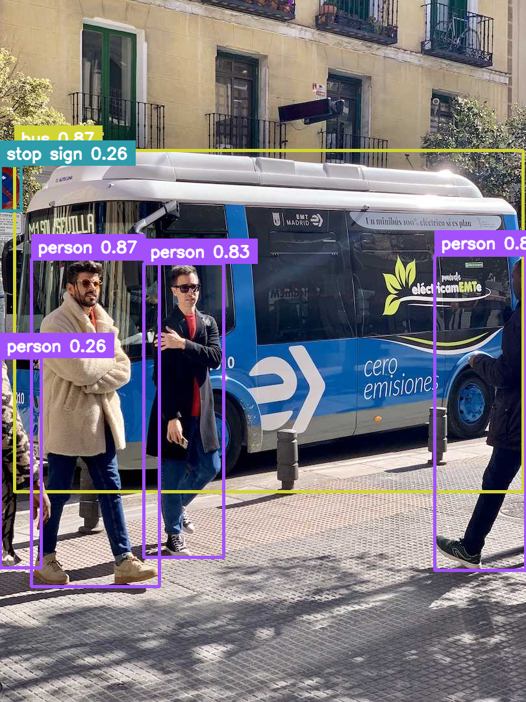

# Object Detection Basics
## Deep Learning for Computer Vision

**Nipun Batra** · IIT Gandhinagar
*Inspired by Andrew Ng's teaching style*

---

# What You Will Learn Today

```
┌─────────────────────────────────────────────────────────────────┐
│                                                                 │
│   Part 1: The Core Problem                                      │
│           Classification vs Detection vs Segmentation           │
│                                                                 │
│   Part 2: Bounding Boxes                                        │
│           How we represent object locations                     │
│                                                                 │
│   Part 3: IoU (Intersection over Union)                         │
│           How we measure detection quality                      │
│                                                                 │
│   Part 4: NMS (Non-Maximum Suppression)                         │
│           How we clean up duplicate detections                  │
│                                                                 │
│   Part 5: Architectures (YOLO, Faster R-CNN)                    │
│           How modern detectors work                             │
│                                                                 │
│   Part 6: Training & Metrics (mAP)                              │
│           How we train and evaluate detectors                   │
│                                                                 │
└─────────────────────────────────────────────────────────────────┘
```

---

# Part 1: The Core Problem
## What IS Object Detection?

---

# Classification vs Detection


<div class="insight">
Detection = Classification + Localization
</div>

---

# The Full Vision Hierarchy


---

# Instance Segmentation Example


Segmentation provides **pixel-level precision** for each object instance.

---

# Real-World Detection Example



Applications: Self-driving cars, retail inventory, medical imaging, security

---

# Part 2: Bounding Boxes
## How We Represent Locations

---

# Bounding Box Basics

A bounding box is a **rectangle** that tightly contains an object.

```
Image Coordinate System:

    (0,0) ─────────────────────────────────► x (width)
      │
      │    ┌─────────────────────┐
      │    │                     │
      │    │     🐕              │ ← Object inside box
      │    │                     │
      │    └─────────────────────┘
      │
      ▼
    y (height)

Box is defined by 4 numbers: Where does it start? How big is it?
```

---

# Bounding Box Formats

<div class="warning">
Different datasets/frameworks use different formats!
</div>


---

# Normalized vs Absolute Coordinates

```
ABSOLUTE (Pixels):                    NORMALIZED (0-1 range):

Image: 640×480 pixels                 Image: Any size → values 0-1

Box: (100, 50, 200, 150)              Box: (0.156, 0.104, 0.312, 0.312)
     ↑    ↑   ↑    ↑                       ↑      ↑      ↑      ↑
     │    │   │    └─ height 150px         │      │      │      └─ h/H
     │    │   └─ width 200px               │      │      └─ w/W
     │    └─ y = 50px                      │      └─ y/H
     └─ x = 100px                          └─ x/W

Conversion:
x_norm = x_abs / image_width
y_norm = y_abs / image_height
```

<div class="insight">
Normalized coordinates are **resolution-independent** — the same box
works for any image size!
</div>

---

# Part 3: IoU
## How Good Is a Detection?

---

# The Problem: When Is a Box "Correct"?


Is this prediction "correct"?

- Boxes aren't identical, but they overlap a lot
- We need a NUMBER to measure how good this is
- That number is IoU (Intersection over Union)

---

# IoU: The Formula


---

# IoU Thresholds in Practice

```
┌───────────────┬─────────────────────────────────────────────────┐
│   IoU Value   │   Interpretation                                │
├───────────────┼─────────────────────────────────────────────────┤
│   1.0         │   Perfect match (never happens in practice)     │
│   0.75+       │   Excellent detection                           │
│   0.50        │   Standard threshold for "correct" (COCO)       │
│   0.25        │   Loose match (used in some old benchmarks)     │
│   0.0         │   No overlap at all                             │
└───────────────┴─────────────────────────────────────────────────┘

Common Rule:
    If IoU ≥ 0.5 → Detection is a TRUE POSITIVE (TP) ✓
    If IoU < 0.5 → Detection is a FALSE POSITIVE (FP) ✗
```

<div class="insight">
Different competitions use different thresholds:
- PASCAL VOC: IoU ≥ 0.5
- COCO: Multiple thresholds (0.5, 0.55, ..., 0.95)
</div>

---

# Part 4: Non-Maximum Suppression
## Cleaning Up Duplicate Detections

---

# The Problem: Too Many Boxes!


Detector finds the SAME object multiple times with slightly different boxes.
We want to keep only the **BEST** one.

---

# NMS Algorithm: Step by Step


---

# NMS: The Python Pseudocode

```python
def nms(boxes, scores, iou_threshold=0.5):
    """
    boxes: List of (x1, y1, x2, y2)
    scores: Confidence for each box
    """
    # Sort by confidence (descending)
    order = scores.argsort()[::-1]

    keep = []

    while order.size > 0:
        # Pick the best box
        i = order[0]
        keep.append(i)

        # Compute IoU with remaining boxes
        ious = compute_iou(boxes[i], boxes[order[1:]])

        # Keep only boxes with IoU below threshold
        remaining = np.where(ious <= iou_threshold)[0]
        order = order[remaining + 1]

    return keep
```

---

# Part 5: How Detectors Work
## Two Main Approaches

---

# One-Stage vs Two-Stage Detectors


---

# YOLO: You Only Look Once

**Core Idea:** Divide image into grid, predict boxes for each cell.


Each cell is "responsible" for objects whose **center** falls inside it.

---

# YOLO: What Each Cell Predicts

```
Each grid cell outputs:

┌─────────────────────────────────────────────────────────────────┐
│                                                                 │
│   BOX 1:  [x, y, w, h, confidence]    (5 numbers)              │
│   BOX 2:  [x, y, w, h, confidence]    (5 numbers)              │
│   CLASS:  [P(dog), P(cat), P(car), ...] (C numbers)            │
│                                                                 │
│   Total per cell: 2×5 + C = 10 + C numbers                     │
│   For 7×7 grid with 20 classes: 7 × 7 × (10 + 20) = 1470       │
│                                                                 │
└─────────────────────────────────────────────────────────────────┘

Confidence = P(object exists) × IoU(pred, truth)

If confidence is low → "nothing interesting here"
If confidence is high → "I found something!"
```

---

# YOLO Architecture Overview


---

# Anchor Boxes: Better Shape Priors

**Problem:** A grid cell might contain multiple objects.
**Solution:** Use multiple "anchor boxes" of different shapes.


<div class="insight">
Modern YOLO (v3+) uses 9 anchors: 3 scales × 3 aspect ratios!
</div>

---

# Part 6: Training & Evaluation
## How We Measure Success

---

# The Loss Function

Detection models optimize multiple objectives simultaneously:


---

# Precision and Recall


---

# Mean Average Precision (mAP)


---

# mAP: A Concrete Example

```
Dataset: 100 dog images, model makes predictions

At confidence threshold = 0.9:
├─ Found: 30 dogs correctly (TP = 30)
├─ Missed: 70 dogs (FN = 70)
├─ False alarms: 2 (FP = 2)
├─ Precision = 30/(30+2) = 0.94
└─ Recall = 30/(30+70) = 0.30

At confidence threshold = 0.5:
├─ Found: 80 dogs correctly (TP = 80)
├─ Missed: 20 dogs (FN = 20)
├─ False alarms: 15 (FP = 15)
├─ Precision = 80/(80+15) = 0.84
└─ Recall = 80/(80+20) = 0.80

AP ≈ Area under the precision-recall curve created by
     varying the confidence threshold from 1.0 to 0.0
```

---

# Common Benchmarks & Scores

```
┌──────────────────┬────────────────────────────────────────────┐
│  Dataset         │  Details                                   │
├──────────────────┼────────────────────────────────────────────┤
│  PASCAL VOC      │  20 classes, ~10K images                   │
│                  │  Uses mAP@0.5                              │
├──────────────────┼────────────────────────────────────────────┤
│  MS COCO         │  80 classes, ~120K images                  │
│                  │  Uses mAP@0.5:0.95 (stricter)              │
├──────────────────┼────────────────────────────────────────────┤
│  ImageNet Det    │  200 classes, ~400K images                 │
│                  │  Large-scale benchmark                      │
└──────────────────┴────────────────────────────────────────────┘

Modern YOLO scores:
├─ YOLOv5s: ~36 mAP on COCO (fast, small)
├─ YOLOv5x: ~50 mAP on COCO (accurate, large)
└─ YOLOv8x: ~53 mAP on COCO (latest)
```

---

# Data Augmentation for Detection

```
IMPORTANT: When you transform the IMAGE, also transform the BOXES!

┌─────────────────────────────────────────────────────────────────┐
│ HORIZONTAL FLIP:                                                │
│                                                                 │
│   Original:              Flipped:                               │
│   ┌──────────────┐       ┌──────────────┐                       │
│   │ ┌───┐        │       │        ┌───┐ │                       │
│   │ │ 🐕│        │  ──►  │        │ 🐕│ │                       │
│   │ └───┘        │       │        └───┘ │                       │
│   └──────────────┘       └──────────────┘                       │
│   Box: (10, 20, 60, 80)  Box: (W-70, 20, W-10, 80)             │
│                                                                 │
├─────────────────────────────────────────────────────────────────┤
│ Other augmentations:                                            │
│  • Random crop (with box adjustment)                            │
│  • Color jitter (no box change needed)                          │
│  • Mosaic: Combine 4 images (complex box handling)              │
│  • Mixup: Blend two images                                      │
└─────────────────────────────────────────────────────────────────┘
```

---

# Summary: The Detection Pipeline


---

# Key Takeaways

1. **Detection = Classification + Localization**
   Predict WHAT and WHERE

2. **Bounding Box formats vary**
   Always check: (x,y,w,h) vs (x1,y1,x2,y2) vs normalized

3. **IoU measures overlap quality**
   IoU ≥ 0.5 usually means "correct" detection

4. **NMS removes duplicate boxes**
   Keep best, remove overlapping

5. **YOLO is fast (one-stage)**
   Real-time detection on video

6. **mAP is the gold standard metric**
   Combines precision and recall across thresholds

---

# Getting Started: Try YOLO!

```python
# Install
pip install ultralytics

# Run in 3 lines!
from ultralytics import YOLO

model = YOLO('yolov8n.pt')  # Load pretrained model
results = model('your_image.jpg')  # Run detection
results[0].show()  # Display results

# Each detection has:
for box in results[0].boxes:
    print(f"Class: {box.cls}, Confidence: {box.conf}")
    print(f"Box: {box.xyxy}")  # x1, y1, x2, y2
```

---

# Thank You!

**"AI is the new electricity."** — Andrew Ng

The same ideas that power self-driving cars work for detecting
anything: faces, products, medical anomalies, defects...

## Questions?
